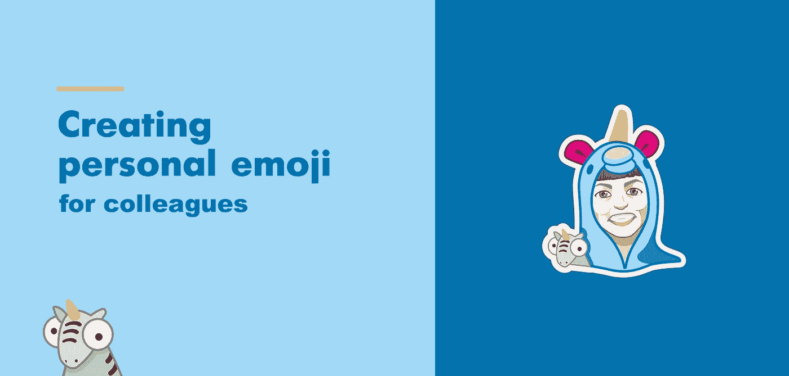
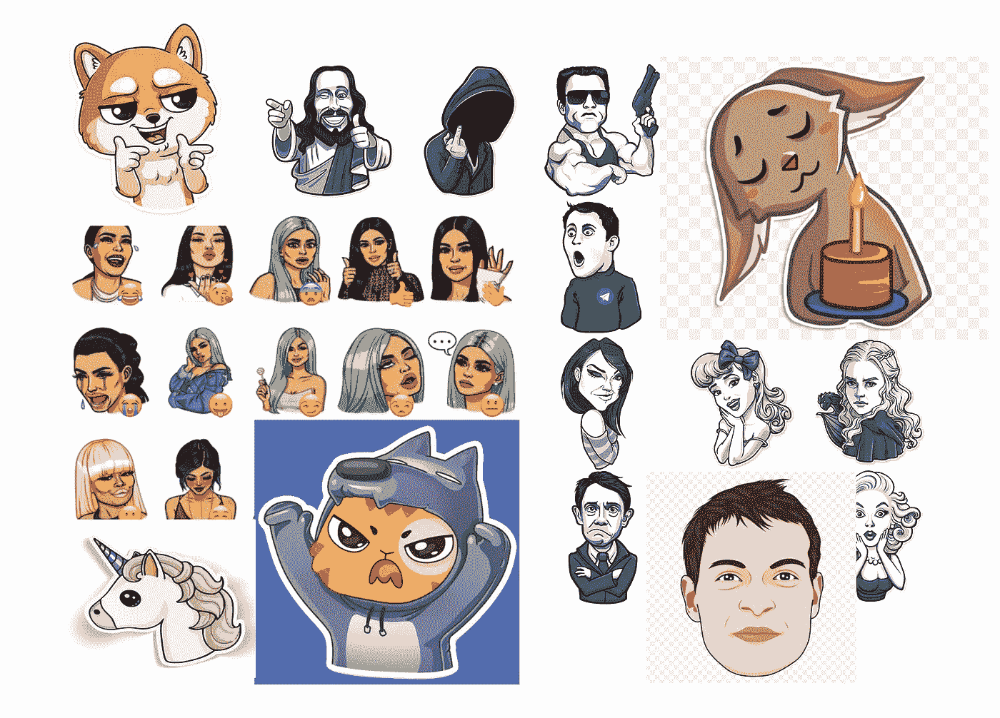
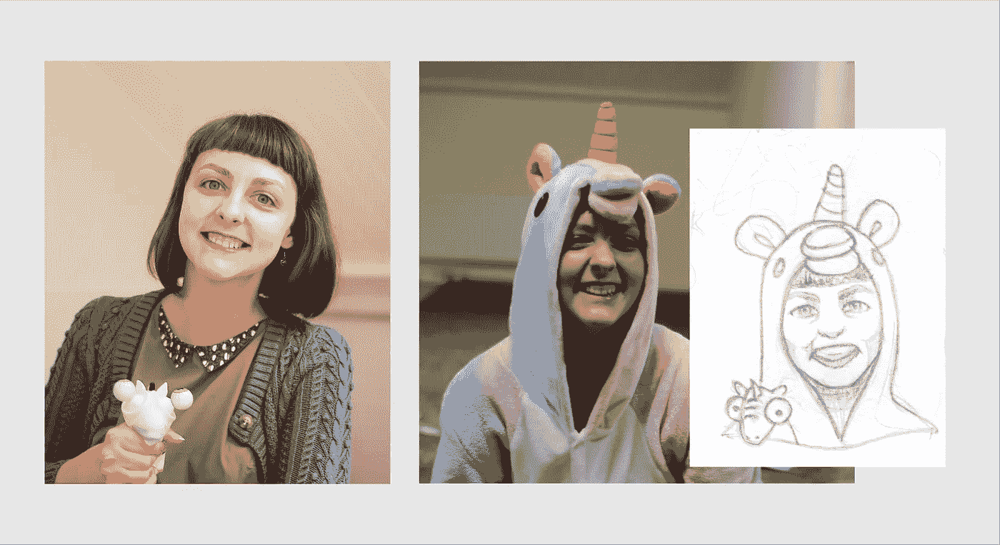
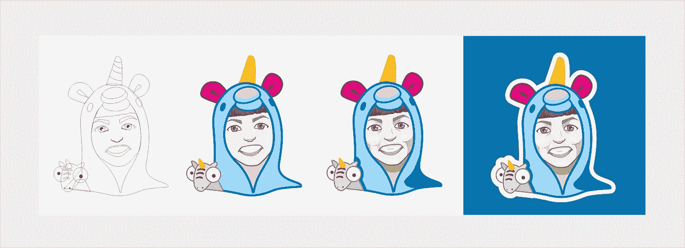
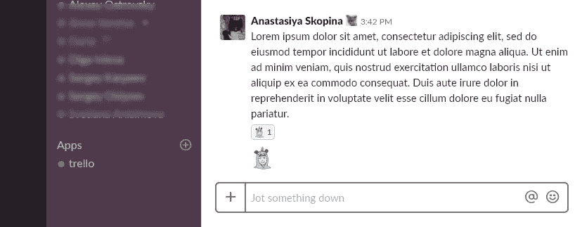
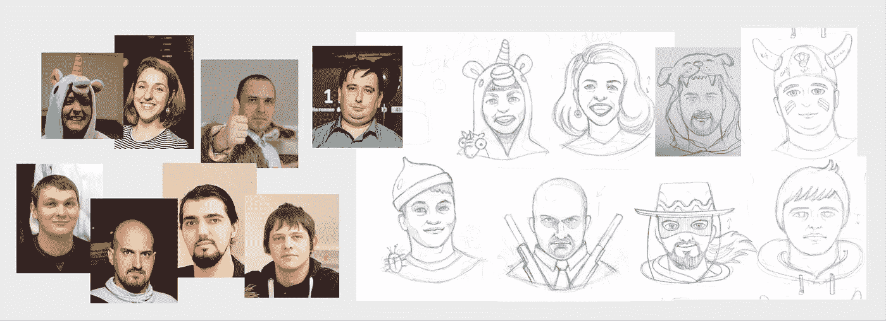
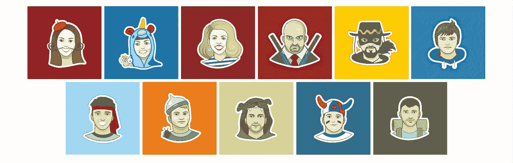

# 创建个人表情符号

> 原文：<https://medium.com/swlh/creating-personal-emoji-f36baf2bd819>

这是我在 Medium 上的第一篇文章，我想在这里分享我为同事创造个人表情符号的经验。

# 这个想法的起源

在我们这个友好的小公司里，祝贺同事的工作纪念日是很常见的。通常我们公司会提供一本关于自我发展的有用的书——这当然是必要的，但我想在这本书中加入一些创意。因此，除了一本有用的书之外，还想出了一个个人表情符号。因此，此外，我想实现一个新的创造性测试。

# **寻找灵感**

工作的第一阶段是分析性的——我做了一个 moodboard，里面有一些我喜欢的例子。我不想画黄色表情符号风格的表情符号，有巨大的眼睛和破碎的比例。出于这个目的，经典的卡通风格，明亮的颜色，简单而清晰的阴影，一个黑暗的轮廓是非常适合的。此外，对于每个表情符号，应该添加一些特殊的东西，将每个员工与其他员工区分开来，因此，建议用一点幽默来处理这个问题，但不要过度！

Moodboard

第一个受害者是 Daria，我们的全栈开发人员。Daria 非常喜欢独角兽，为表情符号选择图像(或特殊功能)的问题由她自己决定。

# 第一步:素描

纸笔成为了创作第一个表情符号过程中的起点。我试着选择脸部的正面，然而，如果构图需要，也有例外。我给所有工作人员，或者说几乎所有人(看原图)画了一个笑脸。

This is Dasha, our Full-stack developer

# 第二步:勾勒轮廓

我把图纸插入图形编辑器，用曲线勾勒出所有的形状。然后我做了一个初步的填充来估计颜色等级，在最终选择颜色后，我开始添加细节。为了使图片看起来不平坦，我添加了一些阴影，并用线条标出了脸部的轮廓。这就是我的第一个表情符号的由来。这是达莉亚。

# 松弛优化

当我将表情符号添加到 Slack 时，我不得不放弃一些小细节，因为所需的大小不应超过 128 像素，而在这么小的图像中，这些细节只会产生不必要的噪声。我还必须纠正线条的粗细，这样必要的元素就不会在视觉上丢失。

Emoji Slack

# 贴纸工作室

接下来的贴纸画得更容易更快，因为我已经有了以前的一部分的基础，我只是把它们收集起来作为一个构造器。

This were my sketches looked like.

所以我收集了一些我同事的滑稽脸。然而，它还没有增加几名员工。

*感谢阅读！！！:)*

## 这篇文章发表在 [The Startup](https://medium.com/swlh) 上，这是 Medium 最大的创业刊物，拥有+400，714 名读者。

## 在这里订阅接收[我们的头条新闻](http://growthsupply.com/the-startup-newsletter/)。

