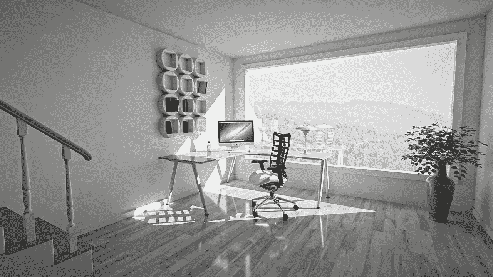

# 打造你的隐形办公室

> 原文：<https://medium.com/swlh/creating-your-invisible-office-62ec52f13462>

Courtesy Pixabay

## 最重要的工作空间。

开放式办公室，封闭式办公室，凌乱的办公室，干净的办公室，大办公室，舒适的办公室，安静的办公室，嘈杂的办公室…

每个人都有自己的偏好，我甚至不想参与这场辩论。

我说的是没人看到的*工作空间*。

你的*隐形办公室*。

这是你为自己的头脑、心灵、时间和健康创造的工作空间。

比家具更能影响你工作体验的东西。

假设你邀请我们去看你的办公室，我们会看到什么？现在，带我们看看你的隐形办公室怎么样？它是你可见办公室的反映吗？

哦。等等。它是看不见的，所以…我们看不见它。

没错，但是我们可以看到结果。

让我们参观一下。

# **界限——你周围的空间**

你的界限反映了你的自尊和自信。它们影响你与老板、同事的关系，最重要的是，影响你自己。它们根植于你的价值观，传达你的价值观。你的界限不是把别人挡在外面的墙，而是保护你免受那些不尊重你的人的伤害。

别人是否清楚你会容忍什么，不会容忍什么，以及你希望别人如何对待你？人们会闯入你的办公室，谈论你，接管你的时间表或者未经讨论就对你提出不切实际的要求吗？你尊重别人的界限吗？

在工作场所拥有并保持健康、个人和职业的界限需要自我意识、勇气和实践。它们提供了一个安全的核心，让你既自信又脆弱。

> “你得到你所容忍的。”
> ——亨利·云

# **页边距——你的日程表中的空间**

你的时间表反映了你的优先事项。你对待时间的方式将决定一天结束时你能完成什么，还能留下什么。日历中的空间是你自己的选择。时间是不可再生的资源。当你在我们的一天中没有留下休息、思考、关系或恢复的余地时，你就付出了代价。

你在优先列表中排在第几位？当你检查你的日历时，它是固定的会议吗？你有没有用活动填满你空闲时间的每一刻？你是否经常在任务或会议之间跑(迟到)？你为家人或朋友留下了什么？你真的很有效率还是只是很忙？

要么是你的时间表在控制你，要么是你在控制你的时间表。当你在一天中保持健康的边际，你的注意力、精力和生产力都会受益。明智地使用你的日历空间。

> “怎么这么快就这么晚了？”
> ――苏斯博士

# **间隔——你的想法和行动之间的空间**

这是没有人看到的空间，也是他们最终会看到的空间。因为在你的思想和行动之间发生的事情将决定你的表现。这个空间是你选择回应或反应的地方。这是你挖掘智慧的地方。诀窍是，你必须意识到空间，否则你只是在自动驾驶仪上运行。

你知道这个地方吗？你是否不止一次被冲动的反应或决定烧伤过？你能等吗？保持沉默？你能在形成你的观点或提出你的主张之前观察故事的展开吗？

斯蒂芬·科维称之为积极主动的习惯。当你能够利用并驯服刺激和反应之间的那一瞬间，你将对你的选择有更大的控制权，这只会帮助你更有效地工作。

> "积极主动的人随身携带着他们自己的天气."—斯蒂芬·柯维

# **空格**

当你把这些空间连接在一起时，你就创造了信心、能量和创造力的源泉。

花时间设计你的*隐形办公室*，这样你就可以每天带着最好的自己去工作。

> “将粘土制成容器；正是里面的空间让它变得有用。
> ――老子

## 这篇文章发表在 [The Startup](https://medium.com/swlh) 上，这是 Medium 最大的创业刊物，有+ 381，088 人关注。

## 在这里订阅接收[我们的头条新闻](http://growthsupply.com/the-startup-newsletter/)。

