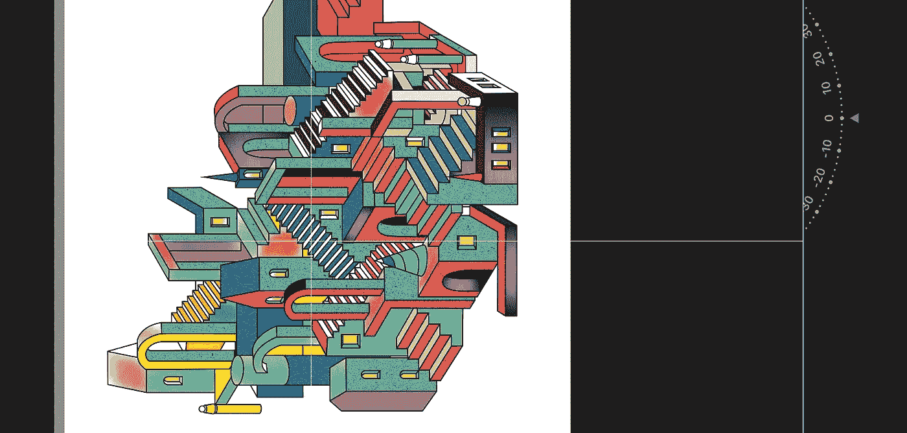

# 创造力与创新

> 原文：<https://medium.com/swlh/creativity-vs-innovation-42fde2e70201>

## 在创业公司中。

Image created by AZ

***创造力。***

这是我们认识到的东西，但我们把它当作某种神奇的光谱——好像它是神秘的仙尘，让人们变得更聪明，有“更明亮”的想法。

即使在简单的文字中，听起来也是完全抽象的。

对我来说，很简单:**创造力是头脑中的一种驱动力。**我们有些人有；大多数人需要更多。尽管创造力对创业公司来说几乎是必不可少的，但它不是一切。

创新要重要得多。

企业家精神的关键就在于此。

首先，让我们认识到创造力和创新的区别。最简单的形式，创意就是思考，创新就是行动。两者之间只有一线之隔。

> 创造力产生于你的头脑。
> 
> 创新发生在世界上。

## 想象一下:

假设你想开一家快餐车公司。

你花了几周、几个月、几年的时间去想象和构思经营这家公司的方法。你想出了精心的设计，独特的方式来推销自己，当然，你还想象着食物是来自这个世界的！

你看到卡车了。你在里面看到了自己。你会看到快乐的顾客。最重要的是，你看到了利润！

虽然你花时间考虑业务很好，但这只是你的想法——你有一个“创造性”的想法，仅此而已。注意，如果你停在这里，你将一无所获。没有食物，没有卡车，没有顾客。

*没事*。

> 仅靠创造力是无法为你创业的。然而，它应该成为促使你的想法成为现实的动力。

**创新是创造力的原动力。**

创新是在做；创新就是应用。你采取的每一个步骤都代表着创新。

一旦你确立了你的卡车的名字，制造一种*独特的*产品，并且**以一种别人无法做到的方式**服务你的第一个顾客，那就是你正式创新并利用你的创造力的时候。

一线之隔，却有着巨大的差异。

# 你为什么需要它们

创造力和创新在任何新的商业冒险中都发挥着作用。创业围绕着我们日常问题的新的、有用的解决方案。

注意对“新”的强调

所有创业公司都必须寻求差异化。如果既定市场没有变化，为什么会有人想要你的产品或服务？

如果你今天晚些时候开车在街上看到“麦当劳 2”会怎么样？你会去那里吗？(可能纯粹出于好奇，但除此之外没有)它已经过时了。

没有创造新的价值。

要开发独特的价值，你需要有独创性。在某种程度上，为了让自己与众不同，你需要创造力。

# 但是怎么做呢？

我经常听到人们说:

> “我不是一个有创造力的人。我从来没有，它不在我身上。”

然后我想回答，“很明显。”

当人们把创造力视为某种与生俱来的、精致的天赋时，对他们来说感觉遥不可及。这从一开始就浪费了想象力，甚至在创造力萌芽之前就扼杀了它。

更复杂的是，科学家和研究人员想出了公式、解剖学研究 [**(左脑、右脑)**](https://www.verywell.com/left-brain-vs-right-brain-2795005) 和练习，让人们“更有创造力”这已经成为一个复杂的理论。

我一点都不买！一点也没有。对我来说，很简单:

> 如果你想有创造力，*允许自己有创造力。*

摆脱你的精神障碍。不要贬低你的想法。带着你的直觉跑——看着它们，研究它们，用它们来建设。

向创造力敞开心扉；你可能会对你的发现感到惊讶。然后在现实世界中应用它，让事情发生。

***- AZ***

## 这篇文章发表在 [The Startup](https://medium.com/swlh) 上，这是 Medium 最大的创业刊物，拥有 306，472+人关注。

## 在此订阅接收[我们的头条新闻](http://growthsupply.com/the-startup-newsletter/)。

