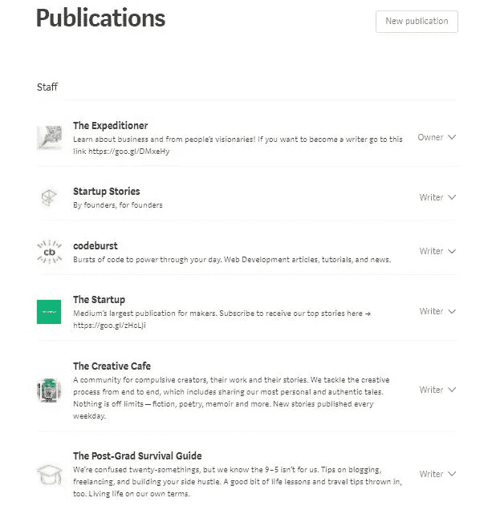

# 跨平台工作更快地为您带来价值

> 原文：<https://medium.com/swlh/cross-platform-work-has-value-2d18301bee6>

*你为什么坚持一个平台？你在浪费时间！*

我在创业刊物上写文章，

研究生出版，

Codeburst 等等。

我甚至打开了自己的出版物，但我仍然有同样的感觉。

媒体都饱和了。它不仅是媒介，而且在网上随处可见。

想成为一名博客写手？我们让像杰克·保罗这样的人在 Youtube 上占据了很多空间。

试图打开下一个社交媒体平台？嗯，脸书、Snapchat 和许多其他实体吸引了大部分注意力。

那么我们的案例中还剩下什么呢？

**跨平台！**

我如何处理我的作品，比如这篇文章:我会先把它发布在媒体上，然后分享给有记录的媒体。

我还会在 Flipboard 和其他写作平台上分享来自记录媒体的信息。

从这些其他平台，我会链接另一个平台，我执行我的工作。

如果我在 Flipboard 上，我会承认有记录的媒体。

我的媒体会承认我的其他网站。

你明白了。

在许多平台上分享你的作品有助于吸引你的追随者。

以下是我的结果:

不要再等了。

跨平台你所有的工作！

## 谢谢你看我的文章！欢迎在下面留下评论或了解更多关于我的信息！！

## 如果您错过了我的上一篇文章:

*   [分批完成任务会带来丰硕的成果](/swlh/batching-your-tasks-brings-fruitful-results-c168b4886534)

## 关于作者的更多信息:

我今年 16 岁|是一名 Android 开发人员|文档出版公司的首席执行官|内容营销人员

*   如果你有兴趣和我一起跟进，请查看我的网站:[https://jdombele.wixsite.com/jayson](https://jdombele.wixsite.com/jayson)
*   如果你对我的 ShareMe 创业感兴趣，请查看下面的链接:[www.jdombele.wixsite.com/shareme](http://www.jdombele.wixsite.com/shareme)
*   如果你想在 LinkedIn 上关注我，请点击下面的链接:[www.linkedin.com/in/jayson-dombele-195a55155](http://www.linkedin.com/in/jayson-dombele-195a55155)
*   想要了解政治、商业、科技等方面的新闻吗？[https://documentedpress.wordpress.com/](https://documentedpress.wordpress.com/)

任何问题，业务查询或关注，请随时发送电子邮件给我@:jdapple4357@gmail.com

## 这个故事发表在 [The Startup](https://medium.com/swlh) 上，这是 Medium 最大的企业家出版物，拥有 288，884+人。

## 在这里订阅接收[我们的头条新闻](http://growthsupply.com/the-startup-newsletter/)。

