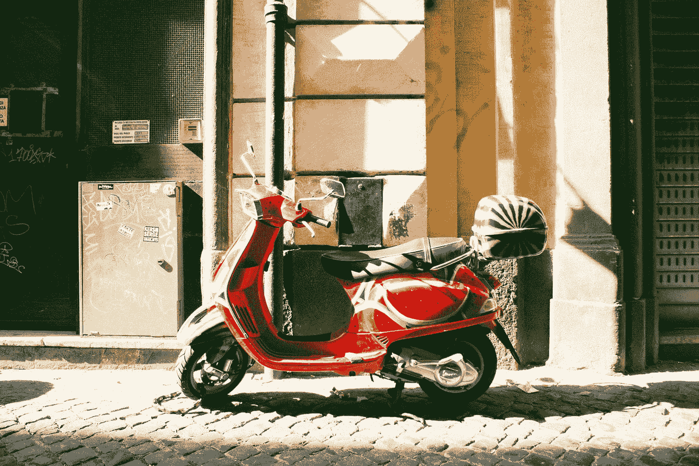

# 像一个真正的热血自行车手一样在创业中漫游

> 原文：<https://medium.com/swlh/cruise-through-entrepreneurship-like-a-true-blooded-biker-dd3f6e11a87f>

Photo by [Daniel Wells](https://unsplash.com/@dwell_in?utm_source=medium&utm_medium=referral) on [Unsplash](https://unsplash.com?utm_source=medium&utm_medium=referral)

## 采取主动方法与被动方法

我和我的妻子刚刚结束每月一次的假期旅行回到家里。我们认为休息对于我们单调的自由职业生活是必要的。我们很少有时间从宏观角度看问题，因为我们太专注于成为管理者和技术人员。这个月休是为了让我们从一个企业家的角度，客观地，从一个很高的角度来看待事情。

这就是我们在四天假期中所做的事情——讨论我们的业务愿景以及加快执行速度的新方法。我们允许自己有远大的梦想和长远的计划。

这也是我们第一次骑自行车长途旅行。我们的旅程持续了四个小时，这是我们骑摩托车旅行的最长时间。

我现在明白为什么人们会对它上瘾了。与开车相比，这是一种不同的体验。

骑摩托车提供了一种不同的体验。你与道路的联系更加紧密，你能感觉到微风拂过你的脸庞，你周围的声音在你的耳朵里是一场盛宴。道路的曲折需要你移动身体才能转弯。这是一项体力活动，骑行时没有沉闷的时刻，你的感官总是活跃起来。

我记得在我年轻的时候，曾北上参观菲律宾的避暑之都——碧瑶。这是一次令人筋疲力尽的六个小时的车程，路上充满了曲折。这是我平时呕吐的地方，也是我尽力入睡的地方。这是旅途中最烦人的部分。

但对于指定司机来说，这是一个不同的故事——他们喜欢这一部分。对于开车或骑车的人来说，这是一条著名的路线，这并不奇怪。当我开始学习驾驶时，我有点明白了这种亲和力。

今天的旅程也是一样——充满了曲折。我和我的妻子有了自己的摩托车，所以在漫长的旅程中，没有人会坐在后面作为乘客。对任何坐在后面的人来说，这都不是一个有趣的景象。

创业充满了曲折。它很少表现为直线。这是一段充满锯齿状线路的旅程，会让乘客发疯并呕吐。但是对于一个紧握方向盘的骑车人或司机来说，情况就不同了。

道路曲折是骑手的福气。

现在，在我们的亚马逊业务中，我们主要是在等待事情发生。等一个设计师完成包装设计，等样品订单到，等亚马逊验证我的身份。

我对自己的速度不满意，我在等待太多事情发生。这就是为什么我们决定对我们的业务采取积极主动的方法——亚马逊只是我们的分销渠道之一。

是什么阻止我们向其他国家批发或零售？是什么阻碍了我们建立自己的网站和寻找自己的履行中心？是什么阻止了我们设计产品和开展 Kickstarter 活动？

你现在在建造什么？你喜欢曲折吗？你是采取被动的方法还是主动的方法？

停止等待的游戏，把轮子拿在手中。

别再以乘客的身份乘车了。

获得自己的摩托车，成为一个真正的热血车手。

回头见，我的朋友。

## 这篇文章发表在《初创企业》杂志上，这是 Medium 最大的创业刊物，有 329，974 人关注。

## 订阅接收[我们的头条](http://growthsupply.com/the-startup-newsletter/)。

