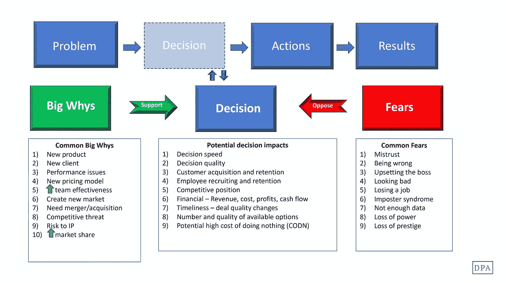

# 粉碎对快速决策的恐惧

> 原文：<https://medium.com/swlh/crush-the-fear-of-rapid-decision-making-dc4f79ea677e>

领导者需要做出决策并交付结果。当我们面对一个问题时，我们做决定，我们行动，我们成功，失败，有时还学习。

当我们反思一个决策时，我们经常发现决策和后续行动在过程的早期是可用的，但是**决定**弥补了发现问题和交付结果之间的大部分时间差距。

为什么？我们的恐惧阻止我们做出决定。

有支持的力量(大为什么)和反对的力量(恐惧)在起作用，它们刺激快速的决定或使它慢如蜗牛。这篇文章讨论了冲突的力量——恐惧。

就背景而言，支持力量(大为什么)可能包括客户需求、绩效问题、创造新市场、处理合并或收购、招聘合适的员工、克服竞争威胁、保护知识产权、扩大市场份额和推出新产品等。所有这些活动都需要领导者做出多项重大决策。每个都有一个支持快速决策偏差的时间元素。

为什么我们做出决策的方式和速度会影响决策速度、决策质量、可用选项的数量和质量，以及团队和公司的绩效。首先，缓慢的决策会影响客户获取和保留、员工招聘、提案完成率、交易质量和竞争地位。当没有做出决定时，无所作为也是有代价的。

当重大的“为什么”比减缓或阻止我们的恐惧更强大时，快速决策就会发生。让我们找出并解决一些让我们陷入困境的常见恐惧及其解决方法:

**不信任。我们不相信自己或他人的判断。我们质疑谈判另一方的动机。我们不相信别人会把我们的最佳利益放在心上。 ***良方:*** 通过回顾过去成功的决策来提醒自己的能力。下一个决定建立在这种信心的基础上。记住你在你的角色中是因为你的技能。你的老板信任你，让你来是有原因的。如果你是一个不信任你的团队的领导者，考虑一下原因。你有没有帮助他们安全地发展决策技能？你过去公开批评过决策吗？你让他们寻求帮助安全吗？你是以安全网还是批评家的身份出现？你现在能做什么来表达你的支持？**

**错了。**对正确的需求是一种强大的动力。我们认为不正确显示了我们的易错性，损害了我们的信誉。 ***解决之道:*** 如果决定是至关重要的，在做出最终决定之前，让其他人进行咨询和评估。邀请其他人来帮助我们做出更困难的决定会增加我们对解决方案的信心。想想完美，远非最高标准，根本不是标准，因为没人能做到。犯错是变得更好的学费。

更好的是，让这些人参与到书面决策过程中，带领他们完成问题定义、当前现实、选项生成和行动阶段。决策越关键，可重复的过程对团队越有价值。

**脸色不好。**错误的近亲。客户不从一家公司购买产品的主要原因是，客户不想让自己的老板或同事觉得自己很差劲。如果领导人认为尴尬的风险太高，他们就会原地不动。 ***治本之策:*** 使用你最佳的决策方法，将风险减轻到合理的程度，在执行决策前与上司或同行商量。评估当前的氛围是否鼓励人们为错误感到羞耻。如果羞愧是默认行为，那就改变它。快速决策文化无法在令人羞愧的环境中发展；它只能在安全的地方生长。

**惹恼老板。每个人都想讨好老板。他们手中握有我们在公司内部发挥潜力的钥匙。我们告诉自己，打错电话会让他们看起来很糟糕，什么都不做是阻力最小的舒适之路。除了老板把问题交给我们去管理，而无所事事的成本通常太高。最好是深思熟虑错误的决定或冻结在原地？ ***解决方法:*** 收集数据，收集团队的意见，评估选项，让老板了解情况并参与进来，然后做出决定。接受不做决定比做决定更痛苦的事实。**

**冒名顶替综合症。害怕我们没有能力坚持自己的立场或做出决定，害怕所有人都看到我们的弱点。 ***解决方法:*** 定义问题，收集数据，从你的团队获得输入，评估选项，做出决定。你的老板让你担任这个角色是因为他信任你。**

赌注太高了。害怕任何决定的负面影响会给我们制造太多的机会。 ***解决方法:*** 从把问题分解成更小的选择开始，不要把公司押在结果上。使用 A/B 测试、试点和小规模实验来测试你的假设和决定。这些策略为您的决策建立了一个安全网，并提供了比等待大实施中的大爆炸更快的反馈。

高风险决策的另一个有用工具是李尚义·罗斯测试。在 70 年代中期到 80 年代中期的全盛时期，摇滚乐队范·海伦设计并提供了极其复杂的旅行。场馆的合同和附加条款长达数十页。隐藏在合同语言中的是更衣室里 M&M 糖果的条款。但是有一个条件:棕色的 M & Ms 巧克力豆必须移除。当罗斯到达竞技场进行技术检查时，他首先看到的是 M&M 罐子。如果棕色的缺席，他知道场馆工作人员已经阅读了整个合同。如果棕色的在集装箱里，它会提醒他检查所有东西。正如奇普和丹·希斯在他们的优秀著作*中描述的那样，他设置了一个绊网，迅速提醒他注意自己的指示。*

*我们可以用我们的决定做同样的事情。建立每周衡量指标，以表明流程何时偏离轨道。如果我们在实施过程中碰到了绊网，比如一个关键路径活动晚了三天，我们会召集团队一起讨论和调整。*

***数据不足。**质量管理中有一句话——我们相信上帝；其他人都带来了数据。快速决策要求领导者熟悉 80%的数据，用相关性和目的性充实这些数据，并使用由此产生的信息做出决定。 ***治本之策:*** 利用现有的数据和信息，运用批判性推理技巧，根据需要寻求帮助，做出决定。我们将数据综合成可用形式的能力只有通过有意识的练习才能提高。*

***影响力或声望的丧失。害怕犯错会导致失去影响力或威望会让领导者行动迟缓，削弱效率。让这种恐惧控制自己行为的领导人会失去可信度和可信赖度，不久之后，还会失去影响力和威望。 ***良方:*** 利用上面的方法，专注于作为一名领导者，你能做些什么来做出快速有效的决定，为团队、公司和客户增加价值。我们赢得影响力或声望的直接原因是领导能力，包括决策效力。***

*要点:解决我们决策恐惧的最好方法是注意到它们，并把它们作为行动的催化剂。不管这种担忧是真实的还是想象的，提高决策能力是领导者有效性的核心。资源以老板、同事、团队成员、导师、教练和文章的形式存在，以增强你的技能和信心。做出快速、合理决策的能力使最好的领导者与众不同。*

**

## *这个故事发表在[的创业](https://medium.com/swlh)上，这是 Medium 最大的创业刊物，有 309732+人关注。*

## *订阅接收[我们的头条新闻](http://growthsupply.com/the-startup-newsletter/)。*

**