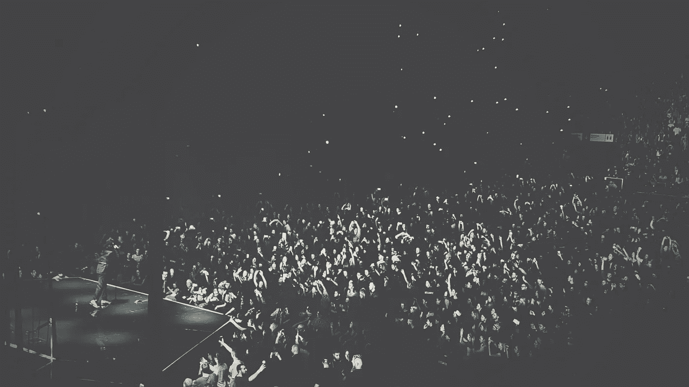

# 狼来了，全场起立鼓掌

> 原文：<https://medium.com/swlh/crying-wolf-over-standing-ovations-9dc23584f661>

我在班加罗尔和阿姆斯特丹的剧院里看过几部戏剧。我在这两个城市的观众中看到的最大区别是，阿姆斯特丹的观众几乎每次都会起立鼓掌，而班加罗尔的观众在发出这种奉承时要有选择性得多。

这让我开始思考为什么我们首先要给予赞扬和奉承。剧院演出结束时的起立鼓掌，餐馆用餐结束时的小费，读完 Medium 上的一篇文章后的鼓掌，对我们在 Instagram 上看到的照片的赞等等。

在许多情况下，我们在给予赞美时似乎比应该给予的要慷慨得多。

结果，我已经开始对这样的赞美半信半疑了。

过去的情况是，这样的回答表明一种“最棒的体验”——一场令人难以置信的表演，一次令人愉快的餐馆服务，一篇真正发人深省的文章。但如今，更多的是一种卫生。

起立鼓掌或一个好的建议不再表示这次经历是最棒的，而是它已经足够好了。现在，当服务质量很差或者表现很差时，就会不给小费或者起立鼓掌。这意味着没有小费或没有起立鼓掌会被认为是不令人满意的表现或服务，表演者和服务员会认为这只是他们的工作。

当我们摒弃这种奉承时，我们的头脑中还会有来自同龄人的压力。当你周围的每个人都站起来不停地鼓掌时，你不会想成为那个伸出拇指不鼓掌的人。即使我们的经历不是最棒的，跟着人群走，成为欢呼的一部分也要简单得多。

这是一个非常重要的概念，用于设计我们日常使用的产品——社会证明和社会推动。

当你在脸书上看到写着“受到<insert the="" friend="" you="" interact="" with="" most="">的喜爱”的广告时，这是观众起立鼓掌的群体动力。你会感觉到一点小小的推动，也会喜欢上它。然后其他人会因为你的行动而被推动，从而倒下多米诺骨牌。</insert>

有自己的观点而不随大流是很好的，但是我们越是需要这样做，就越难做到。所以，我们就位并跟随它。

直到有一天我们彻底决裂，不再随波逐流。

到目前为止，社交推动对于产品设计非常有效，但是我们经常倾向于将原因归结于其他东西——更好的推荐、更好的设计等等。

我们需要诚实地面对自己，为什么事情会这样。

## 在你走之前…

如果你喜欢这个，请支持我的工作。你需要做的就是鼓掌。

[*跟我讨论美好生活的错综复杂。*](http://eepurl.com/cqwJZT)

[*读我的书*](https://www.amazon.com/s/ref=nb_sb_noss?url=search-alias%3Daps&field-keywords=mayantuyacu)

## 这篇文章发表在《T4》杂志《创业》(The Startup)上，这是 Medium 最大的创业刊物，拥有 335，210 多名读者。

## 在这里订阅接收[我们的头条新闻](http://growthsupply.com/the-startup-newsletter/)。

