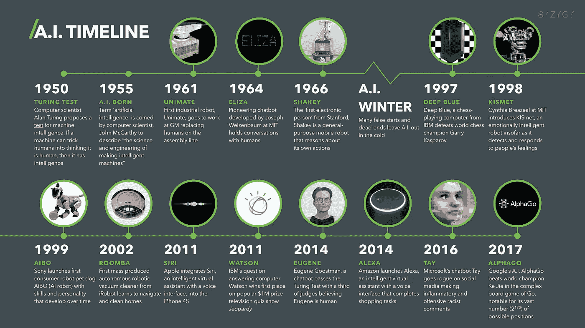
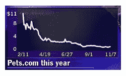

# 加密技术可能正在经历泡沫，但仍然非常有价值

> 原文：<https://medium.com/swlh/crypto-can-be-experiencing-a-bubble-and-still-be-wildly-valuable-9f39d7807254>

abcnews.com

全面披露:我不是金融分析师、经济学家，也不是“古怪的秘密百万富翁”我几乎没有任何密码。我发现围绕它的公众讨论的整个演变令人着迷。

我只是一个注意潮流并偶尔写些东西的人。这是一篇已经在我脑海中渗透了一段时间的帖子，我想把它发布出来(没有双关语的意思)。这与其说是支持或反对加密，不如说是支持“不要使用欺骗性的语言”

目前，加密货币是否存在泡沫是我每天在 twitter 上遇到的一个问题。关于人们[抵押贷款购买比特币](https://www.cnbc.com/2017/12/11/people-are-taking-out-mortgages-to-buy-bitcoin-says-joseph-borg.html)、一家[冰茶公司](https://www.bloomberg.com/news/articles/2017-12-21/crypto-craze-sees-long-island-iced-tea-rename-as-long-blockchain)和一家大麻公司宣布在他们的名字中加入“区块链”的故事，以及他们的[股票价格飙升作为回应](http://business.financialpost.com/investing/pot-stocks-yesterdays-news-as-canada-gripped-by-bitcoin-fever)，以及 j [oke-coin Dogecoin 现在的市值超过$1B USD](https://www.coindesk.com/dogecoin-market-cap-hits-1-billion-creators-dismay/) 的事实，都导致甚至密码迷怀疑是否存在泡沫以及泡沫有多大。

在回答这个问题之前，**重要的是要理解围绕“泡沫”的讨论中起作用的假设，以及经历泡沫的经济部门或资产类别的真正含义。对于华尔街普通人难以获得的资产类别来说，这可能不太重要，比如抵押贷款支持证券，但在加密方面，是否存在泡沫在某人的脑海中浮现，他在考虑是否应该将本周的啤酒钱投入比特币基地的硬币中。**

## 不太像股票

与特定公司股票的价格不同，如果比特币的价值下跌，“投资者”开始寻找高管的人头，没有“比特币公司”或“以太坊公司”可以关门歇业。“投资者”甚至没有上市公司大股东那样的发言权。

即使比特币，或比特币现金，或以太坊，或莱特币，或任何其他有团队在世界各地从事该项目的货币崩溃并跌至几美元/枚，也真的没有一个中央组织的运营费用取决于股票价格。全世界都有开发人员——是的，他们中的一些人在公司工作——为项目和技术做出贡献。即使这些公司中的一小部分关闭了，如果采用意味着价格会反弹，那么个人开发者和小团队继续为项目工作仍然是理性的。

(这忽略了关于有多少开发人员在开发哪些硬币，以及这些开发人员的分布情况…我对此不感兴趣。)

## 还很年轻

我从更懂技术的加密货币怀疑论者那里听到的一个反对意见是，我们已经拥有区块链技术和加密货币近十年了，没有正常人定期使用基于该技术的服务或应用。

但这就提出了一个问题:在什么时间线上？

你可以证明人工智能已经有将近 70 年的历史了，而我们只是在最近十年才开始定期使用以该技术为中心的服务。

digitalintelligencetoday.com

其他消费技术的超快速采用遮蔽了我们在可能是终身采用的更强背景下看到时间线的能力。

theatlantic.com

## 冒险，而不是价值

即使加密货币现在存在巨大的泡沫，如果只有少数存活下来，这个问题又有多大意义呢？最近，一名追随者在 twitter 上询问了他对沃伦·巴菲特不喜欢比特币的看法(在我写这篇文章的前一天，巴菲特宣布我们已经接近了加密泡沫的顶峰)，Naval Ravikant 对此做了有益的区分。

[https://twitter.com/naval/status/947321397528862725?lang=en](https://twitter.com/naval/status/947321397528862725?lang=en)

泡沫意味着资产与其长期价值相比被高估了。一旦投资者看到这一点，他们就会撤回投资，出现收缩。鉴于我们对 crypto 的时间框架可能比一些人讨论的要长，鉴于 crypto 没有 IPO 时间表或季度收益预期要满足，即使从泡沫的角度来谈论它对我来说也没有多大意义。

现在，对于特定的个人来说，如果你想在 Y 日之前从加密货币中获得 X%的回报，那么泡沫论可能非常有意义。如果下周市场收缩，比特币在你以 14000 美元买入后跌至 5000 美元/枚，你想在一年后套现，你可能是 S.O.L。

对我来说，忽略“加密泡沫”的最有说服力的证据很简单…

# 互联网有一个泡沫，现在仍然存在。

你可以认为互联网是 1999 年的一个经济部门，或者你可以看看具体的互联网公司。如果你在 Pets.com 股票首次公开发行时以每股 11 美元的价格买入，你将在一年内失去所有的钱。

The trajectory of Pets.com between February and November 2000.

如果你在 Amazon.com 股票首次公开发行时以每股 18 美元的价格买入，20 年后你将获得 72 倍的投资回报率。

The trajectory of Amazon since 1997.

crypto 和互联网的比较可能是我能想到的最好的一个。1998 年，增加了"。com”的名字会使股票价格暴涨。在 2018 年，在公司名称中添加“区块链”可以重振一支仙股。1998 年，互联网被视为订购书籍或狗粮以及与朋友聊天的有用工具。2018 年，加密货币被视为在没有银行的情况下进行日间交易和快速支付的有用工具。1998 年，人们谈论互联网如何能彻底改变许多行业，但除了一些古怪的书呆子和他们的投资者之外，几乎没有人支持它。2018 年，有人谈论加密和区块链技术如何根除行业，但除了一些古怪的书呆子和他们的投资者之外，很少有人支持它。

当然，后知后觉是 20/20。许多比我聪明得多的投资者在一些投资上输了钱。不是亚马逊或易贝的公司。如果有人问我“在你的类比中，今天的 AMZN 是什么？”这个问题很难回答，尤其是在泡沫和战争的迷雾中，快速致富的计划假装成山寨币，色情公司的高管带着 ICO 的钱跑路。

**但是不要再说 crypto 是不是泡沫了，好像这是在指责它完全是浪费金钱和精力。你读到这篇文章的时候，它是泡沫的产物。**

## 这篇文章发表在 [The Startup](https://medium.com/swlh) 上，这是 Medium 最大的创业刊物，有 284，454+人关注。

## 订阅接收[我们的头条新闻](http://growthsupply.com/the-startup-newsletter/)。

