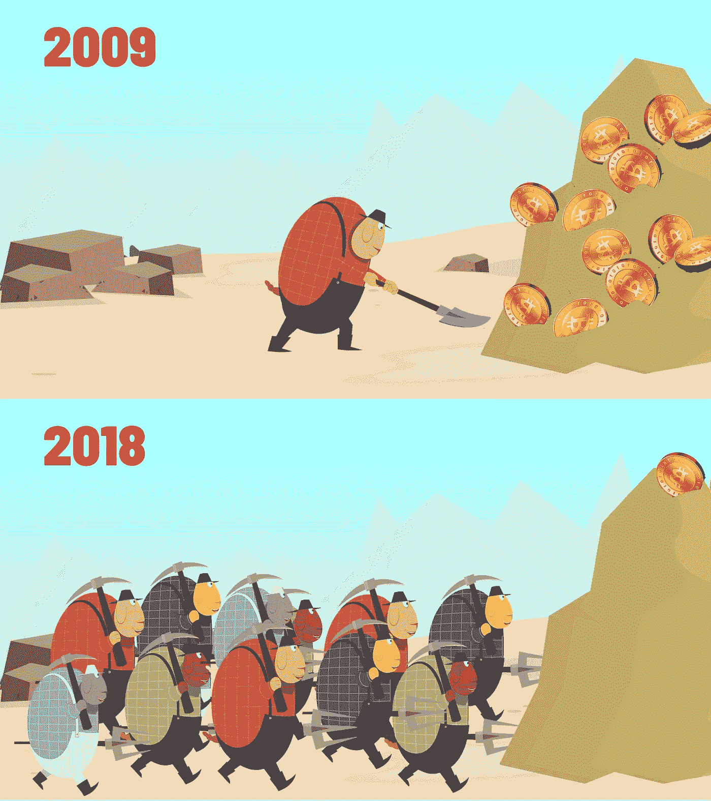
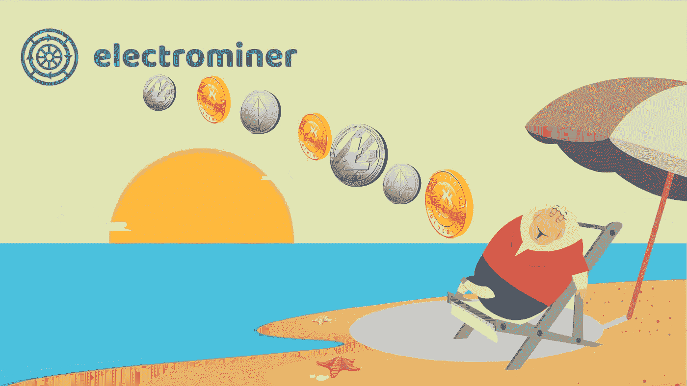
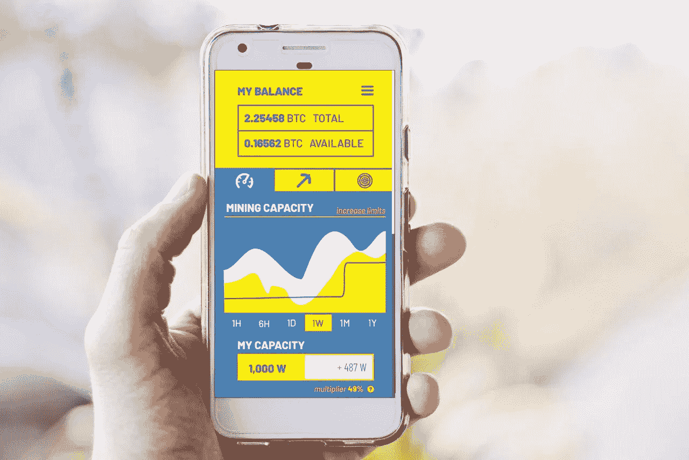

# 加密开采还没有结束

> 原文：<https://medium.com/swlh/crypto-mining-isnt-over-ec01979a8dfb>

*在过去的一年里，你可能听说过很多关于* ***比特币*** *和其他***包括* *的加密货币，不同的现象正在他们身边发生。也许你也听说过新晋的* ***地下百万富翁*** *和* ***亿万富翁。报纸和杂志越来越频繁地报道 crypto，因此越来越多的人开始熟悉它。全球许多商家已经开始接受* ***crypto 作为支付方式。*** *我们可以清楚地看到围绕区块链技术和比特币的兴奋，因为它最近的飙升。****

**

# *只是爱好*

*早在 2010 年，挖掘加密货币曾经只是一种爱好。由于难度较低，矿工可以使用他们的台式机甚至笔记本电脑生产足够数量的硬币。但有一个问题——他们不容易把它换成任何东西或者卖掉它。尽管如此，在密码市场激增之前保留密码的爱好者现在是百万富翁，因为他们中的许多人钱包里有数万比特币。想象一下，你开始挖掘几乎认不出来的硬币，把它们放在钱包里好几年，直到有一天它们“去了月球”……听起来很刺激，不是吗？*

# *今日采矿*

*然而，现在一切都不像以前那么容易了。在 2017 年的加密热潮之后，加密矿工的社区增长了十倍，所以今天有大量的计算机和其他挖掘设备旨在挖掘甚至最年轻和最原始的数字硬币。对新来者来说，这意味着激烈的竞争，没有足够的前期投资就不可能开始采矿。但是等一下，投资加密采矿设备可以被认为是一个高风险的投资。例如，在 2017 年之前，一些公司决定只做加密挖掘。然而，由于高度的不确定性，仅基于密码挖掘来运营整个业务是非常危险的。*

*今天，许多加密货币开采公司在区块链行业中争夺其哈希能力的用户。在大多数情况下，这些公司通常会提供长期合同和单个硬币/算法的附件，这可能会成为一种非常可悲的经历，因为特定硬币的采矿盈利能力可能会迅速变得非常低。也有像 NiceHash 这样的网站，你可以开采任何你想要的硬币，但必须支付高昂的设备租赁费，并且只能以比特币支付。你可能会问——为什么我不能自己购买设备，在家里/仓库开始采矿呢？这种想法可能真的很糟糕，因为采矿设备相当昂贵，而且需要不断更新以提高效率。所以要很好的了解开采流程，设备，开采哪些硬币。那么，这个问题的解决方法是什么呢？*

# *解决方案*

**

*Electrominer 提供了一个很好的解决方案——你可以随时**挖掘各种硬币**。Electrominer 团队负责设备及其维护，这样用户甚至可以下 **1 小时订单**。此外，不愿意花大量时间研究硬币盈利能力和增长的用户，只需打开**自动模式**，电子矿工将为他们挖掘最赚钱的硬币。没有必要研究硬币或购买设备，因为电动采矿机是一个一体化的解决方案。它提供了 **4 种算法**——SHA-256、X11、SCRYPT、ETHASH，对于其他算法，它使用最强大和最高效的**GPU。用户可以在任何时候从一种算法切换到另一种算法。数据中心将配备**最新功能**和**市场上最高效的**ASIC 和 GPU。***

*值得一提的是，除了上述功能之外，Electrominer 还创建了一个移动应用程序，允许其成员**跟踪他们的采矿状态**、**硬币波动**和**在不同算法之间切换**，即使在公共交通中也是如此。*

**

*Electrominer Mobile Application*

*总之，采矿过程可能非常具有挑战性，因为我们总是能看到新硬币在上升。Electrominer 是一个云挖掘平台，它不会限制你做任何事情，让你设定**自己的规则**。该平台的成员甚至拥有对战略改进的投票权。目前，Electrominer 正处于**私募**阶段。欲了解更多信息，请访问 Electrominer 网站:[https://electro miner . io](https://www.electrominer.io/)*

**

## *这个故事发表在 [The Startup](https://medium.com/swlh) 上，这是 Medium 最大的创业刊物，拥有 332，253+人关注。*

## *在此订阅接收[我们的头条新闻](http://growthsupply.com/the-startup-newsletter/)。*

**