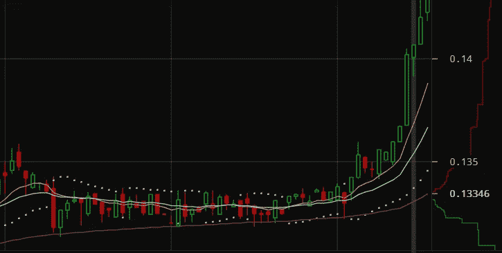

# 加密交易日记。一

> 原文：<https://medium.com/swlh/crypto-trading-diaries-pt-1-513b1bda32d3>

Photo by [NeONBRAND](https://unsplash.com/photos/JW6r_0CPYec?utm_source=unsplash&utm_medium=referral&utm_content=creditCopyText) on [Unsplash](https://unsplash.com/search/photos/stocks?utm_source=unsplash&utm_medium=referral&utm_content=creditCopyText)

你好，世界！

我开始了一个小实验…用钱。

我是那种喜欢实验交易的人。我涉足几个领域——股票、期权、被动收入流、加密货币。前期资金不多，但足以说明我把它作为一种爱好。但是我将永远忠于我的本性——一个业余爱好者。

人们说交易就像赌博——我大体上同意这些人的观点，但我仍然觉得它很有趣，你肯定可以了解市场动态，以及股票如何与你认为会影响价格的其他因素相关联。

我过去赚了一些钱。但是在过去的和现在的我也损失了很多钱。所以我是由**不**的意思是一个专家，请不要把这当成财务建议。风险自担**交易**。

但在听了一些关于加密货币的播客后——特别是一些关于北海巨妖和 BitMEX 及其功能的播客——我的兴趣被窥视了。接下来的一周，我在给自己拍照(这是必须的)，这样我就可以在一个加密交换平台上开始了。

今天，我们将讨论波动性。

# 波动性

每当你听到比特币或任何加密技术的价格，你就会听到波动性。它们携手并进。这就是交易员喜欢它的原因，也是霍德勒赚钱的原因。

据 Investopedia 报道，

> 波动性是对给定证券或市场指数的回报率离差的统计度量。

是的，分散，确实。简而言之，当你交易密码的时候，你最好相信你正在经历一场疯狂的旅程。

直到你开始交易密码，你才真正知道波动意味着什么。当你下注时，有很多事情需要考虑，老实说，我还没有到可以观察市场信号并了解市场走向的地步。那可能在后面的一些文章里。

波动性的好处是，如果你押注比特币或你交易的任何东西的价格会上涨或下跌 1%至 2%，你的情况相当不错。这可能需要 5 分钟到几天的时间。

然而，请记住，波动不会每天都发生。所以，如果你想在波动中交易，你可能需要采用另一种策略来获得你想要的回报。

让我解释一下。

看看下面的图片。

Taken from Kraken’s Trading Platform

每个烛台(绿色和蓝色的矩形)有一些信息嵌入其中。红色表示该时间段(本例中为一小时)的收盘价低于前一个时间段的收盘价。绿色表示该时段的收盘价高于前一个区块的收盘价。

有趣的是，你可以看到一个小时内的自然变化，如果你是以每分钟或每秒为单位交易，你将能够看到价格的真实变化。

然而，正如您所看到的，在这张快照中出现了两种现象。

首先，有一个长期的稳定——或者说没有波动。根据你的观点，这可能是令人安心的，也可能是令人沮丧的。

第二，价格大幅上涨——对于那些低买高卖的人来说，这是一次大牛市。

两种场景都可以赚钱(我觉得)。

我想让你们看到的是——这不是科学。事实上，它有时很不科学，我甚至不知道我为什么要烦恼。目前，我试图设计一个更理性的策略，而不是试图坚持基本面。不知道这是否有用。

我会随时通知你们的。

同时，感谢阅读。

## 这篇文章发表在《初创企业》杂志上，这是 Medium 最大的创业刊物，拥有 336，210 多名读者。

## 订阅接收[我们的头条](http://growthsupply.com/the-startup-newsletter/)。

