# 加密货币让我觉得自己很蠢

> 原文：<https://medium.com/swlh/cryptocurrencies-a-gentle-primer-for-those-still-resisting-them-like-me-b82727146fe1>

## 为什么我们抗拒改变，为什么现在是学习的时候，从哪里开始。

Photo by [Freddie Collins](https://unsplash.com/@visuals_by_fred?utm_source=medium&utm_medium=referral) on [Unsplash](https://unsplash.com?utm_source=medium&utm_medium=referral)

经过许多许多个月的忽视、躲避和断然拒绝任何与加密/区块链空间模糊相关的东西，我让步了。

我终于开始了解加密货币了。

我要怪杰尼斯。两年前，詹尼斯几乎是我在伦敦的室友。几个月前他突然找上门来。

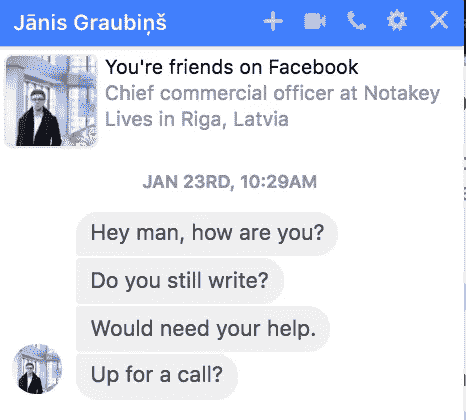

我告诉 Jānis 是的，我仍然写作，我有时间做一些工作。

Jānis 和他的团队来自拉脱维亚。英语不是他们的母语。他们需要帮助向全球人群推广他们的新产品 ICO Pass。

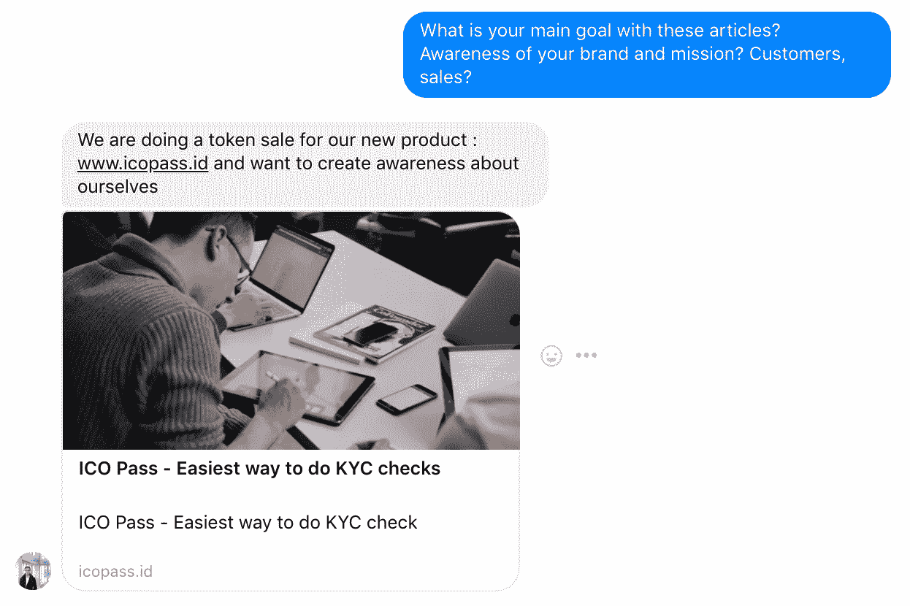

*令牌*， *ICO* ， *KYC* — WTF？

对我来说全是天书。

我想 ICO Pass 要么是一个街机游戏，一些空洞的企业缩写，要么是一个炸鸡店。

我迷失在自己无知的汪洋大海中。

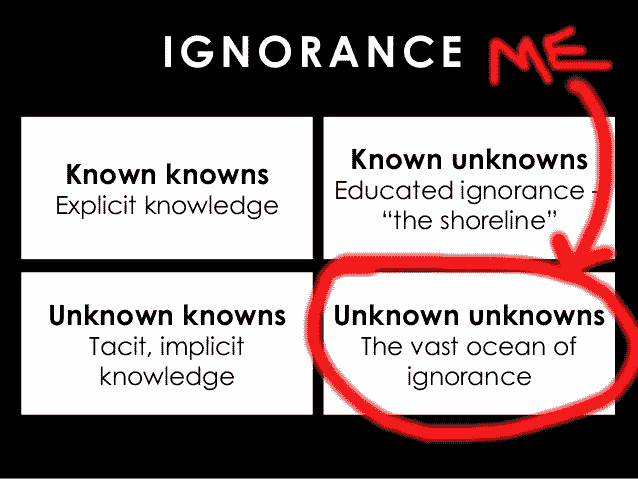

Based on [Donald Rumsfeld’s](https://en.wikipedia.org/wiki/There_are_known_knowns) *“There are known knowns; there are things we know we know. We also know there are known unknowns; that is to say we know there are some things we do not know. But there are also unknown unknowns.”* Slide via [Foxy Thinking](https://www.slideshare.net/didau/foxy-thinking-researched-2015).

很快，我瞥了一眼海岸线，发现了我的第一个*已知-未知*:

*   KYC 与处理银行的身份检查有关。
*   代币是加密货币。
*   ICO 代表初始硬币发行——就像 IPO 或首次公开发行，公司允许公众购买股票并投资于此——除了推出新的加密货币。

Also me.

我对加密货币、ICO 或他们的特定 ICO 试图解决的问题一无所知——但这听起来像是一个最终学习的好借口。我准备好迎接挑战了。我接受了这份工作。

通常我会遵循多克托罗关于写作的建议:*写作是一种探索。你从零开始，边走边学。”不知何故，这个项目与众不同。在试图在其他项目之间挤出时间写作之后，几个星期过去了，我什么也没做。*

我努力去理解这一切。我试图退出。

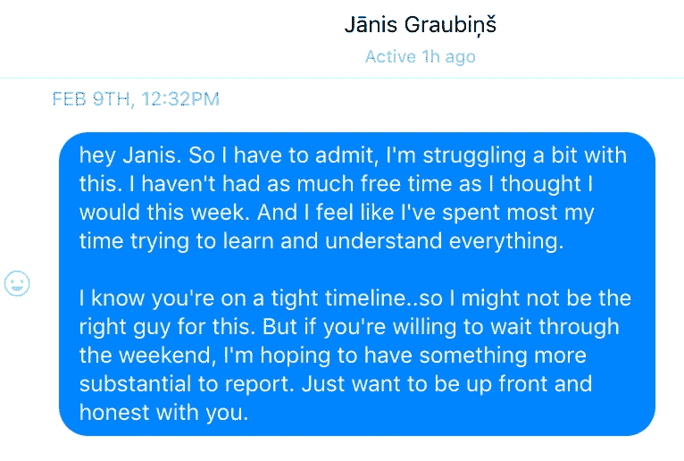

Jānis 说我虚张声势:

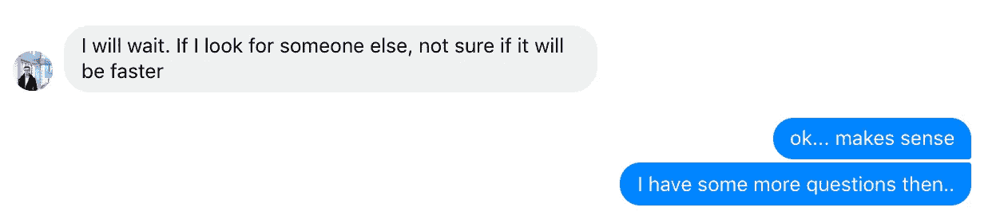

# 1.为什么我们抵制新的

在她为《哈佛商业评论》撰写的文章[中，罗萨贝斯·莫斯·坎特解释了为什么我们抵制变化，拒绝新事物。](https://hbr.org/2012/09/ten-reasons-people-resist-chang)

例如:

*   **失去控制:** *“变化会干扰自主权，会让人们觉得他们失去了对自己领地的控制。”*
*   **更多作品:** *“由于变革中间不可避免的意料之外的小故障，按照坎特定律，“一切都可能看起来像是中间的失败。”*
*   **有时候威胁是真实的:** *“改变之所以被抵制，是因为它会带来伤害。当新技术取代旧技术时，工作可能会流失；价格可以降低；投资可能会化为乌有。”*

但是让我印象深刻的原因是**对能力的担忧:**

> “当改变让人觉得愚蠢时，它就会受到抵制。”

我喜欢认为自己是一个相当聪明的家伙，能够消化困难的话题，并将其提炼为像我一样的其他人可以理解和关心的方式。我也喜欢把自己想象成一个专业作家，一个可靠的、能在截止日期前交付的人。

残酷的现实:这些东西让我觉得自己像个无能的笨蛋。

Photo by [Nick Fewings](https://unsplash.com/@jannerboy62?utm_source=medium&utm_medium=referral).

# 2.为什么现在是学习的时候了。

他们说*写下你所知道的。*我对加密货币一无所知。但我确实对自己和我的技术习惯有足够的了解，知道我通常处于采用曲线的哪个位置。

我不是第一个加入脸书的朋友，但我的大学是第一批加入的，我也是。我不是第一个拥有手机的人，但我很早就有一部诺基亚砖手机。我没有帮助建立互联网，但我有一个神童帐户。

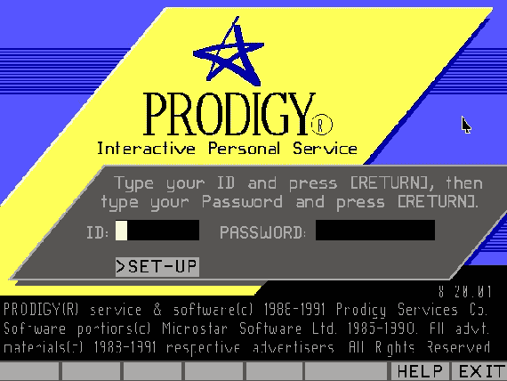

Image [The Atlantic](https://www.theatlantic.com/technology/archive/2014/07/where-online-services-go-when-they-die/374099/)

我不是创新者或超级早期采用者。但我也不是一个落后者。

如果我必须得到超级具体，平均来说我在*早期*早期占大多数。

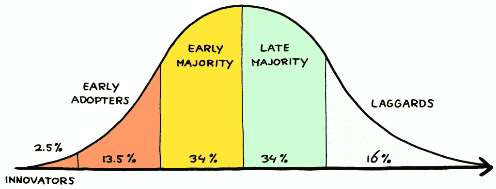

Illustration: [Jurgen Appelo](https://www.flickr.com/photos/jurgenappelo/5201275209/in/photostream/)

当像我这样的人在学习和写一些新的东西时，它可能就要成为主流了。当我对即将到来的新事物有所领悟时，这是我们正处于主流启蒙运动早期上升阶段的标志。

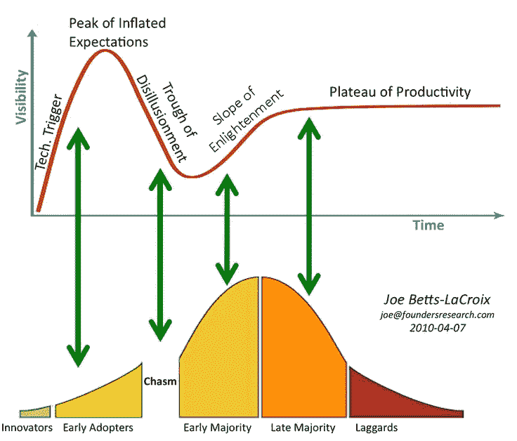

Image: [http://blog.evocator.org/2010/04/hype-chasm.html](http://blog.evocator.org/2010/04/hype-chasm.html)

突然间，了解这个空间的潜力变得有趣多了。也许我正处于某件大事的风口浪尖？如果我变得不那么无知，也许我可以停止新的机会？也许我可以学习评估新的加密货币和技术，如 ICO Pass？也许从长远来看，我可以通过投资一些可靠的东西赚一两块钱？

也许在财务上，这也是一个尝试和参与的好时机？

截至发稿时，两种主要的加密货币——以太坊和比特币——处于超级相对低位。尤其是以太坊，从 2018 年 1 月的高点下跌了 70%以上。

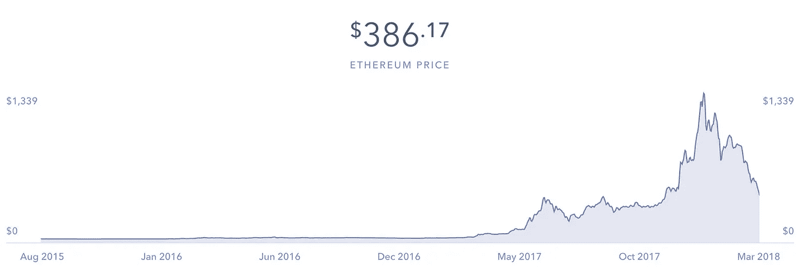

Ethereum has dropped 70% from its Jan 2018 (Coinbase — March 30, 2018)

它又回到了实验室。

# 3.从哪里开始了解加密货币。

在接下来的两周里，我消费了所有带有文字 *crypto* 或*区块链*的东西。那段旅程把我带进了互联网的黑洞。我的浏览器变成了战场。

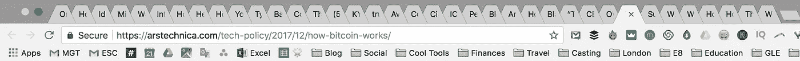

我打开了大量的标签，徒劳地试图阅读世界上关于加密货币、ico 以及它们之间的一切的知识。

我仍在无知的海洋中，但我看到了海岸线的一瞥。更多的*已知未知*出现了。我也开始记下一些已知的事情。

以下是我迄今为止发现的最有用的资源:

## **A)这部石英迷你纪录片:“*比特币、区块链和货币的未来”***

在一个太平洋小岛上用古老的石头解释了货币的未来。

## **B)本间炉边聊天** [**加利亚**](https://medium.com/u/afbdab99ef6f?source=post_page-----b82727146fe1--------------------------------)**[**ƀrock**](https://medium.com/u/4c2643df2f64?source=post_page-----b82727146fe1--------------------------------)**和** [**内森**](https://medium.com/u/f088f701feb4?source=post_page-----b82727146fe1--------------------------------)**

**由 [Vicki Rox](https://medium.com/u/99527868df5a?source=post_page-----b82727146fe1--------------------------------) 主持，感谢她极其热情的 [LoveCoin 脸书](https://www.facebook.com/groups/191271501398799/)组合——“给太空中好奇的新手们”:**

** [## L❤VE 币:VideoSlam //布洛克 x 加利亚 x 内森——众筹

### 与 Brock、Galia 和 Nathan 进行 45 分钟的“炉边谈话”,讨论加密货币+区块链的许多方面

www.crowdcast.io](https://www.crowdcast.io/e/l3ve-coin-videoslam-/) 

## c)蒂姆·费里斯与尼克·萨博和纳维尔·拉维坎特的对话。

蒂姆敢于问我们大多数人不敢问的“愚蠢的问题”。

 [## 加密货币的沉默大师——尼克·萨伯

### “可信第三方是安全漏洞。”—Nick Szabo Nick Szabo(@ nickszabo 4)是一个博学的人。广度和深度…

蒂姆.博客](https://tim.blog/2017/06/04/nick-szabo/) 

或者读一份经过彻底注释的抄本是[这里是](/@gifted_products/cryptocurrencies-with-tim-ferriss-nick-szabo-and-naval-ravikant-51a99d037e04)。

## **D)** [**凯文·罗斯**](https://medium.com/u/f9d429098ec7?source=post_page-----b82727146fe1--------------------------------) **默块零播客。**

与*精通比特币*作者安德烈亚斯·m·安东诺普洛斯(Andreas M. Antonopoulos)、ZenCash 联合创始人罗布·维格里奥尼(Rob Viglione)、Turtlecoin 创始人“Rock Steady”、Stellar 创始人杰德·麦卡勒(Jed McCaleb)等。

 [## 零块

### 凯文·罗斯采访加密货币建设者和专家。了解更多关于比特币、以太坊、Ripple 和其他新…

www.blockzero.show](http://www.blockzero.show/) 

## e)参与和投资。

我们通过实践学得最好。我经历了实际购买一些加密货币的过程…然后看着它们迅速下跌 35%。欢迎来到竞技场！

*   **比特币基地**似乎是最适合新手追踪、买卖 4 种主要加密货币(截至发稿时):比特币、以太坊、比特币现金和莱特币的地方。( [*注册比特币基地*](https://www.coinbase.com/join/5a7d750984d0f20692a84288) *就能获得 10 美元投资*)。

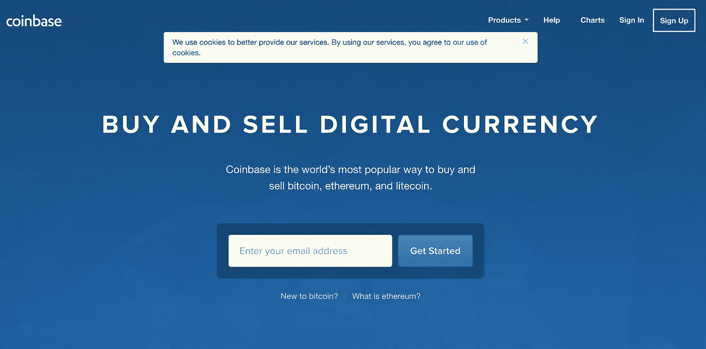

[Coinbase](http://coinbase.com)

我不提倡日内交易，但这篇文章列出了更多参与加密货币投资的有用步骤。

 [## 比特币、以太币和莱特币日交易 10 步指南

### 用加密货币交换假人。

medium.com](/@kaleazy/10-step-guide-for-day-trading-bitcoin-ethereum-and-litecoin-79123673957c) 

## f)保持最新状态。

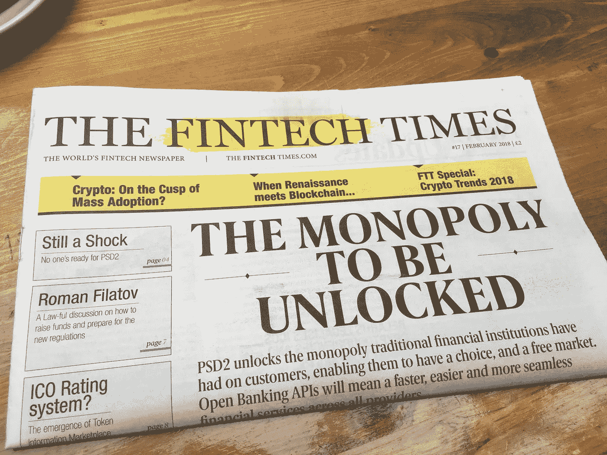

[FinTech Times](https://thefintechtimes.com/) is one place to stay current.

这是一个瞬息万变的领域。几个保持联系的好地方是:

*   [CoinDesk](https://www.coindesk.com/)
*   [Reddit/r/比特币](https://www.reddit.com/r/Bitcoin/)
*   [比特币对话](https://bitcointalk.org/)

像任何新事物一样，这可能需要一段时间。但是我们会得到它的。最终。

Photo by [Nigel Tadyanehondo](https://unsplash.com/@nxvision?utm_source=medium&utm_medium=referral)

# 接下来:如何从一个骗局中评价一个好的 ICO？

在蒂姆·费里斯与尼克·萨伯和海军·拉维康的谈话中，拉维康随口说道:

> “很多 ico 都是骗局。”

这又回到了眼下的问题:亚尼斯公司的 [ICO Pass](https://www.icopass.id/) 是一项可靠的加密货币投资吗？坚实到可以投资？足够让我放下我的名字写一篇关于。

在本文的第 2 部分，我将评估 ICO Pass 的重要特征，以了解它是否是一项可靠的 ICO 投资。

# 我一完成这篇文章的第二部分就可以拿到。

我一写完就寄给你。另外，我将分享我用来区分可靠 ICO 和骗局的 4 个基本问题。

## P.S .如何参与 ICO Pass？

ICO Pass 使 KYC(“了解您的客户”)身份检查对全球的 ICO、银行和政府来说更快、更容易、更便宜、更安全。

*   ICO Pass 的代币销售已经开始。访问[*ico pass . id*](https://www.icopass.id)*了解更多。*
*   获取关于 ICO Pass 发布的最新消息或关注他们的 T2 电讯频道。

## 这篇文章发表在《T4》杂志《创业》(The Startup)上，这是 Medium 最大的创业刊物，有 317，238 人关注。

## 在这里订阅接收[我们的头条新闻](http://growthsupply.com/the-startup-newsletter/)。

**