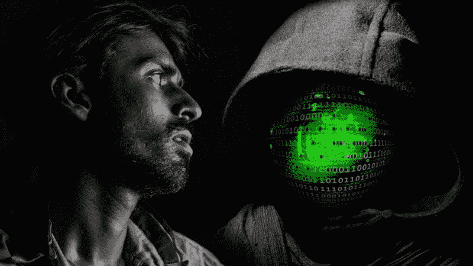
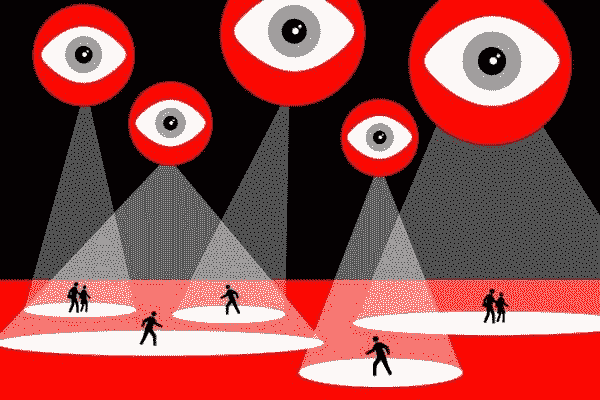
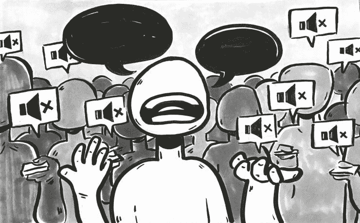
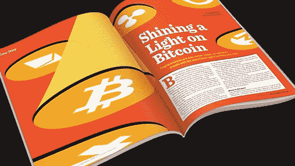

# 加密货币和运动的悠久历史

> 原文：<https://medium.com/swlh/cryptocurrency-and-the-long-history-of-movements-83ca9911f75b>

What is it that you see?

(抄送: [Konsultek](https://konsultek.com/reporter-trolls-the-russian-dark-web-and-finds/)

"*在每一种真正的恐惧背后，都隐藏着一种补偿其痛苦的方式."——嘲讽的真相*

按照世界的双重结构，我们总是会惊讶于这样一个事实，即每一个伟大的创举，都酝酿出一种质疑这一壮举的方式。

从核装置的发明到有助于避免争端的自然边界，每一个被创造出来的术语都有同样令人满意的反义词。

互联网也是如此。

定义互联网的层次和架构将是对互联网的殖民，这最初为自由的政治异议和对各方面的双焦点观察铺平了道路。然而，我们还是那样做了。

无论你说什么、想什么或键入什么，长期以来都受到大量审查，一些无法证明其特定行为动机的声音，成为联邦调查局(FBI)、国家安全局(NSA)等机构的猎物，有时还会成为互联网坏人的猎物。

Big Brother is not just one.

(抄送:[每日博客](https://thedailyblog.co.nz/2017/05/06/this-is-the-spy-agency-that-national-gave-mass-surveillance-powers-to/))

这和其他一百万冒名顶替者，正如一些人所说，是竞选总统的理想候选人。

跟踪互联网上的每一项活动是一项艰巨的任务，任何政府资助的机构都会乐意承担。

然而，有一个主要的问题，即这一切都是合理的吗？

不，很大一部分永远不会。

那么，当你们自己的政府要抓住你们的钩子，把你们扔进那些长着贪婪的牙齿和满是令人厌恶的欲望的眼睛的鲨鱼中间时，提交一份[Change.org](https://www.change.org/)请愿书的目的是什么？

只有当我们开始遵守自然规律，而不是那些娇小的自以为是的组织和可恶的甚至不值得谈论的规则时，照亮整个宇宙的新月才会恢复昔日的辉煌。

互联网的阴暗面肯定会发挥关键作用，帮助我们实现这一目标。

“在那里，心灵没有恐惧，希望没有虚假。这样一个时间线的到来将标志着终结的开始，一个很久以前小心翼翼的对一切事物的贪食在运动中提出的终结。”

不言而喻,《黑暗世界》不仅仅是关于儿童色情、残酷的新奇事物、激进的雇佣军或披着反部落主义外衣的盛行的部落主义，它还是一个探索言论自由、表达和未经审查的价值观的无休止的渠道。

Liberals who discard conservative beliefs are not liberals.

(抄送:[水银](https://utdmercury.com/liberal-ideology-hypocritical-free-speech/))

然而，政府声称的宣传迫使他们从同一批人手中夺回权力，这些人曾经放弃了他们的身体或社会权利的感觉，原因是那些曾经天真地谈论国家及其固有价值观的人造成了不道德的创伤。

*叹息*

另一方面，黑暗的互联网是他们眼前令人不安的真理之光，一个与他们统治的合作希望相反的真实希望，一个每个人都可以成为自由言论的捍卫者和纯粹真理的火炬手的毫不掩饰的渠道。

但是，如果我们按照历史的趋势走，那么真理之窗的出现，必须从无知和谎言的面纱中出现。

只有这样，我们才能感知世界的本来面目，而不是国家赞助的电视节目或自称是新闻业真正精髓的英雄们向我们灌输的东西。

一个普通人唯一能做的就是远离被所有人欣赏的普通真理和被所有人谴责的普通谎言。

与加密货币和黑暗世界相关的运动不胜枚举，然而，如果我们开始逐一扫描它们，那么比率会令人不安地接近 50-50，其中一些人将它用作个人利益的杠杆，一些人则作为负责任的公民为每个人的共同利益尽自己的一份力量。

如果我们只关注后者，那么从爱德华·斯诺登到 T2·哈姆扎·班德拉吉，每一个曾经沉默的人，都会激励一百万人放弃他们一丝不苟的工作方式，走上一条真正的道路，实现所有人的全面发展。

(抄送:[阿塔塔克](https://www.artattackk.com/blog/the-dark-side-of-the-internet/))

就像黑暗网络的发明一样，这篇文章也有它的不足之处，比如:

*   没有一处提到联邦调查局是如何通过拦截“和平”政党之间交换微笑和他们对更美好世界的愿景的集会来阻止恐怖袭击的。
*   或者是在第三方黑客和他们的机器人的外部援助下，[硅路和大量儿童色情网站](http://nation.time.com/2013/10/04/a-simple-guide-to-silk-road-the-online-black-market-raided-by-the-fbi/)被国家支持的机构关闭的时候。

原因？

你知道所有煽动叛乱的黑暗网络和批判性双重思维的危险，所以我们今天最好只看到它积极的一面。

暗网的每一笔交易都伴随着类似比特币、莱特币、以太坊等数字货币。因此，人们把他们当作主要罪犯，而不是真正的罪人。

重要的是要知道，每一种资源都可能成为毁灭的潜在对象，因为这完全取决于你和所有人使用它的方式。

加密货币的传播者和企业家 Vishal GuptaT3 在被问及加密货币的未来时说道

“我们必须消除与加密货币一词相关的污名，即加密货币永远无法取代货币作为常规交易模式，理由是它们的波动性、安全性和基本上不受监管的性质。他们是，因为我相信他们是我们在这个疯狂的世界上表达不同意见的唯一希望。因此，让我们携起手来，享受我们对一个自由世界的憧憬，在这个世界里，思想和观念再次开始自由流动”。

跨越它的最佳方式是跟随道路并引领方向，以便将加密货币带到今天的明亮光线下，并对本世纪最有前途的创新心怀感激，这一创新目睹了世界各地政治局势和人权侵犯的恶化。

Does dark deserve to stay in dark?

(抄送: [ThinkAdvisor](https://images.thinkadvisor.com/thinkadvisor/article/2018/02/05/bitcoin-cryptocurrency-ia-0218-mi600.jpg) )

有很多地方可以买到加密货币并进行交易，以享受权力分散的乐趣，如[币安](https://www.binance.com/en)、[比奈克斯](https://www.binex.trade/)、 [Bitfinex](https://www.bitfinex.com/) 、 [Koinex](https://koinex.in/) 等。

与此同时，继续支持黑暗世界和加密货币，因为这是你能找到当今社会理智和未经审查的声音的唯一地方。

## 这篇文章发表在 [The Startup](https://medium.com/swlh) 上，这是 Medium 最大的创业刊物，拥有+385，320 名读者。

## 在这里订阅接收[我们的头条新闻](http://growthsupply.com/the-startup-newsletter/)。

