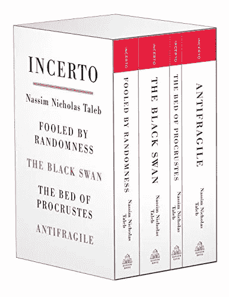

# 加密货币投资，向朋友解释

> 原文：<https://medium.com/swlh/cryptocurrency-investing-explained-to-a-friend-f8acb51bbdc0>

## 该不该投资？怎么会？多少钱？

*免责声明:本评论无意作为投资建议。仅供参考。购买加密资产是非常危险的，你应该在购买前征求有执照的专业人士的意见。*

TL；博士:猜测比特币是否是泡沫很难。摆脱这个难题的唯一方法是运用塔勒布的黑天鹅策略，把你能承受的损失作为期权来投资——前提是你理解是什么驱动货币价值(并相信这一点)。

事先推荐阅读: [*比特币，给朋友解释过*](/@elmidou/bitcoin-explained-to-my-friend-f51e524c6ad6) 。

# 逃离难题

有几个很好的理由可以解释为什么比特币达到了目前的价值，并且随着时间的推移可能会升值更多。但也有明显的泡沫迹象:狂热、投机和只是跟风投资的人。我们知道这些故事的结局。

因为比特币现在是一种货币(排名第 14，领先于沙特阿拉伯里亚尔)，而且货币不再与任何基础资产相关，我们几乎不可能知道一种货币何时过高，或者市场是否是错误的。比特币的波动性肯定更大，但这意味着你应该远离它吗？

我学习了三年金融理论，在投资银行工作了三年，完成/投资了总额超过 300 亿美元的交易，但我从来没有像读纳西姆·塔勒布的两本书*黑天鹅*和*抗脆弱*时那样了解投资。Taleb 附带了几个重要的概念，其中一个在这种情况下很有用:“寻找可选性”。

面对[黑天鹅事件](https://en.wikipedia.org/wiki/Black_swan_theory)(具有重大影响的不可预测事件)，如果你赌输了，进行对你的生活没有任何影响的小的可选性赌注是有意义的。

> 解释:如果我有 10 万美元，我将 99%投资于担保资产、债券、ETF 和房地产，我可以将 1%投资于高风险高回报的投资，因为最后一千美元的效用比之前的任何一千美元都低。如果像大家预期的那样，黑天鹅没有发生(99.5%的几率)，我失去 1%的价值对我的人生不会有太大的改变。然而，如果黑天鹅事件发生(0.5%的可能性)，我的 1000 美元投资可能会带来巨大的收益(如果交易正确，还会增加 20 万美元以上)。这是保险，颠倒了。

简而言之，如果你认为一个黑天鹅事件很可能发生，并且你找到了一种方法来建立上行风险敞口的期权性，你可能会想要投入一笔你准备完全输掉的区别金额来下注。

Bitcoin carries enough volatility to work as an option for upside in itself.

# 比特币黑天鹅

有几种情况可能导致比特币的价值飙升。虽然最有可能的情况是泡沫破裂，但我认为有三种情况会构成正面的黑天鹅。

## 场景 1:世界变得完全加密

最简单和最有效的方法是，在加密货币使用增加的情况下获得积极的敞口，即购买其核心货币比特币。比特币的网络效应和 3000 亿美元的市值也意味着，随着时间的推移，它肯定会成为第一种稳定的加密货币。因为比特币是目前所有注意力的中心，它首先推动了飙升。

因此，如果你寻求短期收益，比特币可能是一个比分散投资于数百种加密货币更好的选择，这些货币在未来几年内可能不会产生网络效应。

> 如果你比较一下过去三个月的价格变化，比特币升值了 5 倍(从 9 月 17 日的 3.8k 到 12 月 16 日的 19.5k)，而以太坊升值了 2.4 倍，我的 35 种精心挑选的加密货币升值了 1.9 倍

Adoption of new technologies is getting faster over time.

## 场景二:比特币取代黄金

与金条相比，比特币更容易获得、更容易储存、更容易保护、更容易出售。就像黄金一样，比特币的价值不是来自于该资产的潜在用途，而是取决于我们认为的开采价格。

此外，除了存储价值，比特币再也不能假装有任何其他用途，因为对于所有其他游戏来说，有更好的加密货币，有专用的区块链和更智能的代码。因此，投资者不太担心比特币的价值会因为竞争而下跌。

> 解释-假设你认为以太坊是一项明智的投资，因为你可以从双重上涨中受益:你可以通过投机储存价值，因为它一直在升值，智能合约的市场是巨大的，所以以太有很好的用途。如果有一天 EOS 或 Cardano 用更好的代码创造了一个更强大的区块链，会发生什么？投资乙醚以储存价值的投资者现在面临着与竞争相关的负面影响，因此不得不撤出资金，形成螺旋式下降。

想要储存价值的投资者选择了比特币，因为你不能用它做太多事情。单人游戏。

如今，约有 6 万亿美元的黄金被用于在金库(或我生活过的许多国家的奶奶嘴里)储存价值，相当于 20 倍于比特币的市值。

Bitcoin is the only cryptocurrency that could defy gold as the refuge asset.

## 场景 3:比特币取代位于避税天堂的流动资产

同样的道理也适用于目前存放在税收天堂(约 7 万亿美元)银行的流动资产，因为任何人都希望这些资产没有政府追索权。

换句话说，持有流动资产的道德人和自然人自然更愿意将这些资产中的一部分放在任何人、组织或司法管辖区都无法强迫的区块链上。

这些事件发生的可能性很小。但是如果其中的一个发生了，而你正在货币上冲浪，这可能是你乘过的最好的浪之一。

# 加密货币投资组合多样化

如果你碰巧考虑长期投资超过 5000 美元，在你的投资组合中增加一些多样化可能是有意义的。每种加密货币都试图解决一个比特币无法单独解决的问题。

*   以太坊已经创建了在交易中添加更多代码的选项，从而为编写与交易相关的复杂合同提供了可能性。基于以太坊的开源代码( [ERC20](https://en.wikipedia.org/wiki/ERC20) )的其他几种货币已经被创造出来，以开发新的市场——稍后将详细介绍。竞争者: [EOS](https://eos.io/) 。我的赌注:[卡尔达诺](https://www.cardanohub.org/en/home/)。
*   [Litecoin](https://litecoin.org/) 增加了区块链每秒可以执行的交易数量，这使该货币成为成为大型点对点支付货币的最有力竞争者之一。争夺者: [BCash](https://www.bitcoincash.org/) 。我的赌注:[恒星流明](https://www.stellar.org/)。
*   [ZCash](https://z.cash/) 在区块链上开发了额外的加密技术来匿名化交易，同时还能够验证信息，例如您是否拥有足够的资金进行购买。竞争者:[莫内罗](https://getmonero.org/)。我的赌注:[卡尔达诺](http://www.cardanogub.org):)

比特币的开源代码允许加密货币的大量存在，因为其他加密货币是基于其源代码创建的，其基本原则是这些新的加密货币本身也是开源的。开源使社区能够以达尔文式的规模进行创新。

由于可扩展性问题，加密货币的大量出现是必要的。区块链是分散在全球数万台服务器上的数据库。区块链，因为他们是安全和分散的，很难扩大规模。Visa 每秒可以处理数千笔交易，因为它只有一个版本的信用卡数据库。区块链处理的复杂程度更高:他们有成千上万个版本的同一个数据库，都向公众开放并接受新的交易。

> 解释:为了安全起见，区块链上所有交易的历史都需要在所有这些服务器上复制，并压缩成每个人都接受为有效的块。这个分散的数据库在每秒钟在每个服务器位置处理几个交易的同时，努力更新其自身的各种版本，同时确保所有交易之间没有不一致:区块链防止你同时在纽约购买一个 [cryptokitty](https://www.cryptokitties.co/) 并在澳门使用两个服务器用相同的以太币支付扑克。

如今已经有超过 1000 种加密货币可供交易。这些货币中有几个是骗局，其中大部分可能没有达到无处不在的地位。然而，有许多应用是有意义的，这场 ICO 革命使你有可能参与由代码和算法推动的潜在的巨大技术变革。

Blockchains around the Globe.

区块链可以用来取代整个市场和市场。未来十年，区块链可能会取代所有的股票市场、保险公司和零售银行。区块链可以取代你今天信任的每一个中央集权的组织，成为一个更有效、更公平、回报每一个为之做出贡献的人的去中心化的算法。脸书可能、应该并且(我希望)将被一个社交媒体区块链所取代，你可以把它用作你的虚拟身份数据库、你的关系数据库，这也将奖励你对社区的贡献，以及你观看这些广告的时间。

> *文章在此继续:* [**区块链的颠覆，向朋友解释**](/@elmidou/the-blockchain-disruption-explained-to-a-friend-747146cf1833)

如果你想应用所有这些，看看俄勒冈大学金融学教授写的这篇文章。你会发现在哪里购买你的第一个比特币碎片(【coinbase.com】[，如何将它们兑换成其他货币(【bittrex.com】](http://www.coinbase.com)[，在哪里了解其他加密货币(](http://www.bittrex.com)[【coinmarketcap.com】](http://www.coinmarketcap.com)，播客，媒体博客)，以及如何安全地储存你的硬币(我推荐 [Exodus](http://www.exodus.io/) )。

## 这篇文章发表在 [The Startup](https://medium.com/swlh) 上，这是 Medium 最大的创业刊物，拥有 275，057+人关注。

## 在此订阅接收[我们的头条新闻](http://growthsupply.com/the-startup-newsletter/)。

