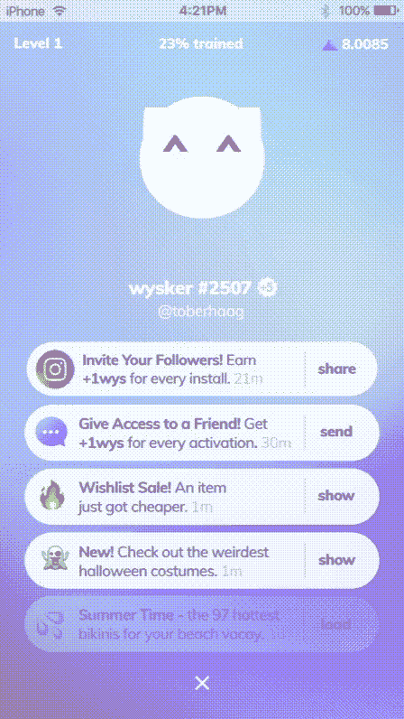

# 隐猫去购物了

> 原文：<https://medium.com/swlh/cryptokitties-went-for-shopping-4acce5a7be39>

> 昨天，2018 年 7 月 13 日，来自柏林的购物体验初创企业 Wysker 开始了他们的“觉醒运动”。从现在开始，你可以在 Wysker 的网站上激活你自己的购物猫。时不时会有一只新的虚拟猫醒来，你可以宣称它是你的。我很幸运，得到了 26 号猫。如果你想拥有自己的 wysker，只需[点击这个链接](https://wysker.com/s/26)，让它成为我的兄弟姐妹。

但是背后是什么呢？Wysker 希望重塑我们的移动购物体验。观看此视频，感受一下:

它既流畅又快捷——体验购买“一代 Snapchat”。

他们也非常注重隐私，保护用户数据免受广告商的侵害。增加一个代币经济，它也被用于[激励广告网络](https://www.google.com/url?sa=t&rct=j&q=&esrc=s&source=web&cd=1&cad=rja&uact=8&ved=0ahUKEwjr2e3LsJ7cAhWHYlAKHfzdBQIQFggsMAA&url=https%3A%2F%2Fwww.wystoken.org%2Fmedia%2Fwysker-whitepaper.pdf&usg=AOvVaw39Kt22i8_rWK4c-GNYXdcQ)(计划于 2019 年推出)。

维斯克去年年底推出了他们的代币。他们是我开始进入这个秘密世界的主要原因，正如你可以[在这里读到的](/swlh/adventures-in-cryptocurrencies-f59471356f93)。他们的开始相当艰难:

*   他们受到了奇偶错误的影响。投入代币发行的很大一部分以太网仍然被锁定，无法访问。
*   2 月份，App v1 希望在谷歌 PlayStore 上直播，但苹果不接受它在 iOS 上的应用，因此他们在时代广场上的巨大营销活动多少受到了关注。它仍然值得一瞥:

但是这个团队完全有信心取得成功。

他们继续进行疯狂的寻宝活动，吸引了整个社区数周。据 Telegram 上的[新闻频道称，他们还成功获得了苹果公司对其 2.0 版本应用程序的批准，该版本将于 4 周后发布。它将使用人工智能来创建购物故事——灵感来自 Snapchat 和 Instagram 上的故事功能，你可以在这里阅读](https://t.me/wyskernews)[这个背景故事](/wysker/neural-networks-at-wysker-6b99b54b0c55)。

你也可以在 Reddit 上找到一份关于 Wysker 的很好的总结。

## 觉醒运动

昨天维斯克发起了他们的觉醒运动。用户可以认领自己的“购物猫”，名为 wysker。

> 可以把 wysker 想象成虚拟电子鸡和密码猫的混合体。

你可以声称一个 wysker 是你的，你给它一个好听的名字，并需要通过电子邮件注册。每一个成功认领的威斯克人将获得一个 WYS 代币(附在他/她的威斯克上)和另一个 WYS 代币。被推荐的威斯克斯成为“兄弟姐妹”。一个 WYS 代币并不多——截至 2018 年 7 月，目前价值 5 美分。但是这个团队也会选出一名获胜者 wysker 来赢得更多的代币。也有迹象表明，快速并获得低数量的 wysker 将是有益的——这肯定是游戏化的另一个方面。

如果你能试一试，我会很高兴。如果你通过[这个链接](https://wysker.com/s/26)创建你的 wysker，我们将成为虚拟兄弟姐妹。；-)

***免责声明:*** *本文无意成为任何形式的投资建议。如果你打算投资本文提到的某个项目，自己做研究并寻求专业支持。*

***延伸阅读:*** *如果你喜欢这个故事，你可能还想看看我早期的作品关于* [*【数字化市场民主化】*](/swlh/democratizing-the-digital-markets-787b749b3405) *，我的* [*【区块链 vNext 系列】*](/swlh/blockchain-vnext-a-series-ff5469aa1f22) *或* [*实用令牌的隐藏力量*](/swlh/the-hidden-power-of-utility-tokens-e846d3a5c1eb) *。*

## 这篇文章发表在 [The Startup](https://medium.com/swlh) 上，这是 Medium 最大的创业刊物，拥有 344，974+人关注。

## 在这里订阅接收[我们的头条新闻](http://growthsupply.com/the-startup-newsletter/)。

