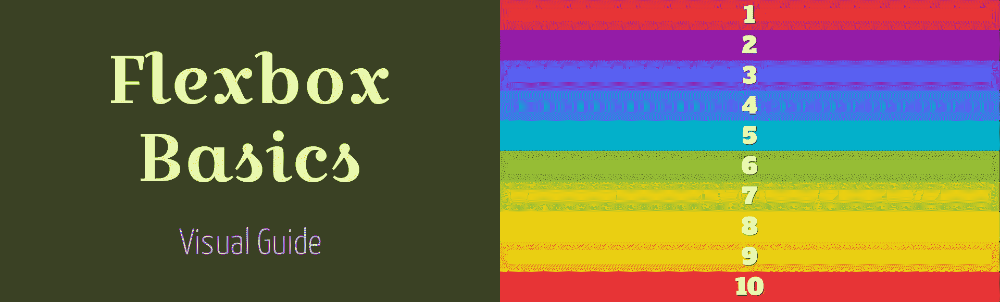

# CSS Flexbox 基础视觉指南

> 原文：<https://medium.com/swlh/css-flexbox-fundamentals-visual-guide-1c467f480dac>

## CSS 柔性盒模块概述

跟随 [Wes Bos](http://wesbos.com/) 的[什么是 Flexbox](https://flexbox.io/) 课程时 [MDN web 文档](https://developer.mozilla.org/bm/docs/Web)的笔记。

# 介绍

Flexbox 是`Flexible Box Module`的简称。一个布局模型，允许容易地控制 html 元素之间的空间分布和对齐[2]。