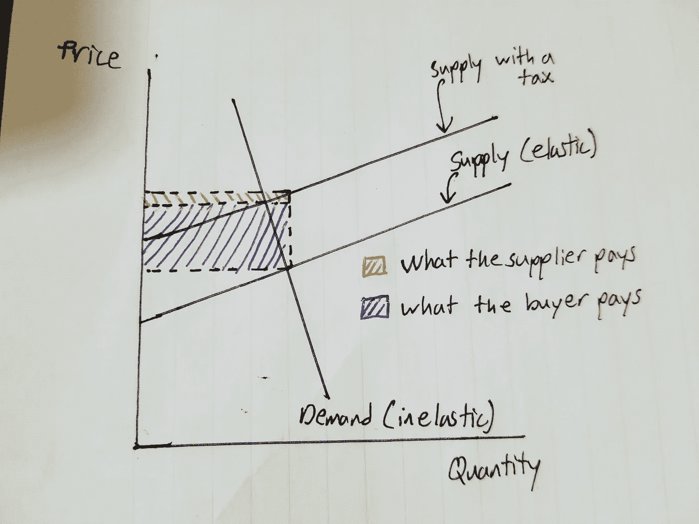

# 不能铸造的货币

> 原文：<https://medium.com/swlh/currencies-that-cant-be-minted-6b55712689b4>

## 无法交易的财富...然而

一直有人问我，“放学后你想做什么？”。

如果我说我接受一份软件工作不是为了钱，那我是在撒谎吗？

我想变得富有，但我相信有些货币是无法铸造的。

## 影响

你可以花一年时间准备，然后攀登珠穆朗玛峰。这看起来可能要花你 100 美元。世界级的装备，不想死的时候要花很多钱。你获得的是**的影响力。**

搜索那些成就伟大事业或拥有强大思想的人的故事。他们很有可能通过公开演讲或其他分享想法的方式来创造财富。

这不一定是什么惊人的身体壮举。米歇尔·奥巴马给了我们强大的优雅和洞察力的光环。她写了一本关于她所学到的东西的书。她没有得到过有意义的生活的报酬。她很有影响力。

 [## 成为

### 这是美国前第一夫人在充满意义的生活中写的一本亲密、有力、鼓舞人心的回忆录…

www.amazon.com](https://www.amazon.com/Becoming-Michelle-Obama-ebook/dp/B079ZYWJJ8) 

同样的概念也适用于 YouTuber，他使用自己的用户号码免费入住酒店套房，以换取视频评论。

此外，每当我们看到 11 在陌生的事物中吃鸡蛋华夫饼，我们就想吃鸡蛋华夫饼。也许它能给我们像她一样的物理能力。

## 文化

今年圣诞节，当我和家人围坐在餐桌旁享用烤牛肉时，我们都在评论妈妈为圣诞晚餐铺的桌布。

那块桌布几乎没有任何有用的功能。我们已经有了一块全年隔天都要用的桌布。它可能值 10 美元，但我的家人愿意花 40 美元买它。**它帮助我们庆祝我们的文化。**

## 自由

我刚上了宏观经济学导论课作为毕业要求。从工程习题集中休息一下是很好的。

我们在课堂上学的第一课是关于**机会成本。**

> 机会成本:放弃的下一个最佳选择的价值。

虽然我们从失去多买一个椰子而不是多买一只鸡的能力中学到了这一点，但我喜欢认为我们的灵活性让我们在机会到来时更有弹性。可以是工作，投资机会，或者要见的人。

我们学到的另一课是什么是价格弹性。这是代理商对价格变化的敏感程度。我们知道，当税收或补贴适用于买方或卖方时，更有弹性的代理人支付更少的税收或获得更多的补贴。

Tax on the more elastic seller

从上图来看，卖方是更有弹性的代理人。当价格变化时，与价格对买方需求的影响相比，他们供应的数量变化不大。

当对卖方征税时，您可以看到

*   红色+蓝色=向政府缴纳的税款
*   红色=卖家必须支付的金额
*   蓝色=买方必须支付的费用。

不管是对卖方的补贴还是对买方征税，更有弹性(自由)的代理人将从供求变化中受益。

我在大学获得的奖学金让我可以专注于其他事情，比如自学计算机科学和写书。这是那本书。

 [## 上大学时薪 500 美元:每个人都需要阅读的坚韧不拔的奖学金指南！

### 你真的想上大学吗？为什么？你是一个青少年。没有人在 25 岁时有过和他一样的心态…

www.amazon.com](https://www.amazon.com/Get-Paid-500-Hour-College-ebook/dp/B078RBH1WX/ref=sr_1_1?s=digital-text&ie=UTF8&qid=1545845834&sr=1-1&keywords=lucas+moyer) 

其他种类的自由也是可以买到的。过去，女人为了钱和男人上床，然后从天主教堂购买赎罪券，这样她们就可以获得救赎。

## 这是其他不能铸造的货币

1.  健康:正确对待你的身体和精神，这样你以后就不会为此付出代价。
2.  归属/关系:我们付钱不是为了感到孤独。
3.  技能:你所拥有的技能达到顶点时产生的效果并不值得你为之付出的代价。
4.  社交网络:将需求与富足联系起来，从无到有创造财富(优步、Airbnb、people)。
5.  时间:**时间就是金钱。**

所有这些东西都是有价值的，一些企业将它们作为服务提供给你。它们可以被支付，但当它们实际上不需要任何成本时，不如去为自己创造这些财富。

> 与其把 1000 美元投资到股票市场，不如付给自己 1000 美元，让自己在这些无法铸造的货币中变得富有。

## 那么放学后我想做什么？

> *我想要更多，但更多的不是出现在我银行账户上的数字*

## 这篇文章发表在 [The Startup](https://medium.com/swlh) 上，这是 Medium 最大的创业刊物，拥有+404，714 名读者。

## 订阅接收[我们的头条新闻](http://growthsupply.com/the-startup-newsletter/)。

