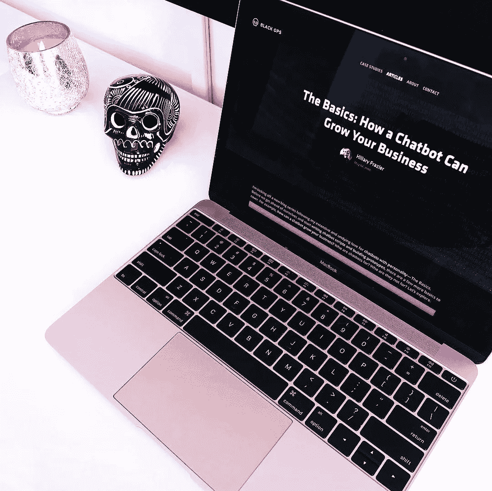
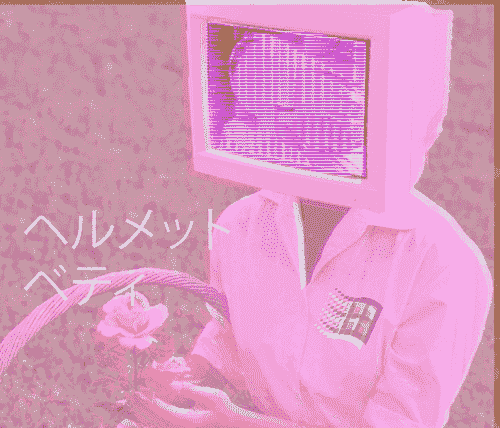

# 机器人基础:设计一个客户收购聊天机器人的人实际上想使用

> 原文：<https://medium.com/swlh/customer-acquisition-chatbot-strategy-85cec88d44ad>

在我的第一篇来自**机器人基础**系列的文章中，我们学习了[聊天机器人如何发展你的业务](/swlh/bot-basics-how-a-chatbot-can-grow-your-business-d7073f928e70)。创建一个机器人，做广告，重新吸引用户，发展你的业务。听起来很简单，对吧？但是中间发生了什么呢？是什么让用户真正点击你的广告并转化为客户？你如何创造一个令人上瘾的用户体验？让我们开始吧。

如果你已经从第一部分决定你想要一个聊天机器人，并计划用它来获得社交客户，首先问自己以下问题:

**除了推广你的品牌/产品，你还能为你的用户提供其他价值吗？**

你的答案应该是肯定的。如果是***不是*** 是的，一个获客 bot 可能不适合你。或者，你可能需要多花一点时间头脑风暴你能为你的潜在客户提供什么价值，并不断回到那个问题，直到你的答案 ***是*** 是*。*以下是一些有价值的客户洞察示例，可以作为获取客户的“诱饵”:

*   立即获得服务报价
*   根据产品的个性化需求找到合适的产品
*   学习可以改善用户体验的技能
*   通过您的网站或时事通讯获得独家内容或下载

你会注意到，这些价值不仅仅是客户简单地收集可以在你的网站或应用程序上找到的关于你公司的信息，机器人要成为收购的战略工具，必须有更多的**T21。一旦你确定了自己的价值，这将成为你的机器人的故事情节。**

在这篇文章中，我将详细介绍如何设计你的[聊天机器人脚本，但在你深入细节之前，重要的是要建立你的机器人策略，并专注于一个成功机器人的基本要素。](https://chatbotsmagazine.com/how-to-start-designing-chatbots-if-you-have-no-experience-8b2ba1e762dd)

专注于基础知识，让我们从聊天机器人策略的三大要素开始:

1.  **观众**
2.  **目标识别**
3.  **平台优势**

**观众。**你知道你能为用户提供什么价值，现在你可以专注于**如何**吸引你想要的观众。完成一个练习，定义以下内容:

*   您理想的受众概况(人口统计/地理)
*   工作/教育(对你的主题的理解)
*   兴趣(他们喜欢什么品牌，以及你自己以外的话题)
*   消费的内容(照片、视频、表情符号？他们使用什么语言)
*   影响者(他们信任谁的意见)

这个练习将帮助你理解如何吸引你的听众，如何用他们能理解的语言谈论他们重视的话题和人物。你还将决定如何与你的听众沟通，并通过交谈呈现真实的体验。

**目标认同。**从目标开始，为你的听众设想最好的情况，以及你希望他们采取什么行动。这将引导你走向你的机器人目标。

**什么是好的目标？**聊天机器人获取客户的最佳目标是具体且可衡量的。虽然可能有次要的、不太具体的目标，但专注于一个明确的目标会让机器人保持专注，并且对话简洁。目标的例子有:

*   点击链接下载或注册优惠
*   完成报价
*   参与度或品牌认知度(通过基准衡量)

**平台优势。聊天机器人不同于任何其他媒介。他们在不同的平台上有不同的优势，比如扩展自动对话的能力。重要的是要考虑如何最有效地使用聊天机器人的功能，以及这些功能能给你的观众带来什么样的价值。特定平台优势的示例:**

*   个性化(使用某人的名字或保存他们的偏好)
*   及时通知(推送通知和提醒)
*   API 和高级集成

有了你对用户的**价值**，你的**受众**概况，你的**具体目标，你将在你的机器人中利用的**和**平台优势**，你就有了一个人们实际上想要使用的客户获取聊天机器人的战略公式。一旦你有了你的 bot 策略(并且有文件证明)，你就可以开始设计对话了，从我最喜欢的一个流程开始——无所不包。这就是令人沮丧的机器人和有趣的机器人的区别。**在我的下一篇帖子机器人基础知识中，更多关于一抓到底的重要性。**

喜欢你正在阅读的东西，准备好成为一名对话设计师了吗？参加我的在线课程吧！学习聊天机器人写作的所有基础知识，开发一个策略，编写你自己的对话，创建一个原型，并获得 UX 作家集体的证书！ [**在这里报名。**](https://uxwriterscollective.com/chatbot-writing/)

我是希拉里，Black Ops 的聊天机器人战略和对话设计主管。想聊天机器人？ [*加入我的私人脸书群吧！*](https://www.facebook.com/groups/210860349731183)

## 这篇文章发表在 [The Startup](https://medium.com/swlh) 上，这是 Medium 最大的创业刊物，有 334，853+人关注。

## 订阅接收[我们的头条新闻](http://growthsupply.com/the-startup-newsletter/)。

