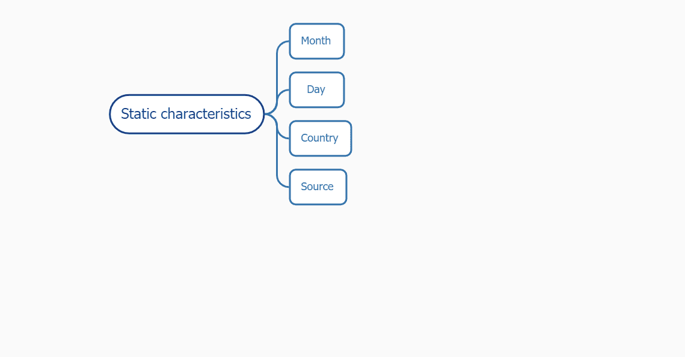
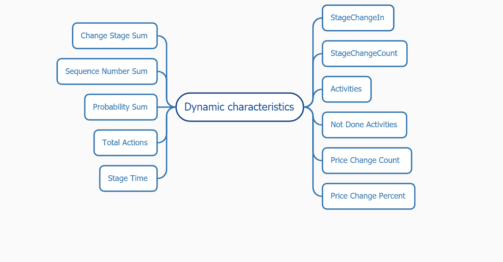
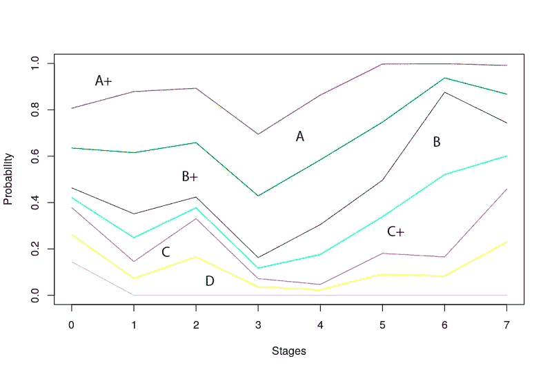

# 中小型企业的客户评分 Realomat AI 现已成为现实

> 原文：<https://medium.com/swlh/customer-scoring-for-small-and-medium-businesses-is-now-a-reality-with-realomat-ai-4db50d561518>

任何销售经理的任务都是计算那些准备购买的客户，并给予他们最大的关注。在沟通过程中，这是在直观的层面上完成的，经理了解任何对话的参与程度。但如果他/她交易量大，经验低，那就相当有挑战了！

因此，许多客户关系经理都有自己的销售线索评分系统来评估指向成功购买的各种因素。此外，他们根据目前为止已经证实的这些因素来估计每一个线索。然而，这一过程面临着最典型的问题。这种评分系统对数字并不十分精确，并且经常给出无效的信息。

# 技术方面:帮助评估成功交易的特征

因此，让我们看看我们是如何决定更加个性化地处理这个问题，并找出对我们的客户最重要的分数的。

为了让系统正确评估所有的交易，有必要正确划分您拥有的全部数据。我们试图为成功的评估开发一些精确的策略，让我们看看我们得到了什么。

下图显示了两个主要的集群:彼此密切相关的静态和动态变量。

***静态特征*** 在公司与客户的协议期间，自始至终不变。例如，它们是创建应用程序的日期(月、日)、原产国、来源。

***动态特性*** 在销售线索培育的每个阶段都在变化。

我们将与客户互动的整个过程分为七个阶段。所有的逻辑都是一个接一个。例如，“未完成的活动”显示一个经理的许多未完成的活动。

因此，考虑到以前的数据，系统相应地将一些线索与某个结果进行比较。

如果出现关于改变某些特性的问题，那么你肯定可以调整它们中的任何一个。从技术方面来说，我们的开发人员可以添加或删除一些数据。然后它会实时自动完成，这样销售经理就可以随时获得相关信息。

在开发阶段，我们设计了一个概率方块，在这里我们检查了已经完成的交易。数字化数字和非数字特征，我们能够更好地计算成功和不成功的交易，并找出发生这种情况的原因。

每个阶段都被赋予一定的概率。简而言之，每个阶段的系统都使用前一阶段的数据。

这种因阶段而异的概率错误估计的结果大约是 80-90%。印象深刻吧？

但这些只是数字，为了让经理更好地了解交易是否成功，我们开发了一个成功评估量表。它对每个阶段的每个案例进行评级，有助于轻松理解对某笔交易应该采取什么措施。你可以分析下图上的成功曲线。最繁荣的交易有估计值——а，A +，中间值在в和в+之间，最低估计值是 d。

scale of success evaluation

因此，经理可以在他的 CRM 中看到他的交易在每个交易阶段的成功等级，这样更容易处理客户的请求。

我们的人工智能每天都在学习和观察领头的旅程，以理解它们的运作原理并开发评分系统。同样，经过一段时间后，静态和动态特性可以通过人工智能改变为新的特性。

# 大容量的数据不是问题

拥有一定的数据，我们可以改善任何员工或整个销售部门的一些信息。

管理人员在使用 CRM 系统时面临的最常见的问题是缺乏信息、数据混乱、新任管理人员难以浏览他们的 CRM 系统和找到一些新任务。

借助我们的评分系统，我们可以发现销售漏斗中的销售线索处于哪个阶段，回复率低，销售过程缓慢，转化率低等。

通过这种方式，系统发现问题并解决它，就像医生分配适当的治疗一样。这促进并加快了部门的工作，因为以前的销售经理大约有 70%没有关注正确的事情，错误地安排了他们的优先事项。

现在很容易对所有交易进行优先排序，转化率正在增长，最令人着迷的是，由于我们的新评分系统，您可以轻松设置所有活动。另外，如果和自动化结合，强大的协同作用就出来了。

这还不是全部！现在，企业家或部门负责人可以非常方便地将所有内容合并到一个个人帐户中，输入到仪表板中，并始终有可能管理和控制员工的工作流程。

# 结论

*销售线索评分起着重要的作用，它让您能够设定优先销售线索，使其具备销售资格，并捕捉“可能的交易”。*

*我们的评分系统帮助* ***优化组织*** *交易特征* *，方便销售经理工作。*

*现在，浏览大量数据变得更加容易！企业主可以控制个人账户的所有内部工作流程。*

*我们的交易成功评估标准可自动帮助经理了解特定事件的真实状态，并专注于进一步成功完成交易。*

请将此分享给你所有的媒体朋友并鼓掌👏这篇文章支持我们的团队。我们感谢您花时间阅读这篇文章，订阅并等待一些新的有用的信息！访问我们的官网了解更多:realomat.com

www.facebook.com/realomat/[脸书](http://www.facebook.com/realomat/)

LinkedIn:https:[www.linkedin.com/company/realomat/](http://www.linkedin.com/company/realomat/)

推特:twitter.com/realomat_biz

Instagram: realomat_biz

## 这篇文章发表在 [The Startup](https://medium.com/swlh) 上，这是 Medium 最大的创业刊物，有+399，714 人关注。

## 在这里订阅接收[我们的头条新闻](http://growthsupply.com/the-startup-newsletter/)。

