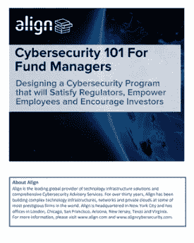

# 投资公司的网络安全趋势

> 原文：<https://medium.com/swlh/cybersecurity-trends-for-investment-firms-49405a4b60c5>

*预测:合规监管、勒索软件、IOT、综合网络安全服务等*

我们的 2018 年网络安全趋势文章旨在提高认识，并提供有关新兴威胁、网络安全风险管理、预防措施、对策和安全意识培训的信息，以增强您的网络情报能力。

# 更多合规法规

对网络安全监管的需求已经并将继续催生监管标准和维护这些标准的行动。

*   欧盟通用数据保护条例(2018 年 5 月)
*   处理、存储和保护欧盟公民个人数据的新 GDPR 标准将产生深远的影响，并可能面临巨额罚款的威胁；即使你没有在欧盟内部广泛开展工作，也可以期待这一举措会启发其他地方的监管。最先违反 GDPR 的几个可能会成为阻止将来不遵守的例子。
*   [SEC 的网络安全部门](https://www.align.com/blog/sec_cyber_unit_enforcement_action)旨在为公共和私营部门提供指导和资源，包括警报、公告和分析。
*   2017 年，纽约州成为第一个制定最低网络安全标准(23 NYCRR 500 部分)的州，影响了银行、保险公司和金融服务机构。各公司可能仍在努力遵守，其他州的类似措施可能很快也会跟进
*   标准化并不总是合法的，可以包括国家标准与技术研究所的出版物，该研究所创建了[研究驱动的有用的网络安全指南](http://nvlpubs.nist.gov/nistpubs/SpecialPublications/NIST.SP.800-53r4.pdf)

***要点:*** *法规迫切需要了解并符合最新规则的合作伙伴。ALIGN CYBERSECURITY 将技术、治理、教育和技术法律方面的专业知识结合起来，成为一项包罗万象的端到端服务。*

# 勒索软件的演变

勒索软件是 2017 年的一个大主题，并可能在 2018 年继续引发问题，因为新的攻击浮出水面，黑客转向新的攻击和利用途径。

*   像 WannaCry 这样的攻击带来的后果是巨大的。很可能具有类似影响力的黑客已经在策划攻击了
*   勒索病毒活动可能会通过将目标转向更易受攻击的个人和企业来应对安全性的提高

***外卖:*** *重大袭击受挫，但仍是一个谜。勒索软件不会很快消失，及时了解最新漏洞和补丁至关重要。*

# 物联网中的漏洞

*   新设备不断增加，但物联网仍然是一个漏洞，许多设备缺乏基本的安全保障
*   据估计，到 2020 年，设备数量将在 240 亿到 500 亿之间，物联网和漏洞造成的潜在损失将继续呈指数级增长

**市场压力和快速扩张使时髦的 IOT 成为首要目标。通过培训和认证来支撑现有的安全性和鼓励安全行为，将是对冲基金和另类投资公司保持领先的关键。**

# *处于十字路口的双因素认证*

*   *防御者和攻击者之间的关系仍然是发展技术的军备竞赛*
*   *随着为应对大规模数据泄露而对双因素身份认证的需求增加，黑客将会寻找削弱或回避双因素提供的安全性的变通办法或漏洞*

***任何级别的安全性都取决于持续的维护和更新。***

# *需要合格的、[全面的网络安全服务](https://www.aligncybersecurity.com/?__hstc=252426326.0baee8fc874f3d8914b99fa7d4c03624.1510929979757.1523548558628.1523563352705.296&__hssc=252426326.4.1523563352705&__hsfp=3137786911)*

*   *根据最近的[报告](https://www.netwrix.com/2017itrisksreport.html)，由于人为错误和恶意活动，安全事件和运营/合规性问题司空见惯*
*   *对网络安全人员的需求非常大，对外部服务/合作伙伴以及虚拟首席信息安全官的需求也在不断增加，他们无需雇佣额外的全职人员即可提供服务*
*   *网络安全会影响公司的多个部门，因此，企业需要采用多学科方法来管理网络风险。*
*   *全面的网络安全解决方案减少了与多家供应商合作的麻烦，并降低了与如此多的移动部件相关的风险。与包括教育、法律、技术和安全在内的各种学科的主题专家团队合作，将为公司构建多样化的基础，以保护其当前和未来最重要的资产。*

****导读:*** *网络安全是现代企业面临的一个重大问题，投资公司、私募股权和金融机构是主要目标。精明的公司所有者将优先考虑寻找最好的服务提供商，网络安全行业的创新参与者应该利用这个机会。**

# *加密货币*

*   *比特币价值的飙升给加密货币带来了越来越多的关注；这也使得加密货币成为黑客和勒索软件的目标*
*   *高威胁集团已经开始瞄准加密货币市场及其主要参与者*

# ***民族国家黑客和代理战争***

*   ***随着朝鲜被指可能是 WannaCry 攻击的罪魁祸首，随着各国政府相互权衡并利用网络攻击，黑客攻击已经走向国际舞台***
*   ***科技公司可能会发现，在公共和私人领域之间开展合作至关重要，因为网络攻击的目标是私人公民和公司，以获取公共利益***

******要点:*** *网络攻击作为民族国家行动的一种手段，纠缠着公民和公司，而不管他们是否感知到参与。网络安全，以及就违规行为的性质和传播进行更好的沟通，将是 2018 年的一个主要话题。****

# ***处理数据泄露***

*   ***Equifax 概括地展示了处理数据泄露的错误方式，延迟、误导和强调他们自己的失败。他们在公众面前的尴尬有望成为其他公司的一个教训，让他们更优雅地处理公关和应对违规行为。***
*   ***Equifax 数据泄露事件凸显了不断变化的威胁形势以及企业和个人环境中普遍存在的无准备状态。***
*   ***现在比以往任何时候，所有消费者也必须发展，并学会如何保护他们的个人金融信息和消费者信用档案。***

******要点:*** *贵公司处理数据泄露的方式对于减轻损失至关重要——光学因素可能与数据的实际安全性同样重要。精明的公司将受益于在发生违规时的主动和负责任的应急计划。****

# ***终端安全性—修补和应用测试***

*   ***主动补丁管理可以避免 WannaCry，但对于许多组织来说，这样做仍然是一个挑战***
*   ***如果您不能管理终端安全，只是听天由命，那么您的组织很可能容易受到今年的攻击***

******外卖:*** *大多数情况下，勒索软件利用的是常见的漏洞。主动管理终端安全是降低数据安全风险的简单方法。****

## ***三思而后行-网络钓鱼电子邮件提示***

***作为网络安全的最佳实践，Align 建议您对潜在的电子邮件诈骗保持警惕和怀疑。您需要注意以下事项:***

*   ***声称来自您的金融机构、社交媒体账户等的网络钓鱼电子邮件，您可以在其中检查您的数据是否遭到破坏***
*   ***声称信用卡、您的信用记录或其他个人财务信息有问题的网络钓鱼电子邮件***
*   ***自称来自您的银行或信用合作社的诈骗电话***
*   ***任何信用卡上的欺诈性费用，因为你的身份被盗***
*   ***电子邮件，你的帐户已被暂停。如果您想更改订阅服务的设置，千万不要点击未经验证的电子邮件中声称来自您拥有帐户的组织的链接。相反，在浏览器中键入网站名称，以标准方式登录您的帐户，并检查那里的任何消息。***

*****你想设计一个让监管者满意、赋予员工权力、鼓励投资者的网络安全计划吗？下载下面的白皮书。*****

******

# ***[立即下载白皮书](https://www.align.com/cybersecurity-101-for-fund-managers?hsCtaTracking=10d43cde-47fc-4037-900e-d9cde8074eca%7Ca87a4161-67ed-43a5-ba9e-f4f0f18a8155)***

******

## ***这个故事发表在 [The Startup](https://medium.com/swlh) 上，这是 Medium 最大的创业刊物，拥有 316，028+人关注。***

## ***在这里订阅接收[我们的头条新闻](http://growthsupply.com/the-startup-newsletter/)。***

******