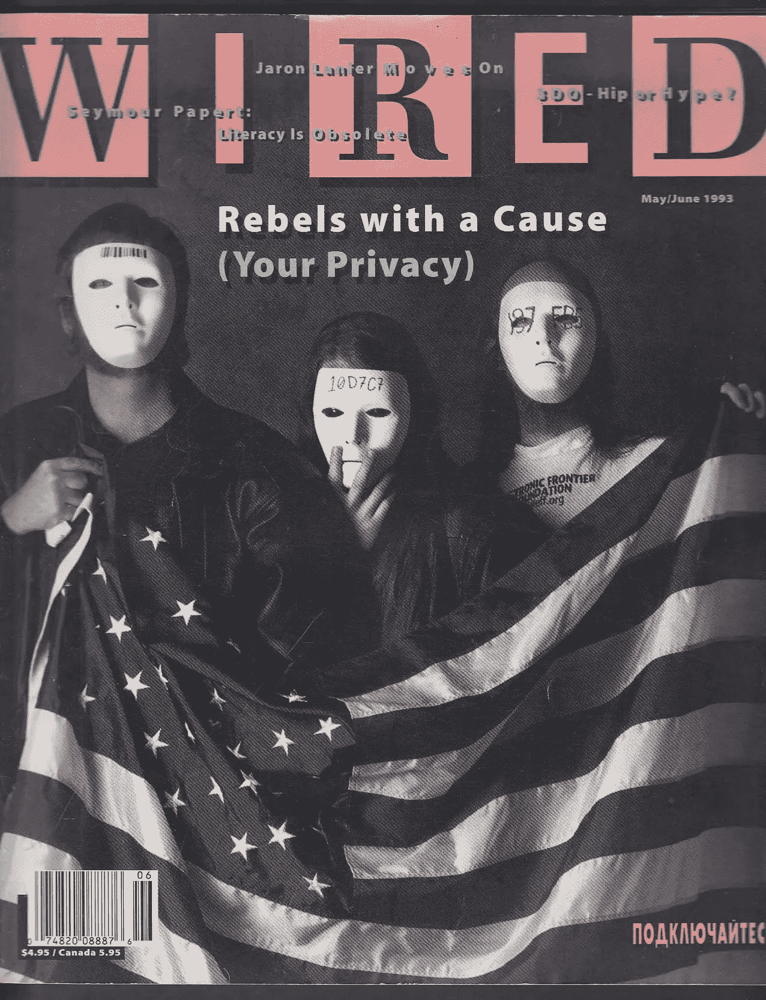
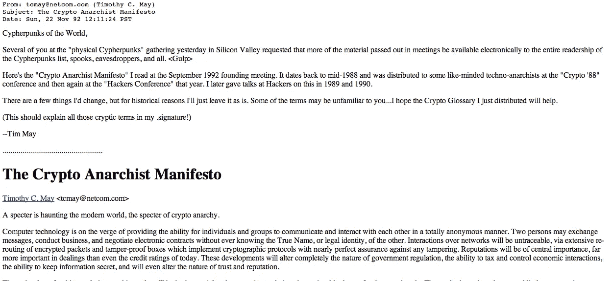
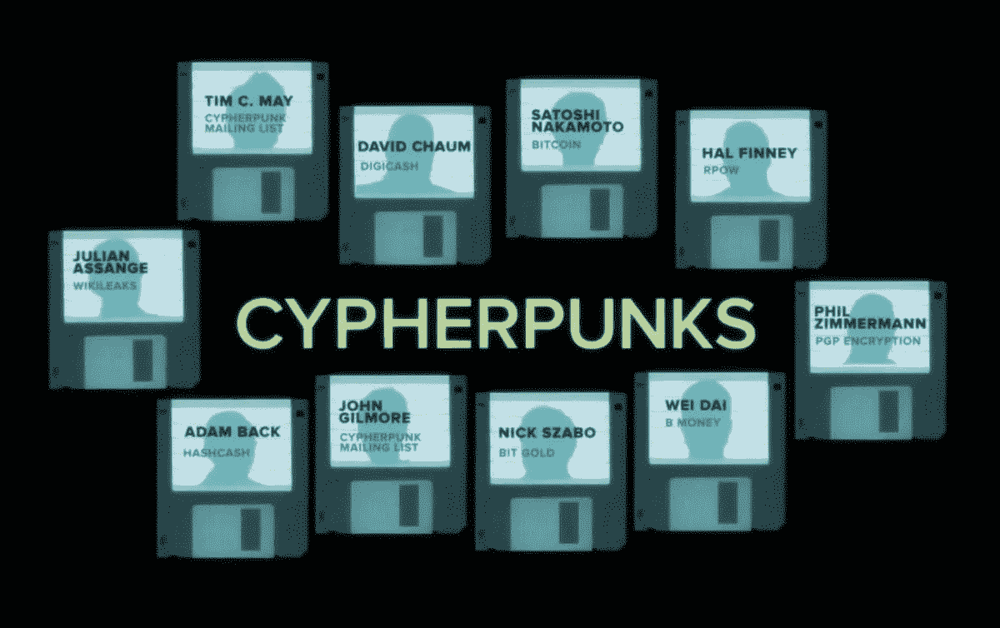
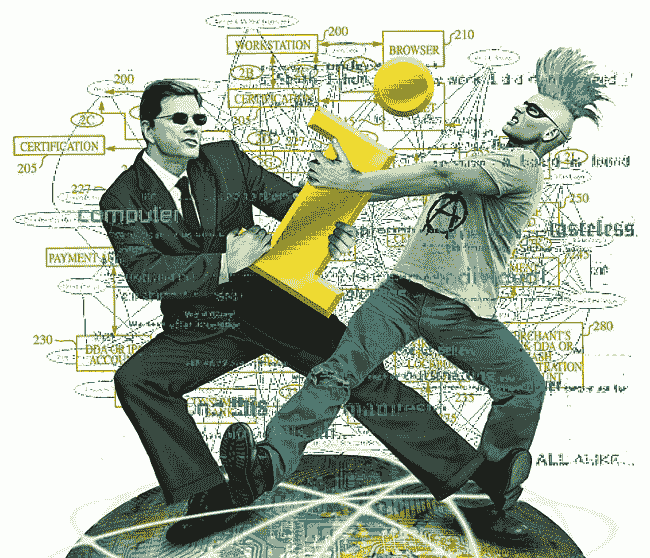

# 密码朋克和加密货币的兴起

> 原文：<https://medium.com/swlh/cypherpunks-and-the-rise-of-cryptocurrencies-899011538907>

几年前，几乎没有人知道比特币是什么。“coin”这个词可能暗示比特币是某种类型的货币——但除此之外，它几乎不为人知。时间快进到 2017 年，现在比特币几乎是家喻户晓的词。几乎 80%的美国人听说过比特币，尽管很少一部分美国人打算使用它，更不用说了解它是什么了。

比特币等加密货币的兴起对其起源提出了合理的质疑。谁开创了这整个加密货币的概念，他们为什么要这样做？这些答案也可以为未来的硬币铺平道路，并帮助开发者确定加密货币发展的下一步。

**塞弗朋克及其在数字货币发展中的作用**

最初的“T4”乐队于 1992 年在加州的三藩市聚会。从很多方面来说，他们的会面是该运动创始人大卫·乔姆的产物。1985 年(具有讽刺意味的是，在奥威尔的《1984 年的事件发生一年后》),乔姆发表了论文《没有身份的安全:让老大哥过时的交易系统》。该论文讨论了匿名数字现金和伪信誉协议的概念——许多人认为这是加密货币和区块链技术的始祖。

1992 年的赛博朋克会议产生了《赛博朋克宣言》,由埃里克·休斯于 1993 年 3 月 9 日出版。在这份宣言中，休斯哀叹当前的系统，在这个系统中，政府、公司和其他“大型的、不知名的组织”出于他们自己仁慈的领导而授予个人隐私。该论文指出了当局“允许”个人隐私和自由的讽刺性——在这一点上，自由和隐私不是不可剥夺的权利，它们只是来自一个更强大的统治实体的礼物。

休斯回应的精髓可以用一句话来概括:“如果我们希望拥有隐私，就必须捍卫自己的隐私。我们必须团结起来，创建允许匿名交易发生的系统……过去的技术不允许强有力的隐私，但电子技术允许。”

休斯所指的电子技术是计算机编码和软件开发。密码朋克们正在开发保护隐私和匿名的软件，这一切都不受政府的控制和监管。此外，该项目是一个公共项目。休斯说，“人们必须为了共同的利益来一起部署这些系统。隐私只延伸到一个人在社会中的同伴的合作。”

在这种历史背景下，加密货币近年来越来越受欢迎也就不足为奇了。他们的吸引力很大一部分在于他们对大卫·乔姆(David Chaum)和赛博朋克(CypherPunks)原则的承诺——匿名、分散的基于加密技术的货币，完全不受政府干预和操纵。事实上，比特币的 2008 年白皮书将“hashcash”和“b-money”列为关键影响因素——这两个分别是 90 年代末的密码朋克亚当·贝克和戴伟的发明。

比特币的崛起催生了其他数字硬币，迄今为止有超过 1000 种硬币在流通。加密货币是隐私和自由爱好者的梦想，因为它们将交易权力归还给了它所属的人——有权控制自己资金的个人。加密货币的倡导者理解原始密码朋克的担忧——隐私和自由是与生俱来的权利，而不是强大的统治实体赐予的礼物。

**但是……加密货币不在它们应该在的地方**

休斯指出，赛博朋克运动的目标是让它被更大的群体所接受。加密货币也是如此——用户越分散越好。不幸的是，大多数个人和企业还没有加入进来。

这是因为加密货币尽管有诸多优势，但仍有一些相当大的缺陷。加密货币没有被更广泛使用的一些更受 T4 欢迎的原因包括数字硬币的波动性和缓慢的交易时间。

感受到这些担忧，一些区块链初创公司正在创建加密货币支付平台，以解决悬而未决的问题。平台的本地令牌可以通过购买低成本看跌期权合约进行对冲，以防范价格下跌。这些对冲服务有助于减轻加密货币的波动性。由于加密货币的稳定性将大大提高，个人和企业都将有动力开始使用加密货币开展业务。

此外，一些支付平台每秒可以处理多达一万笔交易。这使得标准的加密货币交易时间大为缩短，并与 PayPal 和 Visa 等其他支付方式相一致。通过增加每秒的交易数量，加密货币在实际交易产出方面将变得更具竞争力。企业不必担心付款积压，个人也可以安心，因为他们的支付账户会很快得到解决。

这些平台正在为区块链技术和加密货币做一些令人惊叹的事情——他们正在创建支付平台和代币，功能类似于法定货币，但通过利用区块链技术消除了法定货币的缺点。这些加密货币仍然是去中心化的，完全可审计的，不受集中监管。

区块链的使用确保了用户控制他们的钱，而不是政府、公司或其他大型的、不知名的组织。这些调整将鼓励大众接受加密货币，不仅将其作为投资工具，也作为支付媒介。赛佛朋克会骄傲的。

## 这个故事发表在 [The Startup](https://medium.com/swlh) 上，这是 Medium 最大的企业家出版物，拥有 298，432+人。

## 订阅接收[我们的头条](http://growthsupply.com/the-startup-newsletter/)。

