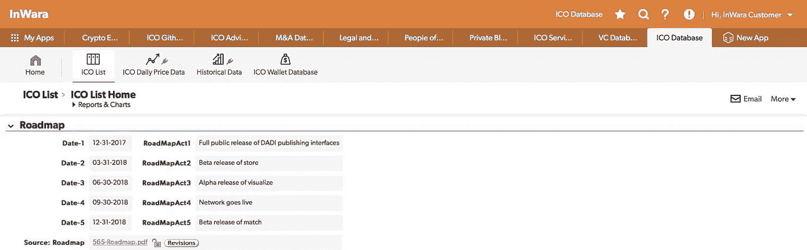
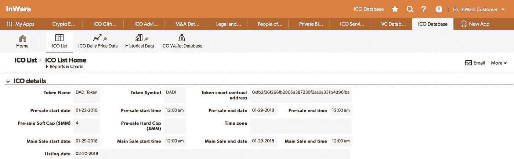

# DADI·ICO:你需要知道的一切！

> 原文：<https://medium.com/swlh/dadi-ico-everything-you-need-to-know-45dffbc93c63>

DADI 一直是 2018 年 ICO 空间中最受关注的项目之一。这是为数不多的几个很快就达到硬上限的 ico 之一。

DADI 之所以成为一个有趣的案例，是因为它拥有相当多的优势和争议。例如:

*   [涉嫌抄袭的白皮书](http://www.thecryptotea.com/index.php/2018/01/06/dadi-caught-plagiarizing-somns-white-paper-drama/)
*   [合伙纠纷](https://www.reddit.com/r/CryptoCurrency/comments/7ogv4n/xrb_dev_team_raiblocks_and_dadi_are_not_partners/)
*   据*外部消息来源*称，一轮 3000 万美元的风险投资从未发生过(消息来源: [InWara](http://www.inwara.com/?utm_source=startupdadi&utm_medium=startupdadi&utm_campaign=startupdadi) )！
*   来自谷歌、AWS 等的激烈竞争。

不过还是值得详细分析的。

让我们直接切入事实。

# 什么是 DADI？

(source: Google images)

DADI 代表 **D** 去中心化 **A** rchitect 代表**A**De**I**internet。该项目旨在利用区块链技术创建一个分散的虚拟主机平台。

这个平台将把信息的力量分散到一个开放的市场，而不是集中起来。

该项目的一个主要威胁是该领域的激烈竞争，因为 DADI 将与亚马逊(Amazon)、微软、脸书和谷歌网络服务等巨头争夺一块蛋糕。

(source: Google images)

然而，DADI 确实有一些锦囊妙计:

*   理论上，拥有一个分散的架构可以让网站托管在多个平台上，而不是一个平台上。至少在理论上，这应该可以让网站全年无故障地运行。
*   DADI 的另一个独特卖点是其令人难以置信的成本效益。由于该平台的分散性，客户将能够节省超过 95%的传统云服务器费用。这对每个资金有限的创业者来说都是天赐良机。信托机构、慈善机构和其他小机构呢？他们会将服务器放在哪里？

> DADI 将是他们所有人因祸得福的地方

DADI 的 ICO 获得了成功，仅在 36 小时内就筹集了 2900 万美元。

## 1.项目背后的团队

Management profile form InWara’s database

该项目由首席执行官约瑟夫·丹尼、首席运营官·保罗·金斯利和 CEO 克里斯多佛·梅尔领导，他们分别拥有 15 年、14 年和 19 年的经验。

除了这些高管之外，DADI 还有一个由 18 名合格员工组成的团队，他们拥有大约 300 多年的工作经验。

与其他具有类似硬性规定的 ICO 项目相比，这是一个相对较大的团队。(来源: [*因瓦拉的*](http://www.inwara.com/?utm_source=Profiles&utm_medium=Profiles&utm_campaign=inblogpost2) )

**2。资金利用和象征经济学**

Source: InWara’s database

根据资金分配分析，很明显，大部分资金将投资于研发。此外，相当大一部分收入被留作营销之用，考虑到该领域现有的竞争，这是令人放心的。

ico 经常忘记这一点，并意识到他们没有足够的资金在一个好的交易所上市！这意味着投资者没有交易场所，被无用的代币套牢。

## 3.软上限、硬上限和募集资金

在设置软上限和硬上限之前，了解项目的需求是很重要的。

如今，ico 们的普遍做法是设置荒谬的硬性上限，却没有明确说明资金将如何以及在哪里使用！

当筹资目标很高，而又没有具体的资金使用计划时，投资者往往会认为这是一个危险信号。

Soft cap, hard cap details from Inwara’s database

**4。** **路线图和行动计划**

Source: InWara’s ICO database

在今天这个时代，有很多 ICO 只有白皮书，没有原型或工作模型，这是耐人寻味的是，DADI 的公共接口在其 ICO 之前 2 个月发布。

## 5.团队的参与。

有很多 ico 有令人信服的白皮书，声称在未来实现一些不可思议的东西，在公开市场上价值超过数千亿美元，甚至没有原型。

DADI 已经 4 岁了，其背后的团队已经自己投资了**200 万美元**(来源: [InWara](http://www.inwara.com/?utm_source=Profiles&utm_medium=Profiles&utm_campaign=inblogpost2) )这反映了该团队对该项目的承诺和认真。

**6。在交易所上市。**

当一个 ICO 在完成预售和主售阶段后就上市时，它会建立投资者的信心。如果 ico 需要很长时间才能上市，那么很有可能你会被代币困住，没有人可以卖给你。

DADI 在主要股票出售后不到一个月就在顶级交易所上市了。

Source: [InWara’s](http://www.inwara.com/?utm_source=Profiles&utm_medium=Profiles&utm_campaign=inblogpost2) database

# 总结一下…..

该团队已经展示了他们开发全栈 web 服务产品的能力，然而，最明显的弱点似乎是 DADI 目标市场中的现有竞争。

SWOT analysis provided by InWara’s database

> 最困难的是决定采取行动，其余的仅仅是毅力。

[*InWara 的*](http://www.inwara.com/?utm_source=Profiles&utm_medium=Profiles&utm_campaign=inblogpost2) 时事通讯以及 ICO、VC 和 M & A 数据库提供了所有关键信息以及对各个行业即将推出的 ICO 的实时分析。

要了解更多关于 ICO 投资的信息，以及 InWara 的*ICO 数据库如何帮助您确定投资哪个 ICO 以降低风险，请在这里注册参加 InWara 的 [*专家*](http://www.inwara.com/?utm_source=Profiles&utm_medium=Profiles&utm_campaign=inblogpost2)[的免费演示。](http://www.inwara.com/?utm_source=Profiles&utm_medium=Profiles&utm_campaign=inblogpost2)*

*   ***最初发布在 InWara 的博客上。这不是财务建议。本信息或其他媒体中的观点、陈述、估计和预测仅属于作者个人。它们不一定反映 Inwara 或其任何附属公司(“Inwara”)的意见。Inwara 没有义务更新、修改或修正此消息或其他媒体，或以其他方式通知其接收者，如果此处陈述的任何事项或此处陈述的任何意见、预测、预测或估计发生变化或随后变得不准确。本邮件或其他媒体中提供的任何内容、信息和材料均按“原样”提供。Inwara 对其准确性、完整性或及时性，或收件人获得的结果不做任何明示或暗示的保证，并且不对任何收件人在此的任何不准确、错误或遗漏承担任何责任。在不限制上述规定的情况下，Inwara 对任何消息或媒体的接收方不承担任何责任，无论是在合同、侵权行为(包括疏忽)、担保、法规或其他方面，对于此类接收方因其或任何第三方决定的任何行动、意见、建议、预测、判决或任何其他结论或任何行动过程而遭受的任何损失或损害，无论是否基于此处包含的内容、信息或材料。****

**

## *这篇文章发表在 [The Startup](https://medium.com/swlh) 上，这是 Medium 最大的创业刊物，有+ 377，923 人关注。*

## *订阅接收[我们的头条新闻](http://growthsupply.com/the-startup-newsletter/)。*

**