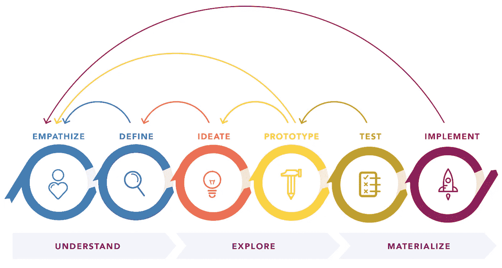
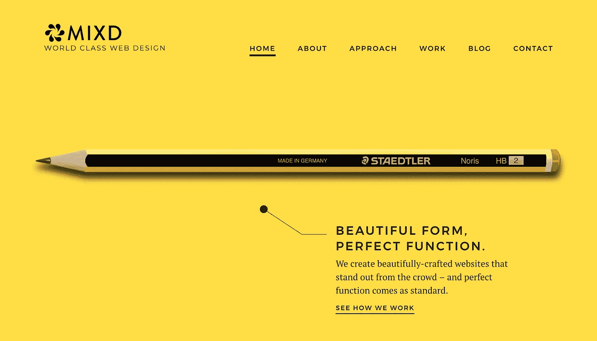
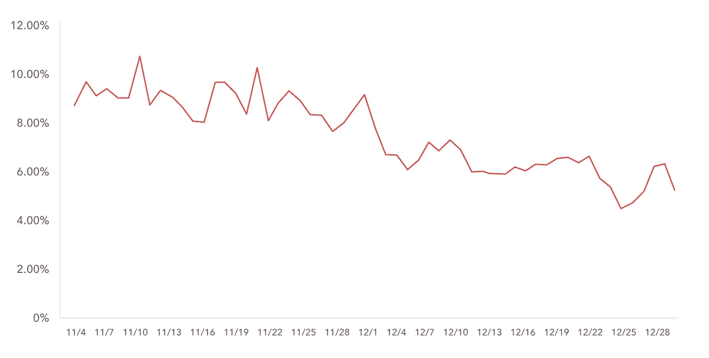
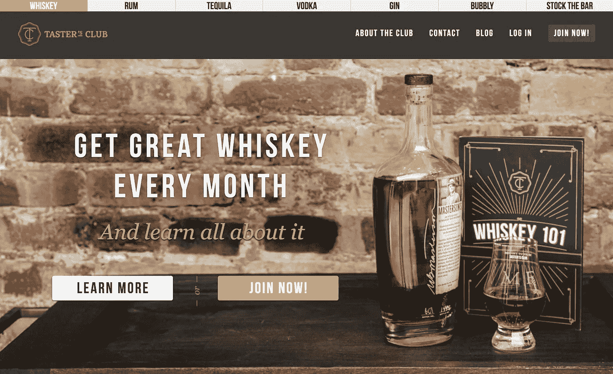
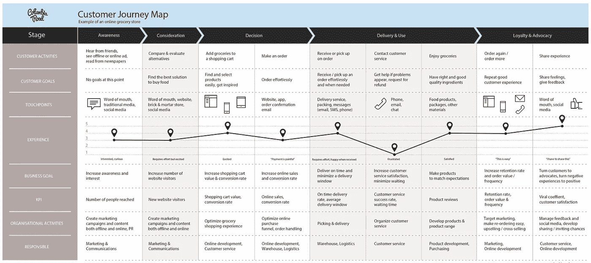
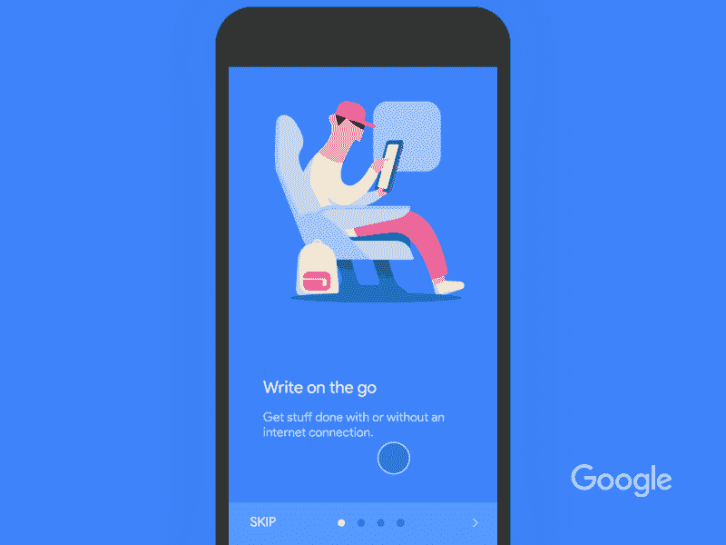
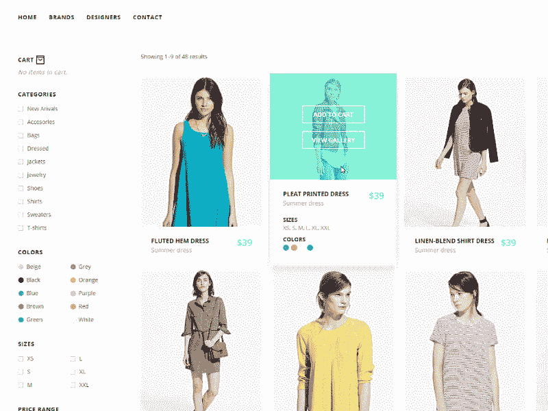
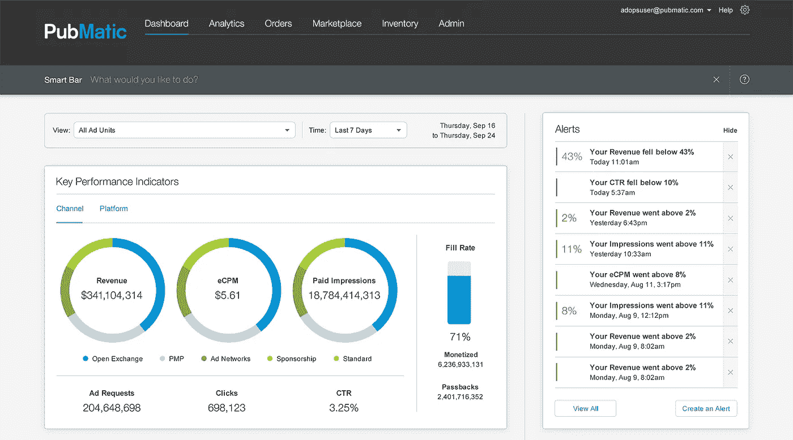
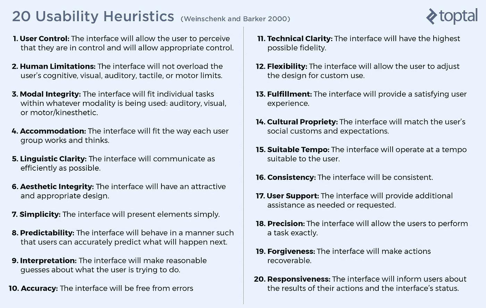

# 前方危险:警示信号是时候引进一位 UX 专家了

> 原文：<https://medium.com/swlh/danger-ahead-telltale-signs-its-time-to-bring-in-a-ux-expert-c28a25e9ea2c>

通常，在一个产品背后投入了大量的资源和金钱，但是这个产品并没有达到预期的效果。警钟长鸣，利益相关者惊慌失措，项目突然岌岌可危。当一个网站或应用程序的表现不尽如人意时，也许是时候请一位 UX 专家了。为什么？行业调查显示，在 UX 投资的每一美元都会带来 2 到 100 美元的回报。

产品表现不如预期可能有很多原因——它没有解决关键问题，可用性差，用户觉得难以导航，或者 UI 混乱和不一致，这些只是表现不理想的几个例子。

# 什么是 UX？快速回顾一下

用户体验，或“UX”，涵盖了系统的所有方面(网站、应用、产品、服务、社区等)。)作为用户体验。正如苹果、微软、IBM、优步、Airbnb 和谷歌的成功所证明的那样，伟大的 UX 设计可能意味着成功或失败。

用户体验设计是 UX 设计师做的**学科**，以用户为中心的设计(UCD)是 UX 设计**流程**。设计思维和以人为中心的设计(HCD)是其他被广泛使用的术语。不管是哪种方法，它们通常都包括用户研究、用户旅程图、草图、线框、原型、交互设计、视觉设计、用户测试和设计的持续迭代。

Design Thinking 101 from the [Nielsen Norman Group](https://www.nngroup.com/)

# №1:人们抱怨你的应用程序使用起来令人沮丧。

最有可能的原因是[可用性差](https://uxdesign.cc/heuristic-analysis-for-ux-how-to-run-a-usability-evaluation-12c86d43936f)，这可能包括:

*   不一致的用户界面
*   信息过载，噪音太多
*   功能不清晰:用户不确定如何使用产品
*   令人困惑的导航:人们正在迷路

# 一名 UX 专家将:

**A)考虑你的内容和核心功能，想出一个** [**极简设计**](https://www.digitechwebdesignaustin.com/web-design-austin/13-amazing-benefits-minimalist-web-design/) **方法:**

**极简主义**是一种专注于简化形式的设计理念，通过利用设计中最简单、最重要的元素来实现。**极简设计**本质上简化了一个系统(网站、app、产品、服务等。)到最关键的元素，并提供以下好处:

*   减轻信息过载:关注内容
*   将产品剥离到最基本的特征
*   使导航更清晰，因此也更容易
*   保持用户关注，突出你独特的价值主张
*   让您的产品更加永恒
*   帮助提高转化率
*   实现更快的性能

**B)深入挖掘用户研究和测试:**

> “模范用户体验的第一要求是满足客户的确切需求，不要大惊小怪或打扰……”*—唐·诺曼&雅各布·尼尔森*

一个好的 UX 专家会定义谁是你的用户，并建立用户测试。用户测试有很多名称:产品测试、设计测试、可用性测试、设计验证等等。并且是在真实场景中用真实用户测试设计的过程，以更好地理解他们的关注点和可用性问题。用户测试将:

**通过[减少开发时间](https://www.usertesting.com/blog/2015/01/06/invest-in-ux/)和降低客户支持成本来节省资金**:

*   据估计，一名工程师有 50%的时间花在返工问题上，其成本比一开始就避免错误要高出 100 倍。
*   主动测试和调整用户报告的问题，并使用这些发现来指导未来的设计，将极大地减轻支持团队的负担。

**通过[提高转换率](https://www.usertesting.com/blog/2015/01/06/invest-in-ux/)以及客户保持率和忠诚度来增加收入**:

*   找出用户感到沮丧的地方，他们理解产品有什么困难，以及是什么阻碍了他们的转变。
*   对设计进行快速修改和复制，以立即提高转化率。

通过帮助企业[获得竞争对手的洞察力](https://www.usertesting.com/blog/2015/01/06/invest-in-ux/)并在竞争中保持领先，从而获得竞争优势:

*   对竞争对手进行用户测试有助于发现他们做得对，以及用户是否信任他们而不是你。
*   如今，用户期待好的 UX，越来越不能容忍坏的。如果他们更容易与竞争对手做生意，那么他们可能会失去客户。

执行启发式分析:

专注于可用性，启发式分析是一种评估方法，在这种方法中，一个或多个 UX 专家将数字产品的设计与一系列预定义的设计原则(通常称为启发式)进行比较，并识别产品没有遵循这些原则的地方。UX 专家的启发式分析将:

*   提高数字产品的可用性
*   提高效率:作为更好的可用性的直接结果，产品可以被使用的速度:质量组件，如可学性、可发现性、可记忆性、灵活性、用户满意度和错误处理

# №2:账户注册和转化率正在下降。

**A** [**转化率**](https://www.forbes.com/sites/theyec/2015/01/19/low-conversion-rate-what-causes-it-and-whose-department-deals-with-it/#5d1e50dc6c3a) **是采取期望行动的用户的百分比。**通常，这意味着人们从网站上购买产品，但也可以应用于其他行为，如时事通讯注册、视频观看等。转换率和注册用户数量的下降可能意味着:

*   登录页面没有遵循最佳实践
*   客户旅程图设计得不好
*   移动应用 onboarding 设计得不好

# 一名 UX 专家将:

查看登录页面、客户旅程规划和入职培训，并建议/实施最佳实践。

**A)查看登录页面:**

登陆页面本质上是关于获取和留住访问者，以及将他们转化为购买者和订阅者，并且是目前营销人员用来收集线索的最受欢迎的工具之一。

以下是登录页面最佳实践的简短列表:

*   视觉简约:参考上面的极简设计。
*   伟大的媒体:使用相关的静止图像和视频有效地展示产品，并与访问者建立个人联系。
*   色彩的有效运用会影响游客的心理。
*   通过实施响应式设计来考虑移动受众。

Catchy and concise headline on [Taster’s Club](https://www.tastersclub.com/) landing page

**B)查看客户旅程图:**

> “规划顾客旅程是了解如何将观众变成长期忠诚顾客的有效方法。” *—* [*柯菲·塞内亚，Clearbridge Mobile 产品总监*](https://conversionxl.com/blog/customer-journey-mapping-examples/)

客户旅程图可以采取多种形式，但本质上它是客户在一段时间内不同接触点对产品或公司体验的可视化表示。

以下是旅程规划[最佳实践](https://www.clientsuccess.com/blog/5-best-practices-to-build-a-customer-success-journey-map/)的一些示例:

*   首先从顾客的角度看待旅程。
*   确定哪些部门在什么时候做什么，并在他们之间建立一个清晰和可靠的沟通流程。
*   定义并分享成功里程碑。
*   从值得信赖的客户那里获得反馈，以验证您的数据。
*   定期衡量结果并优化旅程。

A customer journey map template from [Columbia Road](https://www.columbiaroad.com/blog/why-and-how-to-create-a-customer-journey-map-download-free-template)

**C)审核入职实践:**

> “用户试用了许多应用程序，但在最初的三到七天内，他们决定要‘停止使用’哪些应用程序。对于“体面”的应用程序，大多数保留七天的用户会停留更长时间。成功的关键是在最初关键的三到七天内让用户着迷。”*—*[*Ankit Jain*](https://twitter.com/jain_ankit)*搜索与发现负责人，Google Play*

不管一个应用程序看起来有多棒，如果用户不能学会如何轻松使用它，他们很可能会放弃它。

以下是一些入职最佳实践:

*   强调价值主张。
*   突出核心特色。
*   只要求你需要的。
*   不要让用户不知所措:避免大量的文字解释，使用视觉效果——截图和插图。
*   不要浪费时间陈述显而易见的事情:大多数用户都熟悉表示喜欢、分享和收藏的图标。
*   让注册变得容易:注册可能会成为采用的障碍——要快。
*   为用户提供通过现有社交媒体登录的选项。
*   以行动号召结束。

User onboarding by [Divan Raj](https://dribbble.com/shots/3056941-Google-docs-app-onboarding-interaction)

# №3:你的在线商店表现不如预期。

2017 年，仅美国的电子商务销售额就达到了约 4340 亿美元，并将在 2018 年继续创新高。到 2021 年，全球电子商务销售额预计将达到近 5 万亿美元。一个电子商务网站不仅仅是一个典型的网站——它是一种在线购物体验，如果做得好，会将被动的购物者转化为付费客户。

几个因素决定了一个电子商务网站的整体成功；例如，产品质量、品牌认知度、运输成本、退货政策、可信度和客户服务。然而，周到的用户体验设计也是为客户提供满意、无摩擦体验的关键。它不仅会将潜在的点击转化为实际的电子商务交易，而且会让客户一次又一次地回来。

**这里有一些 UX 专家需要注意的问题:**

*   **可信度:**大多数购物者关心隐私，以及网站是否会通过提供安全的交易来保护他们的个人数据。如果网站不值得信任，他们会选择在其他地方购物。
*   **设计考虑:**网站的外观和感觉是第一印象的主要驱动力。[研究](https://www.tandfonline.com/doi/abs/10.1080/01449290500330448)得出结论，人们会在 50 毫秒内决定他们是否喜欢一个网站。
*   导航:导航是关于人们在网站上移动并最终采取行动的难易程度。电子商务购物体验应该是无缝的，这样购物者就不会中途放弃。
*   特价商品:购物者总是在寻找特价商品、折扣或最划算的交易。即使价格差异没有那么大，省钱的心理感觉也会产生一种占上风的错觉。
*   **购物车:**购物车是一个必不可少的组成部分，因为顾客可以在这里查看他们选择的产品，做出最终决定，然后结账。
*   **结账设计:**一个电子商务网站的成功仅仅是通过完成购买的数量来衡量的——一个设计良好的结账页面将大大有助于被动购物者转化为付费顾客。

eCommerce store concept by [Virgil Pana](https://dribbble.com/shots/1969732-Catalog-page-add-to-cart-interaction)

# №4:你的业务仪表板没有给用户他们想要的。

有效的业务仪表板一目了然地显示可操作的有用信息。一个好的仪表板是清晰、直观和可定制的。它简化了复杂数据的可视化表示，并帮助利益相关者理解、分析和呈现关键见解。

# 一名 UX 专家将:

**A)确保您的仪表板设计决策遵循:**

*   明确项目目标
*   数据的性质
*   用户的需求

**B)检查设计，确保您的仪表板符合这些仪表板设计最佳实践和数据可视化最佳实践:**

*   使用“[渐进式披露](https://www.nngroup.com/articles/progressive-disclosure/)，一种用于减少杂乱的技术
*   使用户只需点击几下鼠标就能完成大多数操作
*   降低复杂性并提供清晰的可操作数据
*   通过使用暗示性的视觉效果和标签向用户传达一个清晰的故事
*   在下钻系统中，在适当的时候显示数据和信息
*   使用数据可视化以有意义的方式公开信息
*   快速、清晰、高效地交流信息
*   有效显示一段时间内数据的趋势和变化
*   在有限的空间内有效地呈现最重要的小部件和数据组件
*   易于定制

# №5:你的网站表现不佳。用户抱怨它很难使用。

这种症状通常是可用性问题的结果，客户投诉可能是由于:

*   低效的信息体系结构、内容布局和导航会影响可用性和可发现性
*   糟糕的用户界面设计试图做太多事情，让用户不知所措
*   信息和功能呈现方式不一致
*   功能和搜索结果页面在设计时并没有考虑到用户

遵循基本的交互设计原则和标准对伟大的交互设计有着巨大的贡献，这反过来又有助于更好的用户体验。

# UX 顾问将:

A)检查网站的用户界面设计，确保它是一致的，并遵循广泛接受的交互设计原则、惯例和标准:

*   审查导航、信息架构、可用性和可发现性
*   检查清楚的能指——这些能指与可发现性联系在一起，并为人们可以采取的行动提供线索
*   看看搜索是如何整合到网站中的(包括搜索结果)

**B)审查网站的用户界面设计的启发性(经验法则)和交互设计的最佳实践:**

*   可发现性:如果用户找不到它，它就不存在。
*   标志:确保启示(可能的动作)在 UI 中被清楚地指出。
*   反馈:让用户随时了解他们在 UI 中的位置和正在发生的事情是至关重要的。
*   概念模型:好的概念模型有助于用户理解系统，并给他们一种控制感。
*   心智模型(认知地图):这些是用户头脑中的图像，告知他们对某种交互的期望以及现实世界中的事情是如何工作的。
*   映射:映射是控件和它们在世界上的效果之间的关系——在界面设计的情况下，它是控件和它的结果功能之间的关系。
*   约束:设计中的约束确保只有特定的东西是启用的，甚至是可见的，以便引导用户进行特定的交互。
*   模式和可学性:通用组件或模式提供即时可学性。一旦你学会了如何使用勺子，你就会知道如何使用勺子——同样的概念也适用于我们每天使用的 UI 组件。
*   一致性、标准和[试探法](https://www.nngroup.com/articles/ten-usability-heuristics/):为了防止用户错误并使应用程序易于学习，交互模型的一致性是至关重要的。

[Susan Weinschenk](https://uxmag.com/contributors/susan-weinschenk-ph-d) and [Dean Barker](https://www.linkedin.com/in/deanbarker/) (Weinschenk and Barker 2000) researched usability guidelines and heuristics from many sources (including [Nielsen’s](https://www.nngroup.com/articles/ten-usability-heuristics/), Apple, and Microsoft) and generated this set of 20 Usability Heuristics to check against.

随着越来越多的个人和专业业务在网上进行，用户开始期望跨所有平台和设备的优化、无摩擦的数字体验；当他们访问一个网站或点击一个应用程序时，只有[秒](https://blog.kissmetrics.com/what-converting-websites-do/)的时间来吸引他们。在这个饱和的数字环境中，人们已经变得要求很高而且非常精明，为了快速获得他们的信任，确保他们的忠诚度并建立品牌认知度，在 UX 投资几乎是强制性的。

[来自 Forrester Research 的最新发现](https://www.forrester.com/report/The+Six+Steps+For+Justifying+Better+UX/-/E-RES117708)表明，一个构思良好、无摩擦的 UX 设计有可能将客户转换率提高 400%。随着公司利益相关者开始认识到它对其在线产品投资回报率的影响，用户体验(UX)正变得越来越主流，不再被视为简单的竞争优势，而是公司底线的重要贡献者。

如果一个应用得到了低评级、差评和对其可用性的投诉，或者一个网站没有产生预期的转化率——或者上面列出的任何迹象击中要害，**可能是时候引入一位 UX 专家了**。

👋🏻**您好！感谢阅读并到达文章结尾。**🙂

我现在可以在 Mentorcruise 上指导设计师了！ [**查看我的个人资料，今天就预定一个会话！**](https://mentorcruise.com/mentor/miklosphilips)

您也可以在 Twitter 上关注我。 ➣

## 这篇文章发表在 [The Startup](https://medium.com/swlh) 上，这是 Medium 最大的创业刊物，拥有+385，320 名读者。

## 在这里订阅接收[我们的头条新闻](http://growthsupply.com/the-startup-newsletter/)。

