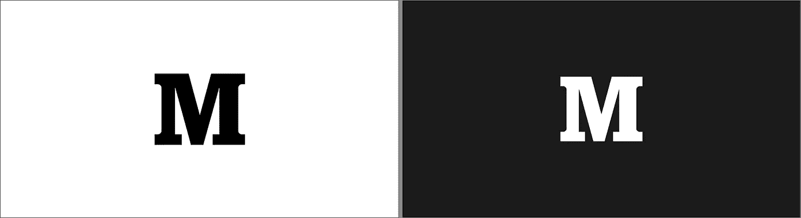
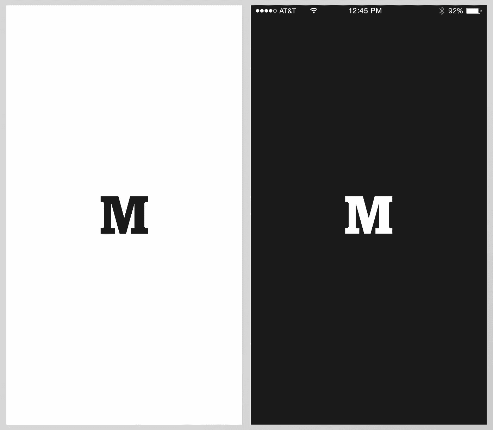
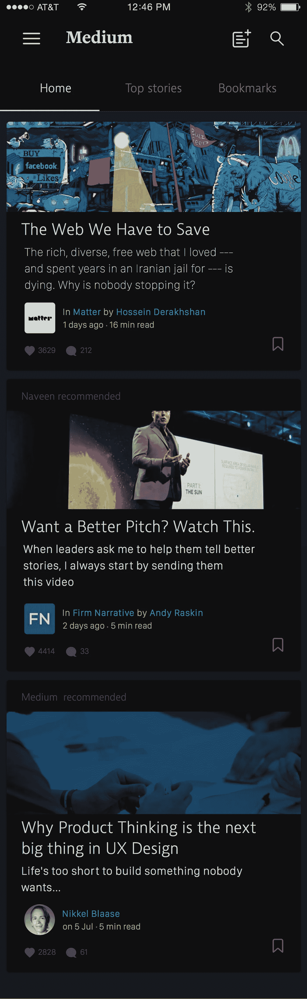
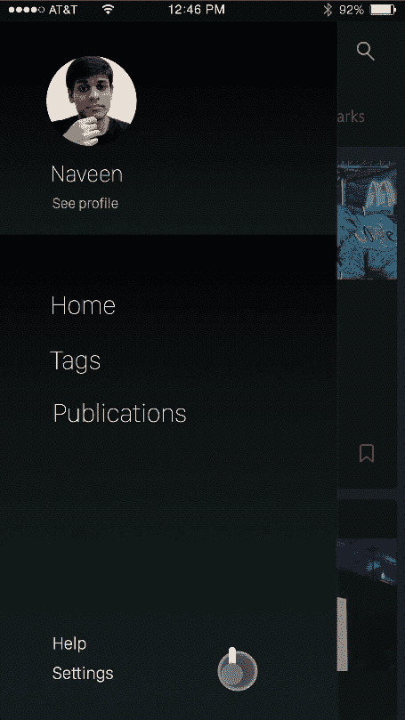
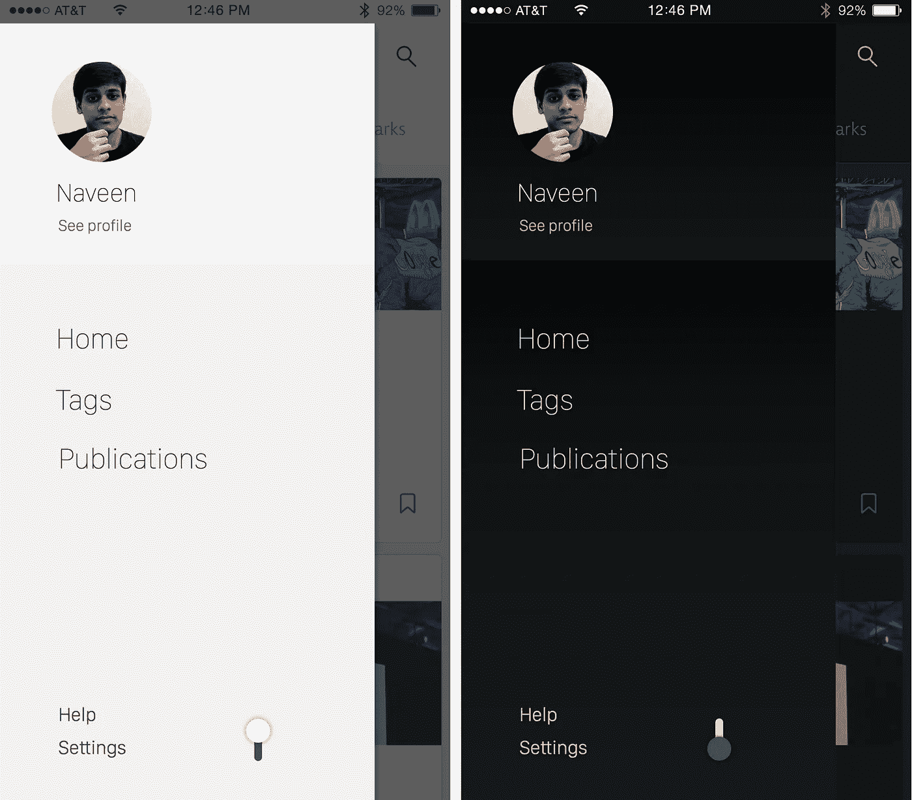

# 中等黑暗/夜间模式

> 原文：<https://medium.com/swlh/dark-night-mode-for-medium-48c281a8734d>

[Medium](/) 是我最喜欢的分享和消费内容的平台之一。

它也是设计最精美的产品之一；更不用说那些非常棒的移动应用了。

[iOS](https://itunes.apple.com/us/app/medium/id828256236?mt=8) 和 [Android](https://play.google.com/store/apps/details?id=com.medium.reader&hl=en) 应用程序不仅优雅简洁，还通过提供出色的用户体验来推动用户与平台的深度互动。

Medium 对我来说是一个日常应用，我把白天遇到的所有 medium 故事都做成书签，晚上睡觉前读一读。

## 中型应用程序缺少的一点是黑暗模式。

应用程序中的所有空白使应用程序在白天看起来很华丽，使应用程序在黑暗的房间里很难使用。

我需要一个应用程序的黑暗/夜间模式。作为一个小练习，我想看看中型应用在黑暗模式下会是什么样子。

我有两个选择。

1.  抓取应用程序的屏幕截图并交换颜色(或)
2.  从头开始设计应用程序。

作为产品设计师，我选择了**第二个**。

亮暗模式

# 启用黑暗模式的中型 iOS 应用程序

Interactive prototype

## 中暗模式

1.  希望明暗模式之间的转换像应用程序一样简单。一个简单的**开关**按钮被用来在模式之间切换，而不是在设置菜单中拨弄。
2.  在黑暗模式中，使用蓝色代替中间的绿色。

**使用的工具:**

*   在[草图](http://bohemiancoding.com/sketch/)中设计。
*   使用[漫威](https://marvelapp.com/)和[原理](http://principleformac.com)制作的交互式原型。

一如既往，请随意分享您的想法和评论。

- [@naveenaly](https://twitter.com/naveenaly)

(如果中型团队同意，我将开放设计文件的源代码。)

*发表于* **创业、旅游癖和生活黑客**

-