# 比特币、莱特币和 DASH 的数据分析——以及发布的 App v10

> 原文：<https://medium.com/swlh/data-analysis-of-bitcoin-litecoin-and-dash-and-app-v10-released-547d14700ca0>

昨天深夜，我躺在床上做着我最喜欢的仪式:数据分析。我在浏览总图上最近的事件，寻找有趣的东西。这是我发现的一个简短的总结。

下面是自 3 月 5 日(00:00 UTC)以来 12 天的 BTC 价格(橙色区域)的屏幕截图—每个区间由 3 小时的数据(合计)组成。深红色的线是交易量。我们注意到的是，交易量有这些积极的波峰和波谷(其价值快速下降/增长)。但它看起来有点循环，意味着有一些重复的模式，但它非常原始(由于大的 3h 间隔)。这并没有告诉我们太多，但是…

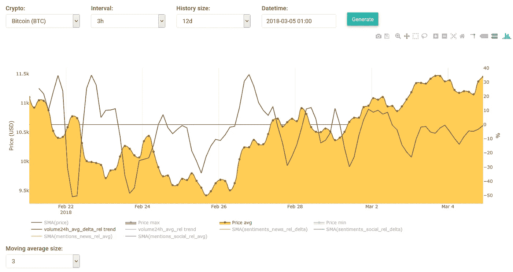

现在，让我向图表中添加另一个数据集:一条“闪亮的橙色线”，它代表新闻提及。新闻提及是在一些主要频道(如 CNN、美国消费者新闻与商业频道、BBC 等)上发表的文章，并谈论所选的加密货币(在我们的例子中是 Bitcoun)。值得注意的是，这条线似乎也是周期性的，它有类似的波峰/波谷。但更酷的是，交易量的峰值与新闻中提到的低谷相匹配——反之亦然。

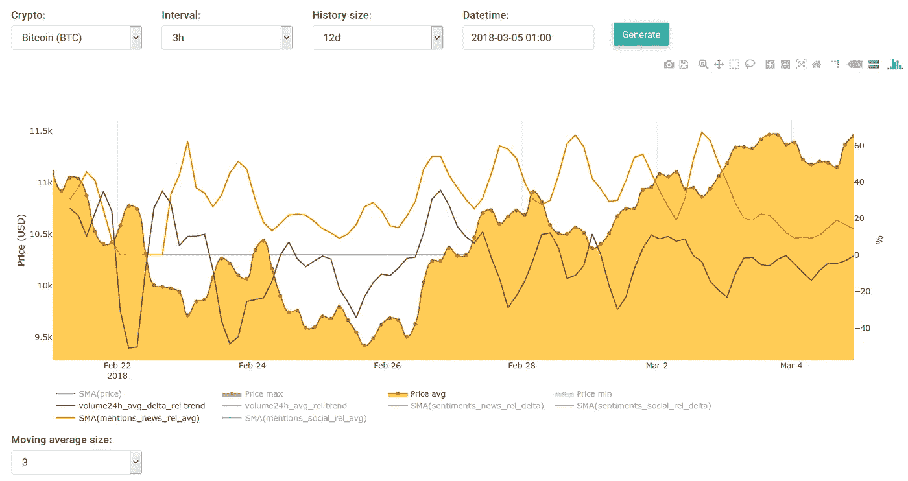

这个图表上的大多数峰/谷似乎都是如此，只有少数例外，例如“2 月 26 日”之后几个小时的两个大的峰(见下图)。由于我们也将 SMA 大小设置为 3，这意味着这两条线/图与价格相比“滞后”了 3 个小时，现在看看在这些匹配的峰值之前 3 个小时价格发生了什么，它上升得相当快。可能是市场受到推动/影响，结果价格上涨了很多。也许在未来，一旦我们有了更多的数据，我们就可以对这里发生的事情有一个更好的理解——我们也可以利用这些发现做出更好的预测。

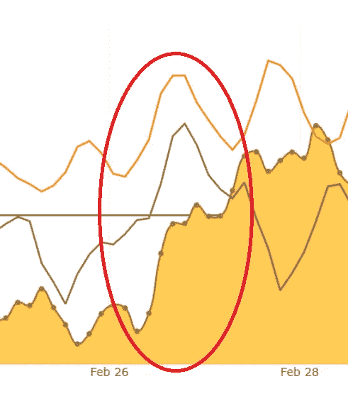

在下一张截图中，我还添加了社交提及(蓝色图表)。这些是与比特币(BTC)相关的社交提及次数。有趣的是，它也是循环的，在某种程度上与新闻情绪图同步。

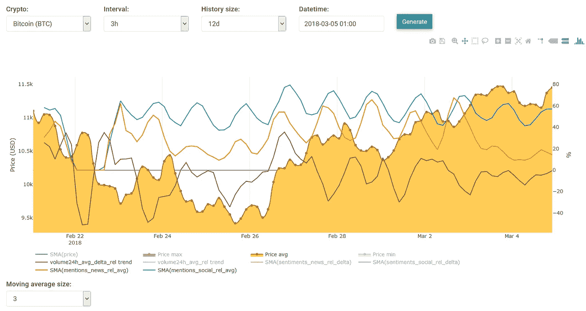

还有一点，在下面的截图中，我将历史记录的大小设置为 20 天(而不是 12 天)——其他都是一样的。但现在我展示了另一个图表，即“新闻情绪”。新闻情绪是从我们的情绪分析系统获得的结果，该系统分析新闻文章以确定它们是正面的还是负面的。我以前没有注意到这一点，第一眼也不容易看出来，但这些情绪似乎“预测”了未来的价格:

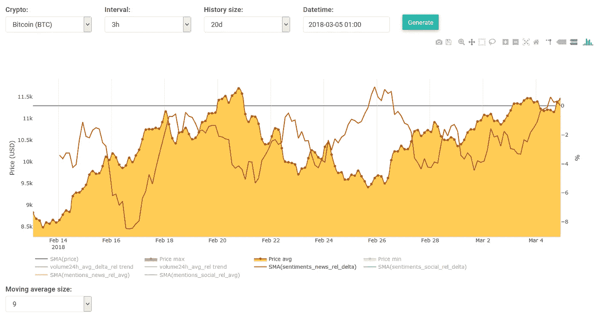

要明白我最初的意思并不容易，所以让我用 Photoshop 把它分成几部分:

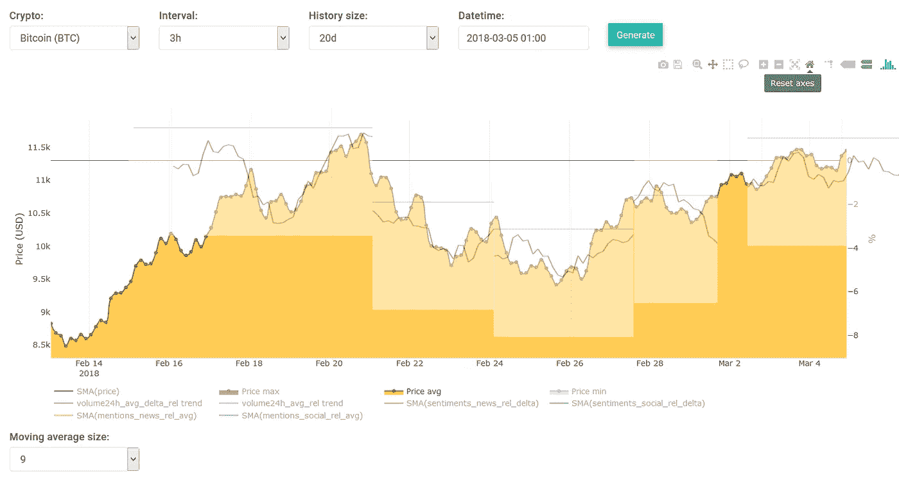

通过分割红色图表(情绪数据)，并将其移动几天，我们可以看到红线如何匹配价格数据的“一些”区域。这是一个很好的发现，但可能完全没有用。我们将情绪图移动了 3 天以上，所以本质上这条线预测了未来 3 天的情况。由于我们没有足够的数据来验证这一发现，所以我还没有计算出它的准确性。但我不会太依赖这个——但这仍然是一个很酷的发现:)。

一旦我完成了比特币，我也看了看我们的其他一些替代币。在“DASH”的例子中，我注意到社交提及(和社交情绪)图似乎跟随价格，并在某种程度上预测价格:

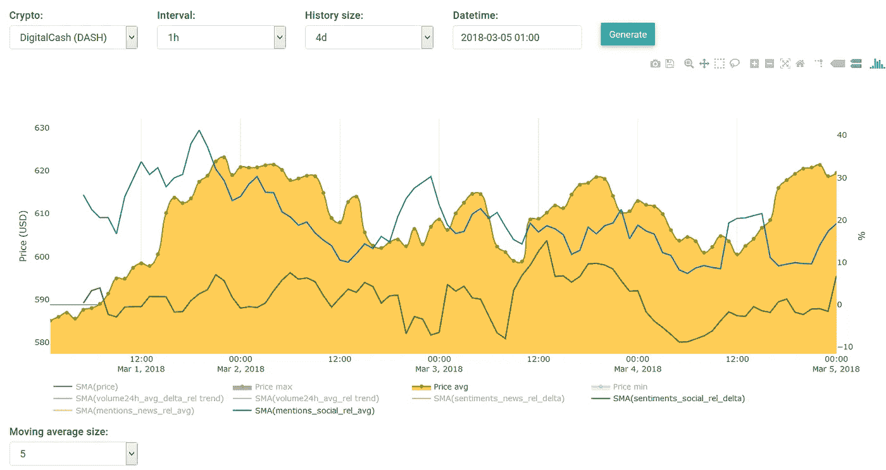

莱特币也深受社交媒体的影响，如下所示:

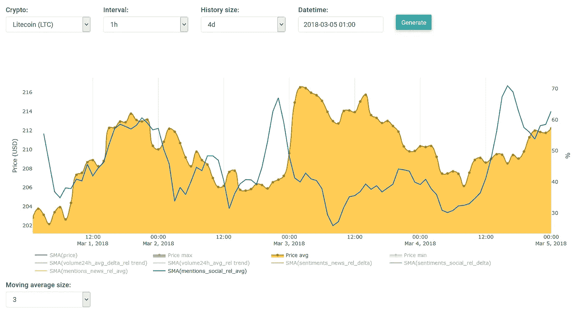

对大多数硬币来说，我注意到交易量作为预测指标不太重要。这意味着，社交提及数据似乎是一个好的、更好的预测指标。最后我睡着了。

## **App 版本 10**

醒来后，我开始开发我们的应用程序，并做了一些相当大的改动。这里有一个总结:

*   新设置布局。
*   广告:不同的水平(+禁用选项)。
*   预测:不同的频率(+禁用选项)。
*   新版本更新通知程序。
*   错误修复:缺少通知。

**新设置布局:**布局改变，大部分开关被下拉列表取代。

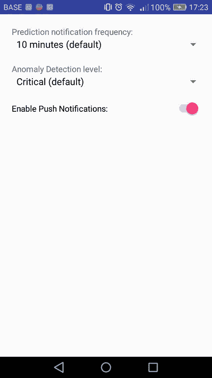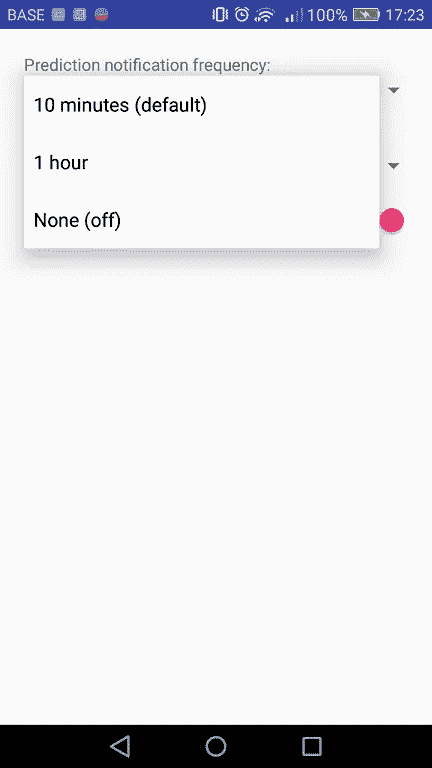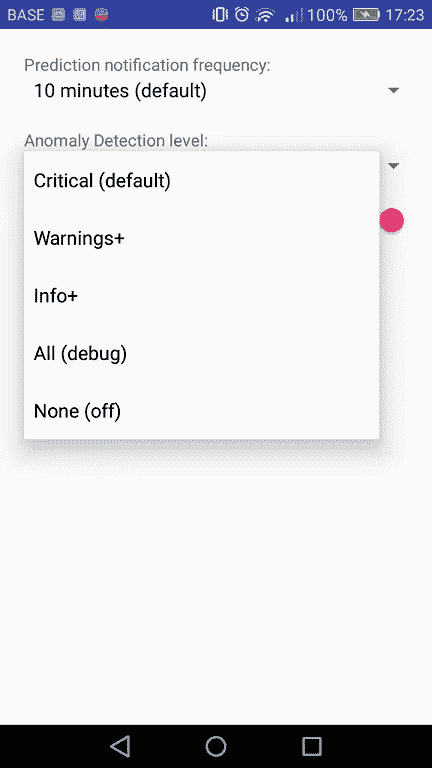

## **预测通知频率**

第一个是预测频率，在这里您可以选择哪种类型的预测通知，你想收到:10 分钟或 60 分钟(每小时)的预测。在应用程序的预测屏幕上，您可以随时通过更改间隔来查看这两种类型的预测-此频率设置仅影响推送通知。如果您不想在新预测生成时收到任何更新/通知，也可以禁用此功能。

这些通知的文本/消息也已更改，以下是新版本的示例。组成消息的算法只使用平均线(中间预测)，它不会使用两个极端值(最大值线或最小值线)来生成消息。所以在这个例子中，第一个预测值(的平均值。行)高于当前/实际价格，这就是消息指出价格可能在下一个间隔内上涨的原因。

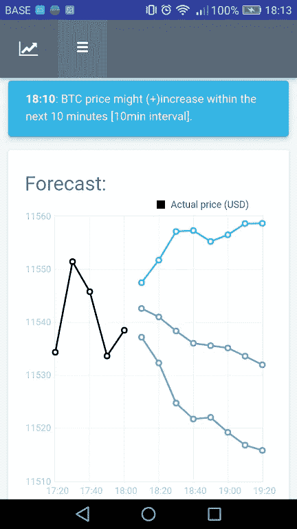

## **异常检测等级**

现在，我们可以选择希望接收哪种级别的通知。

*   严重(默认):这将只通知您最严重的事件，例如:

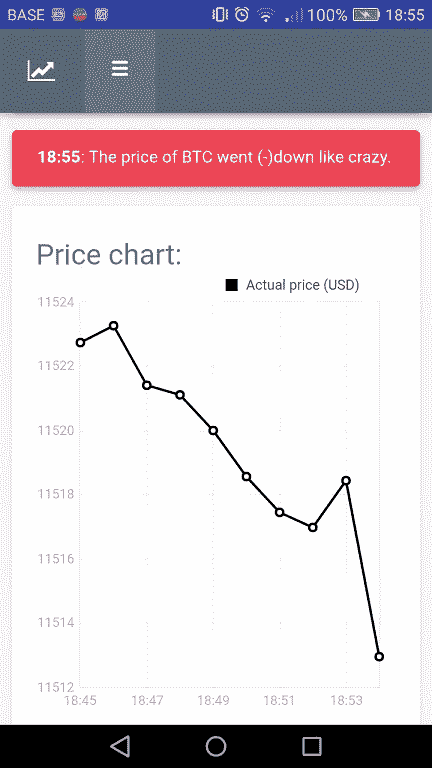

*   警告+:这通知我们相当重要的事件，包括关键事件:

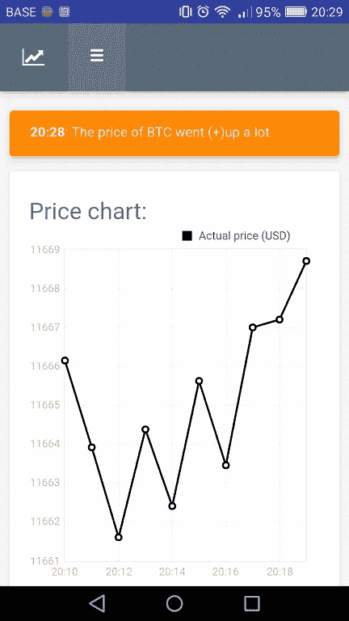

*   Info+:通知我们警告、关键和不太重要的事件:

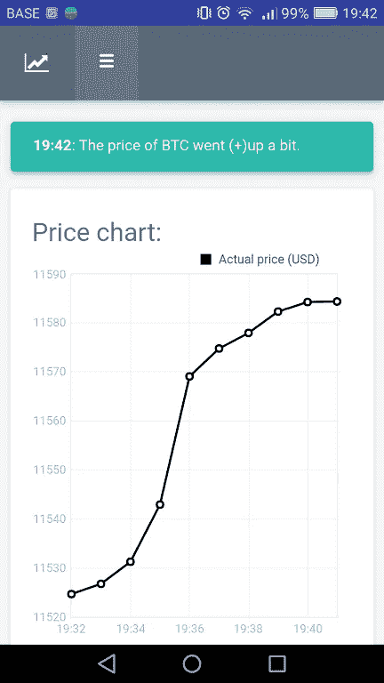

*   All (debug):这将通知我们上面的每一个事件，即使没有任何事情发生。最低水平称为“稳定性”，即价格相当稳定时:

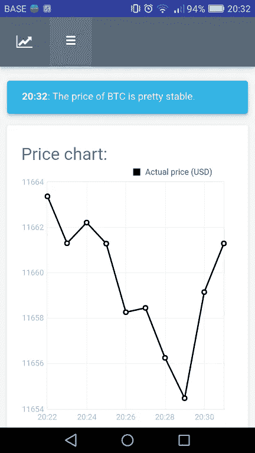

您可能会注意到，系统认为“关键”或“稳定”的事件对您我来说不一定是关键或稳定的事件。因此，在不久的将来，我肯定会调整系统，使其更加可定制。

## **新版本通知程序**

从现在开始，当有新版本可用时，会出现一个通知标签。我相信这是必要的，让人们知道尽快更新。因为当另一个大的变化发生时，旧的组件(在以前的版本上)可能不再正常工作。

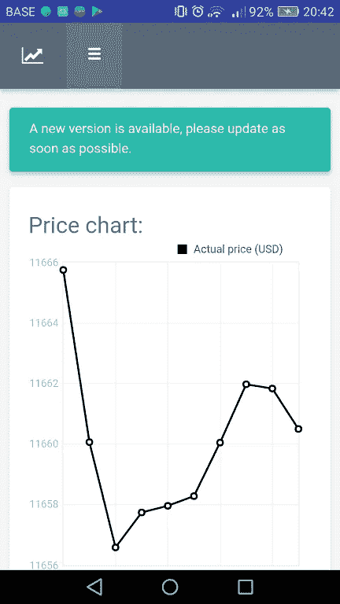

感谢您的阅读，祝您有美好的一天！
——伊利亚·内沃林

## 这篇文章发表在 [The Startup](https://medium.com/swlh) 上，这是 Medium 最大的创业刊物，有 303，461+人关注。

## 在此订阅接收[我们的头条新闻](http://growthsupply.com/the-startup-newsletter/)。

