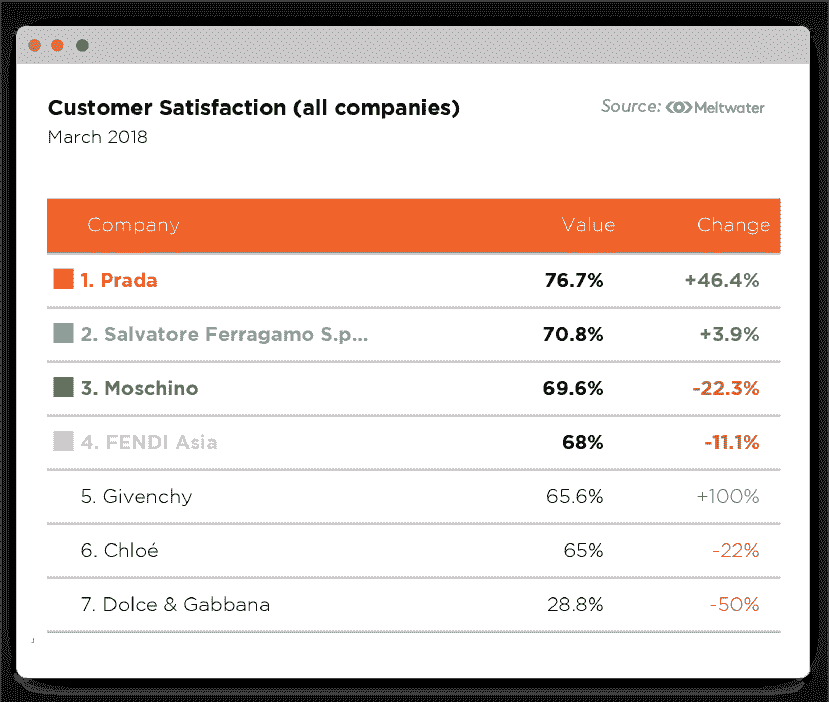
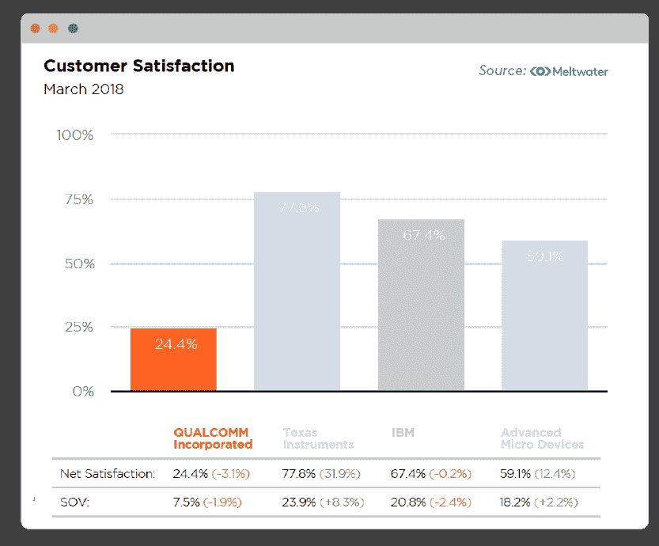
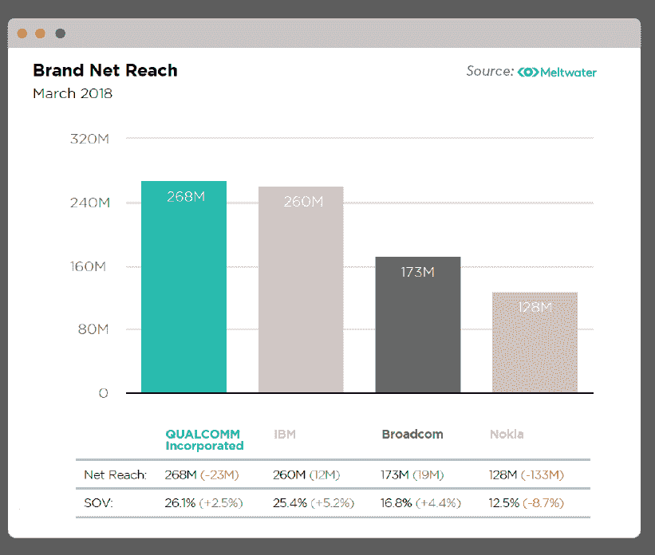

# 数据输入，见解输出:为什么人工智能需要强大的数据才能有效

> 原文：<https://medium.com/swlh/data-in-insights-out-why-ai-needs-robust-data-to-be-effective-2168b5c1730b>

《外部观察》全球副总裁 Leor Distenfeld

**要点:**随着在企业层面实施人工智能工具的竞赛达到新的高度，需要注意的是，为这些工具提供信息的数据至关重要。仅依靠内部信息来通知算法将产生仅从你已经拥有的信息中收集的洞察力。相反，至关重要的是，决策者也要从外部数据中寻求洞察力，以获得对其客户和行业前景更全面、更公正的看法。

在不断增长的人工智能市场，国际数据公司预测全球支出预计将每年增长 50%，到 2021 年总额将达到 576 亿美元。商业领袖们开始意识到在全球范围内实施人工智能战略的重要性。然而，**仅仅推出 AI 驱动的工具是不够的；您需要正确的数据输入来发现有价值的见解**。

在[外部洞察书](https://outsideinsight.com/book)的全球发布期间，作者和 [Meltwater](http://meltwater.com) 首席执行官 Jorn Lyseggen 与人工智能专家一起，讨论了数据推动人工智能的重要性，以及使用人工智能输出进行决策的高管既要理解为这些输出提供信息的数据，又要确保它尽可能全面和公正的必要性。

“人工智能是你的火箭，但数据是燃料。你可以拥有世界上最好的算法，一个令人惊叹的火箭，但是你的数据只能让你走得更远。数据是基础——数据就是人工智能，”香港人工智能学会主席兼 Rocketbots 首席执行官 Gerardo Salandra 在香港发布会上说。

“我对人工智能最大的担忧，”Jorn 在纽约的发布会上说，“是人们太相信它了。人工智能在它是如何被创造、训练和编程的问题上存在根本性的偏见。我认为人工智能要取得成功，最重要的一点是高管和决策者具备数据科学素养，能够击败模型、挑战模型、调整模型，并完全理解潜在的假设是什么，以确保它产生的答案实际上与你想要经营的领域相匹配。”

获得最佳预测模型和前瞻性洞察的关键是，为其提供信息的数据来自各种外部来源。

**内部偏差的危险**

内部数据本来就有偏差。它比其他任何东西都更能说明你和你的组织。同样，这也是历史性的。像上个季度的销售结果或上个月的营销活动努力，虽然理解和学习很重要，但仅限于你公司内部已经发生的事情，它们只是故事的一部分。

将你自己的销售团队、你自己的营销努力和你自己的现有用户的数据输入 AI，将输出只基于你公司内部正在发生的事情的见解。相反，从在线对话中收集客户数据、竞争数据和数据可以帮助您丰富算法，使您能够发现市场中的差距和机会，预测竞争对手的下一步行动，并更好地了解您的客户。

**外部数据洞察:奢华时尚**

**需要外部数据来驱动人工智能驱动的销售工具**

《华尔街日报》的一篇[最近的帖子](https://blogs.wsj.com/cio/2018/03/26/smart-sales-tools-seek-better-data/)说明了仅使用内部数据通知市场上许多人工智能驱动的销售优化工具的问题。

当谈到您的销售团队更有效地与销售线索互动的能力时，使用内部 CRM 中包含的信息可能会受到限制。它只讲述了客户故事的一小部分。为了真正了解潜在客户及其需求，团队需要进行更深入的分析，可以从 360 度的角度了解客户的数据和行为。

“人工智能和机器学习需要大量的数据来学习，”商业智能平台 Collective [i]的联合创始人斯蒂芬·刀子乐队告诉《华尔街日报》。严重依赖内部销售数据是一种“非常奇怪的方法，只能解决一半的问题。”

全球天气预报员 AccuWeather Inc .的首席收入官 Eric Danetz 说:“就客户关系管理系统而言，挑战在于你只能得到你放进去的东西。”他们留下的在线面包屑中隐藏了太多关于客户的信息，否则这些信息可能会被遗漏。

**人工智能在营销中的应用:为什么分析在线对话至关重要**

我们都知道社交媒体不再是主要用于朋友间交流的工具。在线对话中隐藏着真知灼见和丰富的数据集，而且它们正以令人难以置信的速度发生。人工智能可以帮助筛选所有这些数据，以找到你公司之外的真正见解——如果你正在寻找这些信息的话。

你的客户，你的潜在客户，你的前客户和你的竞争对手的客户都在自由和公开地表达他们对你的品牌的看法，他们在你的行业中的需求以及他们面临的挑战。这是自由市场调查。如果你不听，你就不会受益。

[成长部落](http://growthtribe.io/)的首席执行官大卫·阿诺克斯告诉我们，由于人工智能的渗透，特别是在营销行业，我们正在看到这种转变。“我们已经用电子表格和归因模型取代了唐·德雷柏，”他说。“没有理由不利用目前所有可用的数据来衡量投资回报率。用于营销的机器智能正在接管分析、接管设计，并将在某个时候接管战略。这将使我们的生活变得更好，因为我们可以花更多的时间在创造性的东西上。”

**外部洞察力:独自向内看不再是一个选项**

Outside Insight 是一个新的软件类别，对于每一个向前发展的企业来说，它都将变得绝对重要。随着围绕数据分析的对话继续占据中心舞台，那些不断关注外部数据以获得竞争和客户洞察的领导者将会发现自己比那些持续关注的领导者拥有信息优势。

但这一切都要从最高层开始。

如果你的主要高管或经理不理解这些工具和技术，你的公司很有可能会被其他更快、更聪明、更早适应的公司超越。

## 这篇文章发表在 [The Startup](https://medium.com/swlh) 上，这是 Medium 最大的创业刊物，有 315，628 人关注。

## 订阅接收[我们的头条新闻](http://growthsupply.com/the-startup-newsletter/)。

