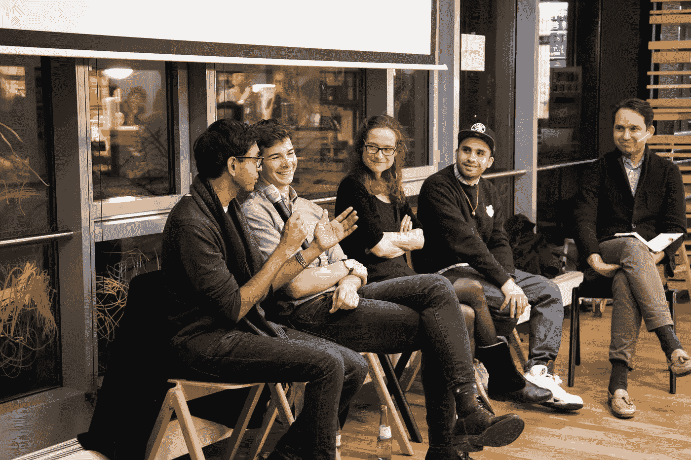

# 数据保护:困扰还是人权——新政策会扼杀欧洲的人工智能创新吗？🤔

> 原文：<https://medium.com/swlh/data-protection-obsession-or-human-right-will-new-policies-kill-ai-innovation-in-europe-9cf6be0af8b3>

*您愿意用无缝的用户体验来换取更高的数据保护标准吗？*

这个问题是在柏林举行的第六届[创业会谈会议](https://www.meetup.com/BCGDV-Startup-Talks/events/245133532/)上向 100 多名企业家、投资者和学生提出的，题为“数据保护:痴迷还是人权——2018 年 5 月欧洲的新政策会扼杀人工智能创新吗？”

答案是:40%的观众回答是——更高的数据保护标准比用户体验更重要。鉴于最近围绕[通用数据保护条例](https://ico.org.uk/for-organisations/guide-to-the-general-data-protection-regulation-gdpr/) (GDPR)的争论，数据保护成为每个人心中的头等大事也就不足为奇了。

# GDPR 对我们的产品意味着什么？

> MoBerries 的联合创始人莫·穆巴拉克(Mo Moubarak)说:“用户界面中更多级别的同意意味着你的注册流程中有更多的按钮，这直接影响到有多少用户会转化。”

但是没有人真正知道 GDPR 的真正含义是什么——这是更好的数据保护新方法的关键挑战。

小组成员爱德华·佩尔卡皮奥解释说:“我们实际上都在等待第一个被起诉的人或公司。”这也是理解这一法规可能带来的影响所需要的。Edward 应该知道——作为 Sovy 的隐私架构师，Sovy 是一家羽翼未丰的初创公司，专门为中小型企业提供免费/低成本的 GDPR 合规解决方案。

GDPR 终究会是一个成功的故事吗？根据 Percarpio 的说法，GDPR 已经取得了巨大的成功，因为它是人们积极谈论的数字空间中的首批监管主题之一。“有多少法律话题被公开讨论过？我们都知道政策有多性感。”

GDPR 背后的核心理念很简单:欧洲监管机构旨在将个人数据控制权交还给公民，并简化和统一欧盟内部的国际企业监管环境。对违规行为的处罚力度很大，罚金最高可达 2000 万€或上一年全球年营业额的 4%，以金额较大者为准。

**从用户的角度来看，这看起来像是一个长期的尝试，实际上是两件事:**

1.  解释算法如何得出结果(如产品推荐)
2.  在使用用户的数据输入算法之前，先征得用户的同意

简介——GDPR 简单地说是什么意思。

MoBerries GmbH 的业务发展主管莫·穆巴拉克认为，这正是理论监管与现实生活相冲突的地方。MoBerries 的指导原则是通过一个人工智能驱动的招聘平台，通过一个透明的就业市场连接世界上的专业人士，该平台通过一个交互式神经网络连接人才和公司。

“从产品的角度来看，用户界面中更多级别的同意意味着你的注册流程中有更多的按钮，这将直接影响有多少用户会转化。如果你不能在最初的几秒钟内说服他们，用户就会跳出来参加比赛。这种竞争可能发生在监管不那么严格的国家，比如美国或中国。

# 全球化世界中的数据保护

那么，欧盟会因为速度和渗透性在全球化的世界中最为重要而输掉这场科技游戏吗？专注于物联网、汽车和能源领域的机器学习和人工智能研发及咨询公司 [Greenlake Research](http://www.greenlakeresearch.com/) 的创始人兼首席技术官 Srinivas Sridharan 表示，GDPR 不会摧毁欧洲的技术创新，但会产生相反的效果。

> “这将提高编码技能，迫使设计人员和工程师提出新的解决问题的技术，以便符合 GDPR 标准。最终，它可以为使用网络和我们的数字身份的公平和中立的方式设定界限，”Sridharan 说。

与数字权利中心[netzpolitik.org](https://netzpolitik.org/)密切合作的独立专家[茱莉亚·克鲁格](https://juliakrueger.org/)坚信:“人类有权了解导致自动化决策的因素；他们也有权反对这一决定，而这正是《GDPR》第 22 条试图实现的目标。”正如你所料，GDPR 的公式中有相当多的回旋余地，需要像 Kreuger 这样的人将通常模糊的规则转化为具体的含义。

# GDPR 将影响我们所有人

显然，围绕 GDPR 仍有许多悬而未决的问题，尤其是它将如何转化为实际意义和标准，以及谁将受其影响最大——初创公司还是大公司。

同样重要的是，作为长时间上网的人，我们的行为和价值观问题。甚至在 GDPR 之前，就已经有很多建立透明和道德的社交媒体平台的尝试，比如 [ind.ie](https://ind.ie/) 。尽管越来越多的人正在从 Facebooks 和谷歌转向分散的替代方式，但人数仍然很少。

因此，我们都应该问自己的真正问题是:我们是否愿意一开始就满足于一个可能不那么直观但更透明的数字产品？我们是否愿意改变我们的日常习惯，质疑我们在数字空间中的行为现状？因为，归根结底，法律法规的好坏取决于我们充分利用它们的意愿。

好奇我们在柏林 BCG 数字风险投资公司做什么？我们去喝一杯，坐下来谈谈。在此之前:请查看我们的 Meetup 系列:

 [## BCGDV 启动会谈

### 波士顿数字风险投资公司的创业讲座系列对那些有兴趣了解更多信息的人开放…

www.meetup.com](https://www.meetup.com/BCGDV-Startup-Talks/) 

感谢您的阅读🙌

## 这篇文章发表在[《创业](https://medium.com/swlh)》上，这是 Medium 最大的创业刊物，有 286，184+人关注。

## 订阅接收[我们的头条新闻](http://growthsupply.com/the-startup-newsletter/)。

