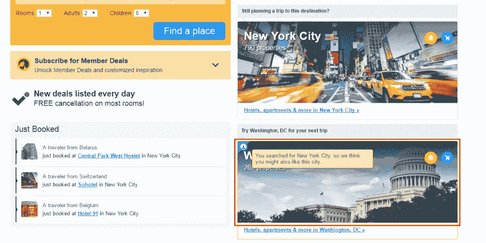

# 旅游业中的数据科学和人工智能:12 个真实的使用案例

> 原文：<https://medium.com/swlh/data-science-and-ai-in-the-travel-industry-12-real-life-use-cases-7f1a5aef7aff>

> "*因此，未来的旅游品牌不仅仅是将人们从 A 地转移到 B 地，推出新的目的地，或者组织旅行。相反，它是一种彻底进步的、完全 360 度的旅行者视角，以及创造特殊、独特、难忘体验的一切。*

*——通过智能定义旅行的未来，由*[*Amadeus Travel Intelligence*](http://www.amadeus.com/documents/travel-intelligence/defining-the-future-of-travel-through-intelligence.pdf)撰写的讨论论文

还记得你最后一次旅行吗？你直接从售票处得到你的票吗？我表示怀疑。在当今快节奏的世界里，挤出时间去售票处买票是很少有人能负担得起的奢侈。此外，如果你可以通过笔记本电脑甚至智能手机点击几下就能买到票，那又有什么好烦恼的呢？

事实上，数字旅游销售额在过去几年中增长迅速，2016 年总额达 5648.7 亿美元。预计到 2020 年，这一数字将达到 8175.4 亿美元。这种爆炸式增长是由最近的技术进步推动的，尤其是数据科学。

我们 AltexSoft 对成功地将数据科学和机器学习技术应用于[定制旅游软件开发](https://www.altexsoft.com/travel-technology/?utm_source=MediumCom&utm_medium=referral)领域并不陌生。因此，如果你正在寻找一些如何充分利用数据的新想法，这里有 **12 个机器学习和数据分析在旅游业的应用场景**。

# 1.推荐引擎

可能是数据科学最主流的使用案例，目前 99%的成功产品都采用了一些推荐解决方案。与网飞上的个性化内容建议或亚马逊上的“特色推荐”框类似，在线旅游预订提供商通常会根据你最近的搜索和预订提供量身定制的建议。

例如，在 Expedia 上搜索飞往伦敦的航班时，会为您的旅行提供几个住宿选择。

*Expedia recommended hotels when searching for flight deals*

同样，Booking.com 为你的下一次旅行提供了可供选择的目的地。

*Booking.com recommended destination based on previous searches*

这只是旅游业中使用数据驱动推荐引擎的两种方式。按照这种模式，在线旅行社可以提供汽车租赁交易、替代旅行日期(见下面的例子)或路线、基于用户偏好的新旅行目的地，甚至一些推荐的当地景点。

*Fareboom.com travel agency suggesting alternative dates for a trip*

手头有了足够的典型搜索或首选交易的数据，你就可以构建一个强大的推荐算法。它可以从特定用户的个人浏览行为中了解更多信息，以提供高度定制的更有价值的建议。

例如，如果 10 个家庭中有 8 个预订了 7 月份的迪士尼乐园之旅，那么在 1 月份给一个商务旅行者提供这样的优惠就没什么意义了。但是如果你向这样的用户展示拉斯维加斯一日游，那么成功的几率相当高。

因此，投资[数据科学咨询](https://www.altexsoft.com/data-science/?utm_source=MediumCom&utm_medium=referral)不仅可以通过追加销售对您的收入产生积极影响，还可以通过提供个性化、高效的 UX 来提高用户参与度。

# 2.机票和酒店价格预测

机票和酒店价格千变万化，因供应商不同而有很大差异。没有人有时间手动跟踪所有这些变化。因此，目前旅游业非常需要能够监控热门交易并及时发出警报的智能工具。

AltexSoft 数据科学团队为我们的客户之一，全球在线旅行社 Fareboom.com 建立了这样一个[创新的票价预测工具](https://www.altexsoft.com/case-studies/travel/altexsoft-creates-unique-data-science-and-analytics-based-fare-predictor-tool-to-forecast-price-movements/?utm_source=MediumCom&utm_medium=referral)。通过开发其核心产品——一个数字旅游预订网站，我们可以访问和收集过去几年数百万次机票搜索的历史数据。有了这些信息，我们创建了一个自我学习算法，能够根据许多因素预测未来的价格走势，如季节性趋势、需求增长、航空公司的特别优惠和交易。

*Fareboom Price Predictor, short-term forecast example*

平均置信度为 75%，该工具可以进行短期(几天)和长期(几个月)预测。

*Fareboom Price Predictor,* *long-term forecast example*

例如，如果在过去的几个假期中，从旧金山到达拉斯的所有航班的价格在圣诞节前几周大幅上涨，那么今年也可能出现同样的趋势。在这种情况下，算法会说等待可能风险太大，并提示您现在预订航班。

同样，如果圣诞节前一周飞往拉斯维加斯的航班价格通常低于平均水平，你会被要求等待，并在临近日期时预订航班。

Hopper 是另一家著名的初创公司，利用数据科学，通过应用预测分析帮助人们预订最便宜的航班。迄今为止，这家公司总共筹集了 8430 万美元，开发了一个直观的机票预测移动应用程序。

该工具被苹果、Buzzfeed、Vogue、Tech Insider、纽约时报和时代杂志评为 2015 年最佳应用之一，每天分析数十亿数据集，以提供准确的价格变动预测。在[公司网站](http://www.hopper.com/research/bunny-saves-money/)上有关于该系统如何工作的详细描述。

*Hopper fare forecast app*

因此，如上所述，基于分析的预测工具已被证明是对现有旅游预订门户或代理网站的宝贵补充。虽然这些工具主要用于机票预订，但也可以用于旅游和酒店业的其他细分领域。

它们可以用来预测酒店价格的变化，告诉你某个酒店的所有房间多久会被预订，甚至根据天气预报或某一天的预计机场负荷为你的旅行建议替代路线，以帮助用户不仅节省金钱，而且使旅行更加高效和愉快。

# 3.智能旅行助手

由于便利是当今世界的王道，由人工智能(AI)驱动的智能礼宾服务正在各个行业获得发展势头。旅行预订只是算法高度自动化的领域之一。

智能程序，被训练来执行用户要求的特定任务，通常被称为“机器人”或“[聊天机器人](https://www.altexsoft.com/blog/business/chatbots-in-travel-how-to-build-a-bot-that-travelers-will-love/?utm_source=MediumCom&utm_medium=referral)”仅在 2018 年 4 月，排名前四的聊天应用就拥有超过 400 万的月活跃用户[,即时通讯平台被一些知名品牌广泛采用，作为接触客户和建立更好的客户关系的一种伟大方式。](https://www.statista.com/statistics/258749/most-popular-global-mobile-messenger-apps/)

例如，全球酒店业领导者凯悦酒店(Hyatt)自 2009 年以来一直在使用社交平台与客户联系。最近，该公司通过 Facebook Messenger 扩展了其客户支持工具集。然而，这种全天候的移动支持需要大量的人力和财力资源。这就是人工智能虚拟助手派上用场的地方。

虚拟旅行助手通常与流行的即时通讯应用程序集成，如 Facebook Messenger、Slack、Telegram 或 Skype，并接受培训来执行各种任务。从搜索最便宜的交易、预订航班和酒店预订，到规划整个旅行，并通过关于热门旅游目的地、吃饭的地方或当地景点的有用信息和有价值的建议来增强你的整体旅行体验，这些都是最受欢迎的使用人工智能机器人的方式。

只需在 Slack 上输入“ */hipmunk 我需要在 11 月 5 日*从伦敦到纽约”，你就可以获得最新的航班选项，包括价格。

*Using Hello Hipmunk on Slack to search for flights from London to New York*

Kayak 是另一个受欢迎的旅行预订服务，它允许你直接从你的 Facebook Messenger 应用程序计划你的下一次旅行。这个聊天机器人也更像人类。它不需要特殊的命令，理解简单的问题，并以一种随意的、对话式的方式做出回应。

*Searching for flights and hotels with Kayak travel assistant on Facebook Messenger*

除了像 Hipmunk 或 Kayak 这样的大型旅行社之外，旅游聊天机器人的[名单正在迅速增长。该技术可能的用例数量也在增加。这些 AI 旅行助手的应用并不仅限于研究和预订。它们还可用作移动旅行伴侣，解决旅途中的几个问题，例如:](https://www.30secondstofly.com/ai-software/ultimate-travel-bot-list/)

*   我的航班的行李限额是多少？
*   最近的商务休息室在哪？
*   我的登机门号码是多少？
*   到机场需要多长时间？

虽然聊天机器人尚未在旅行者中得到广泛采用，但智能助手在与语音激活设备结合时变得越来越受欢迎。截至 2017 年 7 月，亚马逊 Echo 所有者的估计数量约为[820 万人](https://expandedramblings.com/index.php/amazon-alexa-statistics/#.WdYBRGiCyUk)。Echo 设备由智能助手亚马逊 Alexa 提供支持，提供完全语音激活的界面。类似的产品还有由谷歌助手驱动的[谷歌](https://www.theverge.com/2017/10/4/16405218/new-google-home-mini-max-speakers-photos-video-hands-on)和由 Siri 驱动的[苹果](https://www.apple.com/homepod/)。

亚马逊和苹果已经提供了开放的开发套件，将语音助手与第三方服务集成在一起。例如，亚马逊的 Alexa 有大约 15000 种所谓的技能和综合服务。其中一个就是上面提到的 Kayak 建造的。一旦用户在 Alexa 上启用了 [Kayak skill](https://www.kayak.com/alexa) ，他们就可以实时跟踪航班，探索旅行选项，并预订酒店房间。

最知名的智能助理已经拥有足够多的受众，与他们整合是接触习惯语音激活界面的旅行者的最短路径。

# 4.优化的中断管理

虽然前面的案例主要侧重于规划旅行和帮助用户解决旅行中最常见的问题，但自动化中断管理有所不同。它旨在解决旅行者在到达目的地途中可能面临的实际问题。

中断管理主要应用于商务和企业旅行，总是一项时间敏感的任务，需要即时响应。虽然受到风暴或火山爆发影响的可能性非常小，但旅行中断的风险仍然很高:每天都有数千次延误和数百次航班取消。

不管是什么原因，当你需要在明天中午之前到达东京的时候，却在深夜滞留在欧洲的某个地方，这会造成巨大的不便。此外，在商务旅行中，这可能会导致重大损失，并对您的公司产生严重影响。

随着最近技术的进步，预测这种中断并有效地减轻旅行者和承运人的损失成为可能。基石信息系统公司打造的 [4site 工具](https://www.altexsoft.com/case-studies/travel/altexsoft-cornerstone-reimagining-the-user-experience-for-a-corporate-travel-management-solution/?utm_source=MediumCom&utm_medium=referral)，旨在提高企业出行的效率。该产品面向旅行者、旅行管理公司和企业客户，为实时旅行中断管理提供了一套独特的功能。

数据科学的机会在于根据关于天气、当前延误和其他机场服务数据的可用信息来预测旅行中断。因此，一个经过训练来监控这些数据的算法可以及时发出通知，提醒用户和他们的旅行经理即将发生的中断，并自动将应急计划付诸行动。

例如，如果在你的目的地有一场大雪，所有航班都被重定向到另一个机场，智能助理可以检查那里的可用酒店或预订从你的实际到达地到你的初始目的地的转移。

不仅乘客受到旅行中断的影响；每次航班取消或延误，航空公司都会承受巨大的损失。因此，全球领先的分销系统(GDS)之一 Amadeus 引入了航班恢复系统，旨在帮助航空公司降低旅行中断的风险。该工具是一个基于数据科学的推荐引擎，可帮助航空公司即时应对和高效处理运营中的任何威胁和中断。

它将航空公司管理中的手工工作排除在外，帮助航空公司做出明智的决策并优化运营以提高效率。澳大利亚最大的航空公司 Qantas 是第一家应用该系统改善运营的公司。因此，该公司[报告](https://www.tnooz.com/article/amadeus-disruption-management-schedule-recovery/):*Amadeus 解决方案有助于减少延误的数量和时间长度，无论是由于交通拥堵、运营延误还是天气条件，从而改善旅行者的整体体验。*

该系统在 2016 年经历了严峻的考验。在导致澳大利亚东海岸航班延误的暴雨期间，澳航 436 次航班中只有 [15 次(约 3.4%)被取消，相比之下，维珍澳大利亚的 320 次航班中有 70 次(22%)被取消，维珍澳大利亚使用旧的手动系统来管理中断。该公司的准点率也仍然很高:周六为 86%，周日为 62%，而维珍的准点率分别为 74%和 48%。](http://www.theaustralian.com.au/business/aviation/qantas-calm-in-eye-of-storm-with-amadeus-delay-recovery-system/news-story/7312590eb971f52dc03fc5a133f658be)

所描述的机会是数据如何增加价值、降低成本和提高旅行中断管理效率的一个很好的例子。作为一个新的和不饱和的市场，它提供了相对较低的进入壁垒。

# 5.客户支持

与个人旅行助理和智能中断管理不同，航空公司可以利用人工智能的力量来简化客户支持流程。尤其是现在，几乎一半的消费者都认为对询问的响应速度是成功的客户服务最重要的组成部分。

根据澳航为测试其旅行中断系统的效率而进行的实验，一名经验丰富的专业人员大约需要 15-20 分钟的时间，可以通过算法在一分钟内完成。

也就是说， [Gartner 预测](https://www.gartner.com/doc/3168718/predicts--crm-customer-service)到 2018 年，25%的客户服务和支持运营将依赖于虚拟助理技术。

将虚拟助理与真人助理相结合，不仅可以帮助您提高品牌忠诚度，还可以优化您的业务绩效。例如，如果一名乘客的行李丢失，报告丢失或甚至通过虚拟助手进行自动搜索可能会大大加快找到它的过程。这种方法消除了官僚主义和文书工作，这是在客户体验方面重塑自我的一个好方法。此外，为造成的任何不便提供免费奖励是留住客户的更好方法。

# 6.为 MVC(最有价值的客户)量身定制的产品

忠诚度计划对旅游和酒店行业的重要性持续增长。2016 年，主要连锁酒店的忠诚计划会员数量增长了 13.1%(估计[有 3.44 亿会员](https://www.gartner.com/doc/3168718/predicts--crm-customer-service))。由于这个数字只会增加，旅行社和酒店已经有足够的忠诚计划遗留数据来应用基于人工智能的个性化。

忠诚计划的成员，即最有价值的客户，是旅游业参与者应该首先关注的用户，以避免流失。对于机器学习应用来说，这是唾手可得的。

利用行为跟踪技术、元数据和购买历史，为新用户和未注册用户提供量身定制的服务并不总是奏效。你可能会根据一般的历史数据做出一些预测，但是这些预测的准确率对于新人来说不会那么高。另一方面，将历史数据和实时数据结合起来，对于经常性购买者来说确实更简单。OTA 和酒店可以对 MVC 进行定制化建议。这将减少流失的机会，并有助于进一步发展品牌与其忠诚客户之间的紧密联系。

针对 MVC 的定制建议也提供了向上销售和交叉销售的机会。例如，在线旅行社可以利用他们的数据，在购买机票的基础上为个人推荐酒店房间或汽车租赁选项，因为他们使用服务提供商的[预订 API。这可以通过电子邮件活动或直接从网站上完成。](https://www.altexsoft.com/blog/engineering/travel-and-booking-apis-for-online-travel-and-tourism-service-providers/?utm_source=MediumCom&utm_medium=referral)

# 7.航空公司的 UX 个性化

根据[麦肯锡 2016 年报告](https://www.mckinsey.com/business-functions/digital-mckinsey/our-insights/straight-talk-about-big-data)，特别是旅游公司和航空公司，如果它们是数据驱动的，获得客户的可能性增加 23 倍，保持客户的可能性增加 6 倍，盈利的可能性增加 19 倍。航空业中数据科学的使用案例比比皆是。

虽然它们中的大多数与中断管理和延迟预测有关，但有些纯粹是面向 UX 个性化的。例如，联合航空公司过去对他们的数据采用“收集和分析”的方法。但是现在他们采用了这一原则的改进版本。自 2014 年以来，他们在处理其登录页面时应用了“[收集、检测、行动](http://fortune.com/2014/06/19/big-data-airline-industry/)方法。

该公司跟踪客户行为，收集超过 150 个变量的数据，包括个人(例如，以前的购买和搜索目的地)和一般历史数据。这个大型数据集用于进行详细的客户细分，并根据特定用户所属的类别实时调整 UX。

根据一个定义的组，航空公司网站进行 200 毫秒长的计算，并调整屏幕布局、文案和其他网站片段，以增加转换的可能性。据美联航称，这种动态个性化已经使辅助收入同比增长了约 15%。

# 8.社交媒体中的情感分析

据 Amadeus 称，[90%的美国旅行者用智能手机在社交媒体和评论服务上分享他们的经历和照片。猫途鹰有 3 . 9 亿独立访客和 4 . 35 亿条评论。每分钟，大约有 280 条旅行者评论被提交到网站上。](http://www.amadeus.com/blog/07/04/5-examples-predictive-analytics-travel-industry/)

这是一个很大的有价值的数据池，品牌可以通过分析来改进他们的服务。虽然评论子集的传统统计分析是可能的，但是计算能力和底层机器学习技术允许分析所有品牌相关的评论。

情感分析是[监督学习](https://www.altexsoft.com/blog/business/supervised-learning-use-cases-low-hanging-fruit-in-data-science-for-businesses/?utm_source=MediumCom&utm_medium=referral)的一个分支，旨在探索文本数据，以定义和评估其情感和事实质量。例如，[谷歌云自然语言 API](https://cloud.google.com/natural-language/) 是一个现成的应用编程接口，可以调整并与分析工具集成，以提供所有品牌相关评论的实时分析。

*Sentiment analysis of a Cafe Du Monde (New Orleans, LA) review on TripAdvisor made by Google Natural Language API*

自然语言处理和情感分析的成熟允许采用精确的分析工具，而无需耗时的数据收集。适用范围大。这可能是对整体品牌形象的动态跟踪，或者是在引起社交媒体反应的服务产品更新后的特别分析。

# 9.酒店业的动态定价

动态定价基于根据各种市场环境改变房间价格的想法。这种价格优化对这个行业来说并不是什么新鲜事。自 2004 年[开始，希尔顿和万豪酒店每天都会调整一两次房价。随着酒店的机器学习应用变得普遍，动态定价可以基于预测分析，以在预测最佳价格时包括更多变量。我们有一整篇文章是关于使用机器学习进行动态定价的](http://www.businesstravelnews.com/More-News/Hotel-Rates-Go-Dynamic-Hilton-Intercontinental-End-Fixed-Pricing)[，所以一定要去看看。](https://www.altexsoft.com/blog/datascience/machine-learning-redefines-revenue-management-and-dynamic-pricing-in-hotel-industry/?utm_source=MediumCom&utm_medium=referral)

2015 年，[喜达屋酒店](https://www.cio.com/article/3070384/analytics/starwood-taps-machine-learning-to-dynamically-price-hotel-rooms.html)开始开发一个预测分析工具，该工具考虑了数百个因素，以显示当前最有效的价格。这些包括有竞争力的价格数据、天气、用户的预订模式、入住数据、房间类型、每日价格和其他变量。虽然该系统可以全自动方式工作，但它也允许人工操作员查看数据仪表板，并在需要时手动调整速率。

动态定价需要在理解相关客户和市场数据的基础上建立有效的收益管理。虽然在线旅行社(OTA)在客房预订领域占据主导地位，但设定数据驱动的动态定价可以让酒店绕过中介，推动更多的直接客房预订。

# 10.解决旅行中断的目标产品

旅行中断，比如航班取消，会给酒店业主带来意想不到的机会。在经历了 2013 年最糟糕的冬天，美国每天有 500 个航班被取消后，2014 年 3 月，美国连锁酒店[红屋顶酒店发起了一项基于活动的活动](http://www.mmaglobal.com/case-study-hub/case_studies/view/31739)。

酒店使用了航班取消和天气信息的公共数据集。数据通过 API 收集，并通过条件算法进行处理。有了这些数据，连锁酒店预测取消的航班，并针对可能受影响地区的旅客进行广告宣传。该品牌的付费移动搜索活动为潜在客人提供了搜索最后一分钟预订广告的机会，广告中有关于房间和从机场到酒店距离的信息。

该活动的结果令人印象深刻:红屋顶酒店的预订量增加了 266%的非品牌手机预订量，以及 60%的非品牌活动预订量。此外，该活动还带来了 375%的转换率，以及关键旅游搜索查询的 650%的份额增长。

# 11.欺诈检测

根据 [Juniper Research](http://www.experian.com/assets/decision-analytics/white-papers/juniper-research-online-payment-fraud-wp-2016.pdf) 的报告，航空公司和旅游业遭受电子商务欺诈最严重。他们每年都要损失数十亿美元，不得不将被盗的钱退还给顾客。支付欺诈是该行业中最常见的诈骗类型之一，它需要使用偷来的信用卡来预订机票或住宿。另一种常见的欺诈类型是友好型欺诈，即客户支付了购物款，然后声称卡被盗，要求退款。

*Top merchants affected by Fraud Transactions
Source —* [*Juniper Research*](http://www.experian.com/assets/decision-analytics/white-papers/juniper-research-online-payment-fraud-wp-2016.pdf)

使用[剖析和机器学习技术](https://nethone.com/blog/travel-fraud-infographic/)的客户行为分析可以帮助防止和检测非法交易的发生。意大利在线预订平台 Wanderio 与 Pi School 合作，[应用了一种欺诈检测的人工智能技术](http://picampus-school.com/fraud-detection-applied-travel-booking/)。此前，Wanderio 使用第三方提供商的服务来评估交易。由于使用了新技术，每笔交易的最终平均成本有所降低。

用于欺诈检测的人工智能解决方案不仅适用于在线平台。移动预订应用程序 HotelTonight 也[应用定制的机器学习模型](https://www.hoteltonight.com/en/about)来预测和检测欺诈，使他们能够将退款减少到 50%。要了解机器学习工具如何帮助检测欺诈，请阅读我们关于欺诈检测的[白皮书](https://www.altexsoft.com/whitepapers/fraud-detection-how-machine-learning-systems-help-reveal-scams-in-fintech-healthcare-and-ecommerce/?utm_source=MediumCom&utm_medium=referral)。

# 12.入住体验

人工智能解决方案不仅可以帮助旅行者前往目的地，还可以在酒店住宿期间提供帮助。房间里有了支持语音的虚拟助手，客人可以更加舒适。例如，他们可以设置房间的温度，调节光线，开关电视。通过面部识别，酒店可以加快入住速度，并使住宿更加安全。

面部识别和语音服务等酒店入住体验功能已经在全球许多酒店投入使用。越来越多的酒店使用聊天机器人，甚至有机器人门卫。启用语音的虚拟助理更多地出现在酒店中。根据《2025 年甲骨文酒店报告》[,到 2025 年，78%的酒店将升级配有声控设备的套房，其中 68%的酒店将使用机器人办理入住和退房手续。](https://www.oracle.com/webfolder/s/delivery_production/docs/FY16h1/doc31/Hotels-2025-v5a.pdf)

永利拉斯维加斯[为他们所有的房间](https://www.prnewswire.com/news-releases/wynn-las-vegas-announces-the-addition-of-amazon-echo-to-all-hotel-rooms-300377995.html)配备了亚马逊回声扬声器， [Safeco Field Suits](https://www.mlb.com/mariners/news/safeco-field-suites-now-feature-amazon-alexa/c-227850106) 不仅在房间里使用它，还建议客人在逗留期间在这座城市做些什么。伦敦的 Radisson Blu Edwardian 酒店使用一个名为 Edward 的[聊天机器人，拉斯维加斯的 Hotel Cosmopolitan 有](https://www.businesswire.com/news/home/20160509005368/en/Edwardian-Hotels-London-Launches-%E2%80%98Virtual-Host%E2%80%99-Designed) [Rose 和](https://www.travelandleisure.com/hotels-resorts/cosmopolitan-las-vegas)另一个虚拟门房，可以回答任何问题并全天候提供帮助。斯德哥尔摩的 Clarion Hotel Amaranten 也使用基于 Alexa 的聊天机器人。此外，[亚马逊计划在今年夏天推出针对酒店业的定制版 Alexa](https://www.phocuswire.com/Amazon-Alexa-for-hotels-launch) 。

有了面部识别技术，酒店体验变得安全多了。例如，[德利的柠檬树酒店安装了人脸识别系统](https://www.nec.com/en/case/lemontreehotels/pdf/brochure.pdf)来增强安全性。该系统从闭路电视摄像头捕捉面部图像，并将其与数据库中的现有图像进行比较。日本的一家亨纳酒店完全由机器人经营。在 Henn na 酒店，接待员是机器人，搬运工也是机器人，而不是发放电子钥匙，客人在登记入住时必须注册他们的面部图像。

# 向前和向上:塑造旅行科技的未来

在其报告【2024 年旅行的未来中，Skyscanner 揭示了未来十年塑造旅行体验的最有前途的技术趋势。正如该公司的 B2B 负责人菲利普·菲利波夫所说，“*在不久的将来，将有一个面向语义、位置感知和大数据(超出我们合理管理或理解能力的数据集，因此需要更具想象力的方法和途径来可视化它们)应用的大众市场转换，这将对旅行者产生变革性的作用。*

事实上，在该报告发布仅两年后，数据科学显然是改变我们出行方式的最有前途的技术领域之一。上面列出的应用领域只是冰山一角。

仅 Amadeus 一家就拥有超过 37pb 存储空间的数据中心，可用的旅行数据量是惊人的。所以，主要的问题是:你能在你的竞争对手之前把它变成你的优势吗？

*原载于 AltexSoft 的博客**[***数据科学与 AI 在旅游行业:12 个真实用例***](https://www.altexsoft.com/blog/datascience/data-science-and-ai-in-the-travel-industry-9-real-life-use-cases/?utm_source=MediumCom&utm_medium=referral)*

****

## **这篇文章发表在 [The Startup](https://medium.com/swlh) 上，这是 Medium 最大的创业刊物，拥有 355，974+读者。**

## **在这里订阅接收[我们的头条新闻](http://growthsupply.com/the-startup-newsletter/)。**

****