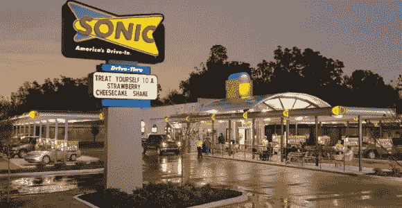

# Sonic Drive-In 的数据安全漏洞

> 原文：<https://medium.com/swlh/data-security-breach-at-sonic-drive-in-e9a71ac61cf7>

## 据报道，黑客窃取了数百万张信用卡/借记卡号

Sonic Drive-In location. Photo: [Krebs On Security](https://krebsonsecurity.com/2017/09/breach-at-sonic-drive-in-may-have-impacted-millions-of-credit-debit-cards/)

[**更新 2017 年 10 月 3 日**](https://www.nextadvisor.com/blog/2017/10/03/data-breach-roundup-deloitte-sonic-and-whole-foods/) **:** *【卫报】*报道称，9 月 25 日，“四大”会计机构德勤(Deloitte)受到一次违规事件的影响，该事件“可能危及公司内所有行政账户以及整个内部电子邮件系统。”据信，被泄露的信息包括该公司一些顶级客户的用户名、密码和个人数据。

连锁杂货店 Whole Foods 也可能在 2017 年 9 月 29 日从这个销售点系统中窃取了支付卡信息。

**2017 年 10 月 4 日更新:**2017 年 10 月 4 日[周三](https://www.cnbc.com/2017/10/04/sonic-shares-dip-on-news-of-payment-breach.html)宣布，Sonic 将向过去一年内在 Sonic 地点使用其卡的客户提供“通过 Experian 的 IdentityWorks 计划提供 24 个月的免费欺诈检测和身份盗窃保护。”

## 原故事:

在 2017 年 9 月 17 日由 [Krebs 就安全问题](https://krebsonsecurity.com/2017/09/breach-at-sonic-drive-in-may-have-impacted-millions-of-credit-debit-cards/)发布的一份报告中，据透露，位于俄克拉荷马城的快餐连锁店 Sonic Drive-In 已经承认了一个数据安全漏洞，该漏洞导致数量不明的 Sonic 收银机(今天称为销售点终端)被侵入。在此之前不久，大约 500 万被盗的信用卡号码——最近在 Sonic locations 使用过——被放在[暗网](https://www.wired.com/2015/06/dark-web-know-myth/)上出售。Sonic Drive-In 很快就被他们的信用卡服务提供商通知了“异常活动”,根据公司声明，他们已经与执法和法医专家“接触”,以确定违规的深度。

> “我们正在努力了解这个问题的性质和范围，因为我们知道这对我们的客人有多重要，”该公司在一份声明中说。“当我们收到处理器的消息时，我们立即聘请了第三方法医专家和执法部门。虽然执法部门限制了我们可以分享的信息，但我们会尽可能地传达更多信息。”— *声波免下车服务声明*

Krebs 表示，尚不清楚被盗的信用卡号码是否与 Sonic 有关，其他公司也可能受到了影响。Sonic 的公共关系副总裁 Christi Woodworth 公开表示，对违规事件的调查仍处于早期阶段，因此，目前尚不清楚有多少地点或客户受到了影响。

[这些类型的安全漏洞](https://www.usatoday.com/story/tech/news/2017/06/05/credit-card-point-of-sale-terminal-cash-register-retail-hack-breach-target-home-depot/102425582/)涉及黑客“秘密访问”接受信用卡的组织的销售点系统，安装恶意软件，将卡号和其他刷卡账户信息发送给黑客，然后黑客在黑暗的网络上出售这些信息。卡信息的价格通常由卡的“新”(最近)程度、类型(借记卡/信用卡、发卡公司/银行)和级别(白金卡、标准卡、绿色卡等)决定。)的卡片。然后，窃贼购买这些信息并使用它来创建卡的副本，使用伪造的副本从各种商店购买高价值的物品，损害信用卡公司和信息被盗的无辜持卡人的利益。

此类事件的报道越来越常见。通常，事故会导致受影响公司的[股票价值](https://www.cnbc.com/2017/10/04/sonic-shares-dip-on-news-of-payment-breach.html)下降，并因此暂时损害其声誉。2013 年[的 Target hack](http://www.businessinsider.com/target-credit-card-hackers-2013-12) 就是一个例子，5 月的[Chipotle hack](http://fortune.com/2017/05/26/chipotle-hackers-payment-card-information/)或 2014 年的 [Home](https://www.theguardian.com/business/2014/nov/06/home-depot-hackers-stole-53m-email-addresses-data-breach) [Depot](http://money.cnn.com/2014/09/18/technology/security/home-depot-hack/index.html) [也是如此。](https://www.sans.org/reading-room/whitepapers/breaches/case-study-home-depot-data-breach-36367)

据《赫芬顿邮报》报道，像这样的黑客攻击通常无法被受影响的公司阻止，因为它们通常符合信用卡公司制定的安全程序。美国国内的金融机构对国内的问题负有部分责任，因为美国是 G20 国家中最后一个转向更安全的芯片卡技术的国家。基于芯片的卡要贵得多，而且比磁条的卡更容易被盗。不幸的是，许多机构还没有用新的标准取代条纹卡。根据 Visa 的数据，截至 2017 年 3 月，美国金融机构发行的 4.21 亿张 Visa 卡中有 58%是基于芯片的[。](https://usa.visa.com/visa-everywhere/security/visa-chip-card-stats-march-2017.html)

> “将是金融机构使它们完整，支付费用或替换客户支票账户中的钱，或重新发行卡，所有这些成本都落在金融机构身上，”伯杰说。“这些大型信用卡违规事件将会持续下去，直到有一个让零售商和商家承担责任的国家标准出台。”— Dan Berger，美国联邦保险信用合作社协会主席兼首席执行官

与那些没有配备芯片卡的零售商相比，接受芯片卡的零售商往往对潜在的小偷和黑客不太有吸引力。由于从更安全的芯片卡中收集信息的难度大大增加，装有芯片的零售商成为不太有吸引力的目标。Visa 在 3 月份表示，只有 44%接受其卡的商店被认为是“支持芯片的”，这意味着美国 56%的商店不能处理基于芯片的卡，这使他们在未来更容易受到攻击。

这一最新发展表明，个人和公司很容易受到此类攻击。然而，通过对财务报表进行密切、定期的监测，这种风险是可以减轻的。如果进行了可疑活动或未经授权的交易，必须尽快向相关机构/发卡机构报告您账户上的可疑活动，以避免潜在的麻烦或不得不为此买单。

:卡信息被盗的时间越近，被发现和注销的可能性就越小。

## 这篇文章发表在[《创业](https://medium.com/swlh)》上，这是 Medium 最大的创业刊物，有 292，582+人关注。

## 在这里订阅接收[我们的头条新闻](http://growthsupply.com/the-startup-newsletter/)。

