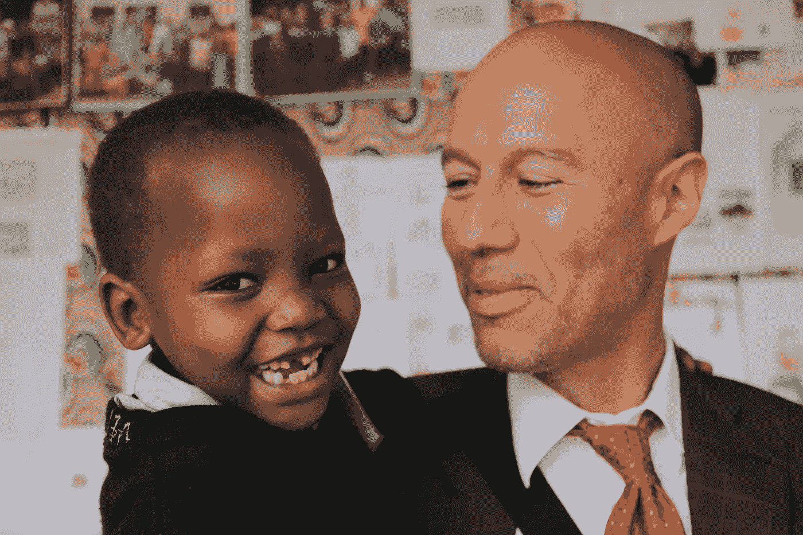
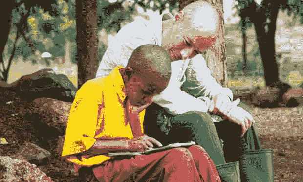
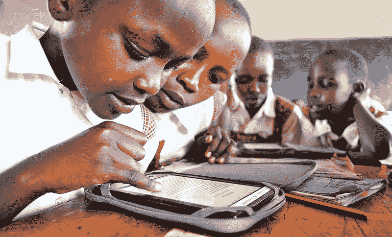
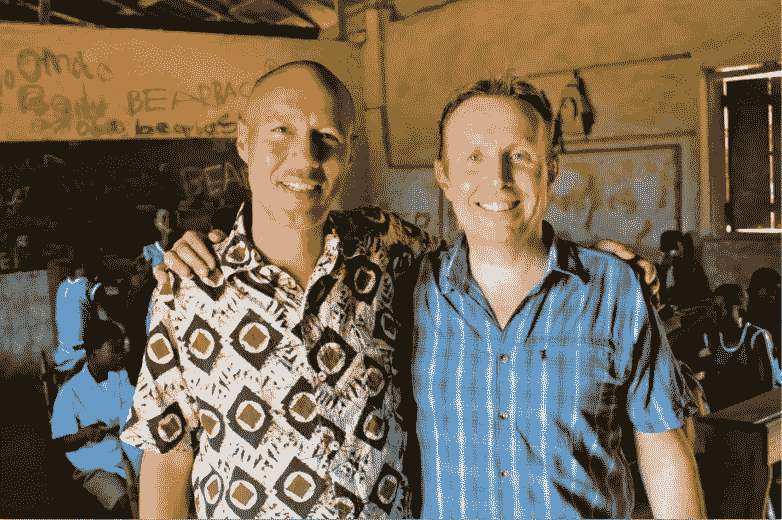
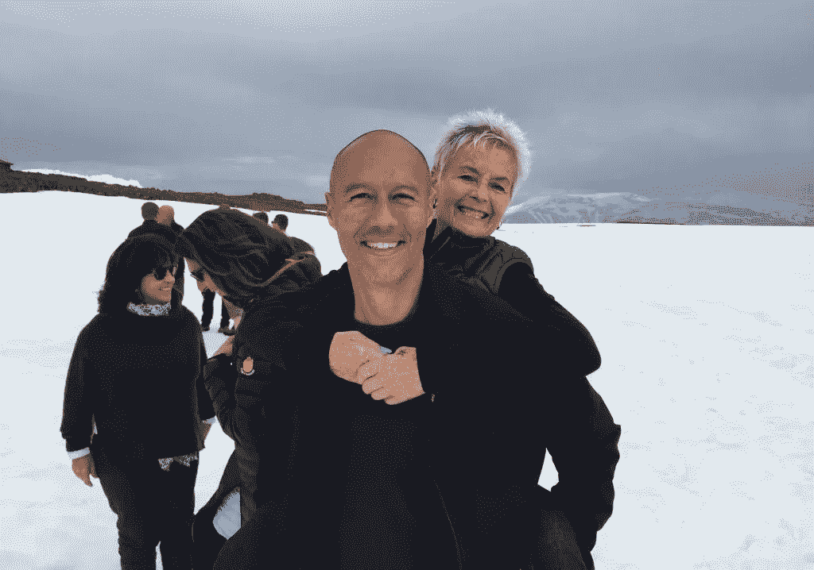

# 大卫·里舍:安静的革命者

> 原文：<https://medium.com/swlh/david-risher-the-quiet-revolutionary-1e6d1512eadb>

## 我们这一代的科技巨头受到了很多赞扬，如埃隆·马斯克、已故的史蒂夫·乔布斯等人，但也有一些人正在以一种安静得多的方式改变世界。其中一个人是大卫·里舍，他是[世界读者](http://www.worldreader.org/)的联合创始人。这是他的故事。

*大卫毕业于普林斯顿大学，获得比较文学学士学位，在去西雅图和加入微软之前，他获得了哈佛商学院的 MBA 学位。他是负责推出公司第一个数据库产品微软 Access 的总经理。*

*1997 年，他离开微软，加入 Amazon.com，成为该公司负责产品和商店开发的第一副总裁。在他的领导下，亚马逊的收入从 1600 万美元增长到超过 40 亿美元。他后来担任该公司美国零售高级副总裁，监督亚马逊零售业务的营销和一般管理。大卫于 2002 年离开亚马逊。在亚马逊网站商店目录的底部，一个永久的复活节彩蛋链接指向杰夫·贝索斯写的* [*致敬大卫*](http://www.amazon.com/gp/feature.html?docId=447307) *。*

*在与家人旅行、教学和慈善工作后，大卫于 2010 年与* [*科林·麦克埃尔韦*](https://twitter.com/ColinMcElwee) *共同创立了*[*world reader*](http://www.worldreader.org/)*。Worldreader 的使命是通过在阅读材料非常有限的地方使用电子书来释放数百万人的潜力。最近，* [*获得了*](http://www.worldreader.org/blog/the-meffy-awards-we-won/) *移动优先市场创新奖，以及* [*梅菲兹*](http://www.meffys.com/about/) *社会责任市场奖。*

> “我想释放下一批 10 亿人的潜力，让他们成为下一批科学家、下一批教师、下一批创新者、下一批探索者。”

***纽汉姆:你经常谈到自己小时候对书籍的热爱。你是什么时候爱上书的，什么书第一次抓住了你的注意力？
里舍:*** 我妈妈去西夫韦超市买食物时，会把我和弟弟送到图书馆，这个习惯一直保持着。我们的地下室里还有一堆我妈妈童年时代的旧书——神探南茜、哈弟小子之类的。我记得小时候很喜欢 CS Lewis 的纳尼亚系列。能够探索新的世界，解决问题，然后安然无恙地回来，这个想法对我来说非常有吸引力。从小，大卫就如饥似渴地读书；他的母亲接到邻居打来的电话，他们看到他鼻子埋在书里步行去学校——他们担心他会出车祸。 ]

纽汉姆:是什么首先激发了你对科技的兴趣？我们家里东西不多，但在离我家几英里的地方有一个无线电小屋。我的朋友托尼和我会在放学后去那里玩几个小时，敲打 TRS-80-一台非常早期的电脑，尝试用 BASIC 语言编写冒险游戏。

后来我妈为了生意买了一台 Apple II+，我用它写高中论文。我们有一个非常早期的文字处理程序，叫做 ScreenWriter II，我觉得这太不可思议了。我的字写得很糟糕——我想我的老师终于可以看我的卷子了，这让我的成绩提高了一个档次！

> “我喜欢从零开始创造一些东西，有一天可以帮助数百万人的想法。”

1990 年晚些时候，在我就读商学院的两年时间里，我以实习生的身份加入了微软。我一直对技术感兴趣，我想有一种方式去看看西海岸(我在波士顿上学)，所以这似乎是一个一举两得的方法。

我在微软的 Windows 桌面数据库上工作，当时还没有一个名字——它的代号是 Cirrus，后来成为 Microsoft Access——我喜欢从零开始创造一些东西，有一天可以帮助数百万人的想法。我后来开始管理这个团队，然后开始了一个名为微软投资者的新产品，这是微软的第一批网络资产之一。

> "在亚马逊的早期，几乎所有的东西都处于巅峰状态."

纽汉姆:你离开了微软，去亚马逊为杰夫·贝索斯工作。比尔·盖茨对亚马逊不屑一顾，称其为小型互联网书店，你认为亚马逊和杰夫有什么潜力？
里舍: 我第一次和杰夫打交道是在他打电话给我，向我推荐一位微软同事的时候。我们聊得很愉快，他问的问题给我留下了深刻的印象，亚马逊的首席执行官会花 45 分钟亲自做背景调查。

1997 年底，我加入了亚马逊，担任其第一任产品和商店开发副总裁。我加入的原因？老实说，这更像是一种抓痒的方式。我永远爱书；我爱上了科技。有什么更好的方法把两者结合起来？

当然，杰夫描绘了一幅创造一个新的十亿美元企业的图画，这一事实也非常令人兴奋——你不会经常有机会成为其中的一部分，即使它可能不会成功。但它的基础是以一种新的方式将书籍和技术结合在一起。

在亚马逊的早期，几乎所有的东西都是高点。我是 60 号员工之类的，所以每个人都在做所有的事情。当时，我们面临的最大挑战是快速做大，同时创造令人难以置信的客户体验，让人们改变习惯，从商店购物转向网上购物。同时做这两件事令人振奋。

唯一真正的低落是在大多数早晨醒来时阅读一些“亚马逊”版本。炸弹”上了头条。在人们月复一月地怀疑你是不是疯了之后，很难不让一些自我怀疑在表面下蔓延。但现在，它很好地为我服务:人们有时会认为 Worldreader 很疯狂，但我已经习惯了！

> “就你个人而言，如果你认真承担责任，就可以改善数百万客户的生活，这一想法非常有说服力。”

纽汉姆:你能告诉我在微软和亚马逊工作的情况吗？为两个如此强大的科技巨头工作，你学到了什么？比尔和杰夫都有无限的精力和动力，尽管他们早就有理由订婚了。很明显，燃烧的火有很多燃料——我认为在这两种情况下，做一些以前没有做过的事情是非常有动力的。

在微软，时任总裁的迈克·梅普斯给新员工做了一次演讲，他描述了成为“黑洞”的原罪——一个做事不坚持到底的员工。我开始意识到，不管付出什么代价，完成工作是多么重要，这样别人才能依赖你。

比尔·盖茨教我不要担心无论如何都会发生的事情，而要关注那些更难预测的事情。20 世纪 90 年代中期，我们在一个异地，有人问他一个关于微软 Excel 的问题。他的回答基本上是:“我不需要过多考虑 Excel，因为它的市场份额在未来几年只会增加。我需要更多地担心我无法预测的事情。”几年后，互联网在我们面前崩溃了，比尔做出了令人难以置信的回应，承诺放弃 ie 浏览器，这样(还有其他原因)微软加强了它在浏览器领域的地位，而不计代价。这是一个非常大胆的举动。

在亚马逊，杰夫坚持代表客户创新的精神给我留下了深刻的印象。如果你认真承担责任，你个人就可以改善数百万顾客的生活，这种想法非常强大。

Jeff 还告诉我，无论你建立的企业多么有吸引力，无论你的价值对客户来说多么强大，如果有更高价值的方式向客户提供价值，你就必须转移到那里，即使这很昂贵，会毁掉你自己的企业。

有趣的是，我从这两者中学到的经验非常相似，但动机却不同。在比尔的案例中，有一个更强的焦点是智胜竞争对手；在 Jeff 的案例中，重点更多的是吸引顾客。这两种策略都有效；它们只是不同人和不同市场动态的产物。

Worldreader in Kenya

> “这与愿景有关……但更重要的是，这与人有关。”

纽汉姆:你能说说导致你和联合创始人科林创办 Worldreader 的对话吗？你一开始的任务是什么？
里舍: 这是我和家人出发去南美前在巴塞罗纳的最后一天，科林要求吃早餐。他对 Kindle 很感兴趣，我和我的家人在旅行时一直用它来阅读，他想谈谈如何用它把书带给那些没有书的人。我认为这是一个很酷的想法，但我把它放在了一边，直到我在厄瓜多尔参观瓜亚基尔的一所名为佩尔图奥·索科罗的女子孤儿院——我看到了这个被锁起来的图书馆，这意味着有 100 名女孩被扣留，这对我产生了深远的影响。

Worldreader Co-Founders David and Colin McElwee

所以当我回到美国时，我打电话给亚马逊的一些朋友，开始着手看看他们是否能捐赠一些 Kindles 给我们来测试这个想法。我想，如果我能说服他们，我们可以一起尝试。亚马逊被说服了，所以我搬回了巴塞罗那(这不是我的主意)；接下来的一个秋天，我和科林一直在调试这个想法，在我们女儿的学校进行测试，看看我们能走多远。几个月后，我们意识到它在起作用，所以我全职关注它；科林辞去了在 ESADE 商学院的工作，于是 Worldreader 诞生了。

如果你看看我的职业生涯，我当过教授；我在两家科技公司工作过；我是一所学校的董事会主席。Worldreader 把我做的一切都拿来，旋转一下，用一种新的方式吐出来。但是我们所有的成功都要归功于我们培养的团队——这是来自私营部门的最大教训。这是关于愿景…但更重要的是，这是关于人。

Worldreader in Uganda

> "识字是我们对抗无关紧要和过时的唯一疫苗."

***纽汉姆:企业家经常把他们所做的事情作为他们的使命。你能告诉我你如何看待你在 Worldreader 的工作吗？
Risher:*** 有些人致力于根除疾病；其他人致力于帮助我们到达火星。我想释放下一个十亿人的潜能，让他们成为下一个科学家，下一个老师，下一个创新者，下一个探索者。识字是我们对抗无关紧要和过时的唯一疫苗。

我很幸运:我们做的工作在很多方面都很艰难，但我发现这很有活力。我不太喜欢的唯一一件事是被我希望成为支持者的人说“不”。通常他们对此很友好——也许这不符合他们自己的慈善战略。但有时很难不把它当成一点个人情绪，因为我看到了我们正在产生的影响，我想:为什么我没有成功地让其他人看到同样的影响？

纽汉姆:如果你明天能做一件事来帮助《世界读者》完成使命，你会做什么？成功是什么样子的？
Risher: 对 Worldreader 所做的事情的需求基本上是无限的，人均成本正在下降到 0.50 美元甚至更少。所以，我希望一个慈善家的合作伙伴明天早上醒来说:我想捐赠 5000 万美元，帮助 1 亿人发挥他们的潜力。一旦我们达到 1 亿，世界其他地方将会注意到，并说:好吧，现在，让我们达到 10 亿。

对我来说，成功是当数字阅读在世界各地被认为是司空见惯的时候，数十亿人将因此能够发挥他们的潜力。这就是成功的样子。

> “你可能不记得我了，但我经常想起你。你们给我留下了一个在世界级水平上运营的强烈愿望。”

回顾你迄今为止的职业生涯，你最自豪的是什么？有没有一个特别的事件以某种方式展示了那个时刻？
里舍: 我离开了亚马逊，在[华盛顿大学商学院](http://foster.uw.edu/)教书——我一直想成为一名教师，他们给了我一个职位，教一门叫做“互联网竞争”的课程几周前，我收到一个以前的学生在脸书发来的信息，“你可能不记得我了，但我经常想起你。你给我留下了一个在世界级水平运作的强烈愿望。我想让你知道你对他人生活的影响。”一个月过去了我还在咧着嘴笑。

纽汉姆:你认为科技会把我们带向何方？就其向善的力量而言，你认为它将何去何从？Risher: 我们仅仅触及了表面。如果你想到我们最基本的需求和愿望——健康、生存、一份好工作和一份可以维持生活的工资，以及我们的孩子过上美好的生活——科技可以帮助解决所有这些问题，而且比以往任何时候都规模更大、成本更低。实际上，唯一阻碍我们的是金融市场没有很好地奖励这种举措，因为大多数受益者没有太多的可支配收入。所以慈善事业必须启动水泵。

纽汉姆:你最喜欢的书是什么，引用？我最喜欢的书通常是我读的最后一本书——我倾向于享受我正在读的书，并且几乎总是从中吸取一些东西。刚刚看完 [*现实的魔力*](http://www.amazon.com/Magic-Reality-Know-Whats-Really/dp/1451675046/ref=sr_1_1?ie=UTF8&qid=1450710257&sr=8-1&keywords=the+magic+of+reality) ，解释了那么多神话背后的科学——创世神话；巴别塔等等——展示了现实是如何像故事一样神奇。

至于引语，我会选择我在大学年鉴中引用的引语，来自约瑟夫·康拉德的*。**“我不喜欢工作——没有人喜欢——但我喜欢工作中的东西——发现自我的机会。”***“不，我不喜欢工作。我宁愿游手好闲，想想所有能做的好事。我不喜欢工作——没有人喜欢——但我喜欢工作中的东西——发现自我的机会。你自己的现实——为你自己，而不是为别人——其他人永远不会知道的。他们只能看到纯粹的表演，永远不能告诉它真正的意思。”* ]*

> *“一次又一次，我意识到:与亲密的朋友和家人在一起的时间是世界上最宝贵的时间。”*

**

*David and his mother in Iceland celebrating his 50th birthday*

*纽汉姆:如果你能回到过去，你会给年轻时的大卫什么建议？我父亲 15 年前去世了，我每天都希望我能多陪陪他。我的妻子和我都刚满 50 岁，我们和 50 位最亲密的朋友和家人一起庆祝了生日。一次又一次，我意识到:与亲密的朋友和家人在一起的时间是世界上最宝贵的时间。*

*纽汉姆:你和科林今年真的激励了我。谁激励了你？
Risher: 我的妈妈。她和我的父亲结婚时，一个白人女子和一个黑人男子结婚在美国的部分地区是非法的。她说:“我们就这么做吧”——当然，否则我就不会在这里了。*

**Worldreader 已覆盖 69 个国家的 600 多万人，目标是到 2018 年覆盖 1500 万人。**

*要了解更多关于 Worldreader 的信息，请访问它的网站。所有图片均由 Worldreader 打理。*

*如果你喜欢这篇文章，请随意点击 heart 按钮并分享，这样更多人可以了解大卫的故事以及他、科林和他们的团队在 Worldreader 所做的出色工作。*