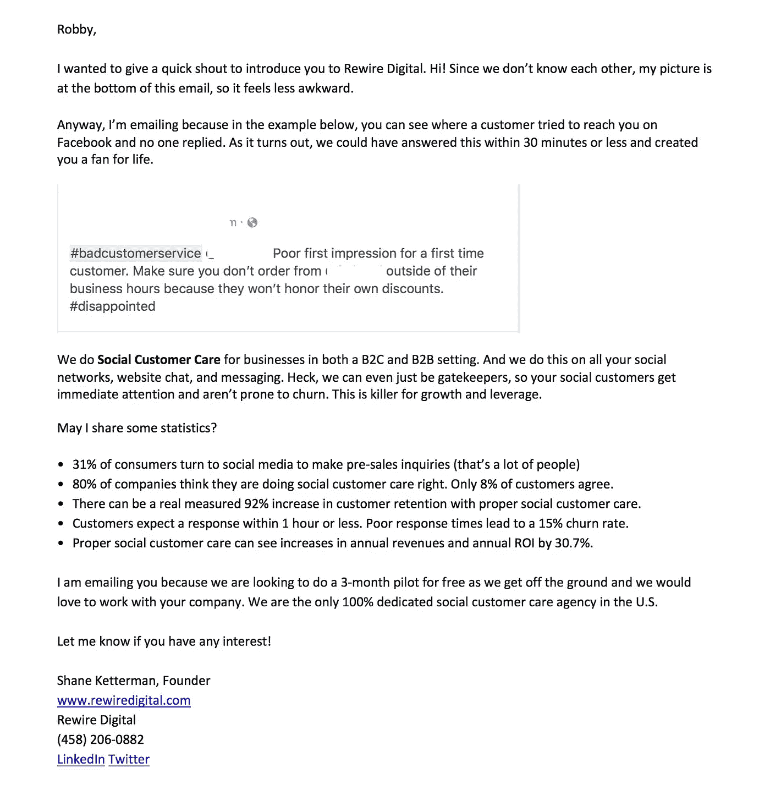

# 第 18 天:从零开始建立一个代理机构——我的新冷邮件，一些个人的东西+更新

> 原文：<https://medium.com/swlh/day-18-building-an-agency-from-scratch-my-new-cold-email-something-personal-updates-9686bcce451>

Someone Has To Steer The Ship

> 如果你是第一次接触这个内容丰富的小系列，我会公开记录一切(原始的和真实的),因为我试图建立一个高度专注的社交客户服务机构，做几份工作，处理焦虑和对未知的恐惧。

今天是第 18 天。我有一个新的冷电子邮件分享和一些更新。但首先我想分享一些个人的东西，如果你愿意的话。

我的情感智商不是很高。这意味着我很容易让很多事情影响我，很难不把事情放在心上。这不是生意上最容易处理的特点之一，因为你会有很多人从不同角度攻击你。你需要保持清醒。

我试图在这方面做得更好，但这很难。我认为情绪智商来自我们的父母，它源于自信和健康的自尊。对我来说，这些事情都来之不易，也没有在我的成长过程中根深蒂固。

我写这个是因为它很难处理，也因为它非常真实。当你阅读他们的文章，讲述他们如何通过创业赚到第一个一百万美元时，没有人会告诉你这些东西。但我会的。我一点也不为自己感到羞耻。沮丧和害怕，是的。但惭愧的是，没有。

不管是谁，我提出这个问题的原因是因为发生了一些事情。当我开始建立这个机构的时候，我并没有专注于成为一名顾问。我没有告诉全世界我是“社交客户服务”领域的顶尖专家，你们应该雇用我(谢恩)。

这对你我都很重要。

为自己工作和创业有很大的区别。是的。有。

让我们看看理查德·布兰森。他买下维珍的时候知道航空业务吗？嗯，没有。他也不打算坐在预订终端。让我们看看菲尔德太太的饼干。她没有受过正规训练，也不了解烹饪。这样的例子不胜枚举——玫琳·凯·艾施、乔伊丝·霍尔(霍尔马克)、史蒂夫·马登、华特·迪士尼。这里有一篇来自 SmallBizTrends 的文章深入探讨了这一点。

所有这些人都想创业。他们有想法和远见，然后他们得到**真正优秀的人来执行它**。这一点都没错。他们得到的真正优秀的人有经验、信誉和知识。

一方面，你可以对你想要建立的东西有一个愿景，并通过一个好的团队来帮助你实现它。

现在我不是说你不需要有什么行业知识，知道自己在说什么。你当然知道。你需要做足功课，在那个领域站稳脚跟，确保你知道发生了什么。

另一方面，你可以简单地说你想成为拥有所有经验、信誉和知识的专家。此时，你可以成为一名顾问，为自己工作。

> 这两种情况都没有错。这真的只是你需要做的一个选择。对我来说，我已经做了第二个选择，虽然成为某方面的“专家”很棒，但这只是短时间的满足。当只有你一个人时，很难扩大规模，也很难在未来销售产品。所以我选择#1。

我有一个 MBA 学位(meh)，在技术领域工作，对营销和客户关系有很强的亲和力，帮助一家初创公司建立了一个完整的客户成功部门(非常成功)，还建立了自己的内容营销业务，完全基于社交客户关怀。

我非常有信心我有资格建立这个企业。我不需要 LinkedIn 上的 5000 个人脉。我不需要推特上的数千条。我不需要整天呆在脸书。我需要的是在很多层面上了解和理解这个行业，以及如何领导人们。这些联系和所有这些都会随之而来，它们将是真实的。

有一年的时间，我休息了一段时间，所以我没有和很多不关心我或我做什么的人建立关系网。我采用的方法是拥有一个非常小且有限的网络，因为它的质量要高得多，我从中可以获得更多。

我想关注的是找到合适的人来帮助我实现这个愿景。有比我聪明得多的人可以帮助实现这个梦想。他们有信誉和经验。我有远见和领导力。

也就是说，当我思考这个问题时，我知道我需要改变一下我的方法。我需要做一些试点，这样我就可以创建一些案例研究，不仅吸引更多的客户，还能吸引真正优秀的人与我合作，而不是试图获得第一个付费客户。

完成了。

所以…这一切导致了一种更新的销售策略。我开始张贴这封新的“冷”电子邮件。它要求做一个免费的试点。它改变了一些语言。我已经发了第一条了(看我多上进？).

除此之外，我还计划做以下事情:

*   会见一些伟大的人，他们可以提供建议，我就是在这里遇到他们的
*   在 LinkedIn 上开展一场针对性很强的广告活动，招揽一些免费飞行员

这是新邮件:

New Lukewarm Email

你可能想知道我的脸在邮件底部的什么地方。当我截图的时候它被切断了，但是请放心，我的小杯子还在。

我今天还做了以下更改:

*   更新了我的商务 LinkedIn 页面
*   写了一些好内容的博文
*   修复了一个大问题，由于一些奇怪的安全问题，我无法登录脸书，所以我不得不重新创建整个事情，现在我的网站上再次运行 Messenger
*   脸书的销售前景。我用的方法和我在 Twitter 上用的一样，但是脸书有一些真正有趣的戏剧——对我来说太完美了。
*   我在我的网站和 Linkedin 上加了一条推荐

# **重新布线数字统计数据**

感受:写完这个帖子后神清气爽；支持

花费:1400 美元

发送的电子邮件:5

飞行员:0

*注意:我现在不打算指望客户，因为我想先集中精力做一些试点。*

SJK

## 这篇文章发表在[《创业](https://medium.com/swlh)》上，这是 Medium 最大的创业刊物，有 293，189+人关注。

## 在这里订阅接收[我们的头条新闻](http://growthsupply.com/the-startup-newsletter/)。

