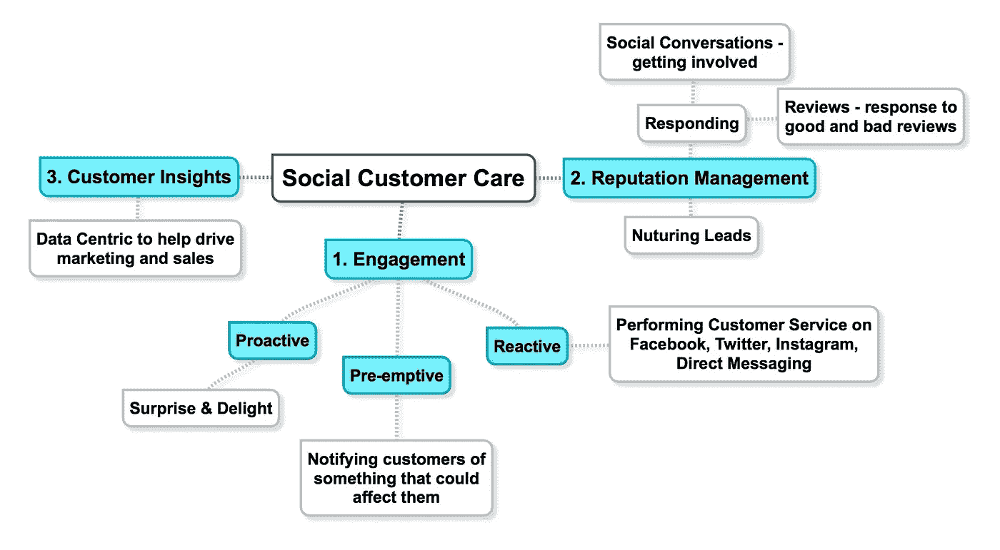
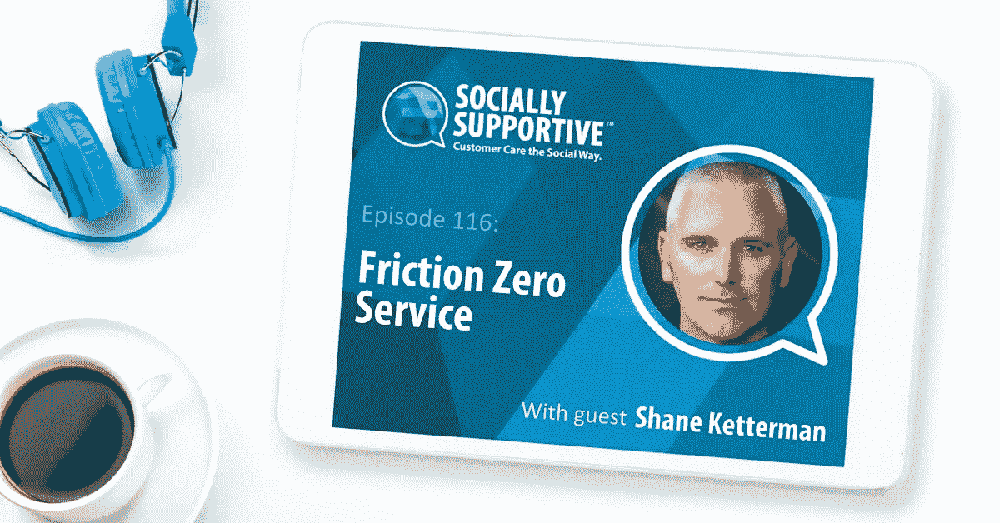

# 第 20 天:从零开始建立代理机构——丰富的销售选择和计划

> 原文：<https://medium.com/swlh/day-20-building-an-agency-from-scratch-sales-options-galore-the-plan-88b9d9da50a1>

> 如果你是第一次接触这个内容丰富的小系列，我会公开记录一切(原始的和真实的),因为我试图建立一个高度专注的社交客户服务机构，做几份工作，处理焦虑和对未知的恐惧。

这几天太疯狂了。我实话实说。我知道有些事我做得对，有些事我做得不对。我和一些优秀的媒体人有过很多交流。我思考过一些事情。我都接受了。

我了解到有很多观点。有很多经验的分享。有很多人真的愿意伸出援手。

很久以前，我希望有一个导师，我觉得我已经得到了。

事实是——这并不是不考虑任何人的建议——我需要为自己做决定，因为这才是最终真正重要的事情——除非我有一个投资的商业伙伴……在这种情况下……我会听我们俩的……哈！

有一件事最突出:

我需要专注于获得客户(大写，因为这是真的)

我需要真正定义什么是该死的社会客户服务(再次大写)

最后，我需要弄清楚我到底在卖什么

我明白了。我听到了。我知道。我感觉到了。

实际上..也许我甚至不应该花时间写这篇文章，因为我需要与人交谈。我也听说了。

所以，如果你在这条船上，感觉像我一样，那么现在我有以下选择:

*   定义什么是社交客户关怀——现在就去做
*   **获得一个客户——最好是付费客户，但只是获得一个客户**
*   完善我的服务集，以便更容易理解我的工作以及企业需要它的原因，即增加声誉管理

我想花点时间关注一下第二点。我听了很多人的意见，也聊了很多。老实说，此刻我感到非常不知所措，简直想沮丧地尖叫。不管怎样，以下是我如何实现第二点:

*   走在线路线——发电子邮件、加入小组、在 Instagram 和 Twitter 上直接发消息——基本上介绍我自己。这个类别包括我正在做的电子邮件。
*   走实体路线——我可以试着在网上寻找线索，然后打个电话，看看我是否能和某人谈谈。也称为冷打电话。
*   走上课的路线——是的，这需要钱，但我可以宣传我的课程，先开两天，看看有没有人来上课——然后我会找个场地(20 人的场地大约 200 美元),开一堂课，看看会发生什么。这有风险，成本也高，但也有潜在的好处。
*   我可以做到这三点，也许我应该这样做

**更新:**我坐下来定义了什么是社交客户关怀。老实说，我对自己的想法印象深刻。我贴在下面。

我对此感觉很好。它看起来有点乱，但是它实际上是描述 SCC 是什么和它做什么的一个很好的开始。这就是我的思维导图，现在我将在我的网站博客上写一篇史诗般的文章，用通俗的语言解释这一点，并希望有助于巩固它是什么以及为什么它是一种需要。

> 当我写这篇文章的时候，我突然想到了一件事。我害怕。我只是害怕拿起电话或者发信息。我会在这里公开承认。我怕得要死被拒绝，让自己看起来像个白痴，还有成功。是的，我完全相信我害怕某些事情真的发生。你可能不承认，但我敢打赌，阻碍我们的是对我们最想要的东西的恐惧。

所以现在我必须深入挖掘我成年后的自我，克服那种恐惧。但我公开说出来是因为这是该死的事实。我感到可悲的是，我不能像加里五世那样去粉碎它。他有我现在缺少的东西，我最好想办法找到它。

好吧——告解完毕。

另一件事是，我开始免费试用 LinkedIn 销售导航器——这真的很酷，因为我不知道我可以从线索中获得多详细的信息。现在，我需要参考我的战略，决定如何与这些潜在客户接洽。

所以现在是第 20 天。我不能在图表和计划上浪费更多的时间。我感觉不到任何怜悯或焦虑。我只需要找到一个客户，他会信任我，让我离开。

现在我正站在山脚下，感觉自己成功到达了山顶，但我看着山顶说，“我怎么才能到达那里，哪条路是正确的？，其他人是如何做到这一点的，如果我真的做到了，会发生什么？”

我有我的选择，也感谢尼克 V 分享他的短信方法。

> 我下一次更新的目标是分享我付诸行动的东西，而不是我没有的东西。

另外，我提到了我做的播客，这是我让自己走出来的另一件事。这是关于社交支持的一集。

Socially Supportive Podcast Episode 116

第 20 天并没有失败。实际上，我在让我的销售团队步入正轨方面取得了很大成就。我和灵媒们有过如此多的交流，所以我必须接受并处理这些，因为我从不低估人们愿意给予的帮助。

# 重新布线数字统计

感觉:如果我诚实、有勇气、有希望，那我就累了

花费:1400 美元(我很擅长不花太多钱)

发送的电子邮件:12 封

客户端:0

SJK

## 这篇文章发表在[《创业](https://medium.com/swlh)》上，这是 Medium 最大的创业刊物，有 295，232+人关注。

## 订阅接收[我们的头条新闻](http://growthsupply.com/the-startup-newsletter/)。

