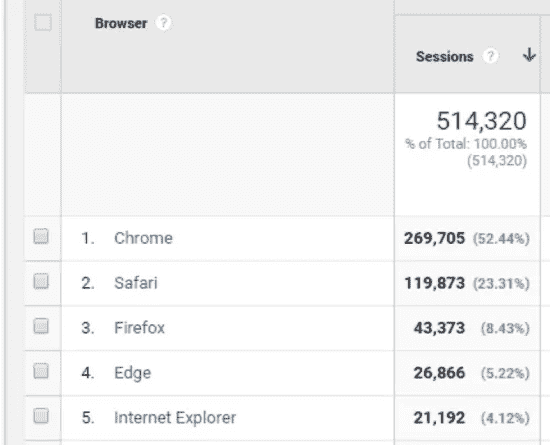
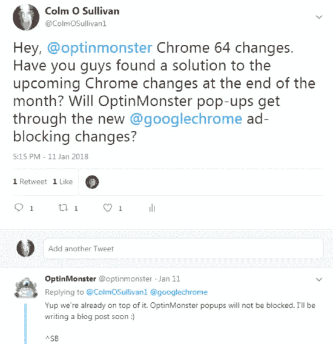

# 自动播放 vsl 和弹出窗口的清算日

> 原文：<https://medium.com/swlh/day-of-reckoning-looms-for-auto-play-vsls-and-popups-67c5b0daa824>

去年 6 月，谷歌宣布，他们的 Chrome 浏览器将从 2018 年初开始自动阻止不符合更好广告联盟(Coalition for Better Ads)设定的初始更好广告标准的广告。谷歌官方开发者博客称[2 月 15 日是弹出窗口的清算日](https://developers.google.com/web/updates/2017/12/better-ads)。

谷歌对弹出窗口和侵入性间隙窗口的打击始于 2017 年初，当时他们开始惩罚在移动设备上显示整页弹出窗口的网站，以及谷歌搜索的流量。他们现在将目光投向了自动播放视频，同时加倍努力阻止弹出窗口。

各种渠道，如 [Venture Beat](https://venturebeat.com/2017/09/14/chrome-will-no-longer-autoplay-content-with-sound-in-january-2018/) 和[谷歌官方演示](https://docs.google.com/presentation/d/1DhW29bTLkDO6JSqp_wLUyByo00nI4krQ9laGQYQEJLU/present?ueb=true&slide=id.g24637dd1e3_0_0)表明，自动播放视频政策的变化将在下周二，即 1 月 23 日 Chrome 64 推出后立即全面生效。

# 谷歌 Chrome 视频政策到底有哪些变化？

一旦 Chrome 64 推出，新的政策变化将只允许在以下条件下自动播放视频内容:

*   内容被静音，或者不包含任何音频(仅视频)。总是允许静音自动播放。
*   用户在浏览会话期间点击或点击网站上的某个地方，这意味着如果你登陆一个网站，并点击同一个域上的一个宣传片的链接，该宣传片将自动播放，如果它设置这样做的话。
*   在移动设备上，如果用户已经将站点添加到主屏幕。
*   在桌面上，如果用户经常在网站上播放媒体，根据[媒体参与指数](https://docs.google.com/document/d/1_278v_plodvgtXSgnEJ0yjZJLg14Ogf-ekAFNymAJoU/edit#heading=h.c1rqulonmckg)。

如果您的视频广告或宣传片不符合这些准则，您的视频将不会播放。

# 自动播放视频的变化将如何影响您当前的营销策略？

当您从收件箱中的电子邮件点击进入某个宣传片时，VSL 将不再自动播放，即使它被设置为这样做。我安装了新的 Chrome 64 测试版，看看被屏蔽的自动播放视频是什么样子。

这不是好消息。这里有两个 Agora 的例子，我从我的收件箱点击进入。

在上面的例子中，出现了一个黑框。没有播放按钮出现，也没有任何迹象表明你需要按下屏幕上的东西或地方来启动 VSL。

下面的例子更糟糕。没有迹象表明这一页上应该有一个视频。

这是它在现实中的样子。

受影响的不仅仅是你的电子邮件营销活动。如果你在 PPC 登陆页面或确认页面使用自动播放 VSL，它们也需要更新。有一个例外。

然而，如果你的确认页面和你的登陆页面在同一个域，你就没事了。当用户与登录页面上的域进行交互时，视频将自动播放。

但是，如果你的确认页面在不同的域上，VSL 就不会播放，你也会遇到我上面提到的同样的问题。

# 这将如何影响您的业务？

谷歌浏览器是目前最受欢迎的网络浏览器。根据 w3Counter 的数据，59%的互联网用户使用谷歌浏览器。

您可以按照以下步骤查看您的 Google Analytics 帐户，了解这些变化如何影响您的网络流量:

第一步:登录到您的谷歌分析帐户，并选择您想要查看的属性。

第二步:选择你的日期范围。

第三步:点击受众>技术>浏览器和操作系统。

在这个例子中，你的网站总流量的 52%(超过 250，000 人)会受到影响。而且那只是 12 月份的。

# 有简单的解决方法吗？

谢天谢地，似乎有。Google 开发者博客发布了一些代码，可以在任何不能自动播放的内容上放置一个播放按钮。[你可以在这里](https://developers.google.com/web/updates/2017/09/autoplay-policy-changes)查看代码片段。

# 谷歌浏览器 64 弹出窗口发生变化

从 2 月 15 日开始，Chrome 将屏蔽未能通过更好广告联盟制定的[初始更好广告标准](https://www.betterads.org/standards/)的广告。

关于这些变化，我有一些好消息。如果在搜索控制台的[广告体验报告](https://www.google.com/webmasters/tools/ad-experience-unverified)中没有通知你，这些变化可能不会影响你。

如果你的网站确实违反了这些标准，你会收到通知，你将有 30 天的时间删除任何违规广告并重新提交审批。如果你没有这样做，谷歌将阻止你网站上的所有广告，直到你重新获得批准。

***注:*** 如果看到广告体验报告的通知，[请伸手](mailto:cosullivan@readyfireaim.eu)。我在所有我们可以访问的网站上看到*还没有被评论过*。

在弹出窗口方面，我有更好的消息。我联系了 OptinMonster，这是 WordPress 网站上最流行的弹出窗口插件，他们已经确认他们的弹出窗口通过了更好广告联盟的指导方针。

如果是他们所有的弹出窗口，或者只是他们的 lightbox 弹出窗口，我不确定。他们即将发布的博客文章应该会回答这个问题。敬请关注。

如果你不使用 OptinMonster 插件，你只有不到一个月的时间来检查你的弹出窗口。做好准备！

我还联系了 Lytics，很多 Agora 团体都在他们的网站上使用它。他们的反应也是积极的，保证说 *Lytics 非常适合谷歌 Chrome changes &过滤器。谷歌将惩罚那些不加选择地使用弹出窗口的网站，但不会惩罚那些有针对性的弹出窗口，比如在 Lytics 中创建的那些。我们的首席技术官对谷歌非常友好&，所以我们在 Chrome(和 IE)* 的任何潜在问题面前保持领先。

我也问过 OptinCat 和 Ninja 弹出窗口关于他们的插件，但是他们都忽略了我。如果你使用这些插件，你可以联系 OptinCat [这里](https://twitter.com/davidhme)和 Ninja 弹出窗口[这里](https://twitter.com/arscode_pro)询问他们如何应对新的变化。

如果你的流量使用不同的广告服务解决方案，密切关注你的谷歌搜索控制台账户，并准备好在收到通知时采取行动。

# 谷歌为什么要做出这些改变？

谷歌的官方说法是，这些广告屏蔽的改变将有助于改善用户体验。他们表示，在 Chrome 桌面版上提交的用户反馈报告中，有五分之一提到了“不想要的内容”。

但是，我不买。真正的原因是，像任何企业一样，谷歌希望提高他们的底线。

通过屏蔽最令人讨厌和侵入性的广告，谷歌希望用户不要安装广告屏蔽软件，这些软件会屏蔽搜索、显示和视频上的所有谷歌广告。在谷歌宣布这些变化之前，人们预计互联网用户使用的广告屏蔽软件将达到 30%。

屏蔽一些自己的广告将意味着广告客户可用的库存将会减少，这反过来意味着你的 PPC 广告运营成本将会增加。希望这也将意味着，当你最初启动一个新的 AdWords 帐户或活动时，一些提供广告的劣质网站将不再需要被手动排除。

在谷歌增加广告收入的同时，更少的广告和更好的用户体验？

看起来对每个人都是一个胜利，除了我们营销人员。

感谢阅读。

科尔姆·奥沙利文，AIM
[cosullivan @ readyfireaim . eu](mailto:cosullivan@readyfireaim.eu)

## 这个故事发表在 [The Startup](https://medium.com/swlh) 上，这是 Medium 最大的创业刊物，有 288，884+人关注。

## 订阅接收[我们的头条](http://growthsupply.com/the-startup-newsletter/)。

