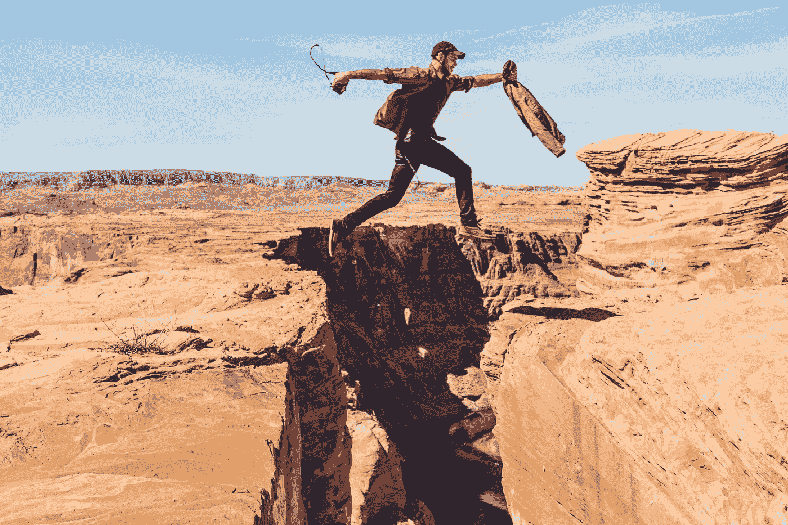
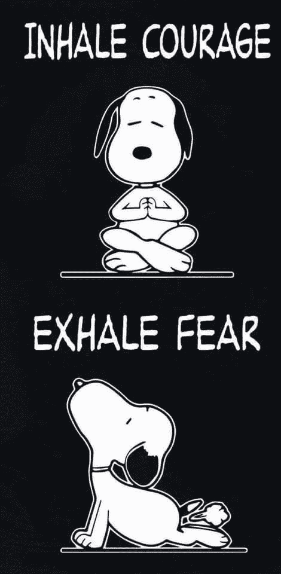
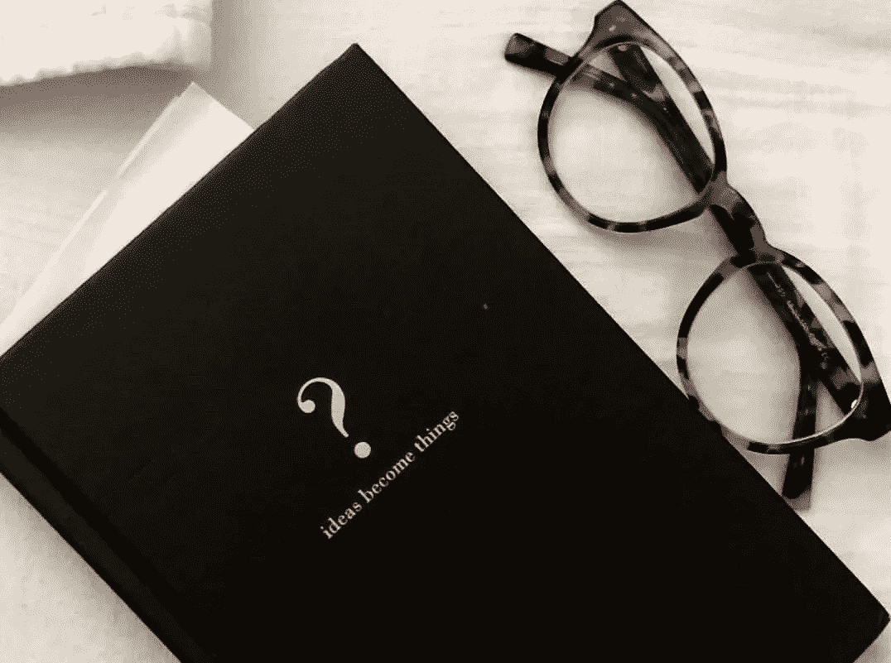
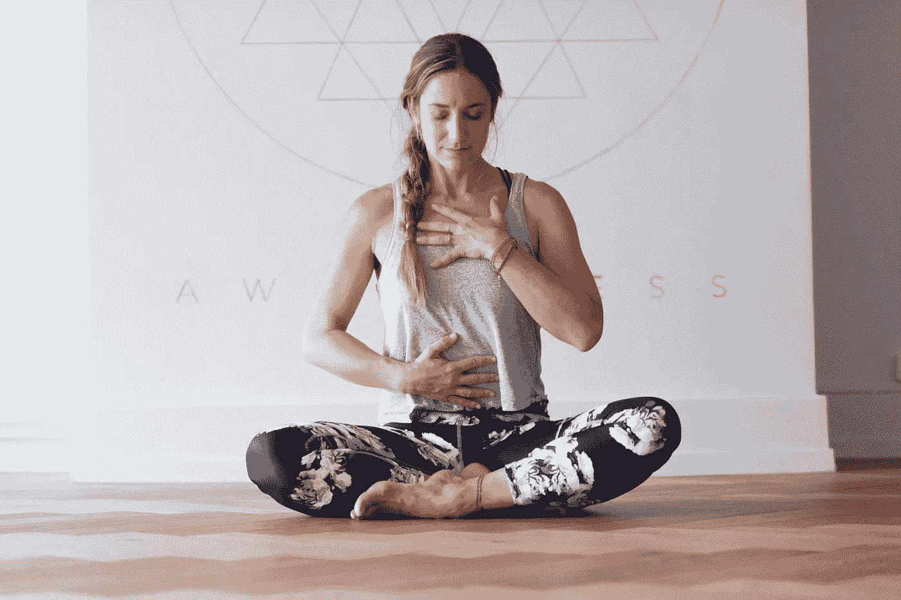
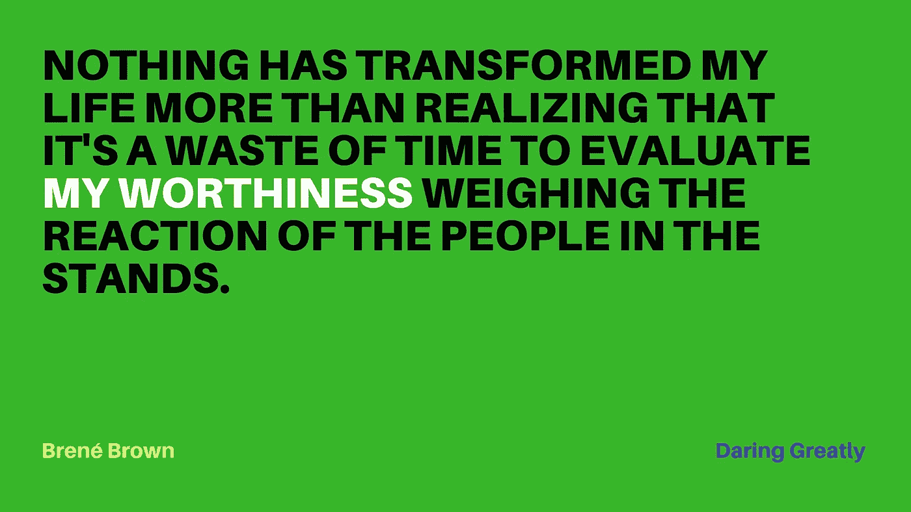
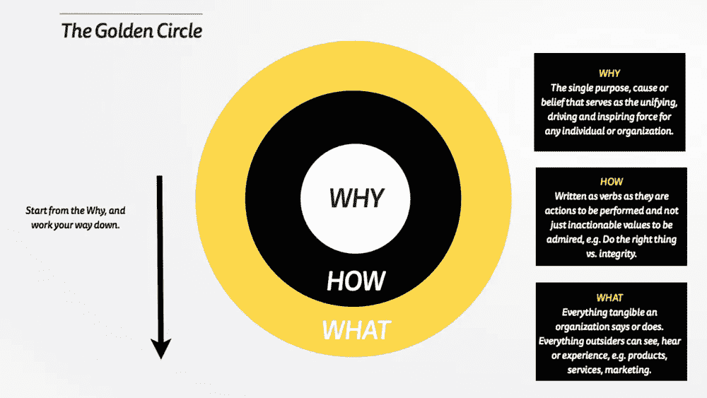
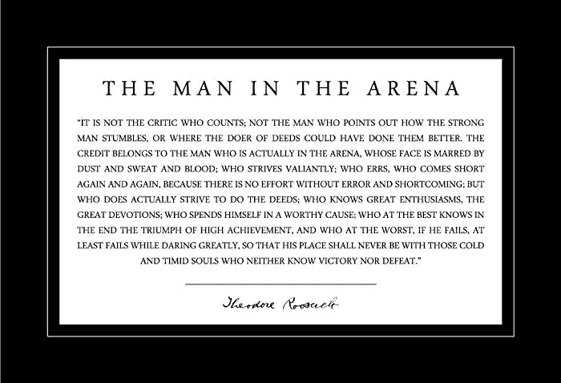

# 应对对大冒险的恐惧，无论如何都要投入进去——10 点建议

> 原文：<https://medium.com/swlh/dealing-with-the-fear-of-big-adventures-and-jumping-in-anyways-10-takeaways-956fd85a42ca>

Video Version of Article Below

三周前，我开始了迄今为止最大的冒险。我飞到秘鲁，花了三个月的时间研究、设计和制作解决方案的原型，帮助弱势学生学会在信息时代为自己和他们的社区创造价值。我的想法是，然后回家，收拾好我所有的东西，搬到那里去实施。

我为什么要这么做？好吧，回到 2016 年，我意识到我并不喜欢在我选择的主要数字营销领域工作。我做了一些反思，意识到我一直对教育充满热情——我一直认为它是我们许多社会问题的根源。当我探索社会企业家精神的原则时，我学会了如何利用我的商业和设计技能为这个领域设计解决方案，并投入其中。我有幸在我大学的创业加速器和创新中心工作，积累了惊人的经验。在我的内心深处，我知道我所学到的东西可能会对发展中的拉丁美洲产生巨大的影响，但我没有足够的勇气放弃目前获得工作签证留在美国的机会。

正如世界所愿，最终我的签证没有通过，我也没能留下来。我认为这是来自宇宙的主要信号，表明我必须去尝试一下。我已经在多米尼加共和国呆了大约一个半月，现在正在为这次旅行做准备，它让我有了很多反思。

大多数时候，我都吓坏了。

This is sort of how I feel right now: hoping my jump will make it safely to the other side. Photo by [Alex Radelic](https://unsplash.com/@alexradelich)

我很害怕，我经常感到焦虑，感觉自己不知道自己在做什么，但(慢慢地)我开始明白这是一个好迹象。这种非常不舒服的感觉似乎意味着我正在被拉伸；这意味着我正在走出自己的舒适区，开始成长。

我们总是听成功人士谈论他们生活中的这个阶段，这很令人鼓舞，但我意识到我们没有听到足够多的正在经历奋斗的人的声音。我们听不到目前敢于站出来说“我很害怕，我不知道我在做什么，但我在这里冒险尝试一下，因为我相信它。”我们听到他们的成就和里程碑，但不知道他们在整个过程中的感受，我认为我们错过了。

我们有这种赞美无畏的文化，但老实说，我开始认为这是废话。我们大多数人都不是无所畏惧的，被一群据称无所畏惧的人包围对任何人的自尊都没有帮助。我明白了，我们大多数人都是勇敢的，我认为真正令人鼓舞的是看到人们说出他们的恐惧并面对它们。

我真的很害怕，但对于任何有同样感觉的人，我想分享我迄今为止在适应这种恐惧方面学到的东西。

# 1.不要忘记呼吸

感谢[普拉诺加](https://www.pranoga.com/)带来的这一集。我知道这看起来很明显，但我从我在迈阿密的瑜伽师那里了解到，当我们紧张和焦虑时，我们会无意识地握紧自己的肚子，不让横膈膜有空间扩张，从而降低我们的肺活量。氧气的减少意味着我们大脑的氧气减少！这反过来又增加了恐慌感。所以放松，冷静，深呼吸，你会想出办法的。

# 2.大多数人也在即兴表演

我们当然会知道这一点，如果我们照我上面说的去做，如果我们更多地赞美勇气而不是无畏，我们会更多地分享这些经验，但是现在，请相信我。

我个人并没有为这种努力做好准备，但我可能永远也不会做好准备，说实话，我认为没有人会为这种跳跃做好准备，你只能在路上跳跃和学习。它的美妙之处在于，通过跳跃的行为，你看到了你不知道的事情，现在至少你知道了你不知道的事情——这比不知道你不知道的事情要好得多。这将是你不断学习和成长的指南。它会让你知道你需要研究什么课题，你需要读什么书，这将是你互动的、个性化的课程。

毕竟，我已经确信，在今天的时代，我们不应该教学生如何提供正确的答案，而是要问正确的问题……这一点你可以通过投入、制造东西……或打破它们，然后迷失方向来学习。

# 3.反思、记录、评估、重复

我一直很恐慌，因为要做很多决定，我不知道什么是正确的决定。事实是，我不会知道，直到他们的结果出来，但如果我不记录这些事情，它会更难记住并从中学习。我的日记一直是我的救命稻草，它让我客观地看待事物，并对它们进行反思，老实说，我发现我因为它在职业和个人层面上都成为了一个更好的人。以科学家进行实验的心态，分析你的结果，然后再次尝试优化！:)

My journal :)

# 4.请求帮助

我的导师总是称赞我不害怕问问题。然而，在个人领域，我在这个问题上更加纠结。对我来说，我为需要帮助来处理我的情绪而感到羞愧——这是在短时间内发生的许多生活变化，对我来说非常难以承受。一旦我分享了我的挣扎，并向亲密的朋友寻求帮助，我就被引导到了非常宝贵的资源和支持——事实证明，他们也经历过类似的情绪！

仅仅因为这是你的冒险，并不意味着你必须独自去做，或者假装你已经想好了一切。就像我之前说的，没有人真的知道，所以不要羞于寻求帮助。承认当你迷失的时候，这没什么好羞愧的，这实际上是难以置信的勇敢(和聪明！)当我们承认需要帮助的时候。

# 5.找出如何管理你的能量

我发现我在清晨最积极、最有活力，所以我试着在那时完成大部分工作。我也知道某些活动能增强我的良好能量，所以我确保我总是为它们留出时间，比如一醒来就做 15-20 分钟的瑜伽和冥想。知道什么有助于你的精力，可以帮助你不必花费太多精力去对抗消极的想法和自我怀疑。

一位智者和秘鲁主管曾经告诉我，

> “关键不是管理好你的时间，而是管理好你的精力”。

Photo by [Janet Orzechowski](https://unsplash.com/@rosalie2015)

# 6.享受现在

我发现自己如此专注于目标，确保一切顺利进行，以至于忘记了享受这个过程。记住活在当下的美妙之处在于，一旦我这样做了，它就不再是“哦，我的上帝，我在想些什么来做这件疯狂的事情”，而变成了“天哪！实际上我正在做一件我梦寐以求的神奇的事情。我其实是在努力让我想要的成为现实！”突然间，恐惧变成了感激，我对有机会追求我的梦想感到感激，而不仅仅是非常害怕。

# 7.不要把你的自我价值与结果挂钩

所以，这很有可能会让我们颜面扫地——这才是真正可怕的，对吧？失败。我有一种非常强烈的将自我价值与成就挂钩的模式；这是我努力让自己摆脱的事情之一。对我有帮助的是再次重视我所展现的勇气——为此我要感谢布莱恩·布朗。

为了准备这次旅行，我正在重读她的书[大胆尝试](https://www.amazon.com/Daring-Greatly-Courage-Vulnerable-Transforms/dp/1592408419)，这本书在 2016 年改变了我的生活。她让我思考的是，无论我成功还是“失败”，我无论如何都会成功，因为没有人能够从我身上带走那段经历和我学到的东西。最终，我变得更好，因为我敢于尝试，因为我经历过。

# 8.永远不要忽视与你亲密圈子的联系

如果不是他们，我不知道我能不能做到。有时我会“太忙”而忘记保持联系，忘记我们彼此有多依赖。这可能看起来没有什么成效，但是如果你有一个很好的亲密圈子，你会给彼此提供很好的能量，让彼此更加强大。最近，我和几个最亲密的朋友一起加入了一个读书俱乐部，最初，我的大脑告诉我，“你没有时间做这些事情了”，但我为它腾出了时间，老实说，从中获得的见解令人难以置信。

这些人会在你身边，不仅为你加油，还会帮助你，尽可能与你并肩作战。拥有它们是无价的。好好珍惜吧。

# 9.可能发生的最坏的事情是什么

我亲爱而明智的朋友塔拉·德姆伦(Tara Demren)教了我这个练习。真的很简单，只要问问自己，如果你这样做，可能发生的最坏的事情是什么。然后问问自己，能发生的最好的事情是什么。你会意识到，如果事情真的成功了，与可能发生的好事相比，可能发生的最糟糕的事情其实并没有那么糟糕。对我来说，我可能会回到我父母在 DR 的房子里，一张白纸。在我看来，我已经 23 岁了，除了我自己没有人需要支持——还有什么更好的时机去尝试这样的事情呢？

# 最后…10。别忘了你为什么要这么做

你可能已经听过无数次了，西蒙·西内克用他的黄金圈让它变得非常受欢迎，但记住这一点非常重要，尤其是在恐惧和自我怀疑可能占上风的那些日子里。

在那些日子里，我发现自己在想，当我可以利用我的关系和技能在我的祖国轻松地赚很多钱的时候，为什么我要投身于这样的事情。要约来了，诱惑总是这样。在那些时刻，我记得我为什么要这样做，我记得我有着难以置信的特权，我可以利用这种特权来保持舒适并为自己创造生活，或者我可以利用它来产生影响并确保其他人拥有与我相似的机会。

Simon Sinek’s Golden Circle Teaching to Start With Why

我问自己什么会让我感觉更有价值，并记住我的坚定信念，我已经得到了难以置信的祝福，至少我可以用这些祝福去服务别人。我还记得我以前的学生，以及当我能够看到对他们产生的影响时所经历的喜悦。那种快乐，我们几乎都在生活中寻找的快乐，是我前进的动力。

学习这一切并没有让我减少恐惧，但它确实帮助我面对恐惧，向前迈进。伊丽莎白·吉尔伯特在她的书《大魔术》中写道，当未知的结果即将出现时，她是如何应对自己的恐惧的:

> “最亲爱的恐惧。创意和我要一起上路了。我知道你会加入我们，因为你总是这样。这辆车对我们所有人来说都有足够的空间，所以请不要客气，但要明白:*在这个过程中，只有我和创造力会做出任何决定*……你可以有一个座位，你可以有发言权，但你没有投票权。不允许你摸路线图，不允许你建议绕路；你不允许篡改温度。伙计，你甚至不允许碰*收音机。最重要的是，我亲爱的老朋友，你绝对不能开车。”*

所以这就是我现在想要表达的恐惧。未来对我来说是难以置信的不确定，这不是我所习惯的，但我比以往任何时候都感觉更自我，这一简单的事情使这一切都值得。如果你正在经历类似的事情，我希望这能有所帮助。抬起你的头，这是值得的。

我们将会记录我们在秘鲁的旅程，所以我保证会让你们保持联系，并希望能在利马见到你们。

为追逐梦想和创造影响干杯。

让冒险开始吧。:)

What I read whenever I’m down.

PS:如果你想知道为什么这个项目将在秘鲁而不是多米尼加共和国进行，我的合作伙伴是秘鲁人，所以在领域专业知识方面，我们在这两个国家之间，事实证明我们在那里有更好的网络杠杆用于这种类型的项目，并且它也有更发达的社会创业生态系统，我们可以在那里找到支持。

> 如果你觉得这很有用，很有见地，请给它一些掌声，这样更多的人可以找到它并使用它。

## 这篇文章发表在 [The Startup](https://medium.com/swlh) 上，这是 Medium 最大的创业刊物，有+ 375，367 人关注。

## 订阅接收[我们的头条](http://growthsupply.com/the-startup-newsletter/)。

