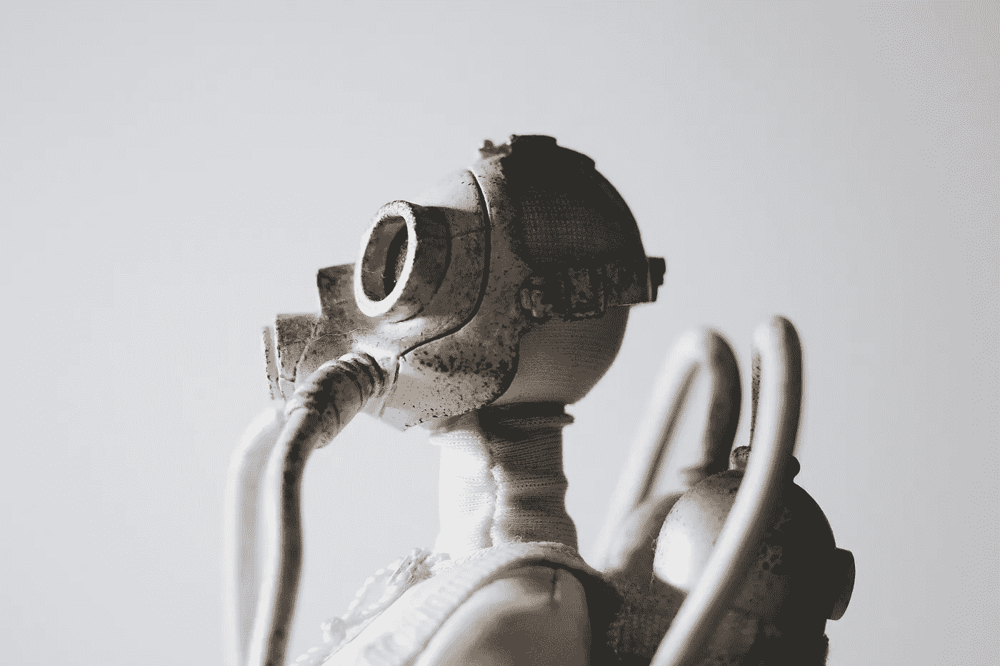
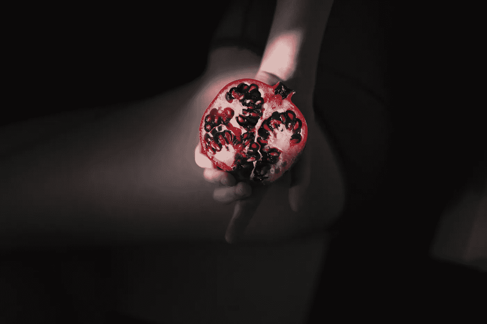

# 处理有毒的家庭成员

> 原文：<https://medium.com/swlh/dealing-with-toxic-family-members-12e3c4fabd1>

最近在我之前的博客 [*上收到一个问题，不要为了有毒的人*](https://ye-chen.com/dont-compromise-yourself-for-toxic-people/) 而妥协自己:

*“如果是你爱的人或你亲近的人，你能做些什么来避免这种毒性呢？当不可能完全避开他们时，让自己不受他们影响的最好方法是什么？”*

# 有毒仍然意味着有毒

如果你认为用“有毒”这个词来形容家庭成员听起来有点刺耳，那么当你理解他们的负面影响如何影响你的健康时，你就会明白这是有道理的。他们会用他们的操纵、戏剧、嫉妒和批评给你带来很多无意义的压力。他们耗尽你的感情，让你对自己感觉不好。

> 一些最毒的人伪装成家人来了。

我们常常对现实视而不见，尤其是在与家人和其他亲近的人打交道时。我们往往对他们持乐观态度，在 ***中抹平表面，找各种借口希望他们会改变*** 。

现在，在你得出任何结论之前，我希望你能确定你正在和一个有毒的家庭成员打交道。

# 获得清晰度

所以，我首先会推荐的是 ***获得清晰度*** 。我们需要更深入地审视自己，看看我们是否被之前事件的怨恨蒙蔽了双眼。也许我们忽略了他们伸出援手的努力，因为我们才是心怀怨恨的人。我们认为它们是有毒的或者没有能力改变。通常这是真的，但有时不是。

因此，首先要试着看清事情的真相。也许可以列一个好时光和坏时光的清单。通过把事情写在纸上，我们让自己对情况更清楚。

这里有四个真正的迹象，如果以下迹象中至少有三个与你有关，那么你的家庭成员对你是有害的。

## **1。在他们身边我感到压抑**

无论你做什么或说什么，他们都让你感觉自己很糟糕。他们的评论不会直接攻击你，但他们的本意是让你感到内疚、后悔、受伤、羞愧，并让你陷入抑郁的漩涡。

## **2。在他们身边我感到愤怒**

因为他们的所作所为、言谈举止，你很想把他们暴打一顿。这可能是他们以正常的方式行事，但这是一个自命不凡的受害者或一个真正的混蛋。和他们打交道会让你有压力。

## **3。在他们身边我感到筋疲力尽**

你爱的人让你自我感觉良好，给你能量。如果你在他们面前感到疲惫，甚至在离开他们之后，那么他们对你的健康有害。

## **4。在他们身边我不能做我自己**

一些事情正在发生，让你觉得好像你不能做你自己。当你和他们在一起时，你会觉得很奇怪，好像你是一个完全不同的人。你可能会发现自己无法畅所欲言，而你通常可以毫无问题地说出你的想法，并展示你真实的态度或行为。

# 如何处理

心理学家 Ellen Hendriksen 博士提出了三种方法来让你和一个有毒的家庭成员保持一点或更多的距离。

# 1.寻找新的参与方式

有许多方法可以控制我们与他们互动的方式，比如你可以限制群体的规模、持续时间和地点。

以下是我有时会做的事情:我只愿意在家庭聚餐时见到他/她，或者我愿意给他/她发一封电子邮件，而不是打一个长长的电话。

无论我们决定采用何种新的参与方式，也要包括建立我们可能会错过的关系的计划，比如有毒家庭成员的伴侣或孩子。

# 2.了解模式

有毒家庭成员的戏剧通常以可预测的模式出现，比如两杯酒后，或者中途关于钱的谈话。一旦你了解了这种模式，你就可以为它做好准备，以免被卷入风暴。

# 3.切断联系

我不想这么说，但只要转身离去，断绝关系。我们这样做的情况出奇的普遍，但是大多数人都把它藏起来了。很激烈，但有时这是最好的选择。这是我们必须做出的选择。不容易，但仍是一个选择。

如果我们走这条路，感到矛盾是正常的。你可能会感到极大的宽慰，但你也可能会感到悲伤或悲痛，尤其是当你拒绝亲近的家庭成员时。请记住，如果我们发现自己想念一个我们再也不想见到的人，我们并没有疯。

重要的是，在做这件事的时候，我们要用善意和支持来包围自己。 ***从来都不容易，所以不独行是有道理的。***

# 情节扭曲

坐好，因为我要说实话了。 ***有些读到这里的人，其实是关系中的有毒家庭成员。***

我们需要审视对自己的看法，然后决定我们是否是关系中的毒害者。我们可能会感到愤怒、不安、疲惫或被他人虐待，但这可能仅仅是因为我们是对他人持非常负面观点的有毒的人。

诚实会让我们对自己和家人感觉更好。如果我们能花时间诚实地面对我们对他人生活的有害影响，我们就能花时间找到解决的方法。当这种情况发生时，也许我们会意识到我们所有的关系都更有爱，更有活力，更有回报。

*原载于 2018 年 4 月 15 日*[*【ye-chen.com】*](https://ye-chen.com/dealing-with-toxic-family-members/)*。*

## 这篇文章发表在 [The Startup](https://medium.com/swlh) 上，这是 Medium 最大的创业刊物，有 317，238 人关注。

## 在这里订阅接收[我们的头条新闻](http://growthsupply.com/the-startup-newsletter/)。

