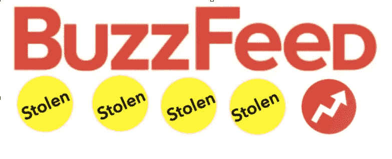
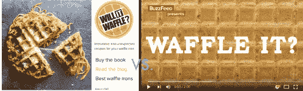
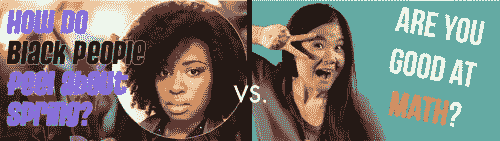
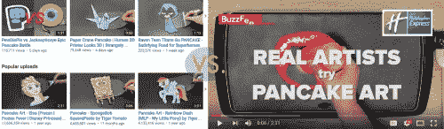
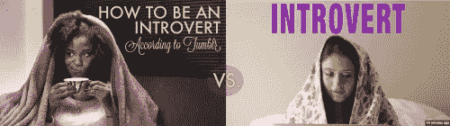

# 亲爱的广告客户:是时候停止支持 BuzzFeed 视频了

> 原文：<https://medium.com/swlh/dear-advertisers-its-time-to-stop-supporting-buzzfeed-video-10f1f423a645>

Via TashaTalksIP.Wordpress.com

作为一个土生土长的互联网人，一个成功的 YouTube 创造者，“千禧一代”，以及你的目标人群，我理解你为什么会向 BuzzFeed 的视频项目投入大量营销预算。他们的视频获得了数百万的浏览量，由于其低生产价值，很容易在紧张的时间范围内周转。我明白了。似乎值得投资。

但是 BuzzFeed 已经被发现多次从著名的 YouTube 创作者那里窃取想法、笑话、小片段、插科打诨以及金钱。我们都受够了。是时候# stopbuzghosts 了

例如，参见:

**[**它会不会华夫饼**](http://www.willitwaffle.com/) **？”vs.** [**BuzzFeed 的“你能胡扯一下**](http://t.umblr.com/redirect?z=https%3A%2F%2Fwww.youtube.com%2Fwatch%3Fv%3DbOGBH3A8Bhc&t=MjNlZTNhZDY1MWFjYjRiZWNmMjZmYWI2MTgzZjRjZDMzMjFmMjYzYyxjTmlRb3BOVg%3D%3D) **？”****

**BuzzFeed 明显抄袭了知名博客改编的书《它会胡扯吗？前提很简单。**

****

**[**明明是阿基拉的《黑人对**](http://t.umblr.com/redirect?z=https%3A%2F%2Fwww.youtube.com%2Fwatch%3Fv%3DfohA2ff_vL4&t=ZTE1MzQyOGM5NTJlM2E2Y2Q3NDRlYzI3YzQwMjUyM2MyYjQyMThjYixjTmlRb3BOVg%3D%3D) **的感觉》vs.** [**BuzzFeed 的《问一个亚洲人**](http://t.umblr.com/redirect?z=https%3A%2F%2Fwww.youtube.com%2Fwatch%3Fv%3Dn9lldH2MuUI&t=ZjdhZWI2OGUwZmVmNjhhZjUzM2U2ZDNlMzExODIzZTU4ZmI2YzE3YSxjTmlRb3BOVg%3D%3D)**》****

**2013 年，我创作了一个名为“黑人感觉如何？”我会开玩笑地回答用户代表我的整个种族提交的问题。2015 年，BuzzFeed 也有同样的想法。**

****

**[**TigerTomato 的整个频道**](http://t.umblr.com/redirect?z=https%3A%2F%2Fwww.youtube.com%2Fwatch%3Fv%3D7URzGRelIFU%26list%3DPLyCXpT2nq1cKVD8jwnroCeNqV0lHmRON6&t=MmZhYjYwZWI5ZTMyMzM1MGVmOWJjN2JmMmU1OGRiNjkwMTZlMGQ2MixjTmlRb3BOVg%3D%3D)**vs .**[**BuzzFeed 的“艺术家尝试由假日快捷酒店赞助的煎饼艺术**](http://t.umblr.com/redirect?z=https%3A%2F%2Fwww.youtube.com%2Fwatch%3Fv%3D5wTVzq3hgxg&t=MTk5YTQ2NjA2OGFhNWUwNzFkYzBlZWZjNTY5M2ZlYzUyOTk0Yzg4NyxjTmlRb3BOVg%3D%3D) **我不是知识产权律师，但我昨晚住在一家*假日快捷酒店*我发现，营销预算的任何一部分被分配给 BuzzFeed 来窃取一个本可以用更少的钱改进 TigerTomato 的想法，这真的很可耻。****

********

****[**Cut.com 的《百年佳人》**](http://t.umblr.com/redirect?z=https%3A%2F%2Fwww.youtube.com%2Fwatch%3Fv%3D-LobfkvONqs&t=NDdiZTczYWEwM2ZlMTA2ZTAwNWI5N2I1ZjQ3YzVlNzAxMGEyMWQ1YSxjTmlRb3BOVg%3D%3D)**vs .**[**BuzzFeed 的《百年风云》系列**](http://t.umblr.com/redirect?z=https%3A%2F%2Fwww.youtube.com%2Fwatch%3Fv%3DXrp0zJZu0a4&t=MzE2MzFmZWY2NTVlMzI2OGM0ZmM1OTEzYTQwOWRiZWQ0ODdlNzYyMyxjTmlRb3BOVg%3D%3D)
这些创意都是通过简单化的背景选择和字幕风格表现出来的。毫无疑问，他们是如何受到启发来创作这个系列的。也没有给出学分。****

********

****[**显然是 Akilah 的《如何成为一个内向的人》**](http://t.umblr.com/redirect?z=https%3A%2F%2Fwww.youtube.com%2Fwatch%3Fv%3Dcf851wZEmXQ&t=MDEyMGNiODkyZmIyNmVjYzg3MGE0MGU5NjE5ZWQwZDExYjUwYmE2ZSxjTmlRb3BOVg%3D%3D)**vs .**[**BuzzFeed 的《内向者的完美周末》**](http://t.umblr.com/redirect?z=https%3A%2F%2Fwww.youtube.com%2Fwatch%3Fv%3DQ64-qXsJ-6U&t=OGNjMWYwOGNmM2YxYmQ0ZTc4Njk5N2RmYjRmZTJiZmE2NjA4YWMyOCxjTmlRb3BOVg%3D%3D)
虽然如今关于内向的内容在互联网上铺天盖地，但关于内向的小品内容却出奇的少。想象一下，当一个相同的缩略图后面出现了一个与我的作品完全相同的视频镜头序列时，我有多惊讶。****

> *******这不是恶搞。这不是致敬。这不是巧合。这是 BuzzFeed 有意为之的举措，旨在破坏在线空间中独立喜剧演员、创作者和创新者的辛勤工作。*******

****除了 BuzzFeed 明显的剪切和粘贴，还有一个更深层次的问题；他们从像你们这样的公司那里赚了数百万美元，而这些公司并不知道他们的工作是欺诈性的，他们把这些钱注入他们的公司——甚至没有进入他们自己的创造者的手中。****

******杰出的黑人 YouTube Kat Blaque**[**描述了一段时间**](http://t.umblr.com/redirect?z=http%3A%2F%2Fkatblaque.com%2Fbuzzfeed-exploitation-eradication-and-exposure%2F&t=MzgwZDQ0ZTY4MGI0MTMyNGFhNjEwMmM3YmU5MTQwOGI1Y2ExOGFlOSxjTmlRb3BOVg%3D%3D) **当她和其他 LA LGBTQ 创作者收到电子邮件，被要求帮助为 BuzzFeed 视频集思广益，而不补偿他们的时间和投入。******

> ****接着，几个人加入了邮件链，我情不自禁地同意了。一个人问“我们的时间会得到补偿吗？“深入了解跨性别者免费或以极低的价格工作的频率，并创造出这些对 cis 消费有利可图的东西，但却永远看不到补偿。这是边缘化少数群体面临的压迫的延续，当你将 Buzzfeed 作为一个想法时，它会创造一种情况，作为一个几乎没有人听到声音的人，你会觉得你应该感谢甚至有这个机会。所以你愿意为很少的或免费的工作，谁会为你的故事得到报酬呢？Cis 白人男性。所以谁在乎你是否需要付房租或支付当月的药费。最后，你应该感谢这个机会，继续免费工作。当被问到这个问题时，那个跨性别的家伙说 Buzzfeed“根本没有预算”聘请顾问。对此，一位跨性别顾问同事说, ***“能够免费工作是一种特权。*******

****BuzzFeed 选择侵犯那些更具创新精神的人的知识产权，这对整个文化都有负面影响。我们并没有生活在电视的黄金时代，因为人们擅长复制视频内容，并在上面加上金发，转述对话。电视正在蓬勃发展，因为越来越多的声音被听到。随着[脸书宣布](http://t.umblr.com/redirect?z=http%3A%2F%2Fwww.techradar.com%2Fnews%2Fworld-of-tech%2Ffacebook-is-about-to-shake-up-your-timeline-again-1324143&t=MmM5NWVkNjIyMGQ5ODRiYThiNTIxOWU4OTkwZTUzYmIyMWFiZDI1OCxjTmlRb3BOVg%3D%3D)其算法将开始优先考虑家人和朋友的帖子，而不是品牌和粉丝页面的帖子——现在是将预算投资于有才华、品味和能力的个人的最佳时机。****

> ****年轻人不应该为了 BuzzFeed 的创造性破产计划而廉价或免费工作，或者让他们的视频被盗。没有人应该为了曝光而工作。人们死于暴晒。****

****你不认为你的数百万美元会更好地花在 YouTube 上有观众和潜力的年轻创作者的原创内容上吗？你知道如果你付给 50 个顶尖的创作者 2 万美元，而不是给 BuzzFeed Motion Pictures 那些没有才华、薪酬过低的员工盲目投资 100 万美元，你的投资会得到多少回报吗？****

******当你停止支持构成 BuzzFeed 电影公司的掠夺性内容窃贼时，如何花掉你省下的所有钱的建议:******

****担心很难找到合格的内容创作者来代表你的公司？尝试与 YouTube 和人才机构合作，以获得合格的独立创作者。直接面向创作者激励了媒体巨头，如英国民航局、UTA、ICM 等。，与数字人才签约，并通过法律团队保护他们，法律团队可以审查合同，并确保他们的想法得到保护和补偿。**如果你想要我们的品牌忠诚度，你需要对我们忠诚。******

****通过继续支持 BuzzFeed video，你是数百名千禧一代知识产权反复被盗的同谋。就当这是我们给 BuzzFeed 视频部门的集体停止信吧。我们不会因为 BuzzFeed 的规模或覆盖范围而退缩。我们拒绝让他们创造性的破产商业模式成为新的现状。BuzzFeed 依靠无偿的年轻人才繁荣的时代已经结束。****

********