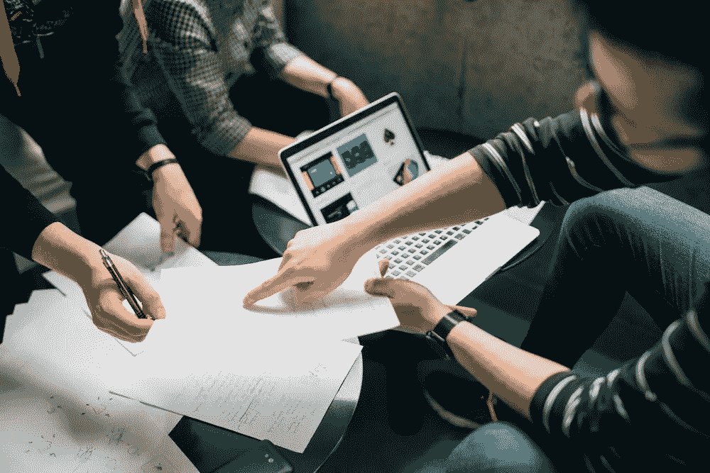
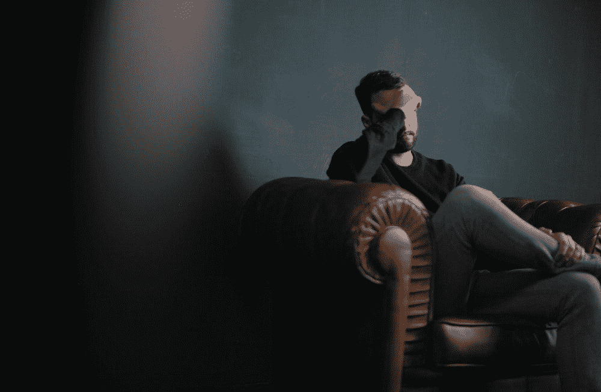
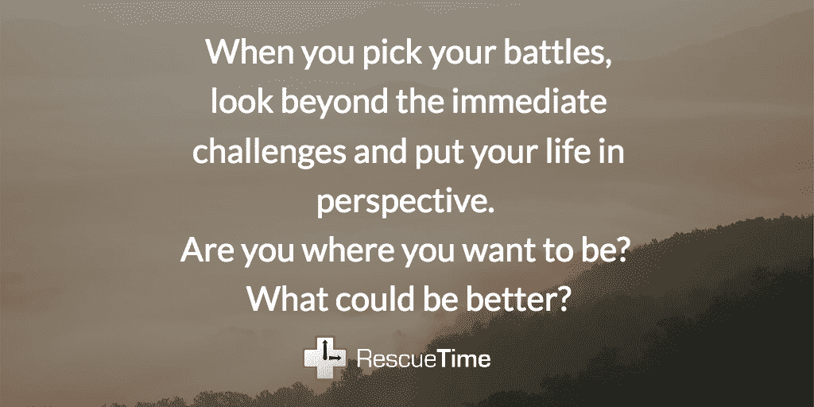

# 决策疲劳:它是什么，它是如何扼杀你的注意力、动力和意志力的

> 原文：<https://medium.com/swlh/decision-fatigue-what-it-is-and-how-its-killing-your-focus-motivation-and-willpower-468d17c659fc>

## 选择你的战斗。其余的自动化。

你一天会打开多少次新的浏览器标签来快速搜索某样东西？或者漫不经心地查看邮件或即时消息？在 Reddit 或脸书(或 Medium)上跳来跳去怎么样？)就一分钟？

10 次？20?100?

在分析了[2017 年](https://blog.rescuetime.com/225-million-hours-productivity/)超过 2.25 亿小时的工作时间后，我们发现**平均用户每天在任务之间切换超过 300 次**(而且这只是在工作时间！)

这种程度的环境转换不仅会分散我们的注意力，而且每个转换任务的决定都会一点点侵蚀我们的意志力。最终，我们遇到了所谓的**决策疲劳**:我们缺乏精力和注意力导致做出糟糕的决策。这是一个问题。

我们的职业越来越依赖于做出正确的选择。通过了解决策疲劳以及我们如何应对它，我们可以确保我们一整天都在 100%地工作。

# 什么是决策疲劳？

简而言之，决策疲劳是指在长时间的决策后，我们做出好的决策的能力下降。

换句话说，**你需要做的决定越多，你就越不善于权衡所有选项，做出有根据、有研究支持的选择。**

这里有一个例子:在一项研究中，研究人员查看了美国法官做出的 1100 多项假释听证决定。他们发现，对某人是否获得假释最有影响的因素不是他们的罪行、背景或刑期。但是他们的案子是什么时候审理的。

> 清晨出现的囚犯获得假释的几率约为 70%，而当天晚些时候出现的囚犯获得假释的几率不到 10%

无论你多么理性或明智，你都无法在不付出精神代价的情况下做出一个又一个决定。与我们有意识意识到的身体疲劳不同，决策疲劳经常在我们不知道的情况下发生。

我们只是累了。或者[烧坏](https://blog.rescuetime.com/burnout-syndrome-recovery/)。我们已经不在乎了。给我们什么都行。

或者，正如斯坦福大学的乔纳森·莱瓦夫解释的那样:

> “决策疲劳有助于解释为什么通常理智的人……无法拒绝经销商为他们的新车做防锈处理的提议。”

# 决策疲劳不仅仅来自太多的选择

决策疲劳是社会心理学家罗伊·f·鲍梅斯特所说的“自我损耗”的一部分或者说，这个想法:

1.  你的意志力有限，所以当你用尽意志力时，你会做出糟糕的选择
2.  长时间工作或被迫做出多个复杂的决定会更快地耗尽你的储备

我敢肯定，你已经感受到那些时刻，当你的能量水平很低，几乎不可能做出明智的选择。在这一点上，似乎很明显我们已经耗尽了一些有限的认知资源。然而，事情没那么简单。

已经有[大量研究](https://hbr.org/2016/11/have-we-been-thinking-about-willpower-the-wrong-way-for-30-years)无法验证决策疲劳的影响。[尤其是斯坦福大学心理学家 Carol Dweck 最近的一项研究](https://news.stanford.edu/news/2013/august/willpower-study-sugar-082713.html)甚至发现，简单地相信你有更多的意志力可以提高你做出正确选择的能力，即使你很疲劳。

“我们并不是说人们在紧张的工作中不需要燃料，他们只是不需要持续不断地消耗燃料，”德韦克解释道。"人们手头拥有的资源比他们想象的要多得多。"

那么，如果决策疲劳是我们可以积极应对的，那是怎么做到的呢？

# 如何保护自己免受决策疲劳，做出更好的选择

如果你的工作意味着不断做出决定和复杂的权衡，你一定会精疲力竭，并在某个时候开始做出糟糕的选择。

仅仅说“不要相信你累了”并让一切变得更好是不够的。

相反，我们需要寻找抵消导致决策疲劳的所有因素的方法——从保护我们的注意力和意志力，到确保我们一整天都精力充沛。

# 1.简化你一天中需要做的选择

前总统奥巴马在椭圆形办公室的 8 年里只穿蓝色或灰色的西装。史蒂夫·乔布斯以他的高领毛衣和蓝色牛仔裤制服而闻名。

他们有限的衣柜背后的想法很简单:一天中有这么多重要的决定，为什么要从决定穿什么开始呢？

就像士兵的制服一样，奥巴马和乔布斯决定在日常生活中简化一些最基本的决定。

对其他人来说，这可能意味着每天在同一个地方工作，遵循严格的常规，或者有固定的每周饮食计划。通过减少你每天做决定的数量，你为重要的事情腾出了空间。

詹姆斯·克莱尔称之为四燃烧器理论。想象你的生活是一个标准的火炉。每个燃烧器代表了它的不同方面:你的家庭、朋友、健康和工作。正如詹姆斯解释的那样:

> *“为了成功，你必须切断你的一个燃烧者。为了取得真正的成功，你必须砍掉两个。”*

归结起来就是 [**选择你的战斗**](https://blog.rescuetime.com/weekly-roundup-find-your-purpose/) 。如果你的时尚和外表对你来说是重要的日常决定，那就花精力在这上面。如果你想一整天都吃得健康，那就放弃这个决定，每周吃同样的东西。

选择你想投入精力的决策，并简化或自动化其余的决策。

# 2.为当天早些时候设定诚实的优先事项

就像那些更有可能在当天早些时候批准假释的法官一样，你做出艰难决定的最佳时间是你刚开始的时候。

把你最重要的事情安排在一天中的第一件事上——无论是做一个个人项目，完成一项艰巨的任务，还是处理你一直拖延的事情。

我发现一个特别有用的技巧是把我每天的待办事项限制在 5 件以内，并在前一天晚上写下清单。

这样，我被迫优先考虑最需要我的注意力和精力的事情。复杂的任务排在前三位，剩下的时间里会有更多“无意识”的任务。

# 3.关注动力，而不是意志力

决策疲劳让我们感到失控。围绕任务建立动力是找回控制感的最快方法之一。如果你能把相似的任务串在一起，你就不太可能不得不“做出开始的决定”

心理学家称之为蔡加尼克效应。一旦我们开始一项任务，我们的大脑就会沉迷于完成它。

最简单的例子就是欧内斯特·海明威总是在写作当天的中间句子结束:

> “最好的方法是，当你进展顺利，并且知道接下来会发生什么时，总是停下来。如果你每天都这样做…你将永远不会被卡住…
> 
> “这样你的潜意识就会一直为之工作。但如果你有意识地去想它或担心它，你就会扼杀它，在你开始之前，你的大脑就会疲劳。”

想办法在一天中建立自己的动力。要么以海明威为榜样，要么将类似的任务安排在一起，然后使用[5 分钟](http://blog.rescuetime.com/5-minute-productivity-hacks/)法则来克服开始时的摩擦。

# 4.当你的动力和意志力很强时，锁定重大决定

不要被你不断变化的能量水平所影响，在你能量最高的时候锁定关键的决定。

例如，你可以在周日准备饭菜，以确保你不会在一周内做出糟糕的饮食决定。或者，你可以使用 RescueTime 的 [FocusTime](https://www.rescuetime.com/focustime) 设置预定的工作时段，自动[屏蔽社交媒体或新闻等分散注意力的网站](https://blog.rescuetime.com/getting-the-most-out-of-rescuetimes-website-blocking/)。

我发现特别有效的一件事是设定一个每天早晨第一件事的聚焦时间。这样，我至少可以完成 1.5 个小时的工作，而不会被社交媒体分散注意力，也不会在网站和应用程序上浏览早间新闻。

最精彩的部分？通过提前安排，我不必在那一刻做决定。

# 5.利用午睡的力量

研究发现，午睡就像我们大脑的赞博尼——清除堆积的粘液。

这要归功于研究人员所谓的[“管家理论”当我们睡觉时，我们的大脑删除了神经元之间的一些连接，为我们醒来时遇到的任何新信息腾出空间。](https://www.thecut.com/2016/07/taking-a-nap-is-like-letting-marie-kondo-loose-in-your-brain.html)

如果你正感受到决策疲劳的影响，小睡一会儿有助于重新调整你的思维空间。你不会满载而归。但是你更有可能做出更好的决定，至少有一点。

如果我们一天中在[网站和应用](https://blog.rescuetime.com/225-million-hours-productivity/)之间切换的次数说明了什么，那就是我们的生活越来越充满了微小的决定。

忙碌是有代价的。我们面临的选择越多，就越有可能成为决策疲劳的受害者。为了做出好的选择，我们需要倾听我们的想法，意识到我们的能量已经下降，并做出相应的反应。

对意志力如何影响我们做出选择的能力有一点了解，对确保我们做正确的工作大有帮助，而不仅仅是当时最容易的事情。

由[斯特凡·斯特凡·契克](https://unsplash.com/photos/UCZF1sXcejo?utm_source=unsplash&utm_medium=referral&utm_content=creditCopyText)拍摄

# 嘿，我是乔里！

*我帮助公司和有趣的人通过聪明和专注的写作讲述他们的故事。想和* [*一起工作*](http://jorymackay.com) *？在 hello@jorymackay.com 给我发邮件*

*本帖的一个版本最初发表于 2018 年 2 月 1 日的* [*改版博客*](https://blog.rescuetime.com/decision-fatigue/) *。*

## 这篇文章发表在 [The Startup](https://medium.com/swlh) 上，这是媒体最大的创业刊物，拥有 292，582+人关注。

## 在这里订阅接收[我们的头条新闻](http://growthsupply.com/the-startup-newsletter/)。

