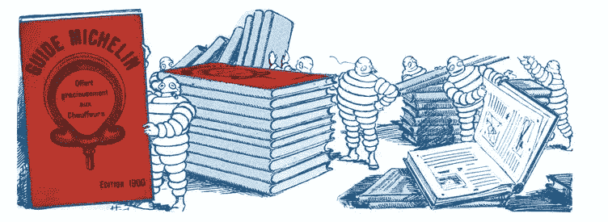
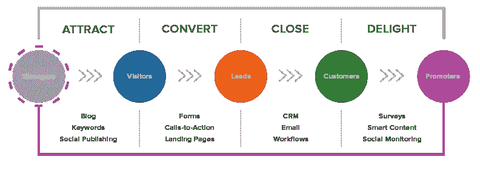
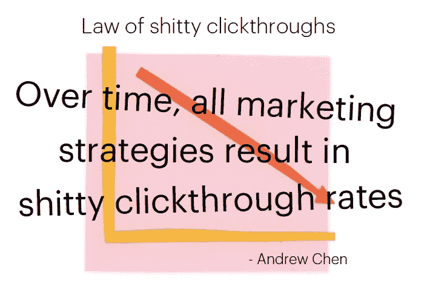
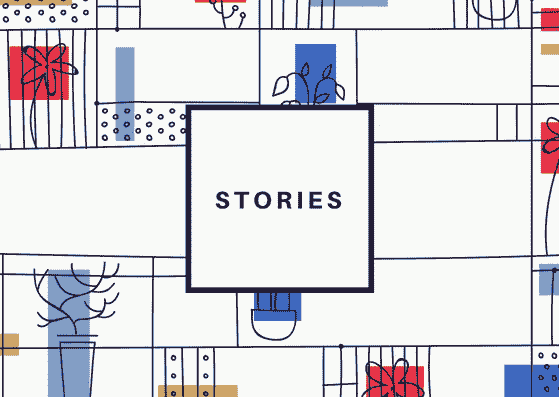
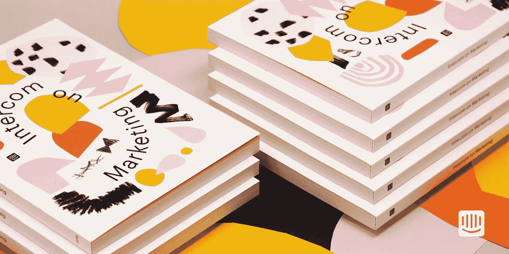
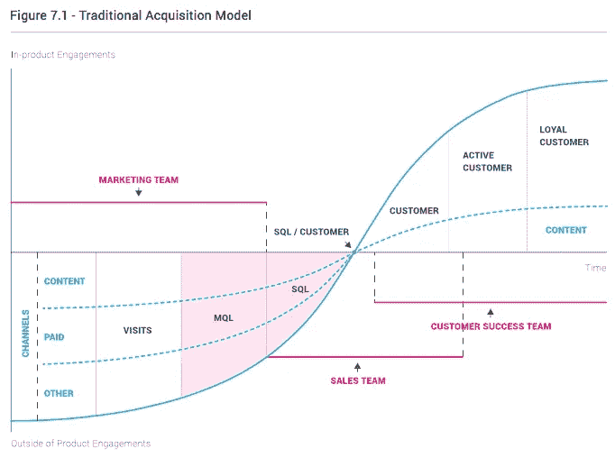
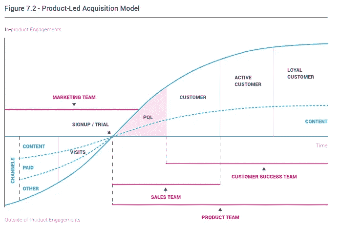
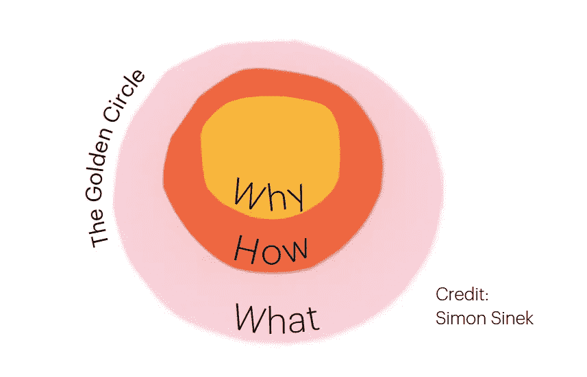

# 解构内容营销

> 原文：<https://medium.com/swlh/deconstructing-content-marketing-d1e3c9718d6e>

科技公司多年来采用的内容策略的杰作。

Photo by [Steve Johnson](https://unsplash.com/photos/eVaxJVA2zHI?utm_source=unsplash&utm_medium=referral&utm_content=creditCopyText) on [Unsplash](https://unsplash.com/search/photos/abstract?utm_source=unsplash&utm_medium=referral&utm_content=creditCopyText)

*与* [合作撰写*马克西姆·拉格雷斯勒*](https://medium.com/u/c0e76647a4ae?source=post_page-----d1e3c9718d6e--------------------------------)

在 SaaS 革命开始蓬勃发展之前，软件公司曾经是令人难以置信的销售驱动型，他们关注的过程是简单的老派——积极地与客户接触，围绕产品进行有说服力的讨论是众所周知的标准。

销售意味着陷入价格战，花更多的时间试图说服潜在买家了解产品的功能，而不是实际提出想法和解决方案。

不要误解我。一个销售团队想要，嗯，销售一个产品，这没什么不寻常的，但是对于任何公司的以功能为中心的销售来说，这肯定不是什么灵丹妙药。

在之前和之后的场景中，团队接近客户的方式紧密围绕着一种倾向，即在没有真正理解潜在客户的“工作经历”或任何业务背景的情况下，满足每一个功能需求。

但让我们快进到五年后，近距离接触一个完全不同的场景，在这个场景中，SaaS 世界开始发生巨大的变化，并开始通过采用集客营销作为核心战略来重新发明车轮。

这是整个行业开始努力推动销售线索生成的时刻；但是集客营销成为传奇的真正原因显然是因为许多公司看到了破碎的销售流程的裂缝，并选择告别他们的旧销售流程。

从那时起，更多的初创企业开始围绕“可持续发展”、“教育”、“意识”和“赋予客户权力”等热门词汇建立自己的战略，然而，主要问题仍然是这个框架能成功多久，如果不能，为什么不能成功？

# 集客营销的简史

Credit: Michelin Guide

现在，让我们稍微停顿一下，回到开头。更好的是，让我们回到 1900 年，米其林兄弟构思出《米其林指南》作为客户服务工具和营销策略的时候。

举个例子，《米其林指南》被认为是美食的权威声音，但实际上，该指南是由一家法国轮胎公司作为销售轮胎的营销策略而推出的。

虽然轮胎和内容似乎并不一致，听起来可能很奇怪，但这可能是第一次一家公司将集客营销作为吸引客户的策略。

当时，为驾车者编写一本指南是非常明智的，其中包括最好的酒店和餐馆的信息，因为它最终会鼓励人们进行更多的公路旅行，从而增加对汽车的需求。

结果,《米其林指南》被设计成了一份免费赠品(在今天的数字世界里，这相当于一本免费的电子书),最终成为该公司在未来几十年里使用的营销手段。

底线是，仅仅因为该公司的价值主张是销售轮胎，这并不意味着他们必须为汽车修理工制作内容，并制作如何修理汽车的指南。

简而言之，一家销售某种产品的公司并不能定义他们的整体形象——正因为如此，米其林兄弟通过提供有用的内容来强化他们的品牌，从而设计出成功的增长战略，这确实证明了他们的创新性。

事实是，产品只是起点，我们的想法是用它作为参考来识别你的受众，了解你如何解决他们的挑战，并专注于为他们的生活增加价值——就像米其林指南一样。

# 集客营销是 HubSpot 的创意

Inbound marketing methodology by HubSpot

在同样的前提下，两位美国企业家 Brian Halligan 和 Dharmesh Shah 于 2006 年创办了一家名为 [HubSpot](https://www.hubspot.com) 的公司。在一个数字破坏的时代，HubSpot 开始作为一个营销中心，其目的是识别潜在市场，并为企业带来新的线索。

集客营销短语的概念是由 HubSpot 的联合创始人兼首席执行官布莱恩·哈利根提出的，随着数字世界的蓬勃发展，它在 2012 年才真正开始增长。

从那时起，HubSpot 方法已经激励了成千上万的营销人员和企业——成为该领域的先驱，并推动无数公司实施同样的增长战略。

为了理解集客营销的作用，下面是该公司网站上的定义。

> 集客营销就是创造有价值的体验，对人们和你的企业产生积极的影响。你是怎么做到的？你通过相关和有用的内容吸引潜在客户和顾客到你的网站和博客。
> 
> 一旦他们来了，你就使用电子邮件和聊天等对话工具，并承诺持续的价值，与他们进行交流。最后，你通过继续扮演一个有同情心的顾问和专家来取悦他们。
> 
> 与外向营销不同，有了内向营销，你不需要去争取潜在客户的注意力。通过创建旨在解决您的理想客户的问题和需求的内容，您可以吸引合格的潜在客户，并为您的业务建立信任和信誉。

不足为奇的是，这种方法已经被从初创企业到中小企业再到大公司的各种公司普遍采用。但是 2018 年，是不是变得太吵了？

Andrew Chen reinforcing that today’s marketing strategies are broken. Credit: Intercom

根据内容营销研究所的研究，只有 42%的 B2B 营销人员说他们在内容营销方面是有效的。这意味着内容营销者想要的和他们实现的之间仍然有很大的差距。

没错，传统广告已经不起作用了，这不是因为人们不再购买产品，而是因为购买过程发生了巨大的变化。

不言而喻，在这个时代，精通数字的消费者不再消费广告，而是努力根据研究和教育内容做出更明智的购买决定——但内容必须有质量、创新和价值。

# 内容，然后是营销——为什么内容很重要

如果我们把信条放在一边，看看数据，数字也能说明问题。在 2018 年关于内容营销的 NewsCred Insights 文章中，作者强调，“人们希望从品牌中获得内容，根据哈瓦斯集团 2017 年有意义的品牌研究，84%的人希望品牌创造内容。”

理论上，数字确实证明了这一点。人们愿意通过消费品牌的内容来参与其中(并信任它们)。但是内容需要讲故事。

为什么讲故事在这种营销策略中起着如此重要的作用，是因为从本质上讲，人类已经讲了几千年的故事——所以出于进化的原因，讲故事已经根植于我们的 DNA 中。

现在我想稍微离题一下，因为最近我读了尤瓦尔·诺亚·哈拉里的三部曲(智人、德乌斯人和 21 世纪的 21 件事)，并了解到从历史上看，人类总是创造神话并生活在双重现实中，以获得灵活性并以可持续的方式合作。

进化教会了人类通过故事来生活，这是完全有道理的——今天，这一过程继续转化为我们的日常生活、工作，并最终转化为我们赋予品牌独特声音的方式。

> 我们的大脑天生就会寻找故事，这就是为什么内容仍然是与你的观众联系的最佳媒介。

但是回到市场营销领域，我们确实可以看到数量惊人的公司通过以我们能想到的每一种可能的形式创造内容来接管互联网。

尽管这可能令人不知所措，但仍然可以肯定地说，围绕思想领导力构建的内容战略对于组织来说仍然至关重要，可以通过教育目标受众了解行业趋势、新战略和策略来推动意识和需求，从而使他们的业务更加成功。

但棘手的问题依然存在:如何在如此拥挤的市场中脱颖而出？

# 但是首先，读者们

Credit: Intercom

就从头开始构建内容而言，我指的是 [Intercom](https://www.intercom.com/) ，这是一个很好的例子，它激励了世界各地的内容营销人员围绕以下营销原则制定一个可靠的战略:

*   **内容，然后营销**
*   **与编辑原则一起成长**
*   **与品牌相关(有见解)**
*   **永远不要忘记真正的目标**

我个人很欣赏这种方法，因为我已经意识到，有大量的品牌内容是不可靠的，只是为了产生潜在客户而创建的。因此，如果公司只是为了这个唯一的目的而创作内容，就很难获得你的观众的信任。

另一方面，通过专注于增加价值的优质内容，公司可以赢得观众和媒体的信任。但是，要想脱颖而出，成为一个行业的首选资源，内容主张需要更多地融合新闻、故事、数据和思想领导力。

还是那句话，让我们看看 Intercom 如何在内容营销上胜出。

我们知道一个事实，他们的内容营销很大程度上取决于 Intercom 的产品团队正在做什么，这使他们成为一个**产品第一的公司。**

基本上，Intercom 的团队避免使用博客(指个人帖子)和电子书(书就是书)这样的短语，因为他们觉得这样会贬低他们所提供的东西的价值。

Intercom 的内容总监约翰·科林斯说，如果你“把内容和营销结合起来，你会进一步破坏你所创造的东西。”

显然,“这句话暗示了整个练习的要点，或者至少是最主要的要点，就是营销。但如果你想吸引人们购买你的产品，这是错误的做法。”

因此，很明显，与集客营销相反，产品导向的方法意味着你最好有一个解决许多客户痛点的杀手级产品，你的内容应该由它来决定。

正如本文引言中所提到的，在过去，许多顶尖的 B2B 软件公司只是简单的销售主导型公司。几十年后，市场主导的公司取得了巨大的成功，但今天，是产品主导的公司(PLC)获得了发展势头。

为什么？因为一个伟大的产品可以增加一个公司的留存，降低客户获取成本。

上市公司有不同的参与方式:

*   **产品是分销媒介**
*   **产品是竞争优势**
*   **产品是顾客忠诚度的驱动力**

正如 Maxime Lagresle 在关于增长收购战略的文章中所写的，第二代 GAS，也称为产品导向战略，在这一发现之后出现，以帮助增长战略家专注于任何早期公司的正确结果。

假设你是一家初创科技公司，你确信你的产品脱颖而出，本质上是一款好产品。虽然这种姿态不能保证任何成功，但在这种情况下真正有帮助的是利用这种竞争优势。

因为一个好的产品最终能做到的，是在降低客户获取成本的同时，增加一个公司的留存。这就是为什么产品导向战略有不同的参与方式。该产品立即成为分销中心，同时也是顾客忠诚度的驱动力。

为了更深入地探讨这个话题，在他们写得很好的书[用产品导向战略](https://intrinsicpoint.com/mastering-product-experience-in-saas-with-product-led-strategy-d190b7e0057b)掌握产品体验(在 SaaS)中，Aptrinsic 的团队漂亮地描述了这个战略:

> 产品导向的走向市场战略是一个行动计划，描述了公司如何获取、保留和发展客户的可重复和可扩展的流程，由产品内客户行为、反馈、产品使用和分析驱动。

现在，让我们根据 Aptrinsic 团队的图表，来看看产品导向战略(第二代— GAS)与传统收购模式(第一代— GAS)的来龙去脉。

1.  **传统收购模式(第一代天然气)**

遵循这种方法的公司在整个客户生命周期中都有三个团队参与。首先，营销团队负责通过使用各种渠道和各种内容为销售团队提供一定数量的线索。在生成的潜在客户数量中，营销团队根据预定义的标准进行第一次选择。

然后，符合这些要求的销售线索被转移到营销合格销售线索(*又名* MQL)桶中，这是销售团队的起点。负责 MQL 的新团队的第一步是按照新的标准重新审核他们，以便更精确地确定他们是否可以成为客户。这个较短的销售线索列表被称为销售合格销售线索(*又名* SQL)。

然后，销售团队负责完成该列表中的一定数量的交易。通常在这最后一步中，SQL 通过销售团队制作的现场演示对产品有了初步了解。最终，客户成功团队接管了与客户的合作。

Credit: Mastering Product Experience by Aptrinsic

这种传统的收购模式仍被许多公司使用，其优点是定义了一个清晰的流程，说明如何在内部处理潜在客户的产生。然而，这种方法的主要问题是它忽略了用户体验。

这种模式无法提供积极的用户体验，主要是因为长时间发生在产品之外。这种“产品项目之外”的旅程是潜在客户产生摩擦的重要原因。

在我们今天生活的实时世界中，即时性已经成为一种规范，对于任何对产品感兴趣的领导来说，不能立即动手是非常令人沮丧的。

相反，一个仅出于信息目的下载了一本电子书(或公司的任何其他内容)并正被销售人员联系的销售线索也会有这种不满意的感觉。

在潜在客户心中，这两点挫败感可以概括为:“别告诉我，让我试试！”

最后，这一过程还会产生内部挫折感和抱怨，这通常是在营销和销售团队之间就所传递的线索的质量而产生的。

**2。以产品为导向的收购模式(第二代——天然气)**

与传统的获取模式相比，产品导向的获取模式从客户生命周期的最开始就以最大化用户在产品内部而不是外部花费的时间的方式形成。使用这一流程，公司可以根据关键的产品内行为数据，而不是来自产品外部的有偏见的数据，大幅提高其销售线索资格的质量。

实施这一战略需要增长团队密切关注客户生命周期，目的是尽可能缩短销售线索访问其产品的时间。

Credit: Mastering Product Experience by Aptrinsic

如前所述，第一代 GAS 在整个客户生命周期中涉及三个团队:营销、销售和客户成功。在第二代 GAS 中，除了其他三个团队之外，产品团队也参与其中。

简而言之，以产品为导向的采购模式引入了一个新的概念，取代了之前的 MQL 和 SQL。确认销售线索的新方法发生在产品内部，称为产品确认销售线索(*又名* PQL)。

> 符合产品条件的潜在客户(PQL)是指根据产品兴趣、使用情况和行为数据签约并展示购买意向的潜在客户。—通过产品导向战略掌握产品体验(在 SaaS)

这种变化对客户生命周期和团队内部的影响比乍一看要大得多。首先，在内部，这种方法要求团队跨职能工作，因为他们的行动范围不像在第一代 GAS 中那样明确，在第一代 GAS 中，销售和营销团队拥有自己的客户生命周期部分。准确定义 PQL 需要营销、销售和产品团队通力合作。

其次，客户生命周期受到这种模式的高度影响。潜在客户在产品之外花费的时间显著减少，因为主要目标是让他在旅程中尽早注册产品或免费试用。

不再需要填写销售线索表格来获得市场营销和销售团队的主观认可。从潜在客户注册产品的那一刻起，公司的团队就有能力分析他的行为以及与产品的互动。

因此，在第一代 GAS 中，市场营销和销售团队在定义销售线索是否可以被视为 MQL 和 SQL 时所使用的主观性被第二代 GAS 中基于 PQL 行为数据的客观分析所取代。

底线是，精心设计的第二代 GAS 有助于公司降低 CAC 并增加 CLV，同时创造无摩擦的客户体验。

# 回到基础:让故事正确

Image credit: Intercom

如果我不得不选择一本营销剧本，我认为 Intercom 的“关于营销的 Intercom”确实引起了共鸣。

由此，你可以很容易地得出结论，无论你的产品有多好，如果你的公司不能讲述一个有凝聚力的故事，它将很难脱颖而出。

诚然，产品第一的战略可能并不适合每一家公司，但要打破内容噪音和典型的销售驱动战略，重要的是后退几步，知道你为什么要做你正在做的事情。

所以，做这个。先说为什么。

精心策划一个讲述故事的内容策略。了解你的产品如何帮助你的观众。

从那里开始迭代。实验。进化。永远不要忘记解决这些问题:

*   目标受众是谁？
*   他们面临哪些挑战？
*   什么产品、服务或解决方案能解决他们的核心问题？
*   我如何让营销和产品同步？

本文是旨在描绘成长型营销演变的系列文章的一部分。要了解更多，放大“T [*何三代成长收购策略”*](/@maximelagresle/the-evolution-of-growth-acquisition-strategy-gas-d448948e794) *数字时代开始以来的可观察。*

## 这篇文章发表在 [The Startup](https://medium.com/swlh) 上，这是 Medium 最大的创业刊物，拥有+394，714 名读者。

## 在这里订阅接收[我们的头条新闻](http://growthsupply.com/the-startup-newsletter/)。

