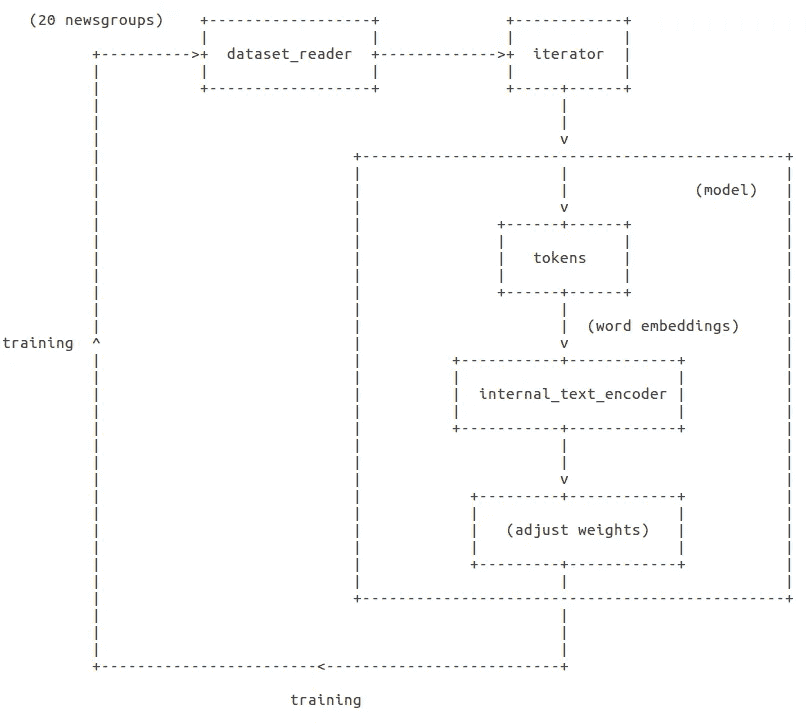
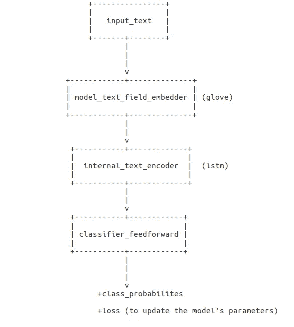

# AllenNLP 让文本深度学习变得简单

> 原文：<https://medium.com/swlh/deep-learning-for-text-made-easy-with-allennlp-62bc79d41f31>


一个好的学习过程的关键原则之一是保持学习比你目前的理解稍微多一点的东西。如果主题与你已经知道的太相似，你最终**不会取得太大进展**。另一方面，如果主题太难，你会**停滞不前，取得很少或没有进展**。

深度学习涉及许多不同的主题和我们需要学习的东西，所以一个好的策略是开始研究人们已经为我们建立的东西。这就是框架伟大的原因。它们让我们不必太在意如何构建模型的细节，这样我们就可以更专注于**我们想要完成的**(而不是专注于如何去做)。

[**AllenNLP**](http://allennlp.org/) 是一个框架，它使得为自然语言处理建立深度学习模型的任务**变得真正令人愉快**。这对我来说是一个惊喜，因为我之前在 NLP 深度学习方面的所有经历都是某种痛苦。

处理 NLP 任务需要不同类型的神经网络细胞，因此在开始使用 AllenNLP 框架之前，让我们快速概述一下这些细胞背后的理论。

# 🙆当简单的神经网络不够时

在简单的作品中，阅读文本的任务是建立在我们以前读过的东西上。比如这句话，如果你之前没有读过，可能就没有意义了。所以创造这些神经网络细胞背后的想法是:

> *“如果人类利用他们之前读过的东西来理解接下来的内容，也许如果我们在模型中使用这种机制，他们可以更好地理解文本，对吗？”*

## 🎥递归神经网络

为了使用一个考虑时间的网络，我们需要一种表示时间的方法。但是我们怎么做呢？

> 处理具有时间范围的模式的一个显而易见的方法是通过将模式的序列顺序与模式向量的维度相关联来显式地表示时间。**第一个时间事件由模式向量中的第一个元素表示，第二个时间事件由模式向量中的第二个位置表示，依此类推。**——[杰弗里·埃尔曼](http://psych.colorado.edu/~kimlab/Elman1990.pdf)

问题是这种方法有几个缺点。例如:

> […]【T1]移位寄存器对模式的持续时间施加了严格的限制(因为输入层必须提供可能的最长模式)，此外，还建议所有输入向量长度相同。**这些问题在语言等领域特别麻烦，在这些领域中，人们希望对可变长度的模式进行可比较的表示。**对于语音的基本单位(语音片段)和句子来说都是如此。

[Jeffrey L. Elman](https://en.wikipedia.org/wiki/Jeffrey_Elman) 谈到论文中的其他缺点[及时发现结构](http://psych.colorado.edu/~kimlab/Elman1990.pdf)。本文介绍了 Elman 网络，这是一个添加了一组“上下文单元”的三层网络。

如果你对神经网络完全陌生，也许阅读我写的另一篇文章是个好主意。但简单地说，神经网络是一种具有被输入激活或不被输入激活的单元的东西。

Elman 根据 Jordan (1986)建议的方法开始了他的工作。乔丹推出**循环连接**。

> 循环连接允许网络的隐藏单元看到它自己先前的输出，因此随后的行为可以由先前的响应来决定。这些循环连接赋予了网络内存。

Elman 然后添加**上下文单元**。这些上下文单元就像一个时钟，告诉我们什么时候应该“放下”之前的输入。但是怎么做呢？与其他神经网络单元一样，上下文单元也有调整权重的机制。

上下文单元和输入都激活神经网络隐藏单元。**当神经网络“学习”时，意味着它具有网络处理的所有输入模式的表示。上下文单元记住先前的内部状态。**

如果这些都没有多大意义，也不用担心。想象一下，现在我们有了一个神经网络细胞，它把前一个状态考虑进去，产生下一个状态。

> “现在我们有了一个神经网络细胞，它可以考虑前一个状态来产生下一个状态。”

## 📹当 rnn 不够用时:LSTM

正如 Christopher Ola 在这里解释的(如果你想了解 LSTMs 的更多信息，这篇文章很棒)有时我们需要更多的上下文，例如，有时我们**需要存储很久以前看到的信息**。

> 考虑尝试预测文本中的最后一个单词“我在法国长大……我说一口流利的法语”最近的信息表明，下一个单词可能是一种语言的名称，但如果我们想缩小语言的范围，我们需要法国的上下文，从更远的地方。**相关信息和需要信息的地方之间的差距完全有可能变得非常大** — [克里斯托弗·奥拉](http://colah.github.io/posts/2015-08-Understanding-LSTMs/)

LSTM 细胞解决了这个问题。他们是一种特殊的 RNN，能够学习长期依赖性。我们将只使用 LSTM 细胞，而不是构建它们，所以为了我们的目的，你可以认为 LSTM 细胞是具有不同结构的细胞，能够学习长期依赖性。

# ✨ 为文本分类建立一个奇特的模型

好了，理论到此为止，让我们进入有趣的部分，建立模型。



The training process

上面的图片向我们展示了我们将如何设置一切。首先，我们**获取数据**，然后我们**将其编码为模型能够理解的格式**(“令牌”和“内部 _ 文本 _ 编码器”)，然后我们向网络提供这些数据，**比较标签并调整权重**。在这个过程的最后，模型准备好进行预测。

现在我们终于可以感受到 AllenNLP 的魔力了！我们将用一个简单的 JSON 文件指定上图中的所有内容。

```
{
  "dataset_reader": {
    "type": "20newsgroups"
  },
  "train_data_path": "train",
  "test_data_path": "test",
  "evaluate_on_test": true,
  "model": {
    "type": "20newsgroups_classifier",
    "model_text_field_embedder": {
      "tokens": {
        "type": "embedding",
        "pretrained_file": "https://s3-us-west-2.amazonaws.com/allennlp/datasets/glove/glove.6B.100d.txt.gz",
        "embedding_dim": 100,
        "trainable": false
      }
    },
    "internal_text_encoder": {
      "type": "lstm",
      "bidirectional": true,
      "input_size": 100,
      "hidden_size": 100,
      "num_layers": 1,
      "dropout": 0.2
    },
    "classifier_feedforward": {
      "input_dim": 200,
      "num_layers": 2,
      "hidden_dims": [200, 100],
      "activations": ["relu", "linear"],
      "dropout": [0.2, 0.0]
    }
  },
  "iterator": {
    "type": "bucket",
    "sorting_keys": [["text", "num_tokens"]],
    "batch_size": 64
  },
  "trainer": {
    "num_epochs": 40,
    "patience": 3,
    "cuda_device": 0,
    "grad_clipping": 5.0,
    "validation_metric": "+accuracy",
    "optimizer": {
      "type": "adagrad"
    }
  }
}
```

让我们看看那里发生了什么。

## 1—数据输入

为了告诉 AllenNLP 输入数据集以及如何从中读取，我们在 JSON 文件中设置了`'dataset_reader'`键。

> 一个`DatasetReader`从某个位置读取数据并构造一个`Dataset`。除了文件路径之外，读取数据所需的所有参数都应该传递给`DatasetReader` — [AllenNLP 文档](https://allenai.github.io/allennlp-docs/api/allennlp.data.dataset_readers.dataset_reader.html?highlight=dataset_reader#module-allennlp.data.dataset_readers.dataset_reader)的构造函数

我们的数据集将是 20 个新组，稍后我们将定义如何从中读取(在 python 类中)。首先让我们定义模型的其余部分。

## 2 —模型

为了指定型号，我们将设置`'model'`键。`'model'`键内还有三个参数:

`'model_text_field_embedder'`、`'internal_text_encoder'`和`'classifier_feedforward'`

让我们先处理第一个，剩下的两个留待以后处理。

使用密钥`'model_text_field_embedder'`，我们告诉 AllenNLP 在将数据传递给模型之前应该如何对其进行编码。简而言之，我们希望让我们的数据更“有意义”。其背后的想法是这样的:**如果我们能够像比较数字一样比较单词会怎么样？**

如果 **5 - 3 + 2 = 4** 为什么不是**国王-男人+女人=王后**？

使用**单词嵌入**我们可以做到这一点。这对模型也有好处，因为现在我们不需要使用很多稀疏数组(有很多零的数组)作为输入。

> 单词嵌入是自然语言处理(NLP)中一组语言建模和特征学习技术的统称**，其中来自词汇表的单词或短语被映射到实数的向量**。从概念上讲，它涉及到一个数学上的[嵌入](https://en.wikipedia.org/wiki/Embedding)从一个每个单词一维的空间到一个连续的[更低维度的向量空间](https://en.wikipedia.org/wiki/Vector_space)。— [维基百科](https://en.wikipedia.org/wiki/Word_embedding)

在我们的模型中，我们将使用 [GloVe:单词表示的全局向量](https://nlp.stanford.edu/projects/glove/)

> GloVe 是一种无监督学习算法，用于**获取单词的矢量表示**。在来自语料库的聚集的全局单词-单词共现统计上执行训练，并且所得的表示展示了单词向量空间的有趣的线性子结构。——[手套](https://nlp.stanford.edu/projects/glove/)

如果这些有意义的话，就把 Glove 想象成一个模型，在这个模型中，我们传递单词并把它们编码成向量。我们将每个嵌入向量的大小设置为 100。

> Glove 将单词编码成向量

这就是`'model_text_field_embedder'`的作用。

## 3 —数据迭代器

像往常一样，我们将分批分离训练数据。AllenNLP 提供了一个名为 [BucketIterator](https://allenai.github.io/allennlp-docs/api/allennlp.data.iterators.html#bucket-iterator) 的迭代器，它通过根据每批的最大输入长度填充批来提高计算(填充)效率。为此，它根据每个文本中的标记数量对实例进行排序。我们在`'iterator'`键中设置这些参数。

## 4 —培训师

最后一步是为培训阶段设置配置。训练器使用 AdaGrad optimizer 达 10 个时期，如果在最后 3 个时期验证准确度没有提高，则停止使用。

为了训练模型，我们只需要运行:

`python run.py our_classifier.json -s /tmp/your_output_dir_here`

另一件很酷的事情是，有了这个框架，我们可以在以后停止和恢复训练。但在此之前，我们需要指定 dataset_reader 和模型 python 类。

# 👩🏾‍💻编写 AllenNLP Python 类

## 数据集 _ 阅读器. py

我们将使用由 [scikit-learn](http://scikit-learn.org/stable/datasets/twenty_newsgroups.html) 提供的 20 个新闻组。要在 JSON 文件中引用 DatasetReader，我们需要注册它:

```
@DatasetReader.register("20newsgroups")
class NewsgroupsDatasetReader(DatasetReader):
```

您将实现三个方法:`read()`和`text_to_instance()`。

*   `read()`

`read()`方法从 scikit-learn 获取数据。使用 AllenNLP，您可以设置数据文件的路径(例如 JSON 文件的路径)，但是在我们的例子中，我们只是像 python 模块一样导入数据。我们将从数据集中读取每个文本和每个标签，并用`text_to_instance()`包装它。

*   `text_to_instance()`

该方法"*执行从文本输入到* `*Instance*` " [(AllenNLP 文档](https://allenai.github.io/allennlp-docs/api/allennlp.data.dataset_readers.dataset_reader.html?highlight=datasetreader))所需的任何标记化或处理。在我们的例子中意味着这样做:

```
 @overrides
    def text_to_instance(self, newsgroups_post: str, label: str = None) -> Instance:  
        tokenized_text = self._tokenizer.tokenize(newsgroups_post)
        post_field = **TextField(tokenized_text, self._token_indexers)**
        fields = {'post': post_field}
        if label is not None:
            fields['label'] = **LabelField(int(label),skip_indexing=True)**
        return Instance(fields)
```

我们将 20 个新闻组中的文本和标签包装成`[TextField](https://allenai.github.io/allennlp-docs/api/allennlp.data.fields.html?highlight=textfield#text-field)`和`[LabelField](https://allenai.github.io/allennlp-docs/api/allennlp.data.fields.html?highlight=textfield#allennlp.data.fields.label_field.LabelField)`。

## model.py

我们将使用一个双向 LSTM 网络，它是一个复制第一循环层的单元。一层按原样接收输入，另一层接收输入序列的反向副本。因此，BLSTM 网络被设计为捕获序列数据集的信息并保持来自过去和未来的上下文特征。(来源:[双向 LSTM 递归神经网络中文分词](https://arxiv.org/pdf/1602.04874.pdf))

首先让我们定义模型**的类参数**

*   `vocab`

> 因为在您的模型中经常有几个不同的映射，所以`Vocabulary`会跟踪不同的名称空间。在这种情况下，我们有一个文本的“令牌”词汇表(代码中没有显示，但这是在后台使用的默认值)，和一个我们试图预测的标签的“标签”词汇表— [在您的项目中使用 AllenNLP](https://github.com/allenai/allennlp/blob/master/tutorials/getting_started/using_in_your_repo.md)

*   `model_text_field_embedder`

用于嵌入我们作为输入获得的令牌`TextField`。返回单词的手套向量表示。

*   `internal_text_encoder`

我们将使用编码器将输入文本转换为单个向量(RNNs，还记得吗？).`Seq2VecEncoder`是一个模块，它将一系列向量作为输入，并返回一个向量。

*   `num_classes` —要预测的标签数量

现在让我们实现模型类**方法**

*   `forward()`



What the forward() method does

> 该模型做的第一件事是嵌入文本，然后将其编码为一个向量。为了对文本进行编码，我们需要获得掩码，这些掩码表示标记序列中的哪些元素只是为了填充而存在的。
> 
> 然后我们通过一个前馈网络来得到类逻辑。我们将 logits 通过 softmax 来获得预测概率。最后，如果给我们一个标签，我们可以计算损失并评估我们的指标。— [在您的项目中使用 AllenNLP](https://github.com/allenai/allennlp/blob/master/tutorials/getting_started/using_in_your_repo.md)

正向方法基本上完成模型训练任务。如果你想了解更多一点正在发生的事情，你可以去[这里](https://medium.freecodecamp.org/big-picture-machine-learning-classifying-text-with-neural-networks-and-tensorflow-d94036ac2274#20cc)。现在我们来谈谈模型类参数的一个重要部分:**分类器 _ 前馈**。

> 我们需要`*Model.forward*`来计算它自己的损失。训练代码将在由`*forward*`返回的字典中寻找`*loss*`值，并计算该损失的梯度以更新模型的参数。— [在您的项目中使用 AllenNLP](https://github.com/allenai/allennlp/blob/master/tutorials/getting_started/using_in_your_repo.md)

*   `decode()`

> `decode`有两个功能:它接受`forward`的输出，并对其进行任何必要的推断或解码，它将整数转换成字符串，使其可读(例如，用于演示)。— [在您的](https://github.com/allenai/allennlp/blob/master/tutorials/getting_started/using_in_your_repo.md)中使用 AllenNLP

# 🔃运行代码

如我之前所说，通过命令行训练模型，我们可以使用:

`python run.py our_classifier.json -s /tmp/your_output_dir_here`

我还创建了一个笔记本，这样我们就可以在 Google Colaboratory 上运行实验并免费使用 GPU，下面是链接:[https://colab . research . Google . com/drive/1 q3b 5 hackcjysvd 6 yhrwnx L2 byqgk 08 jhq](https://colab.research.google.com/drive/1q3b5HAkcjYsVd6yhrwnxL2ByqGK08jhQ)

你也可以在[这个库](https://github.com/dmesquita/easy-deep-learning-with-AllenNLP)上查看代码。

我们建立了一个简单的分类模型，但可能性是无限的。该框架是一个很好的工具，可以为我们的产品创建有趣的深度学习模型。✨

[](https://medium.com/swlh)

## 这篇文章发表在 [The Startup](https://medium.com/swlh) 上，这是 Medium 最大的创业刊物，拥有 307，871+读者。

## 订阅接收[我们的头条新闻在这里](http://growthsupply.com/the-startup-newsletter/)。

[](https://medium.com/swlh)