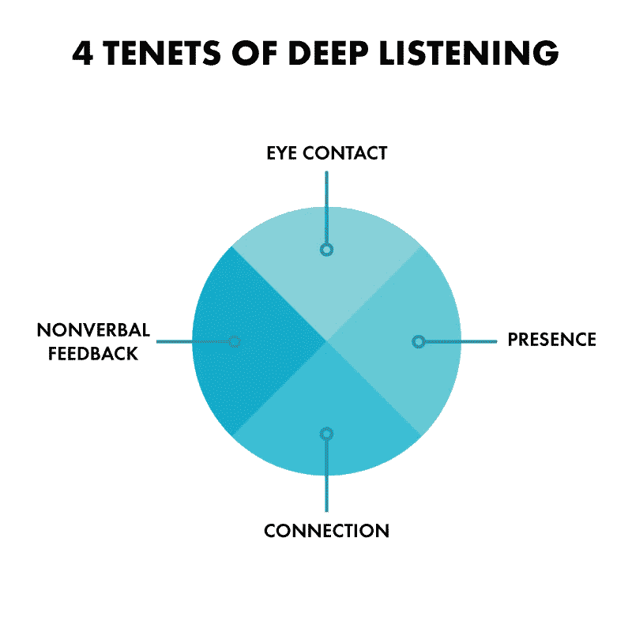

# 深度倾听:一种不公平的优势

> 原文：<https://medium.com/swlh/deep-listening-an-unfair-advantage-ec331ac37d1b>

由 [Las Olas VC(又名 LOVC)](https://medium.com/u/11da95b5ce49?source=post_page-----ec331ac37d1b--------------------------------) 的创始合伙人 Esteban Reyes

深度倾听技巧对创始人和投资者来说至关重要，我相信深度倾听者拥有不公平的优势。深度听者可能会发现非深度听者会忽略的不明显的见解，因为他们的头脑太忙了。更基本的是:当你听的时候，你在学习。当你说话的时候，你是在传播信息和释放能量。投资者和创始人都需要这样做，我发现伟大的深度听众在这两方面都很棒。相反，一般来说，糟糕的听众在这两方面都不好。

因为倾听发生在每个人的内心，所以很难绝对纯粹地定义它的意义。许多人相信他们在听(其实他们没有)，或者认为他们是“特殊的”，可以同时处理多项任务。实际上，我认为这是核心问题——我们对倾听是什么没有共同的理解。

**(在创业公司的背景下)什么不是倾听？**

*   投资人谈论创始人是(显然！)不听。
*   创始人打断团队成员的半句话，说一些“更重要”的话。
*   在团队成员在场的情况下做其他事情不是倾听(例如，发邮件、查看电话、休息等)。
*   投资者假设已经知道创始人接下来会说什么，反之亦然。
*   在创始人向投资者展示时对其进行分析或判断。
*   倾听只是为了知道接下来要说什么，并“赢得争论”。
*   因为不同意而驳回争论。

深度倾听需要自我调节和精神耐力。我观察到，最好的创始人和投资者都是伟大的倾听者。他们有自我意识，情商高，有意识地选择先听后听。他们知道如何应对(内部和外部)干扰，并关闭任何控制谈话的欲望。他们会介入问一些澄清性的问题，并确认他们对所说内容的理解。他们真正感兴趣的是别人要说什么，并且善于设身处地为说话者着想。

以我自己的经验来看，深度倾听有助于我更好地理解和我一起工作的创始人。很多时候，创始人对他们的主题如此深入，你不得不听非语言队列来了解全貌。令人惊讶的是，我学到了更多，这反过来使我们能够更好地合作。

我的目标不是批评，或宣称“真相”，而是每当我不听的时候，让自己负责。希望其他创始人和投资者也能发现这很有用。

## 这篇文章发表在 [The Startup](https://medium.com/swlh) 上，这是 Medium 最大的创业刊物，拥有+405，714 名读者。

## 订阅接收[我们的头条新闻](http://growthsupply.com/the-startup-newsletter/)。

