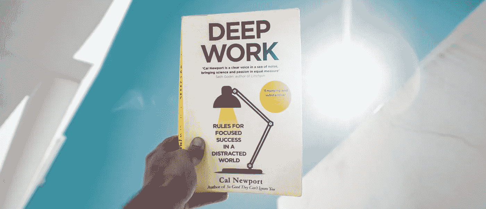

# 深度工作:一本书的总结

> 原文：<https://medium.com/swlh/deep-work-a-book-summary-aad028e49374>

## 最佳生产力书籍的金块

> "为了从你目前的智力中榨出最后一滴价值，深入的工作是必要的."

欢迎来到另一本书的摘要。这一次，我们将深入探讨生产率和关注度的话题。

现在我已经完成了这本书，我可以自信地称它为**我读过的最有影响力的非小说类书籍之一**。它充满了可行的建议，我们今天将探讨这些建议。

但首先，让我们达成共识…

D **eep 工作**——创造新价值且难以复制的任务，将认知能力推向极限，不受干扰地执行。

相比之下，我们有…

沉迷工作——不创造多少新价值、容易复制、经常在分心时执行的任务。

作者卡尔·纽波特认为，我们都应该努力限制吞咽工作，并通过专注于深层工作来训练自己最大限度地发挥潜力。

> 深度工作正变得越来越罕见，同时也变得越来越有价值。少数培养这种技能，并将其作为工作生活核心的人将会茁壮成长。

第一章专门探讨为什么我们应该投资于深度工作。鉴于你正在阅读这篇文章，你可能已经知道深层工作背后的力量。尽管如此，以下是作者的主要观点:

# 深度工作是有价值的

一个不受干扰的工作会议可以让你更快地学习一项新技能，并利用你现有的技能产生更有价值的工作。这使你能够跟上你所在领域的现状，并让你通过专注于重要的活动来创造更多高质量的工作。

> "优化你表现的工作类型是深度工作."

# 深度作品很少

随着网络工具和社交媒体的兴起，我们的个人和职业生活越来越分散我们的注意力。将我们从短期的专注和计划的不适中解救出来的活动优先于更深层次的工作。

由于天生难以衡量知识工作者创造了多少价值，阻力最小的活动占据了中心位置。

> “由于缺乏明确的指标来说明什么是工作中的高效和有价值，许多知识工作者转向了生产力的工业指标:以可见的方式做大量的事情。”

# 深度工作是有意义的

通过促进我们生活中的深层工作，我们也在日常生活中加强了意义和深度，并自然地消除了浅层活动。

练习深度工作也是进入心流状态的敲门砖，是巨大满足感和价值的源泉。

最后，深度工作是从看似无聊的任务中提取意义的途径。它把工作提升到一种可以掌握的技能。

既然我们已经了解了深度工作的重要性，那么让我们深入学习创造深度工作环境的实践课程、陷阱和如何避免陷阱，以及如何充分利用深度。

# 如何深入工作

## 1 /将深度工作仪式化

习惯需要时间和努力来坚持。通过在深入工作会议之前、之中和之后系统化你的行动，我们正在走出我们的方式。通过预先定义以下内容来创建例程:

*   时间和地点(即下午 3 点到 5 点在图书馆)
*   一旦开始，你将如何工作(阅读研究论文，总结，离线)
*   工作时需要的资源(文档、笔记本电脑、一杯咖啡)

## 2 /尽力排除干扰

如果你觉得在家无法集中注意力，或者你当地的咖啡店太吵了，挤满了让人分心的熟人，那就花更多的精力去找一个可以做深度工作的地方。

一旦你找到了那个完美的地方，你投入的努力越多，你的价值就越大。这将激励你充分利用你的深度工作会议。

## 3 /不要独自工作

如前所述，你应该通过从分散注意力的环境中抽身来保护你的深度工作时间。但是，记住与他人交流想法是多么有益。

你的下一个最佳想法可能是由一次随意的谈话引发的，所以确保你仍然在日常生活中寻求自发性。

> “定期让自己接触网络中心的想法，但要保持一种能深入研究你所遇到的问题的方式。

## 4 /像做生意一样执行

在深入工作期间，**关注广泛重要的事情:**一小组最大化你深入工作努力的目标。这些目标应该会让你觉得有挑战性，有点吓人，激励你更深入地工作。

引入关键绩效指标(KPI)来评估您的生产力。**有两种类型:滞后和超前措施。**

**滞后指标**只能作为一项活动的结果来衡量，不能被直接影响(例如，我的这篇博文有多少浏览量)。

**Lead measures** 可以在一项活动中进行测量，并且可以直接受到影响(例如，我在这篇博文上花了多少时间)。

我们应该始终专注于衡量和跟踪销售线索 KPI，因为我们可以直接影响它们。通过记录你的每日关键绩效指标，将深度工作游戏化。

记录你每天深入工作的时间，努力打破自己的记录。这将通过创造责任感来激励你每天进步。在一周结束时，回顾你的表现，评估你可以如何改进。

## 5 /懒惰

工作之余的休息时间非常有助于获得新的见解，让你的大脑重新充电，以便更深入地工作。

研究表明，我们可以在每天 3 到 4 个小时的时间里深度集中注意力，所以如果你在深度工作时尽了最大努力，你就不会错过在一天的其余时间里不深度工作的机会。

在一天中的特定时间创建一个关机程序。花 30 分钟来结束任何正在进行的任务，回顾第二天的待办事项，并保证你每天都在同一时间停止工作。

# 拥抱无聊

> “一旦你的大脑习惯了按需分散注意力，就很难戒掉这种瘾”

但并非不可能…

## 1 /安排允许使用互联网的时间段

我们大多数人大部分时间都在网上度过。我们现在寻求互联网来分散妨碍深入工作的注意力。

通过限制我们对互联网的访问，我们学会了抵制这些欲望，随着时间的推移，我们将重新连接我们的大脑，以便在更长的时间内集中注意力。

## 2 /像泰迪·罗斯福一样工作

承诺给自己一个严格的期限。如果可能的话，公开截止日期，或者通过设置倒计时来激励自己。这种人为的约束会激励你在深度工作中尽可能地集中精力。

## 3 /富有成效地冥想

当你身体上而不是精神上忙碌的时候，训练你的思维专注于一个特定的问题。

通过练习，你将能够探索你头脑中的一个问题，这将提高你的注意力，增强你的抗分心肌肉。

# 退出社交媒体

## 1 /像工匠使用工具一样使用社交媒体

如果它支持你的手艺，那就用它。找出决定你职业和个人生活成功的主要因素，只有当积极因素大于消极因素时才采用一种工具。

## 2 /使用 80/20 规则(帕累托原则)

找出产生 80%结果的 20%的活动。

社交媒体的使用对你目前的结果有什么影响？你在社交媒体上花了多长时间，这对完成你的目标有帮助吗？

## 3 /如果对你没有帮助，那就戒掉。

通过前面两点看完社交媒体，还需要用这些工具吗？如果它不能帮你实现目标， [**戒掉它**](/swlh/addicted-to-social-media-gaining-control-over-your-phone-addiction-a971da7b0783) 。

## 4 /不要用网络自娱自乐

花时间做一些有意义的事情，把更多的心思放在你的闲暇时间上。

这将保持你抵抗分心和集中注意力的能力，并给你更多的精力去面对下一个工作日。

# 吸干燕子

## 1 /安排好一天中的每一分钟

尊重你的时间，提前决定你工作日的每一分钟要做什么。

拿一个笔记本(或日历),粗略地给特定的活动分配时间。这将是你一天的广泛计划，因此你仍然可以保持灵活性，适应一天中出现的新挑战。

## 2 /采用固定时间表的生产工作日

为你一天的工作时间设定时间限制。这种方法要求你更仔细地思考如何组织你的一天，从而比一个更长但无组织的工作日产生更多的价值。

它让你专注于真正重要的事情，因为一天中真正产生价值的时间是固定的。

## 3 /变得难以接近

*   **让给你发邮件的人做更多的工作:**通过建立交往规则把人过滤掉。
*   **发送或回复电子邮件时多做些工作:**通过电子邮件交流时要具体而自信。尝试提出解决方案。
*   **不回复** /你不必回复每一封邮件。如果写邮件的努力很少，但是回复却花费了大量的时间和精力，考虑一下是否值得回复。

感谢您阅读 Cal Newport 关于 **Deep Work 的总结。**

在接下来的 30 天里，我将遵循这本书里的建议。请继续关注我在 Medium 上的报道或我的博客。

你们可能都喜欢阅读这本书的摘要，或者你可能想看一段视频文章？

## 这个故事发表在 [The Startup](https://medium.com/swlh) 上，这是 Medium 最大的企业家出版物，拥有 358，974+人。

## 在这里订阅接收[我们的头条新闻](http://growthsupply.com/the-startup-newsletter/)。

