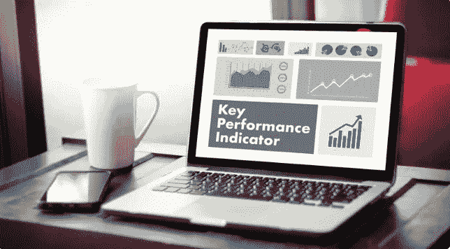

# 定义您的 KPI

> 原文：<https://medium.com/swlh/define-your-kpis-1a2072f1435>

## 你知道什么是 KPI 吗？你知道你的 KPI 是什么吗？

KPI，**关键绩效指标**，用于衡量团队流程的绩效，并根据这些信息了解目标是否实现。

***这是一种被高管和经理广泛用于管理的技术，因为它使他们能够与其他员工交流公司的发展。***

# **利用关键绩效指标…**

*   员工变得更加了解并参与到使命中。
*   努力与战略相一致。
*   量化绩效并帮助员工理解他们的活动如何促成关键因素的整体成功是可能的。
*   领导者可以将定量数据作为分析和决策的基础。

# 示例:

## 让我们使用一个数字营销场景…

对于那些投资数字营销的人来说，结果的衡量是极其重要的。为此使用有效的工具总是受欢迎的。在开展数字营销活动时，需要将每个行动的目标形象化。在这种情况下，KPI 用作每个目标的绩效指标。

***KPI 允许在行动过程中立即跟进，并提供有助于了解活动进展的信息，即使是那些对数字营销知之甚少的人也能做到。***

***KPI 还可用于向雇佣代理服务的客户提供活动数据。当与公司的目标相关时，它甚至可以指出哪里有需要解决的失败或弱点。***

# **KPI 和指标的区别**

为了理解 KPI 的重要性，注意 KPI 和指标之间的区别也很重要，因为两者都是指标。

## 指标指向一个总数。

*比如访问量，跳出率，流量来源。*

## KPI 通知您从指标中得出的结果。

*关键绩效指标表明是否达到了一定的转化目标。*

## **使用的 KPI 和指标示例:**

*   **转化率**:总销售额÷总网站访问量
*   平均销售额:总收入÷总销售额
*   **参与度指数**:与页面互动的访客总数÷访客总数
*   **社会影响力指数**:总点赞或转发数÷总帖子数

***执行正确的分析并正确理解指标和关键绩效指标是制定营销活动和其他计划的关键步骤。***

**如果表现不佳**，可能会得出错误的结论，并危及品牌的发展。

相反，**如果执行得当**，关键绩效指标有助于运营的成功并加强公司的网络。

***跟踪 KPI&将它们与*** [**团队**](https://teamslux.com/?lang=en&utm_source=Fractal%20Solutions%20LLC%20Blog) **无缝实施到你公司的工作中。**

[**团队**](https://teamslux.com/?lang=en&utm_source=Fractal%20Solutions%20LLC%20Blog) 正在革新公司的管理。

## [了解更多关于团队如何帮助你的公司的信息](https://teamslux.com/?lang=en&utm_source=Fractal%20Solutions%20LLC%20Blog)

[**获取免费演示**](http://teamslux.rds.land/request-a-demo?utm_source=Fractal%20Solutions%20LLC%20Blog) ，立即开始管理您的 KPI！

## 在 www.FractalSolutionsLLC.com 了解更多信息

*FTC 声明:如果您购买本页所列的某些商品或服务，我们可能会收到补偿。我们只列出我们信任的资源。补偿并不影响我们的推荐，但确实使我们有可能向我们的观众提供免费内容和有价值的折扣。我们的目标是授权、激励、&服务创新者&企业家。*

## 这篇文章发表在 [The Startup](https://medium.com/swlh) 上，这是 Medium 最大的创业刊物，拥有 340，876+的读者。

## 在这里订阅接收[我们的头条新闻](http://growthsupply.com/the-startup-newsletter/)。

