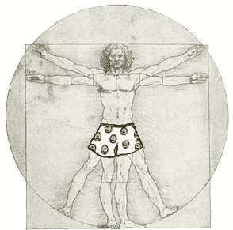
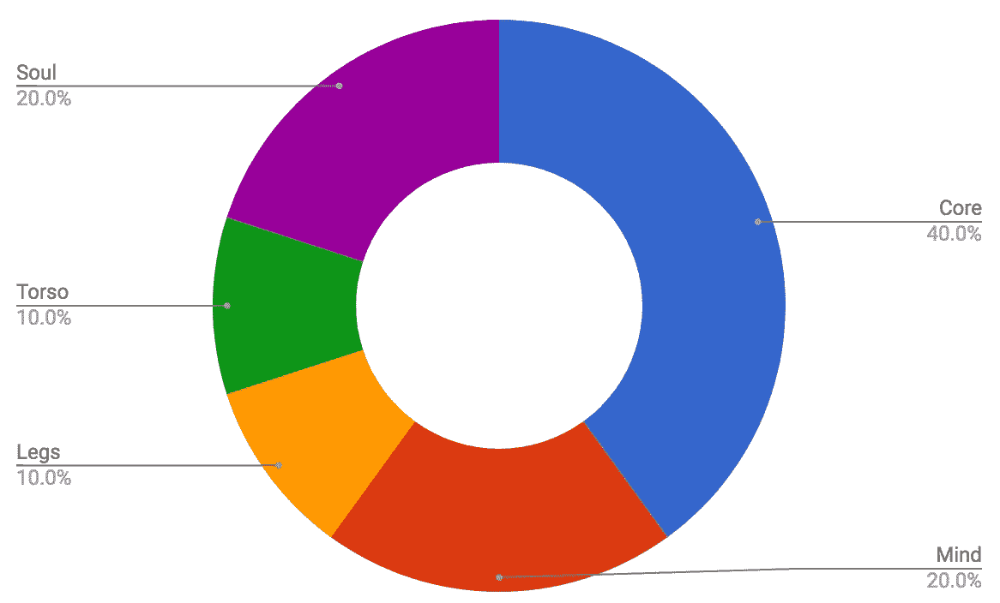

# 了解宇宙万物的 50 本书的权威列表

> 原文：<https://medium.com/swlh/definitive-list-of-50-books-to-understand-everything-in-the-universe-6d04f1a08533>

## 建立知识、智慧和远见的“维特鲁威人”方法。

 [## 赫曼特·莫哈帕特拉在 LinkedIn 上写道:“我会把书籍推荐给...

### 我接受书籍推荐，以便对这个世界有一个更坚定的理解——一种基本的 101…

www.linkedin.com](https://www.linkedin.com/feed/update/urn:li:activity:6391899544212373504) 

几周前，我在我的 LinkedIn(见上图)上写了一篇关于书籍的笔记，这些书籍可以构成我们理解这个宇宙中几乎所有已知事物的基础。本质上，我想了解为什么我们是现在的样子，为什么我们的社会、政治和生物系统进化成今天的样子。

反响非常好，以至于我花了一个多月才把这篇文章和 100 多条推荐中的前 50 条放在一起。

> 完整列表在谷歌文档[这里](https://docs.google.com/spreadsheets/d/1R5OCYGnd9iY47XUnQ7H-oyaOANZ-szWMwvQQxYO5fpY/edit#gid=0)。

我称之为我的“星球级元智能”书单。为什么是星球-？来暗示人类历史上曾经存在过的所有知识都被压缩到这 50 本书里了。为什么是 meta-？它肯定不会教你量子力学或微积分——这太具体了——但它会告诉你为什么需要这些工具，什么时候需要，以及它们在让我们走到今天的位置上发挥了什么作用。

下一个挑战是如何组织列表。当然，我可以把它们归入历史、科学、心理学和影响力、经济学等等，但那感觉太公式化了。在思考如何开发我的智力时，我受到了列奥纳多·达·芬奇的[维特鲁威人](https://en.wikipedia.org/wiki/Vitruvian_Man)的启发，他相信“人体的运行是宇宙运行的类比。”[【参】](https://en.wikipedia.org/wiki/Vitruvian_Man#cite_note-4)。好吧，酷，李奥，但穿上内衣。

you are welcome

所以我把选择分成五类:

> **核心**:类似于在健身房健身，这部分是最重要的，也是最理想的起点。一切都是从这里开始的。这些书涵盖了这个世界如何在基本层面上运作的原则。一个虚弱的核心使得其余的知识变得难以接近。
> 
> 头脑:这包括如何成为一名更好的战略家，培养远见、耐心和更聪明的思维习惯。这两者与核心一起构成了 IMHO 进一步发展的基础。
> 
> **躯干**:更好的上半身通常是最终目标——这是最明显的，最具外表吸引力的，也最能吸引自我。因此，这一类别的书籍迎合了魅力、影响力和权力的主题。
> 
> **腿**:健身房日常活动中最容易被忽视的部分:腿日！没有这一点，你在世界上的影响力总是有限的。这一部分包括操作经验、建立帝国的故事、失败的故事和纪律。
> 
> **灵魂**:最后，没有鼓舞人心的故事或驱使你起床去健身房的个人激情，很难坚持到底。同样，这一节的重点是用奋斗和战胜异常困难的故事、经历意义深远的失败而成长的故事以及救赎的故事来滋养灵魂。

主题的正确分布是个人的。我更倾向于把更多的注意力放在基础上:核心和思想，然后把其他的分开。照单全收但是 YMMV。所以，事不宜迟，这里是列表，从核心开始。所有链接到亚马逊美国。同样，完整的名单是[这里](https://docs.google.com/spreadsheets/d/1R5OCYGnd9iY47XUnQ7H-oyaOANZ-szWMwvQQxYO5fpY/edit#gid=0)。

# 核心

 [## 智人:人类简史

### 纽约时报畅销书。巴拉克·奥巴马总统、比尔·盖茨和马克·扎克伯格的夏季阅读精选](https://www.amazon.com/dp/B00ICN066A/)  [## 金钱的崛起:世界金融史

### 从畅销书作家的文明和广场和塔，丰富的原始看看起源…

www.amazon.com](https://www.amazon.com/Ascent-Money-Financial-History-World/dp/B002XVDFOW/)  [## 沉思(多佛节俭版)

### 世界上最著名和最有影响力的书之一《沉思录》，作者是罗马皇帝马可·奥勒留(公元 121-180 年)…

www.amazon.com](https://www.amazon.com/Meditations-Marcus-Aurelius/dp/1945644583/)  [## 几乎所有事物的简史

### 世界上最受欢迎的作家和畅销书作家之一的一个夏天，需要他的最终旅程-进入最…

www.amazon.com](https://www.amazon.com/Short-History-Nearly-Everything-ebook/dp/B000FBFNII)  [## 有毒的不平等:美国的财富差距如何破坏流动性，加深种族分歧，以及…

### 来自种族和公共政策方面的权威，对家庭如何兴衰的深入研究…

www.amazon.com](https://www.amazon.com/dp/B01NBVBXZT/ref=dp-kindle-redirect?_encoding=UTF8&btkr=1)  [## 制高点:世界经济之战

### 普利策奖的获奖作者加入了全球经济的领先专家提出了深刻的…

www.amazon.com](https://www.amazon.com/Commanding-Heights-Government-Marketplace-Remaking/dp/0684829754/ref=mt_hardcover?_encoding=UTF8&me=&dpID=51AR6PkYmhL&preST=_SY291_BO1,204,203,200_QL40_&dpSrc=detail)  [## 国家失败的原因:权力、繁荣和贫困的起源

### 才华横溢、引人入胜的《为什么国家会失败》回答了困扰专家们几个世纪的问题:为什么…

www.amazon.com](https://www.amazon.com/dp/B0058Z4NR8/)  [## 自私的基因

### 《自私的基因》第一次在……发表时，在生物学家和公众中引起了一阵兴奋

www.amazon.com](https://www.amazon.com/Selfish-Gene-New-Richard-Dawkins/dp/0192177737/ref=mt_hardcover?_encoding=UTF8&me=)  [## 国富论第五册:国富论的性质和原因探究。

### 亚当·斯密的杰作，首次出版于 1776 年，是现代经济思想的基础，至今仍是唯一的…

www.amazon.com](https://www.amazon.com/dp/B078YTNGKP/ref=dp-kindle-redirect?_encoding=UTF8&btkr=1)  [## 丝绸之路:新的世界历史-插图版

### 丝绸之路:新的世界历史-Amazon.com 插图版。*免费*…

www.amazon.com](https://www.amazon.com/Silk-Roads-History-World-Illustrated/dp/1547600217/ref=tmm_hrd_swatch_0?_encoding=UTF8&qid=&sr=)  [## 德乌斯人:明日简史

### 纽约时报畅销书尤瓦尔诺亚哈拉里，备受好评的纽约时报畅销书和…

www.amazon.com](https://www.amazon.com/dp/B01BBQ33VE/ref=dp-kindle-redirect?_encoding=UTF8&btkr=1)  [## 枪支、细菌和钢铁:人类社会的命运

### “太棒了....为理解人类历史奠定基础。”-比尔·盖茨在这篇“巧妙的、信息丰富的和…

www.amazon.com](https://www.amazon.com/Guns-Germs-Steel-Fates-Societies-ebook/dp/B06X1CT33R/)  [## 阿拉伯人:历史

### 在这现代阿拉伯世界的权威历史，获奖历史学家尤金罗根广泛借鉴阿拉伯…

www.amazon.com](https://www.amazon.com/Arabs-History-Eugene-Rogan/dp/0465071007/ref=mt_hardcover?_encoding=UTF8&me=)  [## 原则:生活和工作

### 1《纽约时报》畅销书《重大...这本书既有教育意义，又令人惊讶地感动。”-《纽约时报》…

www.amazon.com](https://www.amazon.com/Principles-Life-Work-Ray-Dalio/dp/1501124021/)  [## 可怜的查理年鉴:查尔斯 t 芒格的机智和智慧，扩大第三版

### 可怜的查理年鉴:查尔斯 t 芒格的机智和智慧，扩大第三版[彼得 d .考夫曼，编辑韦克斯勒…

www.amazon.com](https://www.amazon.com/Poor-Charlies-Almanack-Charles-Expanded/dp/1578645018)  [## 这个美丽的新世界:印度、中国和美国

### “时而令人担忧，时而令人鼓舞...曼纽尔清晰地描述了美国必须密切关注的[原因]...和谐…

www.amazon.com](https://www.amazon.com/This-Brave-New-World-United/dp/1501121979/ref=tmm_hrd_swatch_0?_encoding=UTF8&qid=&sr=&dpID=41ZeBYwKgbL&preST=_SY291_BO1,204,203,200_QL40_&dpSrc=detail)  [## 能源和文明:历史(麻省理工学院出版社)

### 全面阐述了能源如何塑造了整个历史上的社会，从前农业觅食社会…

www.amazon.com](https://www.amazon.com/Energy-Civilization-History-MIT-Press-ebook/dp/B072FH69YH/ref=tmm_kin_swatch_0?_encoding=UTF8&qid=&sr=&dpID=51TDsIx7KqL&preST=_SY445_QL70_&dpSrc=detail)  [## 政治秩序的起源:从前人类时代到法国大革命

### 《纽约时报》2011 年最著名的书，《环球邮报》2011 年最佳图书书名《阿·柯库斯评论最佳…

www.amazon.com](https://www.amazon.com/dp/B00457X7VI/)  [## 政治秩序与政治衰退:从工业革命到全球化…

### 大卫·格雷丝在华尔街日报写道，弗朗西斯·福山的《政治秩序的起源》是“权威的…

www.amazon.com](https://www.amazon.com/Political-Order-Decay-Industrial-Globalization/dp/0374535620/ref=tmm_pap_swatch_0?_encoding=UTF8&qid=&sr=&dpID=51hQAii-HQL&preST=_SY291_BO1,204,203,200_QL40_&dpSrc=detail)  [## 生物中心论:生命和意识是理解生命本质的关键…

### 罗伯特·兰扎是世界上最受尊敬的科学家之一——美国新闻与世界报道的封面故事称他为…

www.amazon.com](https://www.amazon.com/Biocentrism-Consciousness-Understanding-Nature-Universe/dp/1935251740/ref=mt_paperback?_encoding=UTF8&me=&dpID=41CRcibVf8L&preST=_SY291_BO1,204,203,200_QL40_&dpSrc=detail) 

# 腿

 [## 找错了对象:为什么你所知道的关于成功的一切背后令人惊讶的科学…

### 《华尔街日报》畅销书我们被告知的许多关于成就的建议都是合乎逻辑的、认真的...而且彻头彻尾的…

www.amazon.com](https://www.amazon.com/dp/B01KT104RI/)  [## 当机器做所有事情时该做什么:如何在人工智能、算法、机器人和…

### “令人耳目一新，发人深省……”-《金融时报》----未来企业的基本剧本

www.amazon.com](https://www.amazon.com/What-When-Machines-Everything-Algorithms-ebook/dp/B01N7UAGFJ)  [## 感谢你的迟到:加速时代的乐观主义者繁荣指南

### 1 纽约时报畅销书*洛杉机时报畅销书华尔街日报现在要读的 10 本书之一*一本…

www.amazon.com](https://www.amazon.com/dp/B01F1Z0QHA/)  [## 跨越鸿沟:向主流客户营销和销售高科技产品

### 这是最畅销的指南，为高科技行业的营销创造了一个新的游戏计划。跨越鸿沟…

www.amazon.com](https://www.amazon.com/Crossing-Chasm-Marketing-High-Tech-Mainstream/dp/0066620023/ref=tmm_pap_swatch_0?_encoding=UTF8&qid=&sr=&dpID=71E04TSCH0L&preST=_SY344_BO1,204,203,200_QL70_&dpSrc=detail)  [## 创新者的困境:当新技术导致大公司失败时

### 被《亚马逊编辑》、《华尔街日报》和……评为一生中值得阅读的 100 本领导力与成功书籍之一

www.amazon.com](https://www.amazon.com/Innovators-Dilemma-Technologies-Management-Innovation-ebook/dp/B012BLTM6I/ref=tmm_kin_swatch_0?_encoding=UTF8&qid=&sr=&dpID=51n5EwuYBwL&preST=_SY445_QL70_&dpSrc=detail) 

# 头脑

 [## 花费:性、进化和消费者行为

### 一位领先的进化心理学家探讨了美国消费文化背后的无意识本能，阐明了…

www.amazon.com](https://www.amazon.com/Spent-Sex-Evolution-Consumer-Behavior-ebook/dp/B0023SDQFI/ref=tmm_kin_swatch_0?_encoding=UTF8&qid=&sr=&dpID=41gEcTAm89L&preST=_SY445_QL70_&dpSrc=detail)  [## 抗脆弱:从混乱中获得的东西

### 《反脆弱》是纳西姆·尼古拉斯·塔勒布里程碑式的 Incerto 系列中的一本独立的书，是对不透明性、运气…

www.amazon.com](https://www.amazon.com/Antifragile-Things-That-Disorder-Incerto-ebook/dp/B0083DJWGO/ref=tmm_kin_swatch_0?_encoding=UTF8&qid=&sr=)  [## 《黑天鹅:第二版:极不可能事件的影响》

### 《黑天鹅》是纳西姆·尼古拉斯·塔勒布里程碑式的 Incerto 系列中的一本独立的书，是对不透明性的调查…

www.amazon.com](https://www.amazon.com/Black-Swan-Second-Improbable-Incerto-ebook/dp/B00139XTG4/)  [## 只有偏执狂才能生存:如何利用每个公司面临的危机点

### 英特尔公司创始人兼前首席执行官安迪·格罗夫分享了他的成功战略，他带领读者深入了解…

www.amazon.com](https://www.amazon.com/Only-Paranoid-Survive-Exploit-Challenge-ebook/dp/B0036S4B2G/ref=tmm_kin_swatch_0?_encoding=UTF8&qid=&sr=)  [## 引爆点:小事情如何能产生大影响

### 引爆点是指当一个想法、趋势或社会行为跨越一个门槛、提示并传播的神奇时刻…

www.amazon.com](https://www.amazon.com/Tipping-Point-Little-Things-Difference/dp/0316316962/ref=tmm_hrd_swatch_0?_encoding=UTF8&qid=&sr=&dpID=41BZSirBuKL&preST=_SY291_BO1,204,203,200_QL40_&dpSrc=detail)  [## 思考，快与慢

### 《纽约时报》主要畅销书，2012 年美国国家科学院最佳图书奖，由新…

www.amazon.com](https://www.amazon.com/Thinking-Fast-Slow-Daniel-Kahneman-ebook/dp/B00555X8OA/)  [## 斯多葛派书信(塞内加书信)(Digireads.Com 经典)

### 在古罗马，年轻的塞内卡在他的中年时期成为一名政治家。之后…

www.amazon.com](https://www.amazon.com/Letters-Epistles-Seneca-Digireads-Com-Classic-ebook/dp/B00E0VXJ30)  [## 真实性:我们对世界误解的十个原因——以及为什么事情比你想象的要好

### 真实性:我们对世界错误的十个原因-以及为什么事情比你想象的更好-汉斯的 Kindle 版…

www.amazon.com](https://www.amazon.com/Factfulness-Reasons-World-Things-Better-ebook/dp/B0756J1LLV)  [## 阿尔萨斯特拉

### Arthashastra 是一部关于治国之道、经济政策和军事战略的优秀著作。据说是…

www.amazon.com](https://www.amazon.com/Arthashastra-Kautilya/dp/1530830656/ref=tmm_pap_swatch_0?_encoding=UTF8&qid=&sr=&dpID=41OOJboVrBL&preST=_SY344_BO1,204,203,200_QL70_&dpSrc=detail)  [## 稀缺性:为什么太少意味着太多

### 这是一个令人惊讶而有趣的研究，它揭示了稀缺以及我们对稀缺的错误反应是如何塑造我们的生活、我们的社会…

www.amazon.com](https://www.amazon.com/dp/B00BMKOO6S/) 

# 灵魂

 [## 从第三世界到第一世界:新加坡的故事- 1965-2000

### 当新加坡在 1965 年获得独立时，很少有人给它生存的机会。那么，为什么今天…

www.amazon.com](https://www.amazon.com/Third-World-First-Singapore-1965-2000/dp/0060197765)  [## 写下我的错误:美国监狱中的生命、死亡和救赎

### 纽约时报畅销书，来自奥普拉超级 100 成员。一个令人难忘的回忆录的救赎和第二…

www.amazon.com](https://www.amazon.com/Writing-My-Wrongs-Redemption-American-ebook/dp/B014NZJPDU/ref=tmm_kin_swatch_0?_encoding=UTF8&qid=&sr=)  [## 我在通用汽车公司的岁月

### 这个版本没有照片也没有图表。可以从 enetpress.com 下载免费的 GM_Charts_Supplement.pdf

www.amazon.com](https://www.amazon.com/Years-General-Motors-Alfred-Sloan-ebook/dp/B00S8U0ADG/)  [## 超常:逆境和韧性的不为人知的故事

### p.p1 {边距:0.0 px 0.0 px 0.0 px 0.0 px 0.0 px；字体:12.0px Arialcolor: #232323}临床心理学家和……

www.amazon.com](https://www.amazon.com/Supernormal-Untold-Story-Adversity-Resilience-ebook/dp/B06XFR3D5S/)  [## 当呼吸变成空气

### 1《纽约时报》畅销书*普利策奖入围奖*给阿图尔·加万德、安德鲁·所罗门和安妮·拉莫特的读者…

www.amazon.com](https://www.amazon.com/When-Breath-Becomes-Paul-Kalanithi-ebook/dp/B00XSSYR50/ref=tmm_kin_swatch_0?_encoding=UTF8&qid=&sr=)  [## 百病之王:癌症传记

### 普利策奖得主，现在 PBS 电视台播放的本·伯恩斯纪录片《百病之王》是一部…

www.amazon.com](https://www.amazon.com/Emperor-All-Maladies-Biography-Cancer/dp/1439107955/)  [## 我们本性中的善良天使:为什么暴力减少了

### 被《纽约时报书评》选为年度最佳书籍，纽约时报畅销书的作者…

www.amazon.com](https://www.amazon.com/Better-Angels-Our-Nature-Violence/dp/0670022950/ref=tmm_hrd_swatch_0?_encoding=UTF8&qid=&sr=)  [## 人类对意义的探索

### 精神病学家维克多·弗兰克尔的回忆录以其对纳粹死亡时期生活的描述吸引了一代又一代的读者…

www.amazon.com](https://www.amazon.com/Mans-Search-Meaning-Viktor-Frankl-ebook/dp/B009U9S6FI/ref=tmm_kin_swatch_0?_encoding=UTF8&qid=&sr=)  [## 黑人的命运:最初六个非洲裔美国人逃离奴隶制并成为…

### “通过讲述六位非洲裔美国先驱企业家鲜为人知的故事，《黑人财富》制作了一部有价值的…

www.amazon.com](https://www.amazon.com/Black-Fortunes-African-Americans-Millionaires/dp/0062437607/ref=tmm_pap_swatch_0?_encoding=UTF8&qid=&sr=)  [## 现在的启蒙:理性、科学、人文主义和进步的案例

### 现在的启蒙:Amazon.com 的理性、科学、人文主义和进步[史蒂芬·平克]案例。*免费*运输…

www.amazon.com](https://www.amazon.com/Enlightenment-Now-Science-Humanism-Progress/dp/0141979097/ref=tmm_pap_swatch_0?_encoding=UTF8&qid=&sr=) 

# 躯干

 [## 影响力:说服心理学(柯林斯商业精要)

### 关于说服的经典著作《影响力》解释了人们为什么说“是”的心理——以及如何运用这些…

www.amazon.com](https://www.amazon.com/Influence-Psychology-Persuasion-Business-Essentials-ebook/dp/B002BD2UUC/ref=mt_kindle?_encoding=UTF8&me=&dpID=51meTbF6ahL&preST=_SY445_QL70_&dpSrc=detail)  [## 社会智力:人类关系的新科学

### 情商是一个国际现象，在《纽约时报》畅销书排行榜上出现了一年多…

www.amazon.com](https://www.amazon.com/Social-Intelligence-Science-Human-Relationships/dp/0553803522/ref=tmm_hrd_swatch_0?_encoding=UTF8&qid=&sr=)  [## 制造同意:大众媒体的政治经济学

### 制造业的同意:大众媒体的政治经济学- Kindle 版，作者爱德华·s·赫曼，诺姆·乔姆斯基…

www.amazon.com](https://www.amazon.com/Manufacturing-Consent-Political-Economy-Media-ebook/dp/B0055PJ4R0/ref=tmm_kin_swatch_0?_encoding=UTF8&qid=&sr=)  [## 游戏中的皮肤:日常生活中隐藏的不对称

### 《黑天鹅》作者的一部大胆新作，挑战了我们许多长期以来的…

www.amazon.com](https://www.amazon.com/Skin-Game-Hidden-Asymmetries-Daily-ebook/dp/B075HYVP7C/ref=tmm_kin_swatch_0?_encoding=UTF8&qid=&sr=)  [## 道德动物:为什么我们是，我们是什么样的:进化心理学的新科学

### 男人真的生来就会出轨吗？一夫一妻制实际上符合女性的利益吗？这些是…的问题之一

www.amazon.com](https://www.amazon.com/dp/B00486U8N6/ref=dp-kindle-redirect?_encoding=UTF8&btkr=1) 

平装本、精装本和 kindle 格式的全套图书的总成本刚刚超过 600 美元。所以你看:宇宙中所有的知识只需要一部 iPhone 的价格。尽情享受吧！

## 这篇文章发表在《初创企业》杂志上，这是 Medium 最大的创业刊物，有 333，253 人关注。

## 订阅接收[我们的头条新闻](http://growthsupply.com/the-startup-newsletter/)。

