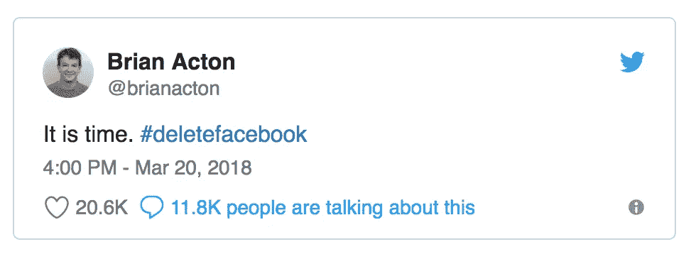

# 删除脸书就像接受我们民主的失败

> 原文：<https://medium.com/swlh/deleting-facebook-is-like-accepting-failure-of-our-democracy-8eb50b0b2ecc>

## 你不能同时关心和放弃。你选择哪一个？

剑桥分析揭秘不需要介绍——如果你正在读这篇文章，你已经知道了。据报道，约有 1 万人以#删除 facebook 为标签发推文，其中最受欢迎的是 Whatsapp 联合创始人布莱恩·阿克顿，他不久前以 190 亿美元的价格将自己的公司卖给了脸书！

一些人在脸书上发布了最后的告别帖子，删除了他们的账户。然而，许多从脸书删除自己的人出于个人或职业原因选择保留 Instagram 和/或 Messenger。

> 删除脸书就像离开我们的民主。这真的是我们想要做的吗？

更新:关于这篇文章的评论提出了与脸书有关的民主参考的问题。此外，社交媒体是一个时间接收器，因此是时候#删除 Facebook 了，这一观点得到了强调。我在这里试着总结一下我对这些方面的想法。

 [## 脸书连接着数十亿人。

### 对这篇文章的评论从嘲笑我观察到的删除脸书和走开之间的等同…

medium.com](/@hellovidya/facebook-connects-billions-of-people-3a86b4272e56) 

是的，[马克·扎克伯格](https://medium.com/u/c79346ea7c9a?source=post_page-----8eb50b0b2ecc--------------------------------)搞砸了。他没有足够的责任来保护我们的民主。随着成功而来的是责任，而他却搞砸了。

对于上市公司来说，如果创始人和/或首席执行官对股东不负责，他们就会被赶下台，这种情况并不少见。我们必须有可能对马克和董事会采取行动，因为他们对人们的数据不负责任，特别是在涉及国家安全、平民安全和违反民主本身的时候。

*马克保留大约 25%的公司所有权和巨大的董事会控制当然是一个主要问题。但是，这篇文章不是关于法律的，所以，我不会在这里讨论这个问题。*

事情是这样的。当政府让爱国者失望时，他们不会逃离这个国家。爱国者有责任去履行，这需要我们留下来带来改变。

更重要的是，虽然这是脸书管理层的失败，但也是我们的失败。

> 由于不知道我们的信息是如何被共享的，并且忽略了共享的内容，我们对信息滥用负有部分责任。

现在，让别人听到我们的声音比以往任何时候都更加重要。不是所有人都能成为草根活动家。但是我们每个人都可以成为社交媒体上的积极分子。

脸书是我们声音最大的地方。通过退出网络，我们有意地缩小了拯救我们的民主所迫切需要的覆盖范围。

> 如果我们每个人都把这作为自己的使命，那么曾经威胁我们民主的平台也可以拯救我们的民主。

## 不要删除脸书。相反:

*   更多地表达你的观点——机不可失，时不再来。你在等什么，天启吗？！
*   倾听故事的方方面面，即使这需要加入一些不舒服的团体。当我感觉自己与另一方脱节时，我会阅读保守团体和观点。它激怒了我，让我晚上无法入睡。但是，值得。
*   停止参与广告，点击诱饵。如果你想证明一个观点给马克 Z，**这个**是你怎么做的。

> 现在，比以往任何时候都更有助于传播对你有意义的声音。对有争议的话题做出反应和评论，你可能只是一个沉默的旁观者，直到现在！

值得重复。当政府让爱国者失望时，他们不会逃离这个国家。爱国者有责任去履行，这需要我们留下来带来改变。

> 成为你想在世界上看到的改变！

*如果你同意，就从在你的脸书 feed 上分享这篇文章开始(不，我绝对不是在推销自己——我很乐意分享你的观点——请在这里给我留下建议，我很乐意分享我同意的观点！).*

## 这篇文章发表在《T4》杂志《创业》(The Startup)上，这是 Medium 最大的创业刊物，拥有 308，471+读者。

## 在这里订阅接收[我们的头条新闻](http://growthsupply.com/the-startup-newsletter/)。

