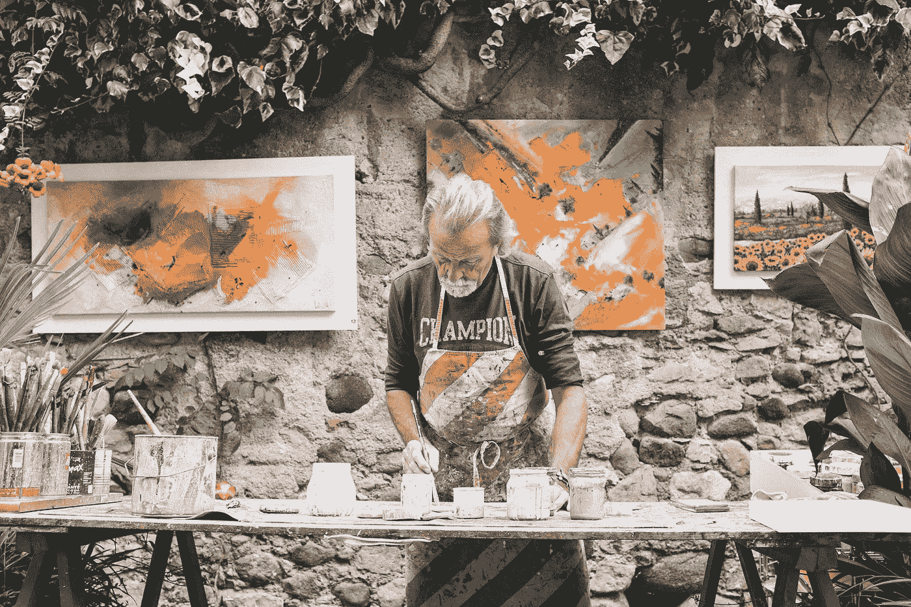

# (深思熟虑)熟能生巧:如何成为任何领域的专家

> 原文：<https://medium.com/swlh/deliberate-practice-makes-perfect-how-to-become-an-expert-in-anything-ec30e0c1314e>

Originally published on [**JOTFORM.COM**](http://jotform.com)

人类超越了自己。

我们比以往任何时候都更快、更聪明、更强壮、更有情感智慧和艺术天赋。

看一看当今世界上的任何一个职业。

从音乐到数学到径赛，以前不可能的事每天都在实现。