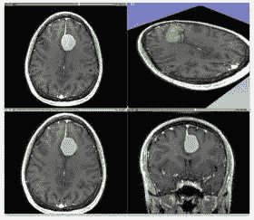

# 为了明天更好的未来，今天让人工智能民主化

> 原文：<https://medium.com/swlh/democratize-artificial-intelligence-today-for-a-better-future-tomorrow-fbb33e04b3f9>

作者:阿达尔·夏尔马、[拉梅什·戈里·拉加万](https://medium.com/u/2d339de77f89?source=post_page-----fbb33e04b3f9--------------------------------)和[苏坎特·库拉纳](https://medium.com/u/6d41261644a8?source=post_page-----fbb33e04b3f9--------------------------------)

人工智能对人类有很大的帮助。不幸的是，滥用的范围也很大。鉴于企业和国家实体建立主导地位的趋势，我们分析了伦理问题，并倡导民主化的必要性。

关键词:数据、人工智能、人工智能、民主、社会控制、权利、隐私、透明、平等、数据保护

*Figure 1:* ***United Nations General Assembly*** *(Wikimedia Commons)*

*“仅仅是选举人是不够的。有必要成为立法者；否则，那些能够制定法律的人将成为那些只能成为选举人的人的主人。”― B.R. Ambedkar*

考虑以下场景:你梦想中的工作面试迟到了。你拿起你的邮差包，冲出你的公寓，没有在意灯或门锁:他们感觉到你的缺席，并采取相应的行动。当你在电梯里焦虑不安地抽搐时，你的智能手机——意识到约会——会叫一辆无人驾驶出租车。跳进车里，你打开一个音乐流媒体服务，它会自动将你调到一首*勃兰登堡协奏曲*来让你平静下来:你手掌上的汗水向设备传达了很多信息。到达目的地后，你冲进大楼，因为你的电子钱包会自动支付旅费。面试结束后，你对自己的机会很有信心，但后来发现你被拒绝了，因为你私下的性取向——被评委桌上那个奇怪的摄像头发现了，它一直盯着你。

你*会有什么感觉？*

这甚至不是未来的事情:人工智能(AI)渗透到我们的生活中。从周末的[寻找火绒约会](https://techcrunch.com/2017/12/01/tinder-tests-a-new-feature-that-uses-a-i-to-suggest-who-to-super-like/)到宇宙中的[新行星](https://www.nasa.gov/press-release/artificial-intelligence-nasa-data-used-to-discover-eighth-planet-circling-distant-star)，几乎任何领域都使用它。人工智能是技术上的一大飞跃，但它也一直笼罩在争议中。一方面，它对地质学家预测地震有很大的帮助，但另一方面，人们训练它进行种族歧视还是太天真了。虽然技术的开放性和透明性值得称赞，但大多数产品背后的秘密成为潜在利用的担忧。在目前的状态下，人工智能似乎是为科技巨头定制的(或许也方便了威权主义)；虽然组织捍卫他们的投资，但作为谦逊的消费者，我们有义务辨别他们的真实意图，并为我们的权利而斗争。

**数据不仅仅是数据**

*华盛顿大学机器学习教授、《大师算法》的作者佩德罗·多明戈斯*说:

人们担心计算机会变得太聪明并接管世界，但真正的问题是它们太愚蠢了，它们已经接管了世界。

今天，社交媒体、搜索引擎、物联网和类似平台产生了海量数据，这些数据可能会为我们的世界提供宝贵的见解(它们肯定知道我们何时需要重新订购卫生纸)。根据一些估计，到 2020 年，活跃的智能手机设备将超过 30 亿台，联网传感器将超过 1500 亿个——这是预计人口的 18 倍——到下一个十年。换句话说，大量产生的数据将比我们今天产生的多得多。大数据的吸引力吸引着公司和政府进行投资和资本化。

那么，数据将如何改变社会的动态？一个数据控制的社会将是一个数据在决定国防、经济和所有其他政府政策的组织中占据优势的社会。未来的问题是，这样的社会是否会存在，这是有争议的，但我们必须承认，我们已经生活在一个数据影响大多数决策的世界。人工智能通过研究数据(数据分析)来发现有趣的模式，并为手头的问题提出候选解决方案，从而补充了人类的决策艺术。一种工具，不仅通过利用资源(时间、劳动力、资本等)来帮助做出决策。)而且*符合*明确的标准(可定制:准确性、速度、通用性等。)，毫无疑问，在任何行业都有很大的就业潜力。

例如，当你报告一封电子邮件是垃圾邮件时，Gmail 中的人工智能会了解它并更新“垃圾邮件过滤器”。每当一封新的类似垃圾邮件的电子邮件到达时，人工智能决定直接把它扔进垃圾邮件箱。因此，您不会在收件箱中看到类似的电子邮件(而是在垃圾邮件列表中)。然而，如果你认为它做了一个错误的决定(误分类:一个误报)，你总是可以取消垃圾邮件，让人工智能也学习这个。

正是像这样的应用，为人工智能赢得了工业界和政府间巨大的关注和兴趣。一个为审查人类提出解决方案的人工智能的能力是有限的。然而，对于自主决策的人工智能来说就不一样了，它可以自由地采取行动而无需人类的批准。自主的力量并不一定意味着人工智能只是恶意的或仁慈的，而是应用程序和环境将真正控制这样一个人工智能的行为。

*Figure 2:* ***Medical Image Segmentation****: a brain tumor, is segmented in an MRI scan of the brain.The green-blob is the segmented tissue.*

目前，肿瘤学家需要 4 个多小时来识别和分类癌变组织。为了有效地定向放射治疗，快速和准确地分析扫描是至关重要的。图像分割等 AI 算法(有绿色斑点吗？)和分类(这个绿色斑点是癌性的吗？)以惊人的速度和准确度帮助检测肿瘤。 [DeepMind Health 的研究人员与 UCL 医院](https://www.uclh.nhs.uk/OurServices/ServiceA-Z/Cancer/RADIO/Pages/DeepMindQandA.aspx)合作，训练人工智能模型，快速执行分割并提高向患者提供的治疗质量。

显然，人工智能对人类非常有益。然而，人工智能中的自主性也可能成为对伦理突出的渴望的巨大障碍。医疗行业面临移植器官短缺的问题；医生必须迅速决定哪个候选人得到它。这个过程涉及许多对医生来说足够困难的伦理困境——当 AI 开始做出这些决定时，伦理界限变得更加模糊。例如，杜克大学的研究人员开发了一个决策系统，为肾脏移植挑选受体。它被要求在一个年轻的酗酒者和一个老年癌症幸存者之间做出选择；它选中了那个年轻人。但是伦理上的困境是:如果年轻人回到他酗酒的生活方式，他很可能也会破坏新的肾脏。或许这位长者(重获新生)本可以做一些更积极的事情。这是一个最有经验的医生表示自己无法做出的决定，因为它是基于几乎不可能预测的情景(如果这个年轻人不喝酒呢？如果长辈的癌症复发了怎么办？).算法是有问题的，因为它做出的决定可能连它自己都不理解，以这种方式，这样一个*系统*做出的决定有多道德？

人工智能帮助决策的另一种方式是对抗认知偏见。然而，自治也可能使系统容易受到安全威胁和意外事件的影响。举个例子:2010 年 5 月 6 日，美国股市崩盘(即臭名昭著的“闪电崩盘”)，金融巨头损失了数十亿美元。*为什么？*因为高频异常检测系统(自主决策 AI)未能检测到近 19000 个假卖单。几分钟内，价格下跌，从市场上抹去了近 1 万亿美元的价值。后来的刑事调查得出结论，一名交易员利用了此前未知的(异常检测系统的)漏洞和市场结构，导致了这场灾难。测试简单的软件已经够难了，如此高吞吐量的人工智能实际上不可能进行详尽的测试或实时跟踪行为。如果系统以前所未有的方式违反了任何边界条件，整个机器就会陷入混乱。

人工智能的透明度是另一个问题。人工智能中最先进的算法本质上是黑盒，没有人完全知道它们在技术上是如何做出决定的。此外，专有算法的基本设计通常被公司保密。一个程序可以通过观察面部图像来预测一个人的性取向。其他面部识别程序可以预测人们的[情绪状态](http://news.mit.edu/2016/detecting-emotions-with-wireless-signals-0920)、[政治倾向和智商](https://www.theguardian.com/technology/2017/sep/12/artificial-intelligence-face-recognition-michal-kosinski)。一些公共研究引发了伦理争议。然而，行业或政府机构中不道德部署的算法的数量可能永远不会真正为人所知。

“我认为政治系统会利用人工智能来恐吓人民。”—杰弗里·辛顿

无论我们投入多少信任，如果我们在已经有偏见的数据上训练它们，这些算法都会继承偏见。例如，如果一个人在一个对非洲裔美国人有偏见的犯罪记录数据集上训练一个人工智能模型，算法将从这种内置的偏见开始。美国的几个州向罪犯发布“风险评估分数”，预测未来犯罪的可能性，并帮助法院确定最佳惩罚。然而，现在人们认为[在法庭上注入了种族偏见](https://www.propublica.org/article/machine-bias-risk-assessments-in-criminal-sentencing)；有很多例子表明，第一次被起诉的黑人比臭名昭著的白人罪犯获得的风险分数要高得多。开发该系统的公司拒绝透露它用来分配这一分数的计算方法。

缺乏民主控制进一步加剧了透明度问题。这迫使人们思考，数据是否意外地显示了人工智能的偏见，或者是公司和政府暗中监管人工智能，以建立主导地位或基于主观标准进行歧视？

随着我们越来越依赖于搜索引擎和社交媒体等技术，通过明确诱导数据场景中的偏见，可能被利用的潜力也在增长。对选民数据的控制有可能诱使政府干预选举，以确保 T2 继续获胜。[公司也可以通过调整算法来提升姐妹企业而不是竞争对手的业务，从而在财务上受益。拥有这种权力的政府或组织可以支配所有其他政府或组织；这是对社会凝聚力的威胁。](http://www.bbc.com/news/technology-40406542)

如果数据集是干净的，但系统确实表现不佳，而不是受到[外部操纵](https://www.nytimes.com/interactive/2015/business/international/vw-diesel-emissions-scandal-explained.html)，那么技术就有问题(因为，所有算法都不是完美的，代码中的错误很常见)，研究人员有义务分析底层算法，使它们无病呻吟。然而，大多数这些系统都受到知识产权的有力保护。公司经常过度销售他们的产品，只公布模糊的细节，很少透露有意义的信息。研究方法和算法计算等细节的封装在竞争激烈的行业中至关重要，但除了有争议的事件之外，公共信息(透明度)的严重缺乏自然会让人产生怀疑。

最后，从社会控制的技术统治中——使用人工智能机器——可能会出现一种新的独裁形式。为了抑制自上而下的全球控制的出现，我们必须使人工智能民主化，这需要透明度以及保护宪法和公民权利。这似乎也是要求额外权利的最佳时机，这些权利不仅捍卫身份和权力，也捍卫社会动态和多样性。通往人工智能更美好未来的道路将会有许多高潮和低谷。有时，我们可能会发现自己陷入意料之外的困境，但正是在这种情况下，我们的社会凝聚力和政府政策将帮助我们获胜。

— —

关于:

**Adhar Sharma** 是与 **Sukant Khurana** 博士团队合作的研究员，专注于人工智能的伦理。

Raamesh Gowri Raghavan 正在与 Sukant Khurana 博士合作多个项目，从人工智能的流行写作、技术对艺术的影响，到心理健康意识。

Raamesh Gowri Raghavan 先生是一位获奖诗人、著名的广告专业人士、历史学家和探索科学与艺术界面的研究人员。他还与 Khurana 博士和 [Farooq Ali Khan](https://medium.com/u/3ed4f198804b?source=post_page-----fbb33e04b3f9--------------------------------) 一起倡导大规模的抗抑郁和自杀预防工作。

您可以通过以下网址了解更多关于 Raamesh 的信息:

https://sites.google.com/view/raameshgowriraghavan/home 和 https://www.linkedin.com/in/raameshgowriraghavan/?ppe=1[的](https://www.linkedin.com/in/raameshgowriraghavan/?ppe=1)

Sukant Khurana 博士经营着一个学术研究实验室和几家科技公司。他也是著名的艺术家、作家和演说家。你可以在 www.brainnart.com[或 www.dataisnotjustdata.com](http://www.brainnart.com)了解更多关于苏坎特的信息，如果你希望从事生物医学研究、神经科学、可持续发展、人工智能或数据科学项目，为公众谋福利，你可以在 skgroup.iiserk@gmail.com 联系他，或者通过 LinkedIn[https://www.linkedin.com/in/sukant-khurana-755a2343/](https://www.linkedin.com/in/sukant-khurana-755a2343/)联系他。

这里有两个关于 Sukant 的小纪录片和一个关于他的公民科学努力的 TEDx 视频。

 [## Sukant khu Rana(@ Sukant _ khu Rana)|推特

### Sukant Khurana 的最新推文(@Sukant_Khurana)。创始人:https://t.co/WINhSDEuW0 和 3 家生物技术创业公司…

twitter.com](https://twitter.com/Sukant_Khurana) 

## 这个故事发表在 [The Startup](https://medium.com/swlh) 上，这是 Medium 最大的企业家出版物，拥有 287，184+人。

## 在这里订阅接收[我们的头条新闻](http://growthsupply.com/the-startup-newsletter/)。

