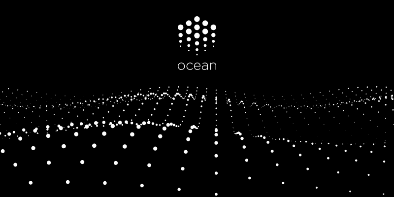
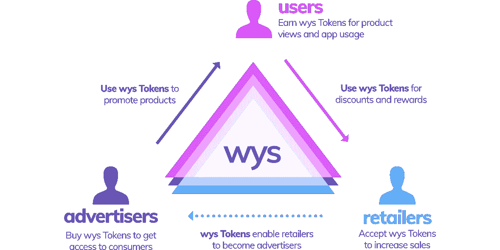
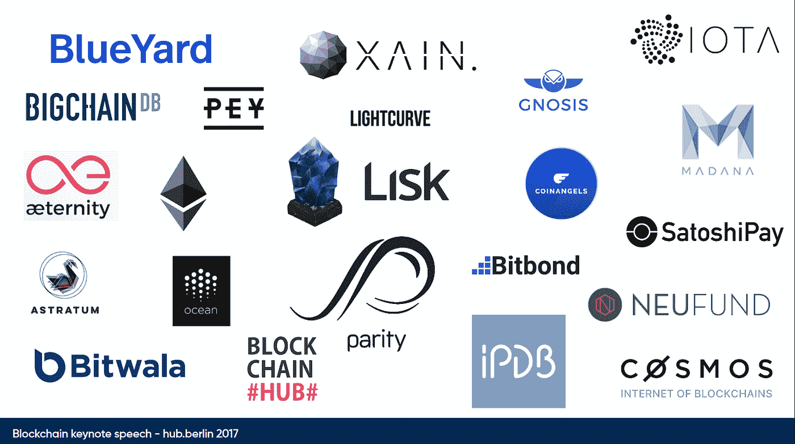

# 数字化市场的民主化

> 原文：<https://medium.com/swlh/democratizing-the-digital-markets-787b749b3405>

每个人都在谈论比特币炒作的金融方面。但是底层的分散技术有更大的潜力。它们可以用来建立分散化版本的社交媒体平台，比如脸书，或者像谷歌创造的巨大的广告市场。这些新技术可能被用来打破现有的垄断，让我们重新掌控自己的数据。

> 我认为我们即将看到数字市场民主化的开端。

Protocols like [https://oceanprotocol.com/](https://oceanprotocol.com/) use blockchain technologies to democratize AI

当你读到比特币时，你很快就会遇到它的底层**区块链**技术。区块链是一种去中心化的方法，不需要中介或中央平台提供商。相反，区块链是分布式工作的——你可能会想到一大群遵循共同协议的计算和存储节点。

如果你回想一下:在新千年开始的时候，点对点的方式已经很流行了。数百万人使用 Napster 分享音乐。但是当时的大多数用例都是非法的。分散系统很快失去了重要性。相反，移动应用和集中式云计算成为了主导的技术方法。

尽管如此，去中心化技术在区块链社区得到了进一步发展。他们现在得到了越来越多的关注和巨大的资助。许多观察家很快被这一发展的经济刺激所分散了注意力。因此，潜在技术对我们社会的革命性潜力仍然被广泛忽视。

乍一看，基于区块链的方法似乎是一种倒退——即使对许多计算机科学家来说也是如此。像来自 chain.com 的亚当·路丁这样的技术先驱[很清楚这个事实:](https://blog.chain.com/a-letter-to-jamie-dimon-de89d417cb80)

*   与基于云的中央方法相比，这些方法速度较慢。
*   当前版本消耗大量能量。基本的共识算法使用计算密集型加密方法，以保护系统免受欺诈。这种系统的“内置防御机制”是有代价的。
*   它们比集中式方法更难扩展。
*   很多区块链系统还是用户体验不好。
*   大多数系统仍未受到监管——因此法律基础仍不稳固。

区块链场景接受所有这些缺点，以便真正去中心化他们的系统。作为回报，他们创造了一个自由市场，这个市场很好地保护了免受审查和来自外部的攻击。自我修复能力是这些系统最底层的基础。

> 起初，这听起来很老套。
> 而且光看文章真的很难把握区块链的潜力。

# 我的个人旅程

在与各种创业公司的密切接触的激励下，我决定在最近几个月获得自己作为这些技术的用户的经验。

我的第一步是与来自柏林的专注于区块链的初创公司 [Wysker](https://www.wysker.com/) 合作，该公司希望创造一种新的在线购物体验，正如你在这个视频中看到的[。但真正的革命不是应用程序，而是底层系统。维斯克为它的用户、零售商和广告商创造了一个市场。与许多区块链公司类似，Wysker 发行自己的](https://www.youtube.com/watch?v=_1FHa_QftP4) [WYS 令牌](https://www.wystoken.org/)，以创建数字资产作为其市场的基础。

来源:[威斯克](https://www.wystoken.org/)

Wysker 方法的中心焦点是他们用户的隐私。在购物过程中，用户可以控制自己的数据。他们可能决定完全不共享他们的使用数据。或者，如果他们故意接受 Wysker 使用对他们行为的跟踪来显示符合他们用户当前兴趣的定向广告，他们可能会决定获得 WYS 代币。稍后，用户可以使用这些代币来支付账单。

> *表面上 Wysker 用这个概念攻击亚马逊等零售平台。但实际上他们创造了一个社区，他们建立了一个生态系统，他们建立了一个广告系统，让用户控制他们数据的使用。他们正在攻击谷歌相当不知名的广告网络。让它深入人心。*

像许多类似的创业公司一样，Wysker 推出了初始硬币发行(ICO)来寻找早期投资者。ICO 目前正在预售中。它也面向小投资者和粉丝。我参加了这次预售。你可以在这里找到我的“投资者之旅”的五味杂陈的感觉。

> 没人知道这家公司是否真的会成功。但对我来说还有一件事:魅力。这种环境下发生的事情多得令人难以置信。许多工具都在争夺用户的青睐——包括商业工具和开源工具。势头是巨大的。

# 进一步洞察

11 月底，我在柏林参加了德国数字协会 [BITKOM](https://www.bitkom.org/EN/index-EN.html) 的 [Hub 会议](https://www.hub.berlin/en)。你可以真切地感受到区块链运动的力量:没有人谈论第一代(比特币)或第二代(以太坊)。热门话题是**区块链 3.0** 。新的方法有望解决上面提到的许多技术缺点:诸如[和](https://iota.org/)之类的框架引入了新的分类账概念，这些概念消除了这些分散系统中在交易速度、交易成本和能源消耗方面的许多限制。创建者有很大的目标:他们想建立一个[民主化的数据湖](https://blog.iota.org/iota-data-marketplace-cb6be463ac7f)，让每个数据项的创建者(即我们每一个人)控制他们数据的使用。IOTA 背后的组织结构是引人注目的:它是一个致力于欧洲数据保护标准( [GDPR](https://en.wikipedia.org/wiki/General_Data_Protection_Regulation) )的基础。同样令人惊奇的是:著名合作伙伴的名单[包括许多大学，但也包括像博世和德国电信这样的大公司！](https://data.iota.org/)

欧洲政策仍试图支持本土企业与美国科技巨头竞争。没有人注意到这种充满活力、自下而上的区块链场景恰恰在欧洲和德国发展，正如 Max Kordek 在 Hub 演示中的一张照片所示。柏林目前约有 40 家区块链创业公司:

来源:[马克斯·科德克](http://maxkordek.com/max.kordek.berlin.hub.pdf)

# 区块链 3.0 的例子

应用区块链技术的可能性非常广泛。像 Dimitri de Jonghe 这样的区块链研究人员想要创建各种各样的 T2 公共事业网络。有些公司为数据、身份管理、贷款、风险投资等创造市场。其中一些正在攻击现有业务:例如 [FileCoin](https://filecoin.io/) 与 DropBox 竞争——酷的是:你可以成为它的一部分。你可以把你闲置的电脑存储空间派上用场，成为一名“Filecoin miner”。你将通过在 Filecoin 市场上完成存储请求获得报酬，并获得代币，稍后你可以用代币兑换传统货币。

> 听起来很吸引人？嗯— [*FileCoin 在他们的 ICO 期间刚刚收了少到 2.57 亿美元*](https://www.coindesk.com/257-million-filecoin-breaks-time-record-ico-funding/) *。*

像 [BigchainDB](https://www.bigchaindb.com/) 或 [IPDB](https://ipdb.io/) 这样的框架甚至想用去中心化、隐私优先的数据存储和联网方法来重建互联网基础。许多新公司都集中在欧洲，比如柏林(德国)、代尔夫特(荷兰)或楚格(瑞士)。

# 结论

现在还为时尚早，但可能性是巨大的。我非常期待看到这些新生态系统的出现。很快肯定会有很多失望。然而，我确信我们目前看到了一个巨大的范式转变——来自德国和欧洲。如果我是脸书或谷歌，我会密切关注这一发展。

如果你想更深入地了解这些话题，我推荐你在 Youtube 上观看迪米特里·德容的精彩演讲。

**免责声明**:你可以在[zh lke 官方博客](https://www.zuehlke.com/blog/demokratisiert-blockchain-digitale-maerkte/)上找到这篇文章的德语版。我还会把这个故事交叉发布在 steemit 上，这是一个位于区块链的智能社交媒体网络。

## 这个故事发表在 [The Startup](https://medium.com/swlh) 上，这是 Medium 最大的企业家出版物，拥有 289，682+人。

## 订阅接收[我们的头条](http://growthsupply.com/the-startup-newsletter/)。

