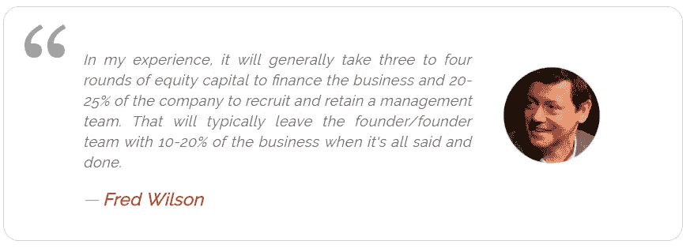

# 揭开初创企业股权的神秘面纱

> 原文：<https://medium.com/swlh/demystifying-startup-equity-7497da92e38e>

这是我的“大 ol”九部分系列的第五部分，探索创业融资的每一个可以想象的方面。从融资回合到估值方法，准备好一个完整的融资速成班。

[***点击阅读全部九个部分的完整帖子，或者下载成 PDF 格式。***](https://www.cobloom.com/blog/startup-funding?utm_campaign=Repurposed%20Content&utm_medium=startup%20funding&utm_source=medium)

大多数创始人一开始都拥有自己的公司。

但是为了尽可能快地发展，你需要投资，为了获得你需要的资本，你的投资者想要拥有你公司的一部分。

你成长得越快，你的[消耗率](https://www.cobloom.com/blog/saas-metrics)就越大，你需要的资本就越多。你从 pre-Seed 到 Seed 再到 A 轮，但是随着每一笔现金的注入，你不得不放弃你公司的另一部分。出价太低，投资就会枯竭——出价太高，你很快就会发现自己连自己公司的股份都没有了。

[了解稀释如何影响你的创业——马克·苏斯特](https://medium.com/u/9d9e7084d6cb#.6igsummxr)*   [股权等式—保罗·格拉厄姆](http://paulgraham.com/equity.html)*   你应该筹集多少资金？一种经济学方法——皮埃尔·恩特蒙特

*准备好看整篇帖子了吗？* [***点击阅读完整帖子，或下载成 PDF 格式保存以备后用。***](https://www.cobloom.com/blog/startup-funding?utm_campaign=Repurposed%20Content&utm_medium=startup%20funding&utm_source=medium)

## 这个故事发表在 [The Startup](https://medium.com/swlh) 上，这里有 263，100+人聚集在一起阅读 Medium 关于创业的主要故事。

## 在这里订阅接收[我们的头条新闻](http://growthsupply.com/the-startup-newsletter/)。

