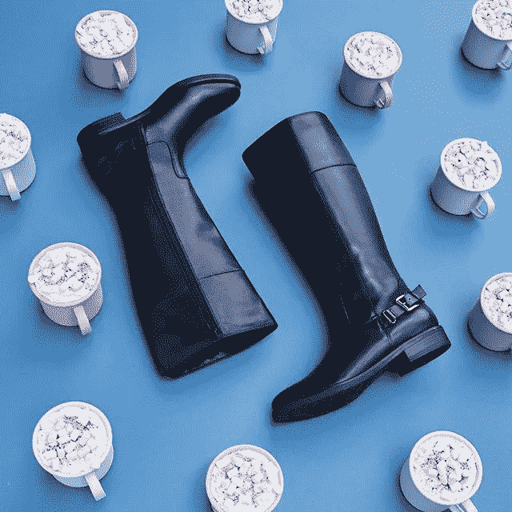
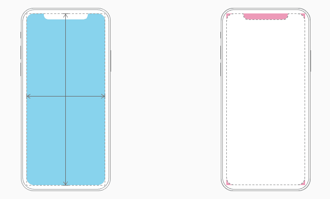
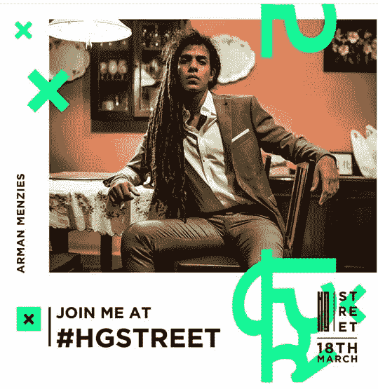
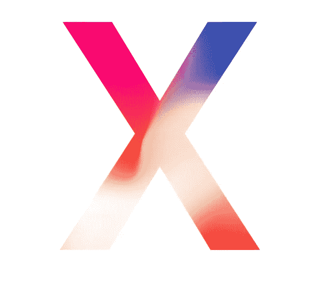
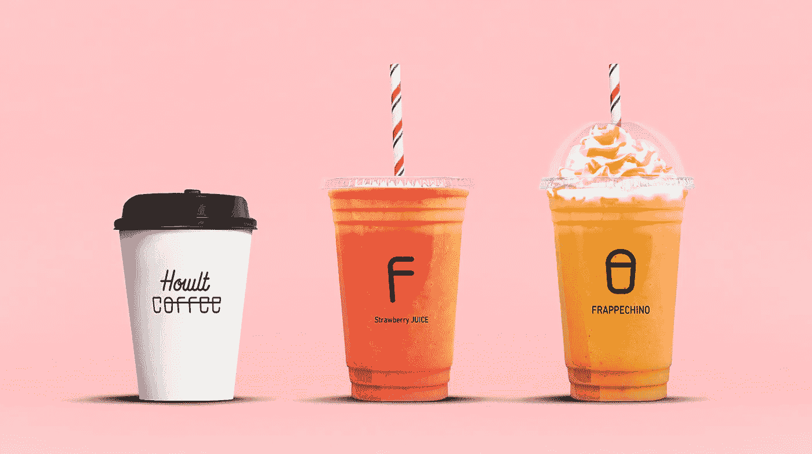

# 为设计而设计

> 原文：<https://medium.com/swlh/design-for-designs-sake-an-autodidactic-quest-in-branding-a4bebf2e6c20>

品牌塑造中的自学练习

*这里阐述的原则，可能标志着你对图形设计迷人领域的尝试。但是你必须拒绝他们。*

1891 年，world 迪克森渴望尽可能真实地捕捉世界。通过第一台电影摄影机，任务是将静止图像制作成动画*，为眼睛做留声机为耳朵做的事情。*

今年是 2018 年，虽然较短的注意力持续时间引发了我们的暴饮暴食习惯，但我们正在见证平面设计的崛起。对于视觉传播的早期先驱来说，像电影一样有前途的领域。

图形设计是视觉信息的一种广泛形式，通过图像、文本和符号来运作。这篇文章试图开发一个环境，在这个环境中，你可能能够发挥你作为一个设计师的技能。

为了利用数字营销和沟通工作，领先的服务商 Adobe 发布了一系列设计软件。从赞助的脸书广告的海报到产品的 UI/UX，营销人员可以通过各种方式实现他们的目标。

但是，在你开始这个视觉之旅之前，要知道你不需要成为一名艺术家就能成为一名设计师。任何人都可以共享内容。你需要的是对你的目标受众有一个公平的认识，以及什么对他们有用，什么对他们没用。

除此之外，一个有品位的精简沟通策略是至关重要的。你需要像编辑一样思考，让你的观众在有限的时间和空间内无缝地推断出你在展示什么。

## **1)场地布置**

找出你视野的形状。如果你正在为社交媒体营销设计一个作品，你将获得内容规范。基本上所有的东西从尺寸到复制品。

从小处着眼，关注负面空间。重要的是给眼睛提供足够的空间，让信息从上到下，从左到右流动。

> 将文本限制在最少，以产生最大的影响。

## 2)排版

文本的样式和整体外观取决于您选择的字体、大小、颜色和粗细。这基本上就是印刷术的全部内容。当您探索所选设计软件的可用范围时，请记住 ***少即是多*** 。

在选择一种完全适合你的交流风格的字体时，你需要谨慎。试着坚持使用一种或两种字体，但是不要犹豫多样化——这取决于你项目的交流目标。

你必须熟悉最常用的字体——衬线字体。它出现在社论中，与无衬线相反，无衬线没有围绕字母的弯曲边缘。后者适合更正式的交流方式，因为它带来了更多的清晰度。

> 避免过于随意或单薄的字体，比如漫画字体( *pfft* )。

## **3)色彩理论**

颜色在吸引人们对你设计的注意方面起着至关重要的作用。它几乎能立刻营造气氛。

注意下面 Instagram 帖子中某鞋品牌的极简主义。布局的领域是干净的，并且对象被组织用于清晰和无混乱的通信。品牌信息是隐含的。但是颜色的选择决定了字体、图像和背景之间的对比

一旦你弄清楚了品牌身份，就直接投入到色轮中。经过大量的试验和错误，你将学会改变色调，饱和度和价值的程度，以创造出适合你的设计的色调。

## **4)平衡和校准**

到现在为止，你一定已经注意到设计是如何主要由形状构成的。无论是字体、符号还是图像，这些形状都需要处于平衡或完美和谐的状态。实现这一目标的最简单方法是正确对齐。

对称分割磁场是一个很好的起点。在你的初始布局上放置一个网格来合理分配物体的重量。这将使你能够在深入研究其他细节之前建立秩序。关键是在你的设计的整体外观中持续地建立和缓和紧张感。

由首席设计官 Jony Ive 创建的苹果设计确保了屏幕的布局不会被设备的圆角、传感器外壳或允许访问主屏幕的指示器所遮挡。

一旦横向和纵向尺寸到位，其他方面如宽高比就进入了画面。保持对称以避免观众从中心信息中分心。

在某些情况下，需要不对称的平衡。与其他对象相比，有些对象需要故意弹出。特别是当沟通不针对目标受众，或者需要传达非常规的想法时，这种做法尤其适用。

下面这张本土海报的主角是独立电子艺术家阿尔曼·门泽斯(又名佐库马)。除了图像之外，请注意任意放置的“x”和印地语中的随机字母如何扰乱了 HG 的街头节日的公告。这个品牌显然迎合了打破传统的观念。

> 他们的品牌目标是代表那些打破印度狭隘文化身份和刻板印象的艺术家。

## **5)颜色和对比度**

你对颜色的选择是建立你的设计的 ***情绪*** 和 ***吸引力*** 不可或缺的。如前所述，你必须从色轮开始，在找到和谐之前进行简单的实验。

苹果的 Iphone X 模糊了设备和显示器之间的界限，以创造无缝的用户体验。冷热两种颜色的创新混合构成了其新时代魅力的关键。只需一瞥，似乎有一种潜意识的真实性，这实际上是硬销售营销策略的结果。

对比是下一个重要的原则，它让你在强调重点的同时，发现哪个物体在你的设计中最重要。两个设计元素需要相互对立才能起作用:比如大字体对小字体，黑字体对白字体，粗字体对细字体，现代字体对传统字体等等。它有效地组织了物体所传达的信息。

## **6)层级**

层次是第一个至关重要的技巧，它可以帮助浏览者在一切之前理解你的交流的关键。换句话说，它告诉观众从哪里开始，从哪里结束，同时关注最重要的信息。

一般来说，你应该把正文放在能够突出其中心地位的地方。其余的对象和文本可以跟随。

> 但这不是一个硬性规定。事实上，当涉及到层次结构时，大多数设计师会违背构图规则。

的确，信息从左到右、从上到下流动最好。此外，负空间的使用强化了整洁的布局有助于最佳设计的观念。但是，随着你逐渐发现主观成分可以有多主观，这些规则实际上可能会根据项目的交流目标变成技术。

下面的广告是由 LOWERS INC .设计的。它更像是一个抽象的安迪·沃霍尔，他曾经用他的艺术打破了所有流行的惯例。注意设计师们如何通过他们的选择专注于传达独特的隐含观点。Howlt 这个咖啡品牌仍然备受关注，但刻板的等级观念已经不复存在。

## **7)接近度和空间**

观察如何接近和空间齐头并进，同时支持这种有计划的划分。邻近性是指将不相关的元素组合在一起，以在它们之间创建一个牢固的关联。但是周围的负空间对这种联系的具体化至关重要。

时刻提醒自己的听众，确保沟通尽可能透明。而且一定要保证用词简洁。在社交媒体上发布时，描述也应该作为状态更新发布，而不是用文本塞满横幅。

直觉在决定视觉传达方面起着巨大的作用。它是通过实践和坚持，以及不断的重复和反复来构建的。一定要参考其他设计来获取灵感。观察是关键。一个好的开始是复制最吸引你的设计。

你将会接触到更多的基本概念工具。那么，你的最终目标是在开始你自己的创造过程之前，内化它们，但也可能拒绝它们。

> 设计的过程会随着时间的推移而演变，你必须有耐心。

设计师可以通过几条路在这个领域建立自己的事业。这可能是你从非设计师转变为内容营销人员、产品或编辑设计师或动画艺术家的第一步。

*我目前的灵感来自资深设计师* [*丹麦 Ahmed 的书 MyShow UX 案例研究*](https://blog.prototypr.io/bookmyshow-ux-case-study-3dbb5c8a1ea2) *，以及* [*Julia Potato 的 Beehance 作品集*](https://www.behance.net/juliapotato) *。记住，你需要及时建立自己的投资组合。*

## 这个故事发表在 [The Startup](https://medium.com/swlh) 上，这是 Medium 最大的创业刊物，拥有 315，028+人关注。

## 在这里订阅接收[我们的头条新闻](http://growthsupply.com/the-startup-newsletter/)。

