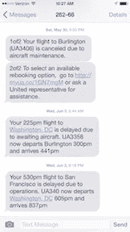

# 设计模式——循环往复

> 原文：<https://medium.com/swlh/design-patterns-coming-full-circle-d8292e261dc6>

这是一个由两部分组成的博客系列的第一部分，这个系列与架构中的设计模式、软件工程和我们在 Flux 的工作有关。检查第二部分的 [*通量模式*](/@flux/design-patterns-coming-full-circle-part-two-ced2c69e4724#.eb88802o5) *。*

## 架构激发软件:设计模式

奥地利出生的建筑师克里斯托弗·亚历山大有一个简单而优雅的想法。他的想法是，人们应该命名并描述建筑中常见问题的解决方案。他称之为“设计模式”。

Christopher Alexander 在他 1977 年出版的开创性著作 *A Pattern Language* 中描述了 253 种设计模式，涵盖了从宏观到微观设计的所有内容。在宏观方面，他描述了区域和城镇规划的模式，如“模式 3:城市和乡村的手指”和“模式 52:道路和汽车的网络”。在光谱的中间，他描述了建筑之间的关系，例如“模式 101:建筑通道”和“模式 106:积极的室外空间”。在微观方面，他描述了个人空间以及如何让它们变得宜居和令人愉快，使用了“模式 159:每个房间的两面都有光”和“模式 201:齐腰高的架子”等模式。

> *格局 159:每个房间两面都有光* 给每个房间定位，使其至少两面都有室外空间，然后在这些室外墙壁上放置窗户，让自然光从不止一个方向射入每个房间。

用克里斯托弗·亚历山大(Christopher Alexander)的话来说，所有 253 种模式一起使用时，“创建了整个区域的连贯画面，有能力以一百万种形式生成这样的区域，所有细节都有无限的变化”。此外，实践者不需要一次关注所有 253 种模式——一个更小的模式序列可以作为模式语言来关注环境的更小部分，比如一个建筑或者甚至是建筑中的一个房间。简而言之，设计模式，无论是放在一起还是单独放在一起，都清晰地表达了可以在定制设计中重用的指导方针。

从最初出版模式语言*到 1987 年，时间快进了 10 年，当时两位计算机科学家[肯特·贝克](https://en.wikipedia.org/wiki/Kent_Beck)和[沃德·坎宁安](https://en.wikipedia.org/wiki/Ward_Cunningham)受到克里斯多夫·亚历山大作品的启发，开始尝试将设计模式的思想应用到编程中。他们在 OOPSLA 会议(面向对象编程、系统、语言应用)上展示了他们的工作，随后在软件工程社区引发了一个新的思想流派。*

在接下来的几年里，这些想法越来越受欢迎，1994 年，一群软件工程研究人员组成的四人组( [Erich Gamma](https://en.wikipedia.org/wiki/Erich_Gamma) 、Richard Helm、 [Ralph Johnson](https://en.wikipedia.org/wiki/Ralph_Johnson_%28computer_scientist%29) 和 [John Vlissides](https://en.wikipedia.org/wiki/John_Vlissides) )出版了一本很有影响力的书——《设计模式:可重用面向对象软件的元素——这本书至今仍在许多软件工程师的书架上(这对于一本超过 20 年的书来说已经很有意义了).

Gang of Four at OOPSLA conference, 1994

直到今天，这本书被广泛认为是面向对象设计理论和实践的重要来源。面向对象编程(简称 OOP)是一种围绕对象组织的编程模型。它关注这些对象可以执行的操作，以及这些对象操作的数据。

软件设计模式的关键思想，就像架构设计模式一样，是对一个经常出现的问题的通用可重用解决方案。它不是一个可以直接翻译成代码的成品设计，而是对如何解决一个可以在许多不同情况下使用的问题的描述。

常见软件设计模式的几个例子是:

*   *观察模式* : **A** 告诉 **B** 每当 **B** 发生变化时通知 **A** 。观察者模式应用于日常生活的一个例子是，当你注册了即将到来的航班的文本提醒。如果航班延误或者登机口有变化，你会收到变化的通知。

Flight alerts keep you informed, like the Observer Pattern

*   *代理模式* : **A** 是一个大的、重的、不灵活的对象 **B** 的轻量级替身。现实生活中代理模式的一个类比是能够将一封信投入街角的 USPS 邮箱，而不是跋涉到最近的邮局去投递你的信。邮箱是邮局的代理。

A USPS box is a proxy for the Post Office

*   *命令模式*:把一系列的动作当做一个命令，可以很容易的撤销或者重做。这方面的真实例子有 Google Docs 等程序中的撤销/重做，或者 Photoshop 中的历史调色板。

软件设计模式通常是语言不可知的，这意味着无论是用 C++、Go、Javascript、Python、Java、Ruby、PHP、Dart 还是其他语言编写，它们都可以很好地工作。它们只是概述了一个解决问题的方法，而这个问题在你之前已经有很多人经历过了。就像他们说好莱坞电影只有 7 个基本情节一样，我们通常在软件工程中面临的挑战也是有限的。在电影中，角色可能不同，但他们讲述的故事是熟悉的。同样，在软件工程中，细节可能不同，但真正独特的问题是有限的。

在软件行业中，在今天的软件设计模式被编纂之前，花费了许多年和许多人。这是一个实验、提炼和批判的过程，帮助塑造了软件设计是如何构思和实现的。然而，重要的是，这些模式*被*编纂成了法典，这样整个行业都能受益。

建筑就不一样了。虽然 Christopher Alexander 提出了设计模式的初始集合，但是软件设计模式所经历的实验、批判、提炼和最终采用在架构中还没有发生。今天绝大多数建筑设计项目都是定制的，人们一次又一次地解决同样的问题。在 Flux，我们问，**如果 AEC 行业像软件行业一样接受设计模式的概念，世界会是什么样子？**我们能否利用 AEC 社区的集体智慧和知识来造福整个行业？

那个世界会是什么样子？

*— Jen Carlile，Flux.io 联合创始人、软件工程师*

*阅读第二部分:***如果你对这方面的观点感兴趣！**