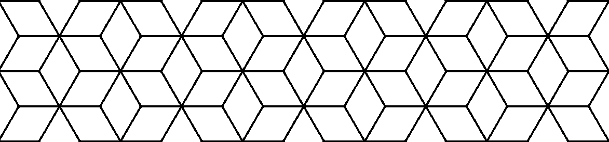
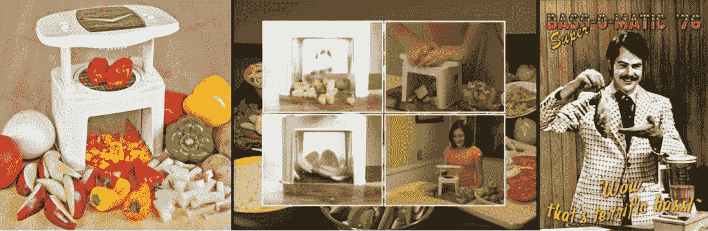
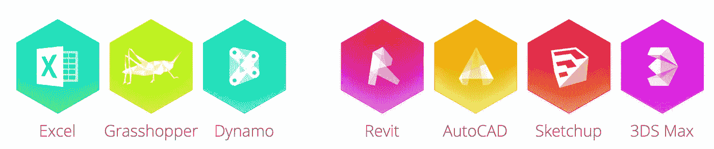

# 设计模式——循环往复，第二部分

> 原文：<https://medium.com/swlh/design-patterns-coming-full-circle-part-two-ced2c69e4724>

这是关于架构设计模式、软件工程和我们在 Flux 的工作的两部分系列的第二部分。你可以在这里查看第一部分: [*架构激发软件:设计模式*](/@flux/design-patterns-coming-full-circle-d8292e261dc6#.kv1aoix04)

今天，世界各地的设计师和建筑师正在有条不紊地、稳步地、令人钦佩地研究解决方案，解决与满足日益拥挤、资源枯竭的地球的需求相关的非常现实和重要的问题。

从本质上讲，绝大多数现代建筑设计项目的共同点多于不同点。在 Flux，我们想知道，如果世界各地的设计公司和建筑师能够花更少的时间一遍又一遍地解决同样的问题，花更多的时间专注于解决每个项目真正独特的方面，还能取得多大的进展。具体来说:

如果我们能够利用全球 AEC 社区的集体智慧和知识会怎么样？

如果 AEC 行业接受设计模式的概念，我们的世界会是什么样子？

## ***部分*** ***两种:*通量模式**

作为一名软件工程师，我一直在寻找我周围世界的模式。当我在日常生活中发现两个看似不同的场景之间存在一种模式时，我有点激动。

例如，我最近注意到一种模式，这种模式来自我最喜欢的消遣之一——在太浩湖滑雪——和一项我讨厌的活动——开车去太浩湖。

在乘坐缆车的过程中，我向下看，发现滑雪者都倾向于从左侧超车；就像他们开车一样。

我想到，无论我们是开着斯巴鲁在高速公路上飞驰，还是脚上绑着两块木板从山上冲下来，人们(无论他们是否意识到这一点)在经过彼此时都倾向于遵循相同的模式——在左边。

**观察。倾听。学习。**

模式在我们周围的世界中比比皆是——自然、人类行为、音乐、政治、城市规划，当然还有软件设计。几乎可以肯定的是，任何喜欢模式的人都非常善于观察，因为识别模式可以归结为一点——倾听、观察，并与我们周围发生的事情保持一致。

在 Flux，我们非常善于观察。尤其是，我们是好的倾听者。作为一家专注于为 AEC 行业开发解决方案的公司，我们花了大量时间会见和倾听各种建筑行业专业人士，包括计算设计师、建筑师、工程师和总承包商。

有趣的是，随着我们花更多的时间去倾听每一组人的担忧和挫折，一组清晰的共同痛点开始形成。我们已经认识到，虽然他们的日常任务和责任表面上看起来非常不同，但从根本上来说，他们面临的问题实际上非常相似。

从这些会议中获得的知识以及我们发现的共同痛点是推动我们工作不断变化的原因。因此，受 Christopher Alexander 和“四人帮”的工作启发，下面我们来简单看看“流动模式”,这些模式被我们认为是 AEC 行业的常见痛点。

## 模式 1:采用异构工具。

*问题:*没有单一的工具可以完成所有的工作。

*模式机会:拥抱异构工具的使用。*

> *“切片，切块。它能做薯条！但是等等！还有更多…。”(Ronco Veg-o-Matic)*

Veg-o-Matic and derivatives

本质上，我们知道完成工作的最佳方式是使用合适的工具。任何厨师都会告诉你，他们宁愿在厨房里有一把高质量的厨师刀、坚固的锅铲和曼陀林切片机，而不是一个看似包罗万象的厨房用具。(抱歉，Veg-O-Matic。)

同样，设计团队应该被授权使用最好的工具来完成手头的任务——而不是满足于其他人认为可能足够好的东西。

在任何建筑项目中，设计师都依赖于几十种特定用途的工具。不幸的是，这些工具中很少能在相互通信方面做得特别好。这损害了生产力，是整个行业沮丧的主要原因。

行业专业人士应该把精力集中在寻找工具更好地沟通的方法上，而不是强迫设计师选择更少的工具或试图强迫他们的工具做他们不特别适合的事情。

这个概念是 Flux 工作的核心。通过为最流行的设计工具开发插件和创建开放的 C#和 JavaScript SDK，Flux 为信息共享提供了一个渠道。

## 模式 2:交换数据，而不是文件。

*问题:*大多数工具通过导入导出整个文件来共享数据。

*模式机会:交换数据，而不是文件。*

工具应该能够只提取特定工作所需的相关数据，而不是共享整个文件。将每一段数据视为一个原子对象，与文件中的其他内容分离。来自一个工具的文件几乎总是包含与另一个工具无关的无关信息。导入和导出文件的过程也会失去保真度。

Extract only the data that is relevant

## 模式#3 新数据是最好的数据。

问题:一个建筑项目的“模型”通常由来自不同项目、不同日期和时间、不同团队的多个文件组成。因此，版本问题很常见，而且追踪最初的“真实来源”非常困难。

*格局机遇:新鲜的数据是最好的数据。*

取代从多个静态文件交换和拼凑信息，转向实时交换动态数据。跟踪最新信息和识别“真相来源”变得简单多了。

发送到中央存储库的原子数据可以被项目团队中的每个人访问，并成为项目的通用数据源。

## 模式 4:适应变化

*问题:*由于设计工具景观的异质性，同一个概念经常根据工具的语言以不同的方式表现出来。也就是说，Revit 中“墙”的概念与 IFC 或 GBXML 中的不同。

*模式机会:转换以适应*

在软件工程中，当数据以一种格式发送，而需要以另一种格式使用时，一种典型的方法是构建一个对象，该对象识别传入的数据，然后将传入的数据调整为适当的格式以供使用。

这被称为*‘适配器模式’*，用于创建一对一或一对多的适配。在 Flux，我们开发了一个名为 Flow 的图形编程环境，使用操作环境中提供的一组实用函数将输入数据转换为其他各种格式。

诚然，一个正方形的钉子可能(最初)不适合一个圆孔，但可以使用正确的工具将其边缘削掉，使其变圆。对于软件开发人员来说，流是一个不断增长的工具箱，可以对他们的数据进行相同类型的转换。

## **前方的路。**

你在自己的工作或同事的工作中发现了一种模式吗？你看了多少遍才认出是图案？其他人观察到同样的事情了吗？

无论是为设计还是为过程开发一套模式，都必然是一种迭代和协作的努力。您的想法、意见和反馈都很重要，我们希望您能加入我们的探索！

[在我们的主页](https://flux.io/)上了解更多关于我们的互操作性工具，并且[注册](https://flux.io/signup/)在你自己的项目上尝试 Flux。

然后，告诉我们你*发现的模式。*

*— Jen Carlile，Flux.io 联合创始人、软件工程师*